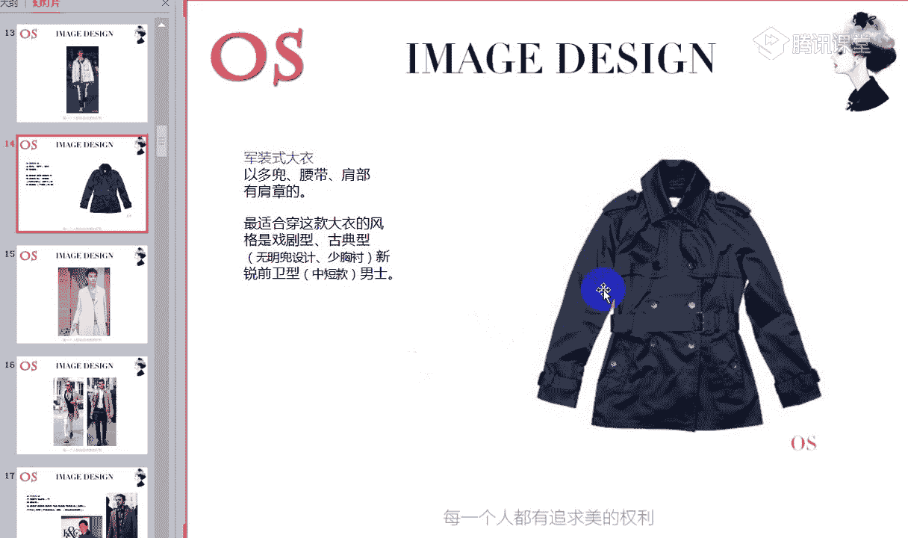
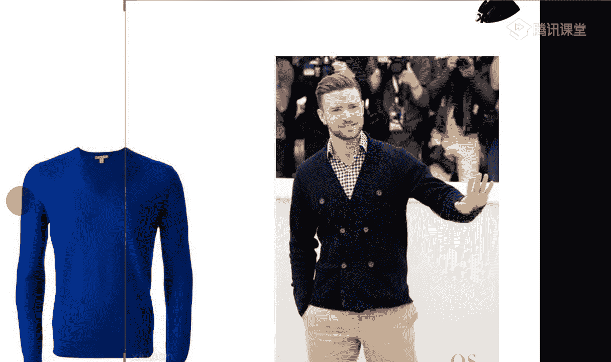

# 男士个人形象班（中级版）VIP课程：第7节：服装风格认知 👔

在本节课中，我们将要学习男士服装款式的基础认知。这是构建男装知识体系的重要基石。之前我们已经学习了不同场合的着装要求，并对服装的“型”（指人体体型）有了基本了解。基于这些基础，本节课我们将系统地认识基础的男装款式，并初步探讨它们与个人着装风格之间的关系。这可以看作是对男士风格服饰辨别的入门了解，为后续深入学习风格分析打下基础。

## 学习重点 📚

以下是本节课的三个核心学习模块：

1.  男士外套款式的分类
2.  男士毛衣的分类
3.  男士裤装的分类

本节课的要求是：熟知服装款式的分类，并能结合自身特点进行初步选择。

---

## 一、礼服篇：正式场合的着装规范 🎩

首先，我们从最正式的外套——礼服开始。虽然部分男士可能暂时没有穿着礼服的场合，但作为形象知识体系的一部分，了解礼服规范十分必要。尤其在收到注明着装要求的正式请柬时，这些知识至关重要。

### 燕尾服

燕尾服是男性晚间（18点以后）最正式、最隆重的礼服。

*   **外观辨别**：其后摆形似燕尾，因此得名。
*   **颜色与面料**：通常为黑色或深蓝色精纺羊毛面料。
*   **裤子特征**：裤子与上衣同色，裤侧缝镶有**缎面饰条**。
*   **搭配规范**：
    *   衬衫：必须搭配白色翼领衬衫。
    *   领结：最正式的穿法是搭配**白色领结**。
    *   衬衫需有U型胸衬。
    *   马甲（背心）：可选白色，或与外套同色（如深蓝配深蓝，黑配黑）。
    *   口袋巾：配**白色**口袋巾。
    *   鞋袜：搭配漆皮牛津雕花鞋，袜子必须是**黑色**（袜子颜色应深于裤子）。
*   **适用场合**：晚间最正式隆重的场合，如国家级庆典、婚礼、古典交际舞比赛、大型音乐会等。

### 塔士多礼服（吸烟装）

这是另一种晚间（18点以后）的正式礼服。

*   **外观特征**：
    *   领型：通常为**青果领**，领面材质常为**缎面**（与衣身面料不同）。
    *   颜色：正规款式为**黑色**，回避藏蓝色。
    *   扣子：以**一粒扣**为主。
    *   口袋：为**暗兜**设计，无明兜翻盖。
    *   下摆：呈**圆摆**设计（正式西装多为直角下摆）。
*   **搭配要点**：
    *   可内搭翼领衬衫配领结，并搭配**腰封**。
    *   也可内搭传统衬衫配**黑色领带**（若配领结，则需搭翼领衬衫）。
    *   若穿翼领衬衫（带双层袖口），则必须佩戴**袖扣**。
    *   鞋子：搭配系带皮鞋，如雕花鞋或镂空鞋。
*   **适用场合**：晚间正式的宴会、舞会、剧院、授奖仪式、鸡尾酒会等。

### 晨礼服（日间大礼服）

这是白天最正式的礼服。

*   **外观特征**：
    *   领型：**枪驳领**。其前衣片与后衣片是连接在一起的（燕尾服则是分开的）。
    *   款式：一粒扣。
    *   裤子：通常为**深灰色**，并带有**竖条纹**。
*   **搭配与变化**：
    *   可内搭翼领衬衫配领结和腰封。
    *   也可内搭传统衬衫、领带和马甲。
    *   上衣黑色、下衣深灰色是国际最高穿着标准。
    *   在春夏季，颜色可适当变化，但仍以无彩色系为基础。
*   **适用场合**：日间各种正式场合，如典礼、午餐会、游园会、婚丧仪式等。

### 普通西装作为礼服的替代方案

对于没有明确着装要求的一般社交场合，可以用西装代替礼服。

*   **选择要点**：
    *   款式：选择**窄版英式或欧式西装**。
    *   扣子：单排一粒扣或两粒扣。
    *   领型：可选择**枪驳领**以增加正式感。
    *   面料：需选择**有光泽感**的面料来提升华丽度。

---

上一节我们介绍了最正式的礼服类别，本节中我们来看看日常生活中更常见的基础外套款式。

## 二、外套款式认知：从正式到休闲 🧥

首先从大衣开始。正式大衣可以看作是西装的加长版，款式简洁，颜色沉稳，适合在寒冷天气套在西装外，适用于正式职业场合。

### 正式大衣

*   **风格适配**：
    *   **古典风格**：穿传统正式大衣最为合适。
    *   **戏剧风格**与**自然风格**：可通过调整**领型**（如增大领子宽度）来增加量感，以适应自身风格。
    *   **前卫风格**（量感偏小）：不适合穿正式大衣。

### 休闲类大衣

1.  **猎装式大衣**
    *   **特点**：多口袋设计，营造宽松随性的休闲感。
    *   **适配风格**：适合大量感的**自然型**和**戏剧型**男士。

2.  **军装式大衣（风衣）**
    *   **特点**：多口袋、有腰带、肩部常有肩章。
    *   **适配风格**：适合**戏剧型**、**古典型**、**新锐前卫型**。
    *   **风格调整**：
        *   古典型：应选择**无明兜设计、少胸衬**的款式。
        *   新锐前卫型：应选择**中短款**，避免过长。

3.  **马术式大衣**
    *   **特点**：由传统马术服演变而来，常在领部有拼色等装饰，带来年轻感。
    *   **适配风格**：适合**浪漫风格**及**古典型**中个子不高的男士（应选择短款、面料柔软但保有精致度）。

4.  **荷兰式大衣**
    *   **特点**：呢子面料，常用牛角扣，休闲感强。
    *   **适配风格**：适合**自然型**及**阳光前卫型**（阳光前卫型需选择**精短版**）。

5.  **短款大衣**
    *   **适配风格**：适合**新锐前卫型**和**浪漫型**男士在秋冬季节穿着。

---

接下来，我们看看更为精干、休闲的夹克类别。

## 三、夹克款式认知：短款休闲外套 🧥

夹克的共通特点是衣片短、袖子长，能塑造整体休闲感。

以下是各类夹克的特点与风格适配：

1.  **双色棒球夹克**
    *   **特点**：运动款式，衣身与袖子常为拼色。
    *   **适配风格**：**新锐前卫型**、**古典型**（需选择**精良**质地与剪裁）、年轻的**戏剧型**与**自然型**、**阳光前卫型**。**浪漫型**不适合。

2.  **商务便装夹克**
    *   **特点**：颜色深、材质硬挺，用于一般职业场合或出差，稳重又不失舒适。
    *   **适配风格**：**戏剧型**、**浪漫型**、**古典型**。
    *   **浅色变体（高尔夫夹克）**：适合**自然型**和**古典型**在职业场合穿着（需避免过多明兜、明线设计）。

3.  **艾森豪威尔夹克（美军陆军夹克）**
    *   **特点**：最明显的特征是**明兜设计**。
    *   **适配风格**：**戏剧型**、**新锐前卫型**、**古典型**（需选精良版）、**自然型**、**阳光前卫型**。**浪漫型**不适合。

4.  **飞行式夹克**
    *   **特点**：衣身精短，面料常带有一定**光泽感**（如皮革或金属质感面料）。
    *   **适配风格**：最适合**新锐前卫型**和**阳光前卫型**。因其款式短小、光泽感强或设计感强，**古典**、**戏剧**、**自然**、**浪漫**风格均不适合。

5.  **海军式夹克**
    *   **特点**：装饰重点在**领部和肩部**，领型常较柔和（如毛领）。
    *   **适配风格**：适合**浪漫型**（柔和领型与华丽感）、**戏剧型**、**自然型**。**古典型**不适合（因多口袋设计显啰嗦，不够稳重）。

6.  **连帽式夹克**
    *   **特点**：帽子与衣身相连。
    *   **适配风格**：适合**阳光前卫型**和**自然型**。

7.  **伊顿式夹克**
    *   **特点**：类似短小西装，像贵族学院学生装，显年轻活力。
    *   **适配风格**：适合个子不高、想穿类似西装款式夹克的男士。

8.  **运动式夹克**
    *   **特点**：运动品牌推出，材质舒适（如棉）。
    *   **适配风格**：最适合**自然型**。其他风格穿着效果一般。

---

了解了外套，我们再来看看内搭的重要品类——毛衣。

## 四、毛衣款式认知：温暖与风格并存 🧶

毛衣大致可分为以下几类，不同风格在选择时需注意其特点。

### 套头毛衣

1.  **渔夫式毛衣**
    *   **特点**：图案丰富，休闲感强。
    *   **适配风格**：**自然型**、**浪漫型**（需选择**面料软、薄**的款式）、**戏剧型**（需选择**宽松、大**的款式）。

2.  **斯堪的纳维亚式毛衣**
    *   **特点**：设计集中在肩部，有民族感、异域风情。
    *   **适配风格**：最适合**戏剧型**男士驾驭。传统**自然型**难以驾驭。

### 开衫毛衣

各风格选择开衫的要点：

*   **古典型**：选择**质地挺实**、精良的款式。
*   **浪漫型**：选择**质地柔软**的款式。
*   **自然型**：可选择**厚实粗糙**的款式。
*   **阳光前卫型**：可选择**图案丰富、修身**的款式，材质上可选带**闪光光泽感**的混织面料。
*   **新锐前卫型**：多选择**V领**款式（带来尖锐感）。

### 其他毛衣领型与风格要点

*   **法式领毛衣**：领型呈柔和圆弧状。**浪漫型**男士可多选择此类领型的毛衣。
*   **新锐前卫型**：在选择毛衣时，应注重**图案和色彩的明显表现**，追求个性与冲击力。
*   **古典型**：应尽量选择**少设计、精良**的毛衣，避免过多休闲感。

---

上衣之后，我们来看看下装的基础——裤子。

## 五、裤装款式认知：奠定整体廓形 👖

裤子是塑造下半身线条的关键。

1.  **锥形裤**
    *   **特点**：臀部贴合，大腿有余量，裤腿至脚口逐渐收缩。是男士**最正式的裤型**。
    *   **适配风格**：各风格基本都适合。但**戏剧型**因量感大，应尽量少穿（以免显得头重脚轻）。腿短或个子不高的男士穿锥形裤搭配尖头鞋，有助显高。

2.  **喇叭裤**
    *   **特点**：小腿附近裤腿逐渐变大。
    *   **适配风格**：**戏剧型**（需选择合体款式）、**浪漫型**（能驾驭感性元素）。**古典型**绝对不适合。

3.  **直筒裤**
    *   **特点**：大腿至小腿宽度基本一致。
    *   **适配风格**：六大风格基本都适合。但**新锐前卫型**和**阳光前卫型**应尽量选择**合体**一点的直筒裤，避免过于宽松。

4.  **五分裤**
    *   **特点**：长度在膝盖附近的短裤，是男士最正式的短裤。
    *   **适配风格**：各风格都可穿。但**个子不高的男士**应尽量少穿，因其会在腿部制造横截面，显腿短。

5.  **工装裤（抽褶裤）**
    *   **特点**：多褶、多口袋，休闲感强。
    *   **适配风格**：适合**自然型**及**前卫型**（前卫型需选择稍短、合体的款式）。**古典**、**戏剧**、**浪漫**风格不适合。

6.  **翻边裤**
    *   **特点**：裤脚自带翻边设计，凸显休闲感，但易显腿短。
    *   **适配风格**：适合**自然型**和**戏剧型**。其他风格需谨慎，**个子矮、腿短者**尤其要避免。

7.  **七分裤**
    *   **特点**：长度在小腿中部，非常休闲。
    *   **适配风格**：**古典型**男士绝对不要穿，与其严谨气质不协调。

8.  **运动裤**
    *   **特点**：休闲运动款式。
    *   **适配风格**：各风格可根据场合和自身体型（如锥形、直筒版型）进行调整选择。

### 一个重要的细节：裤边缝合方式

*   **古典型**、**浪漫型**、**新锐前卫型**的男士，在选择裤子时，应尽量选择**单边缝合**的裤边，而非双边缝合。

---

## 灵活运用：从基础到变通 💡

学习基础款式的目的是为了理解和运用。现代服装设计常在基础款上做文章（改变材质、颜色、细节）。因此，关键在于充分理解自身风格的特点（如量感、动静、直曲），以及服装带来的视觉感受，从而灵活判断一件衣服是否适合自己，而非死记硬背。

**例如**：传统双色棒球夹克不适合浪漫型。但一件在棒球夹克版型基础上，改用**有光泽感、华丽面料**的类似款式，浪漫型男士就可以尝试穿着。

## 课程总结 📝

本节课中我们一起学习了男士服装款式的基础认知：
1.  **礼服**的类别、特征与穿着规范。
2.  **外套**（大衣、夹克）的分类及各风格适配要点。
3.  **毛衣**的分类及各风格选择重点。
4.  **裤装**的分类及各风格适配建议。

核心在于建立对服装“型”与个人风格“型”之间关联的初步理解。建议在后续学完详细的服装风格课程后，再回顾本节内容，会有更深层次的理解和消化。

## 课后作业 📋

1.  **整理笔记**：梳理本节课的知识点。
2.  **实践搭配**：根据你已知或推测的个人风格，找出适合该风格的服装单品（上衣、下装），并进行搭配。
3.  **分析练习**：选择一套服装，分析其款式、材质、颜色，并说明它适合哪种风格的男士穿着。如果颜色不符合该风格，可以指出如何调整颜色会更佳。

---
**注意**：请将作业提交到指定的课程作业相册中。