# 男士个人形象班（中级版）VIP课程：第8节：配饰的搭配技巧（一）

在本节课中，我们将要学习男士配饰的搭配与选择。配饰的分类主要基于材质、功能和应用方向。我们将重点探讨围巾、帽子和手表这三类核心配饰，了解它们如何根据个人风格和场合进行选择，以达到完善整体形象的目的。

## 配饰的重要性

首先，我们需要明白配饰在整体形象中的重要性。

配饰可以修饰我们的缺点。其点缀作用在于引导人们的视线，这一点在第三节讲解体型时已有分享。

其次，配饰在整体形象中起到画龙点睛的作用。即使服装搭配得当，若细节处理不佳，形象仍不完美。

接下来，我们来看看配饰搭配与选择的具体方法。

## 本节课学习重点

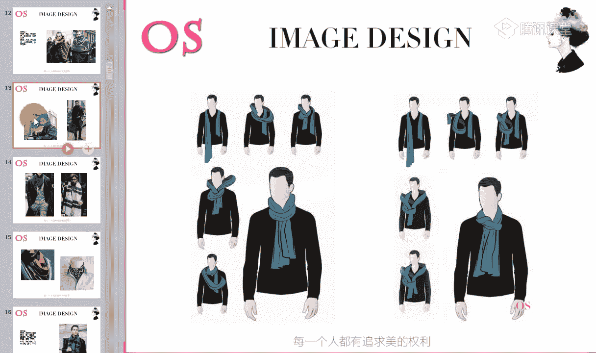

以下是本节课的核心学习内容：
*   学会围巾的分类及其与自身风格的关系。
*   了解帽子的分类及搭配注意事项。
*   掌握不同风格及不同场合下手表的选择要点。

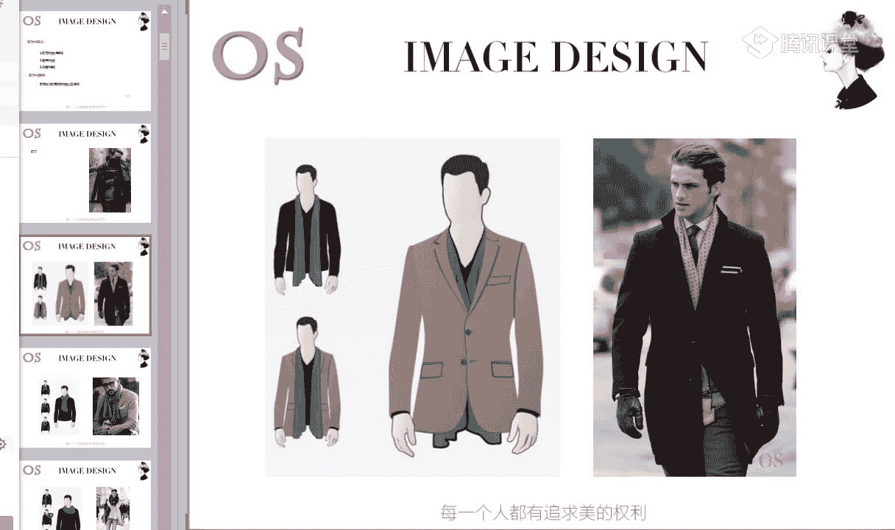

本节课的要求是熟知配饰搭配的分类与选择方法。

当一套服装搭配好后，若再增添眼镜、帽子或手表等配饰点缀，整体形象会更加完整。

## 围巾的系法与风格选择

上一节我们介绍了配饰的重要性，本节中我们来看看围巾的具体应用。首先是一些常用的围巾系法，大家可以保存参考。

快速浏览这些围巾系法，部分同学可以截图保存。网络上也有许多系法图片，这里仅展示几种常用且易搭配的。

如果围巾非常长，可以绕几圈后打一个松散简单的结。如果围巾长度适中，也可以像右图模特一样，直接打一个结即可。

以上是围巾的常用系法。

接下来，我们讲解不同风格在选择围巾时需注意的知识点。

### 戏剧型风格

戏剧型风格的代表人物包括甄子丹、周润发、陈凯歌、姜文、黄秋生、齐秦、任达华、陈柏霖等。

这些人物给人的视觉感受是**大气**、**夸张**、**立体**。他们通常五官量感大，轮廓分明，常见浓眉大眼的特点。

因此，戏剧型风格的人在选择围巾时，需与五官长相协调。

以下是适合戏剧型风格的围巾选择要点：
*   **材质**：多选择皮毛材质，或光泽感强的材质。避免哑光面料。
*   **图案**：可选择几何图案、大型花朵、醒目的人物图案等。图案需分明、醒目。

物体上的“量感”指面积的大小与厚薄。适合戏剧风格的围巾通常具有成熟、大气、夸张、醒目的共同特点。

戏剧型男士在秋冬季节或夏季选择小方巾时，也应注意图案的选择。

### 自然型风格

自然型风格也属于量感偏大的风格。代表人物包括裴勇俊、阿杜、陈奕迅、黄力行、黄宗泽、陆毅等。

与戏剧型风格相比，自然风格人物的五官立体度和大气感相对柔和，面部棱角不过于分明，带有一种柔和感。

因此，在选择围巾时也需遵循此特点。

以下是适合自然型风格的围巾选择要点：
*   **材质**：选择弱化、天然的材质，如麻、粗毛呢、棉质、粗棒针织等。避免光泽感强的材质，适合无强烈光泽感、质地天然的面料。
*   **图案**：可选择民族风、方格纹、条纹、植物纹样、泼墨几何图案等。

质地可选择稍微粗糙、淡雅的。多选择格纹和条纹。避免存在感太强的围巾。

自然风格适合穿着休闲类西装，且最好拆套穿着，以表现休闲感。

### 浪漫型风格

浪漫型风格同样是大量感风格。代表人物包括钟汉良、费翔、焦恩俊、方中信、张国荣、梁朝伟、陈坤等。

他们的共同特点是眼神**水润**、**感性**、**性感**。五官柔和，轮廓不硬直，没有硬汉形象，身材成熟饱满。

因此，在选择围巾时需体现柔和、感性、性感的感觉。

以下是适合浪漫型风格的围巾选择要点：
*   **材质**：多选择真丝、丝棉等柔软平整的面料，或精纺毛呢、羊绒等光泽感强、柔软华丽的面料。
*   **图案**：可选择波纹、花朵、曲线图案。

真丝材质、曲线波点图案都适合。精纺羊绒围巾上点缀小曲线图案也能透露感性元素，显得非常柔和，偏向中性感。

浪漫风格需要凸显品质感和贵气感。精纺羊绒等高品质面料非常适合此类风格。

### 古典型风格

古典型风格代表人物包括胡锦涛、陈道明、白岩松、康辉、吴秀波、张嘉译等。

他们的特点是五官**端正**、**精致**、**正派**。面部带有成熟感和距离感，身材板正。

因此，在选择围巾时需凸显严谨、精致的感觉。

以下是适合古典型风格的围巾选择要点：
*   **材质**：选择挺括的精纺毛料或丝制品。
*   **图案**：选择规则排列的条纹、格纹、点状几何图案。图案排列必须严谨、有规则。

精纺羊绒围巾具有挺括感和柔软度，适合古典型风格。图案必须是直线图案，且规则排列。

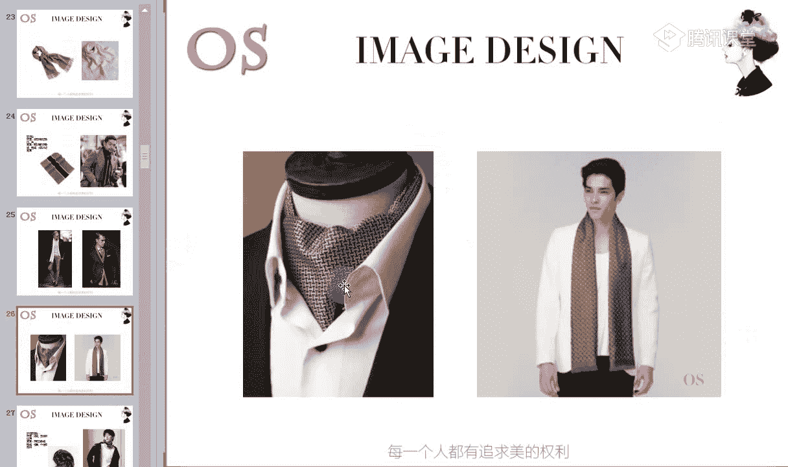

古典型风格追求精致和品质感。

### 新锐前卫风格

新锐前卫风格代表人物包括陈冠希、朴树、吴奇隆、谢霆锋、余文乐、陈小春等。

他们的五官线条分明，清晰度高，个性强，有一定立体度。但与戏剧型相比，其五官量感偏小，更显精致。

因此，在选择围巾时需体现个性化与酷感。

以下是适合新锐前卫风格的围巾选择要点：
*   **材质**：选择闪光、硬挺的化纤材质。
*   **图案**：选择不规则的条纹、格纹，或怪异、个性、抽象的图案。

这类风格追求与众不同，引领潮流。围巾图案会带来尖锐、年轻、时尚的感觉。

### 阳光前卫风格

阳光前卫风格也是前卫风格的一种，但相较于新锐前卫，其五官更偏向柔和、紧凑、小巧。代表人物包括阿牛、何炅、苏有朋、林俊杰、林志颖等。

带有大男孩的感觉。

以下是适合阳光前卫风格的围巾选择要点：
*   **材质**：可选择毛类，或闪光、硬挺的材质。
*   **图案**：选择个性化、可爱、抽象的几何图形，或有趣的波点图案，以带来年轻、阳光、调皮、时尚的感觉。

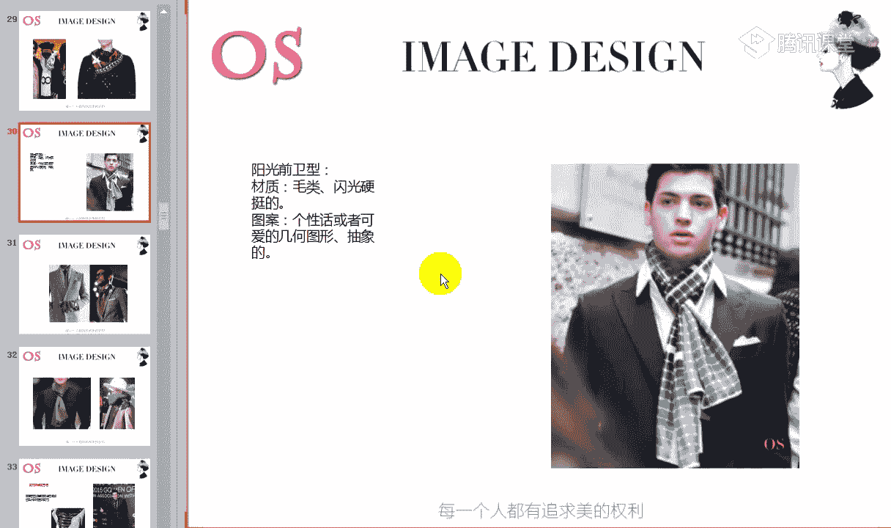

## 围巾的场合搭配技巧

上一节我们了解了不同风格如何选择围巾，本节中我们来看看围巾在不同场合的搭配技巧。

### 正式场合

在正式严谨的场合，如穿着正式西装时，可以选择围巾进行搭配，甚至可以用丝巾代替领结或领带。

以下是正式场合的围巾选择要点：
*   **材质**：选择真丝或精纺毛料材质的围巾。
*   **图案**：图案必须严谨，可参考领带的图案选择。

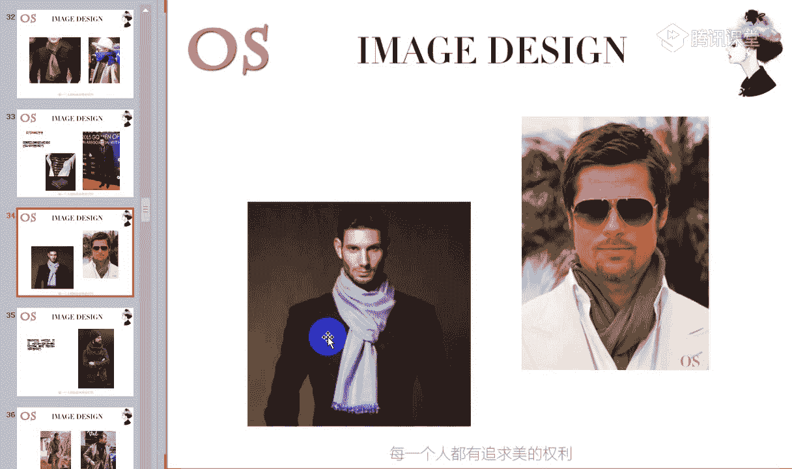

精纺羊绒围巾也适合与正式西装或一般职业西装搭配。如果不适合真丝，羊绒材质是更好的选择。

### 休闲场合

在休闲场合，搭配针织衫、休闲西装、夹克、大衣等服装时，可选择休闲感强的围巾。

以下是休闲场合的围巾选择要点：
*   **材质**：选择针织、毛线、羊绒、棉麻等材质的围巾。

但需注意服装与围巾的材质肌理感搭配。例如，平整平滑的正式西装面料，搭配粗棒针织或肌理感强的围巾会显得突兀，因为肌理感强的面料有膨胀效果，而平整面料有后退效果。

因此，与品质好的正式单品搭配时，应尽量选择真丝或质地好的羊绒围巾，避免肌理感太强或粗糙的材质。

若服装本身具有粗糙感，搭配粗糙感强的围巾则会显得和谐。

在休闲场合中，其他任意单品，如大衣、夹克、背心等，都可以随心所欲地选择围巾进行搭配。

秋冬季节多运用围巾可以增加整体层次感，提升时尚度。对于前卫风格或浪漫风格的男士，夏季也可以尝试小方巾作为点缀，尤其适合前卫风格。

## 帽子的分类与搭配

接着我们来说说帽子。以常用帽子为基准进行介绍。

### 卡车帽/棒球帽

卡车帽又称棒球帽。通常与休闲装搭配，例如夏季T恤牛仔裤，或春秋季节外加夹克。

搭配时需注意图案协调度。如果帽子有图案，全身服装的图案就应减弱；如果帽子无图案，服装可增加图案感。若服装色彩鲜艳，帽子图案也可相对鲜艳以形成呼应。

选择时需注重脸型与风格协调。

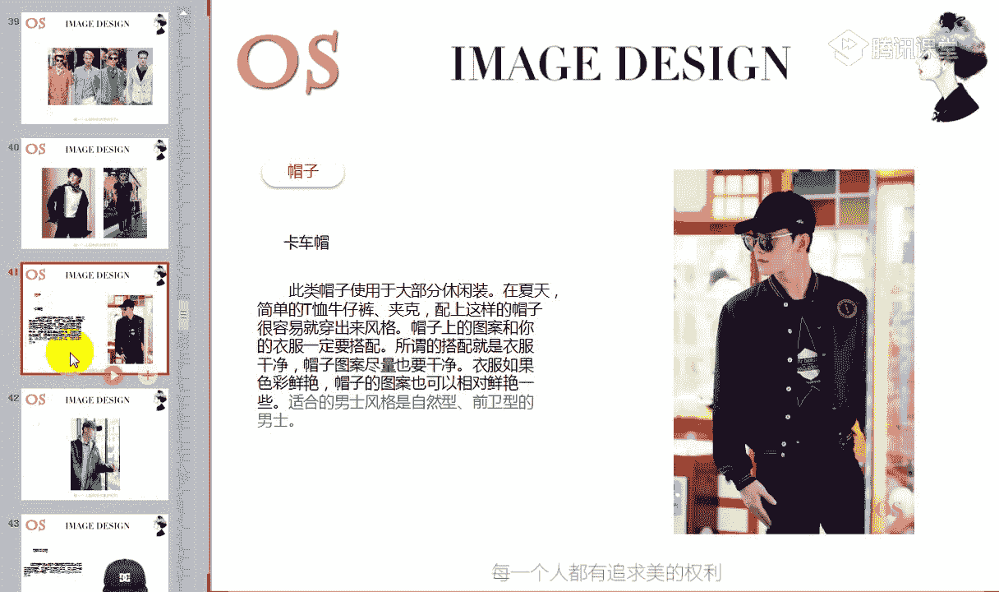

以下是卡车帽/棒球帽的选择要点：
*   **适合风格**：自然风格和前卫风格。
*   **脸型注意**：方脸型和圆脸型应尽量少选择，因为会显得头部不协调。

脸型精致者一般任何帽型都可选择，但需根据风格调整。

### 棒球平沿帽

棒球平沿帽的帽檐是平的。对脸型和风格要求非常高。

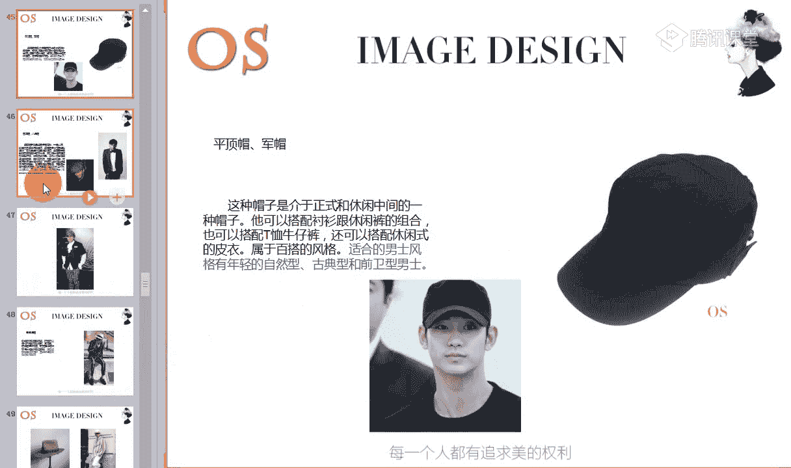

以下是棒球平沿帽的选择要点：
*   **适合风格**：主要推荐前卫风格，其他风格少选。
*   **搭配**：与休闲类单品搭配。
*   **脸型注意**：圆脸和方脸少戴。

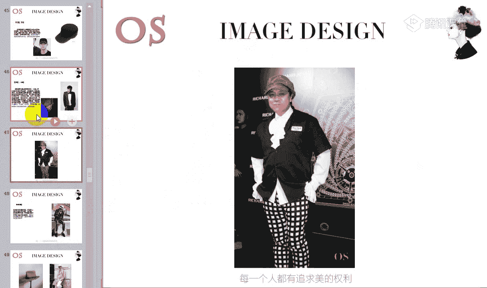

### 平顶帽/军帽

平顶帽顶都比较平，介于正式与休闲之间。可搭配衬衫，也可搭配T恤牛仔裤或皮衣，属于百搭款式。

以下是平顶帽/军帽的选择要点：
*   **适合风格**：年轻的自然型、古典型和前卫风格。
*   **脸型注意**：方脸尽量少戴。

### 画家帽/八角帽/贝雷帽

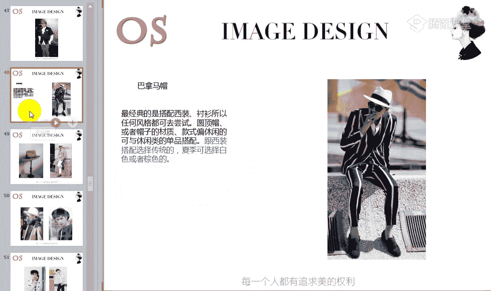

这类帽子略显高端，对帽型要求高，需选择有型的，否则软塌塌会显得没精神。

以下是画家帽/八角帽/贝雷帽的选择要点：
*   **搭配**：可与西装、休闲正装、风衣等搭配，营造英伦风格。避免搭配牛仔T恤风格。
*   **适合风格**：戏剧型、浪漫型、自然型、古典型。古典和浪漫风格需选择精纺材质；古典风格需选择帽型正的。
*   **脸型注意**：方脸和圆脸因脸部长度无优势，应尽量少选；由字型脸同理。

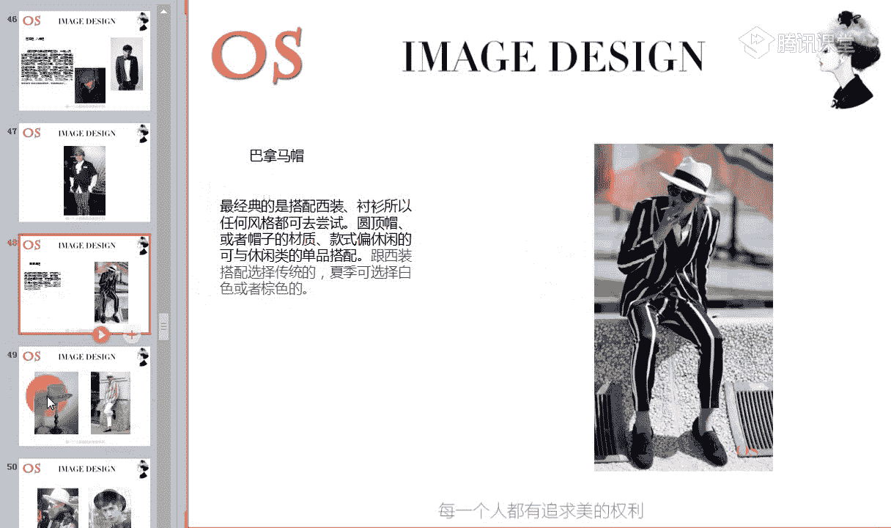

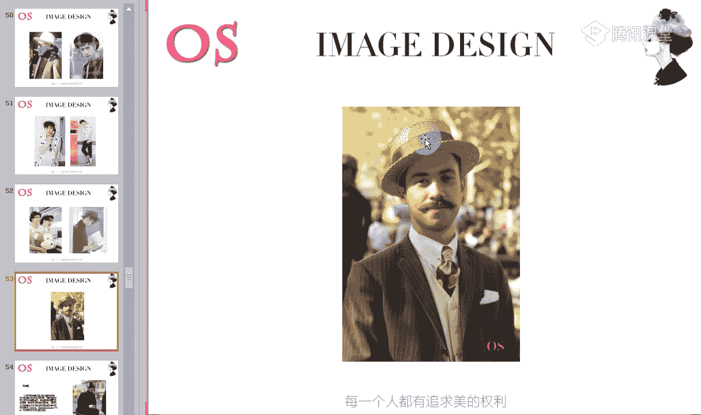

### 巴拿马帽/圆顶礼帽

经典的巴拿马帽帽檐较宽，属于正式场合可用的帽子。最经典的搭配是西装。

圆顶帽也属于礼帽的一种。

以下是巴拿马帽/圆顶礼帽的选择要点：
*   **脸型修饰**：宽帽檐对圆脸、方脸等脸型较大的有很好的修饰作用。但方脸型不要选择平顶帽，否则会显得整体方正。
*   **适合风格**：任何风格都可尝试。根据风格量感大小做细微调整：量感小的选择精致小巧的帽型；量感大的选择大一点的帽型。
*   **搭配**：也可与休闲类单品搭配。与正式西装搭配时，需选择传统款式，避免太小巧。夏季可选择棕色系或白色。

改良后的礼帽也可与休闲单品搭配。

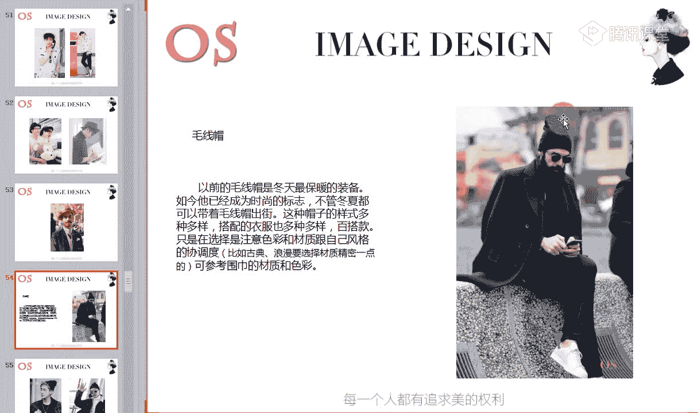

### 毛线帽

毛线帽曾是冬季保暖装备，现已成为时尚标志。样式多样，百搭。

以下是毛线帽的选择要点：
*   **选择关键**：注意色彩和材质与自身风格的协调度。例如，古典和浪漫风格不能选择粗棒针织或图案杂乱的毛线帽。可参照围巾的材质和图案选择原则。
*   **脸型注意**：长脸型的人不要选择。
*   **搭配**：可与任何休闲类单品搭配。

帽子与围巾一样，能为整体形象增添色彩。

## 手表的选择

手表对男士来说非常重要。下面我们进行手表的基础辨别。

### 表盘基础辨别

首先看表盘。**表盘越厚，越显运动感和朴实平和感；表盘越薄，越能带来尖锐感**。例如，前卫风格适合选择表盘薄的手表以凸显锐利感。

以下是三种常见表盘类型的特点：
1.  **无精确数字刻度**：带来经典、严谨的感觉，适合职业场合。
2.  **阿拉伯数字表盘**：装饰效果突出，带来轻松、运动的感觉。
3.  **古罗马数字表盘**：显得年轻、现代。

按场合划分，无精确数字刻度的表盘适合正式场合；阿拉伯数字或古罗马数字表盘适合休闲场合。男士应像女士搭配包一样，根据不同场合备置不同的手表。

### 不同风格的手表选择

#### 戏剧型风格
*   **选择要点**：选择表盘**厚**、**大**的款式，搭配天然动物皮革表带。

#### 浪漫型风格
*   **选择要点**：表盘刻度可选择古罗马数字。可选择金表或带有金边的手表，金色能带来感性感。所有风格中，浪漫风格戴金表最好看。

#### 自然型风格
*   **选择要点**：表盘厚度选择适中。材质尽量选择皮革。多选择阿拉伯数字刻度或能带来轻松休闲感的手表。

#### 古典型风格
*   **选择要点**：尽量选择无明确数字刻度的表盘，以体现严谨感。年轻古典型可选择古罗马数字；休闲场合可选择阿拉伯数字刻度。尽量选择金属表带。

#### 新锐前卫风格
*   **选择要点**：表盘尽量选择**薄**的。不太适合皮带表带。若选择皮带，表盘需为棱角分明的方形等，以凸显锐利感。圆形表盘则更适合阳光前卫风格。

#### 阳光前卫风格
*   **选择要点**：佩戴一些个性、有趣的手表，可带有童趣感。

### 其他选择要点

金属表带有金色和银色之分。冷色肤色的男士（夏季型、冬季型）适合银色表带；暖色肤色的男士（春季型、秋季型）适合金色表带。

手表也分场合佩戴：
*   **职业场合**：凸显职业感。
*   **休闲场合**：凸显休闲轻松感。
*   **运动场合**：佩戴运动款手表，搭配运动服装或休闲装。

## 课程总结与作业

本节课中我们一起学习了围巾、帽子和手表这三类重要配饰的搭配技巧。我们了解了配饰的画龙点睛作用，以及如何根据个人风格和不同场合选择合适的配饰来完善整体形象。

以下是本节课的作业要求：
1.  做好课堂笔记。
2.  找出适合自己风格的围巾、帽子和手表单品。

手表的笔记尤为重要，因为它是男士非常重要的配饰。围巾等配饰在后续课程中还会结合男士风格深入讲解，但手表的选择是本课重点。

请记得及时将找到的适合自己风格的三类单品图片整理后发给老师。未交作业的同学请尽快补交。

配饰在整体装扮中起到画龙点睛的作用。服装搭配好后，若细节管理得当，并加上合适的配饰点缀，整体形象会更加完美。

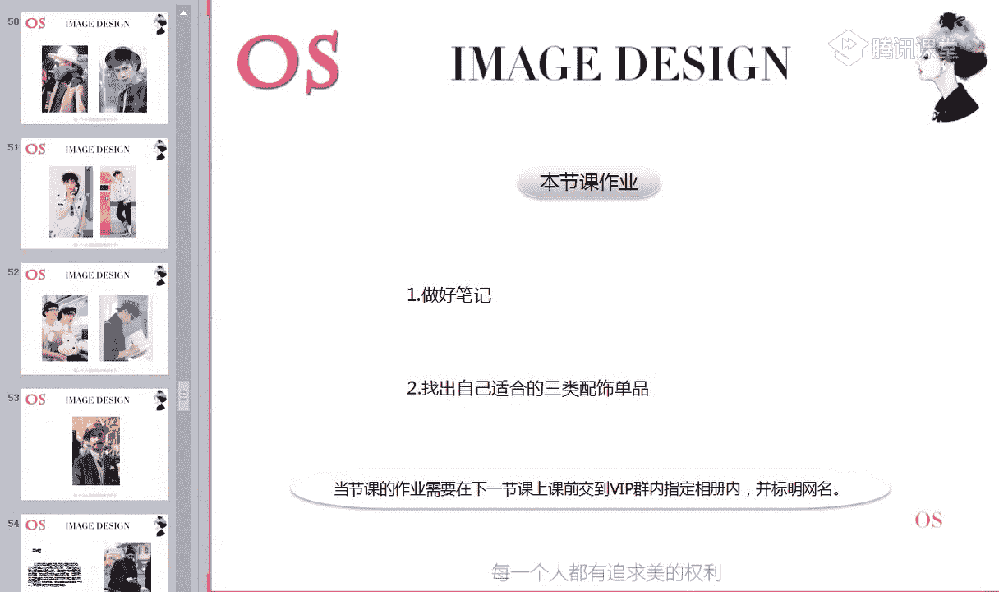

