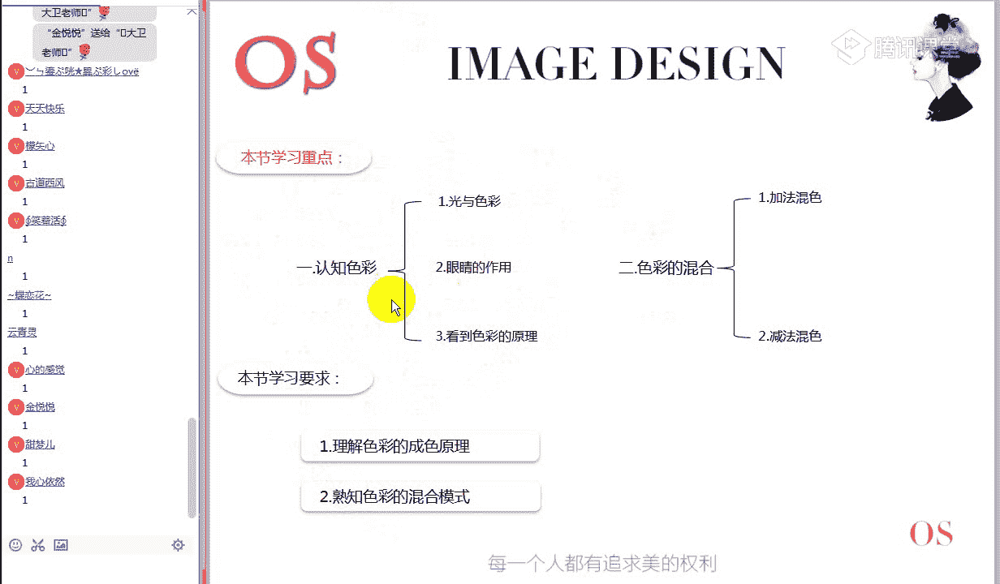
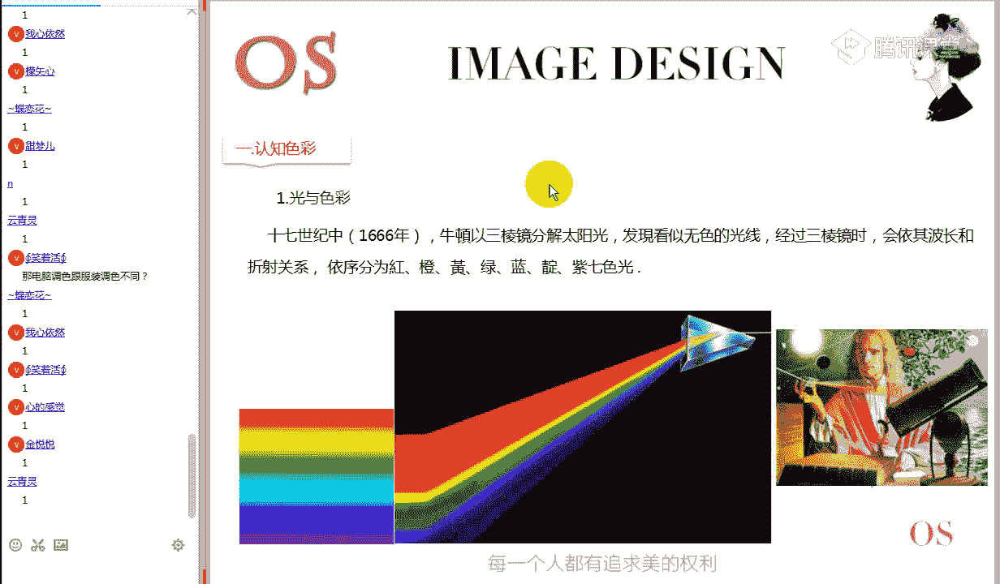

# 15男士形象色彩班VIP课程：第1节：色彩的构成

在本节课中，我们将要学习色彩的基础构成原理。这是色彩美学的入门课程，将从零开始，帮助你理解色彩从何而来，以及我们如何感知和运用色彩。课程内容逻辑性强，请跟随讲解，做好笔记。

## 课程概述与学习方法

在正式学习色彩知识前，我们先明确本课程的学习方法。正确的学习方法是高效掌握知识的关键，特别是对于网络课程。

以下是五个核心的学习步骤，请务必遵循：

1.  **课堂交流**：直播课程中，请积极参与互动。有任何疑问请第一时间在公屏提出，争取当堂解决。你的反馈是老师调整讲解节奏的重要依据。
2.  **课堂笔记**：不要依赖截图。请用笔记录每节课的关键词和核心概念。课后根据关键词回忆课程主线，能有效加深记忆。
3.  **课后作业**：认真完成作业至关重要。作业能检验你的理解程度，遇到困难时，请及时联系老师答疑。
4.  **课程温习**：由于知识具有连贯性，需要定期复习。尝试用自己的话复述知识点，如果能清晰表达，说明你已真正理解。
5.  **学以致用**：本课程是成人教育，重在解决实际问题。将所学色彩知识与日常生活观察结合，例如观察街上的服装配色或室内装修色彩，在实践中巩固知识。

掌握以上方法，将帮助你在这门课程乃至后续学习中取得最佳效果。

## 第一部分：认知色彩——色彩从何而来？

上一节我们明确了学习方法，本节中我们来看看色彩本身。我们将从物理和生物学的角度，了解色彩产生的科学原理。



### 1. 光与色彩：牛顿的发现


色彩的研究始于光。伟大的科学家牛顿在1666年进行了一个著名实验：让太阳光透过三棱镜。


**核心发现**：白光被分解为红、橙、黄、绿、蓝、靛、紫七色光带。

由此，我们可以推导出一个重要结论：我们日常所见的太阳光（白光），实际上是这七色光带叠加在一起形成的现象。

### 2. 可见光谱与人眼

并非所有光都能被人眼识别。人眼能看到的色彩范围称为“可见光谱”。

*   **波长范围**：可见光谱的波长大约在 **380纳米** 到 **780纳米** 之间。
*   **色彩感知**：波长不同，人眼感知到的颜色就不同。波长越长，颜色越偏红；波长越短，颜色越偏蓝。
*   **人眼的作用**：人眼内部有能感应红、绿、蓝三种色光的视觉细胞。正是这些细胞正常工作，我们才能辨别超过750万种颜色。

### 3. 色彩的呈现原理

人眼看到色彩，本质是光以不同形式进入眼睛的结果。主要有以下三种形式：

1.  **光源色**：指光源本身发出的色彩直接进入人眼。例如太阳、灯泡。
2.  **透过色**：指光线穿过透明或半透明物体后，再进入人眼所呈现的色彩。例如光线穿过彩色玻璃。
3.  **表面色（固有色）**：指光线照射到物体表面后，物体反射部分光线进入人眼所呈现的色彩。这是我们研究服装搭配时最重要的色彩形式。

**重点解析：表面色的形成过程**
为什么在同样的白光（七色光）照射下，苹果是红的，树叶是绿的？关键在于物体的物理属性决定了它对光线的**吸收**和**反射**。
*   红色物体：吸收了白光中除红色光以外的其他色光，只反射红光，所以我们看到它是红色的。
*   绿色物体：吸收了白光中除绿色光以外的其他色光，只反射绿光，所以我们看到它是绿色的。

**重要前提**：我们讨论物体的“固有色”，都是在“正常光线（如日光）照射下”的前提条件下。如果没有光源，一切色彩都无从谈起。

## 第二部分：色彩的混合模式

理解了色彩如何被我们看到之后，本节中我们来看看色彩的混合模式。你可能会听到“原色是红绿蓝”和“原色是红黄蓝”两种说法，它们都是正确的，但应用领域不同。

### 1. 加法混色（光的三原色）


**研究对象**：光源色，即本身会发光的物体。
**核心公式/原理**：**红 (Red) + 绿 (Green) + 蓝 (Blue) = 白光**。色光混合是越加越亮。
**三原色**：**红 (R)、绿 (G)、蓝 (B)**。
**应用领域**：所有电子显示设备，如电视、电脑、手机屏幕，以及在这些设备上运行的软件（如PS）。因为这些设备都需要通电发光来呈现色彩。

```python
# 加法混色示意（概念性代码）
def additive_mixing(red_intensity, green_intensity, blue_intensity):
    # 三种色光强度叠加，产生新色光
    # 强度范围通常为0-255
    return (red_intensity, green_intensity, blue_intensity)
# 例如：红色光(255,0,0) + 绿色光(0,255,0) = 黄色光(255,255,0)
```


### 2. 减法混色（色料的三原色）

**研究对象**：表面色，即本身不发光、靠反射光线呈现色彩的物体。
**核心原理**：色料混合是越加越暗，因为混合后吸收的光线增多，反射的光线减少。
**三原色**：**红 (Red)、黄 (Yellow)、蓝 (Blue)**。
**应用领域**：绘画、印刷、印染、服装搭配、室内设计等。因为我们研究的衣物、颜料等都不能自己发光。


```python
# 减法混色示意（概念性代码）
def subtractive_mixing(cyan_amount, magenta_amount, yellow_amount):
    # 三种色料混合，吸收特定光线
    # 理论上，等量混合三原色会得到黑色（吸收所有光）
    return "混合后的颜色"
# 注意：实际印刷中使用的是青(C)、品红(M)、黄(Y)、黑(K)四色体系。
```

### 核心区别总结

| 特性 | 加法混色 (光的三原色 RGB) | 减法混色 (色料的三原色 RYB) |
| :--- | :--- | :--- |
| **研究对象** | 光源（会发光） | 物体表面（不发光，靠反射） |
| **三原色** | 红、绿、蓝 | 红、黄、蓝 |
| **混合趋势** | 越加越亮（最终为白） | 越加越暗（最终趋近黑） |
| **本质** | 色光的叠加 | 色料的混合（吸收光线） |
| **应用领域** | 电子显示、数码绘图 | 服装搭配、绘画、印刷 |

**简单记忆**：**红绿蓝**是用来在屏幕上“显示”色彩的工具（手段），而**红黄蓝**是我们判断服装等实物色彩是否“和谐”的美学基础（目的）。两者因研究对象不同而并存，并不矛盾。

## 课程总结与作业

本节课中，我们一起学习了色彩构成的基础知识。

**第一部分，我们认知色彩**，了解了牛顿的色散实验、可见光谱、人眼视觉原理，以及色彩呈现的三种形式（光源色、透过色、表面色），并重点剖析了表面色（固有色）的形成过程。

**第二部分，我们区分了色彩的两种混合模式**：用于电子显示领域的**加法混色（光的三原色RGB）**和用于服装搭配等实物领域的**减法混色（色料的三原色RYB）**。理解这一区别是进行专业色彩学习的重要基石。




---

### 📝 课后作业


1.  **描述表面色**：以一片绿叶为例，说明其在正常日光照射下呈现绿色的表面色形成过程。
2.  **比较混合模式**：详细说明加法混色与减法混色模式的区别（可从研究对象、三原色、混合趋势、应用领域等方面分析）。

**作业提交**：请在下节课上课前一天，将作业提交至VIP群内指定的“第一期第一节”官方相册。作业末尾请附上校训“自律自信有爱勤奋”及你的网名。


---
*校训：自律 自信 有爱 勤奋*