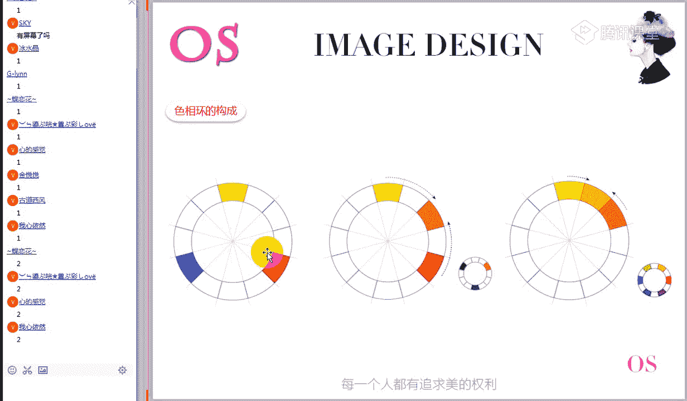
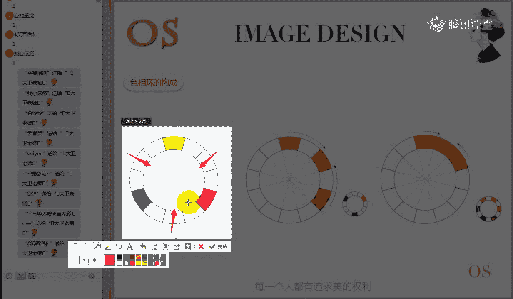
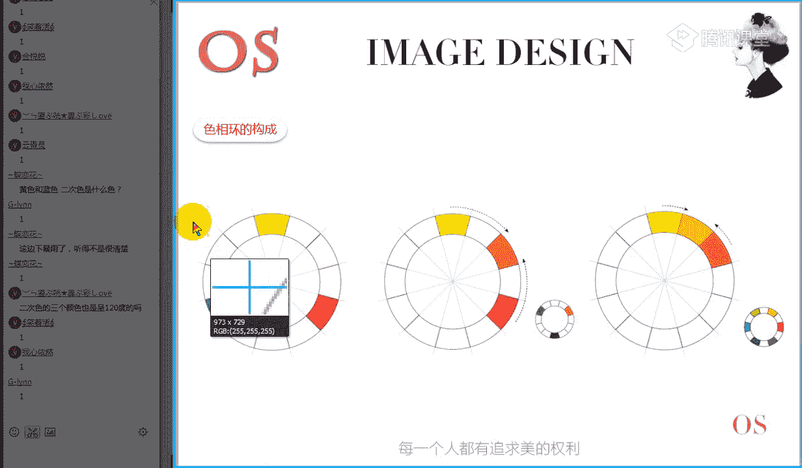
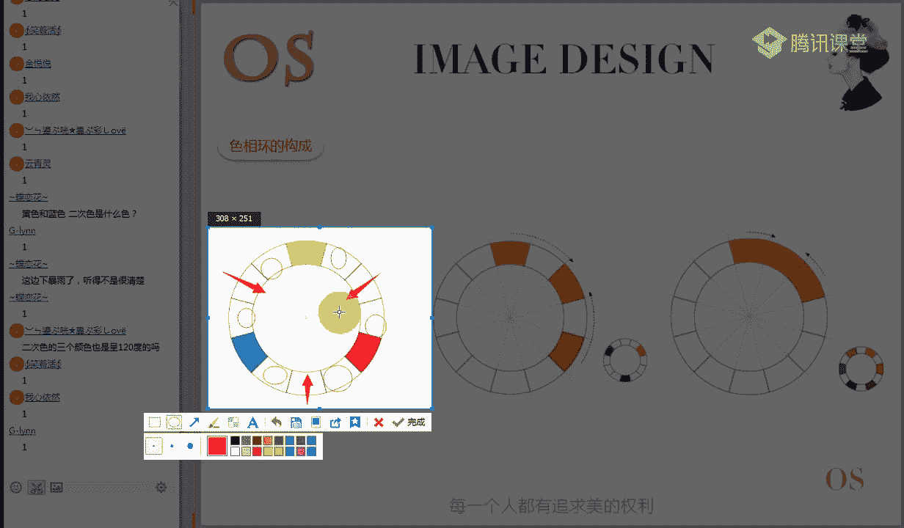
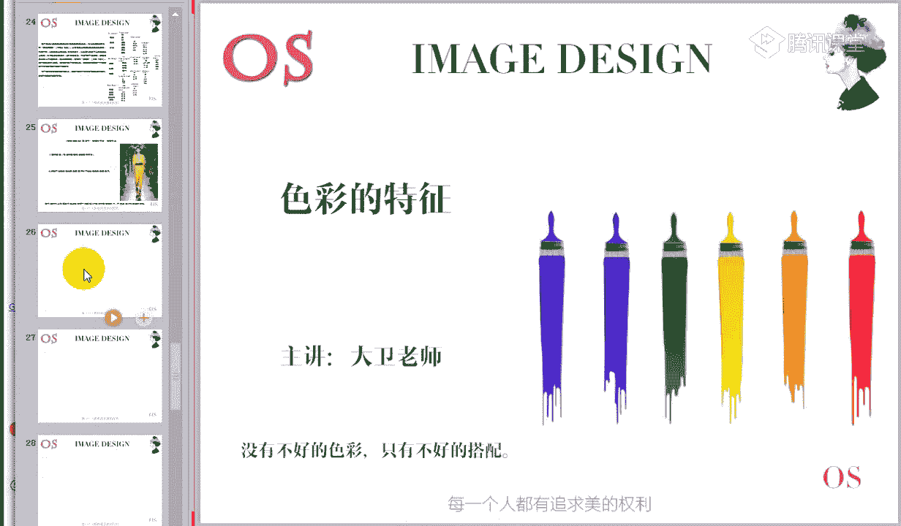

# 男士形象色彩班VIP课程：第2节：色彩的特征

在本节课中，我们将要学习色彩的核心特征。理解这些特征是进行专业色彩分析和搭配的基础。课程内容分为三个主要部分：色彩的三要素（核心重点）、色名的分类方式（拓展了解）以及国际色彩体系（拓展了解）。我们将从最重要的色彩三要素开始。

## 第一部分：色彩的三要素（属性）

色彩的三要素，也称为色彩的三属性，是描述和分析任何一个颜色的基础。它们分别是：色相、明度和纯度。理解这三者及其关系至关重要。

### 1. 色相 (Hue)

色相是指色彩的相貌，即色彩的名字。它是我们识别色彩的首要特征。

通俗地理解，色相就是色彩的长相。例如，你看到红色就知道它是“红色”，看到绿色就知道它是“绿色”，就像你能通过长相区分不同的人一样。色相是色彩最直观的特征。

### 2. 明度 (Value / Brightness)

明度是指色彩的明暗程度。

通俗地理解，明度就是颜色的深浅或亮暗。比较两个颜色时，哪个颜色看起来更亮、更浅，哪个颜色的明度就更高。

**明度变化的规律**：
对于同一色相（例如红色），其明度变化的原因是混入了黑色或白色。
*   **加白**：颜色变浅、变亮，明度**升高**。
*   **加黑**：颜色变深、变暗，明度**降低**。

**公式表示**：
*   明度升高 = 原色 + 白
*   明度降低 = 原色 + 黑

在无彩色系中，白色明度最高，黑色明度最低。不同色相本身也有固有的明度差异，例如黄色明度较高，紫色明度较低。

### 3. 纯度 (Chroma / Saturation)

纯度是指色彩的鲜艳程度，也称为饱和度或彩度。

通俗地理解，纯度就是颜色看起来是否鲜艳、浓烈。比较两个颜色时，哪个颜色看起来更鲜艳、更纯粹，哪个颜色的纯度就更高。

**纯度变化的规律**：
对于同一色相，导致其纯度变化的主要原因是混入了灰色。
*   **加灰**：颜色会变得浑浊、发旧，纯度**显著降低**。
*   **加黑或加白**：虽然主要影响明度，但同样会**降低**颜色的纯度（使其不如原色鲜艳）。

**重要提示**：
明度和纯度是两个独立的概念，没有必然的正比关系。一个颜色可以**高明度但低纯度**（如浅粉色），也可以**低明度但高纯度**（如深红色）。

---

上一节我们详细介绍了色彩的三要素，这是本节课的核心。接下来，我们将快速了解一些拓展知识，以拓宽大家对色彩体系的认知。

## 第二部分：色名的分类方式（了解）

将色彩名称收集分类后，大致可分为四种类型，了解它们有助于我们理解不同色彩名称的来源和含义。

以下是四种主要的色名分类：

1.  **基本色名**：用于表示最基本色彩的名称。如：红、黄、蓝、橙、绿、紫、黑、白、灰。也包括由基本色名组合而成的名称，如黄红、蓝绿。
2.  **系统色名**：在基本色名基础上加入修饰词，更精确地描述色彩。例如：“泛红的蓝色”、“鲜艳的泛黄的绿色”。
3.  **固有色名**：从古代流传下来，常以矿物、动植物、地名等命名的色彩。例如：胭脂、朱砂、翡翠绿。
4.  **惯用色名**：从固有色名中演变而来，在现代社会被广泛使用的色彩名称。例如：驼色、咖啡色、卡其色。

---

了解了色彩的名称分类后，我们再来看看国际上如何系统化地研究和表述色彩。

## 第三部分：国际色彩体系（了解）

国际上存在多种科学的色彩体系，用于精确标定色彩。这里介绍几种常见的体系，大家稍作了解即可。

以下是三种著名的国际色彩体系：

1.  **蒙塞尔色立体 (Munsell Color System)** - 美国
2.  **奥斯特瓦尔德色立体 (Ostwald Color System)** - 德国
3.  **日本色研所体系 (PCCS)** - 日本

这些体系通常采用三维模型来同时表示色彩的色相、明度和纯度。

**PCCS体系的色调概念**：
PCCS体系提出了“色调”的概念，它将明度和纯度结合起来考虑，形成了一系列有规律的色调区域。例如：
*   **鲜艳色调 (v)**：接近纯色，纯度很高。
*   **明亮色调 (b)** / **浅色调 (lt)**：加入白色，明度高，显得明亮。
*   **深色调 (dp)** / **暗色调 (dk)**：加入黑色，明度低，显得深沉。
*   **浊色调 (d)** / **灰色调 (g)**：加入灰色，纯度降低，显得浑浊或雅致。

通过色调图，我们可以更系统地理解色彩给人的不同心理感受（如清新、柔和、稳重等），这在未来的高级搭配中会很有用。

---

## 课程总结

在本节课中，我们一起学习了：
1.  **色彩的三要素（核心）**：**色相**是色彩的名字；**明度**是色彩的明暗（深浅），变化源于加黑或加白；**纯度**是色彩的鲜艳程度，变化主要源于加灰。
2.  **色名的分类方式（了解）**：包括基本色名、系统色名、固有色名和惯用色名。
3.  **国际色彩体系（了解）**：认识了蒙塞尔、奥斯特瓦尔德和PCCS等体系，以及PCCS的色调概念。

请务必掌握色彩三要素，这是后续所有搭配知识的基石。