# 男士形象色彩班VIP课程：第3节：色彩的心理直觉 🎨

在本节课中，我们将要学习色彩搭配中至关重要的心理直觉部分。我们将深入探讨色彩之间的对比关系、特殊现象以及色彩带给人的不同感受。掌握这些核心知识，是理解并驾驭色彩搭配的基础。

上一节我们学习了色彩的基础构成，本节中我们来看看色彩之间是如何相互作用并影响我们视觉与心理的。

## 第一部分：色彩的对比关系

色彩的对比是色彩搭配的核心。理解对比关系，是让色彩和谐统一的关键。

### 1. 色彩对比的概念

色彩的对比是指色彩之间存在的矛盾、对立及差别。这种差别主要体现在四个方面：
*   **色相差别**：例如红色与绿色。
*   **明度差别**：例如深蓝色与浅蓝色。
*   **纯度差别**：例如鲜艳的红色与灰暗的红色。
*   **面积差别**：例如一大块红色与一小块红色。

由于色彩之间在这四个方面或多或少都存在差异，因此我们可以得出一个结论：**色彩之间的对比关系是绝对的**。任何两个颜色放在一起，都会产生对比。

### 2. 学习对比的目的

学习色彩对比的最终目的，是为了实现色彩搭配的**和谐与统一**。我们研究色彩之间对比的强弱，是为了在搭配时能采取有效的调和手段。例如，知道哪些颜色对比强烈需要谨慎搭配，哪些颜色对比柔和可以自由组合。

### 3. 区分强弱对比关系

判断两个颜色是强对比还是弱对比，关键在于分析它们**是否有相同的色相成分**。

*   **弱对比关系**：两个颜色有相同的色相成分。例如，黄色与黄绿色（都含有黄色成分）。
*   **强对比关系**：两个颜色没有相同的色相成分。例如，黄色与紫色（黄色只含黄色，紫色由红、蓝混合，不含黄色）。

**核心方法**：利用色相环分析。在色相环上相邻或相近的颜色，通常含有相同色相成分，属于弱对比；在色相环上相对或距离较远的颜色，通常不含相同色相成分，属于强对比。

**重要提示**：强对比色（如红与绿、黄与紫、蓝与橙）若大面积等量搭配，容易显得俗气。需要通过面积调和（如万绿丛中一点红）、加入中性色等方式进行处理，才能达到出彩的效果。

## 第二部分：色彩的现象

在色彩搭配中，有时会出现一些用常规理论难以解释的特殊视觉现象。以下是两种常见现象。

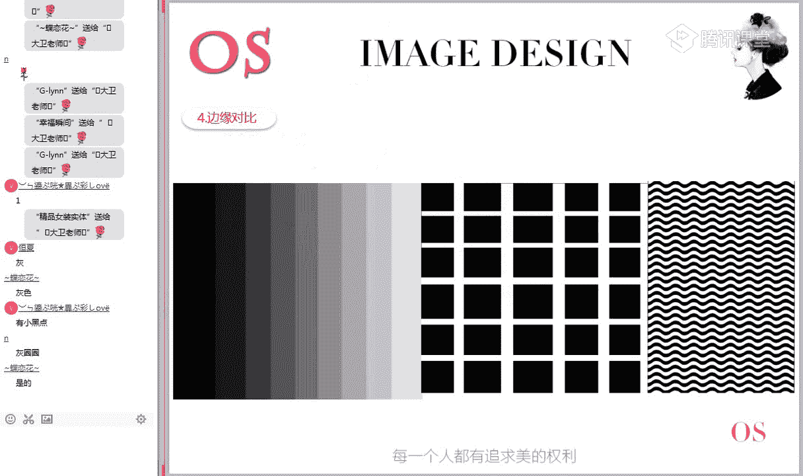

### 1. 色阴现象（视觉残像）

当我们长时间凝视一种颜色后，将视线移到白色背景上，会看到该颜色的心理补色。这是因为我们的视觉神经在长时间受刺激后，会产生疲劳，大脑会自动产生其补色来进行调节和平衡。

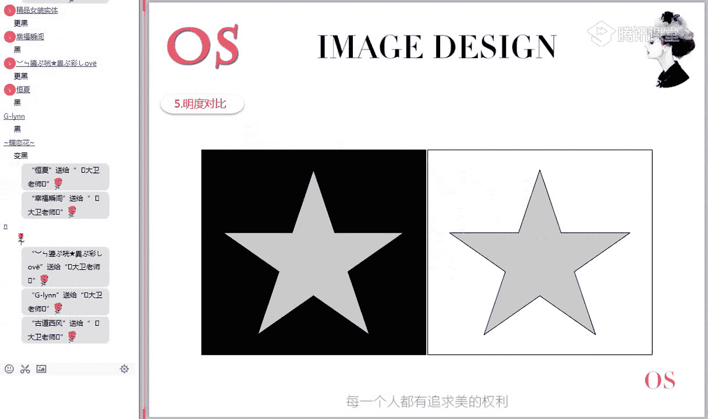

**互动实验**：凝视红色圆点30秒后，迅速看白色区域，你会看到一个淡蓝色的残像。这个淡蓝色就是红色的心理补色。

### 2. 同化现象

同化现象是指一个颜色因为受到周围环境色的影响，在视觉上倾向于环境色的现象。主要有三种：

以下是三种主要的同化现象：
*   **色相同化**：底色在分割线的影响下，整体色相发生偏移。例如，绿色底色被黄色线条分割后，整体看起来偏黄绿；被蓝色线条分割后，整体看起来偏蓝绿。
*   **明度同化**：底色在分割线的影响下，整体明度发生改变。例如，灰色底色被黑色线条分割后，整体看起来更暗；被白色线条分割后，整体看起来更亮。
*   **彩度（纯度）同化**：底色在分割线的影响下，整体纯度发生改变。例如，中等纯度的红色被高纯度红线分割后，整体看起来更鲜艳；被灰色线条分割后，整体看起来更灰暗。

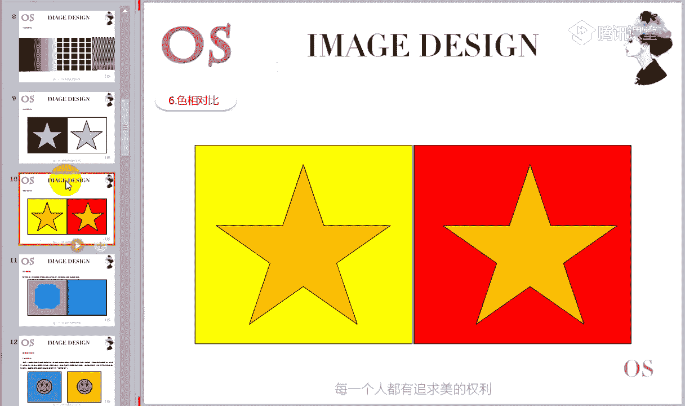

## 第三部分：色彩的感受

色彩不仅自身有属性，它们在不同的组合和环境下，还会给人带来不同的心理感受和视觉效应。

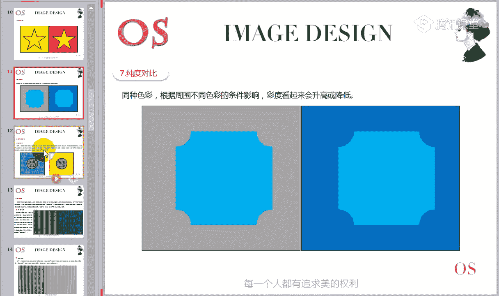

### 1. 色彩的面积效果

同一颜色在不同面积对比下，给人的鲜艳感不同：
*   在**大面积鲜艳色调**的衬托下，**小面积**色块看起来比它实际更鲜艳。
*   在**大面积灰暗色调**的衬托下，**大面积**色块看起来比小面积色块更鲜艳。

### 2. 色彩的识别性

色彩的识别性指色彩吸引视觉注意力的强弱程度。提高识别性有三种方法：
*   **增大色相差**：使用对比色（如红与绿）。
*   **增大明度差**：使用深浅对比（如黑与白）。
*   **增大彩度差**：使用鲜艳与灰暗的对比。

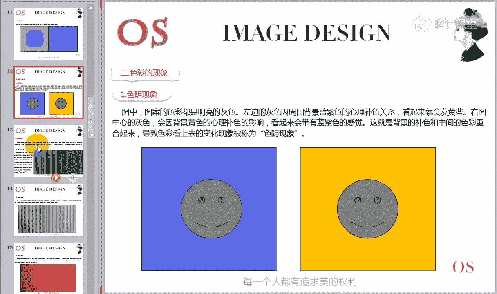

### 3. 色彩的前进感与后退感

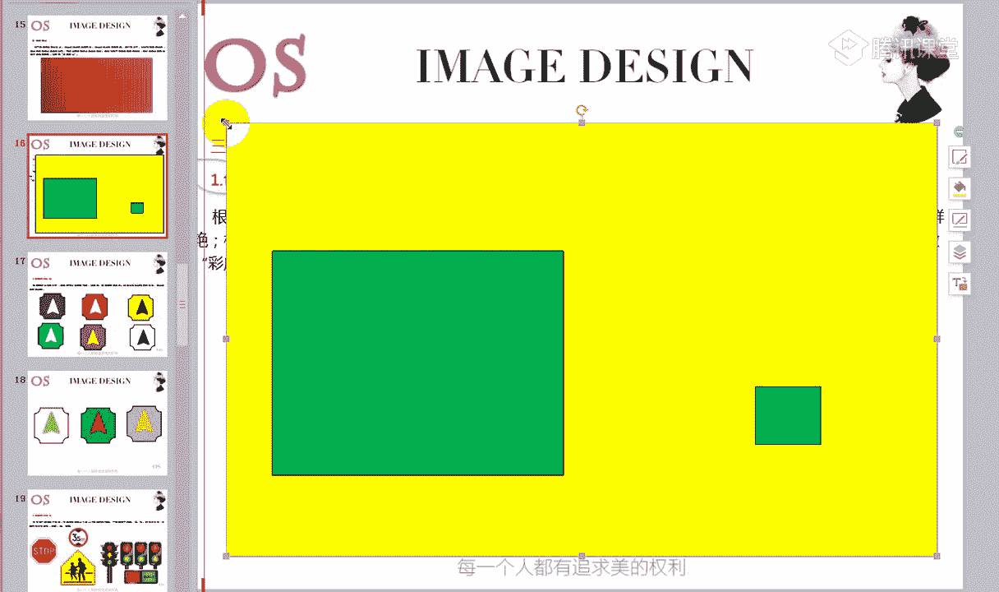

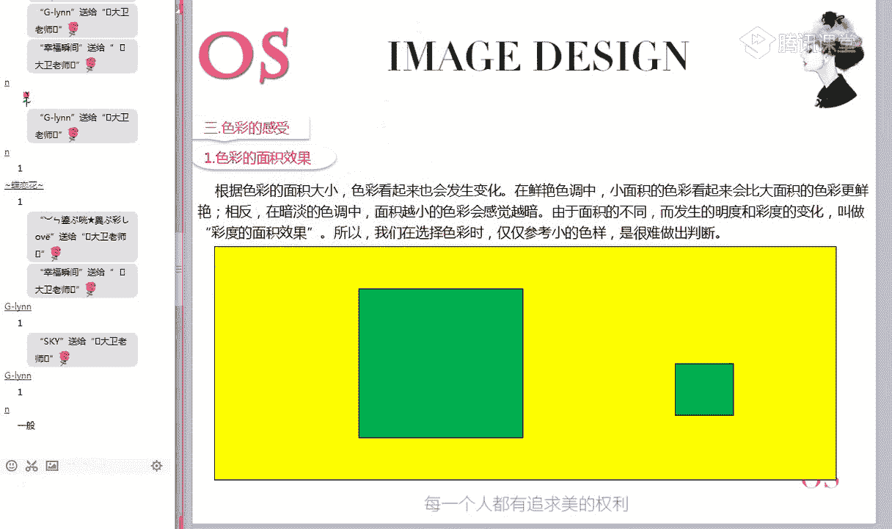

色彩能在视觉上产生空间距离感：
*   **前进色**：暖色系（红、橙、黄）和明度高的浅色，看起来有膨胀、靠近的感觉。
*   **后退色**：冷色系（蓝、绿、紫）和明度低的深色，看起来有收缩、远离的感觉。

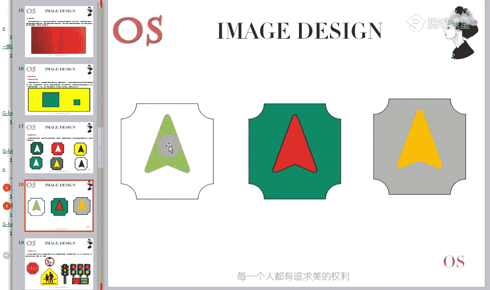

### 4. 色彩的膨胀感与收缩感

这与前进/后退感相关，主要指导搭配时的视觉效果：
*   **膨胀色**：暖色、浅色。使人看起来比实际更丰满。
*   **收缩色**：冷色、深色。使人看起来比实际更纤瘦。

---

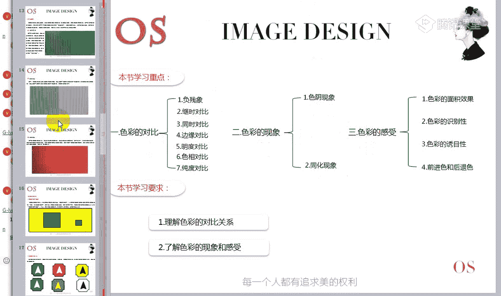

本节课中我们一起学习了色彩心理直觉的核心内容。我们首先明确了**色彩对比**的绝对性及其在实现和谐搭配中的目的，并掌握了通过分析**色相成分**来区分强弱对比关系的关键方法。接着，我们了解了**色阴现象**和**同化现象**这两种特殊的视觉效应。最后，我们探讨了色彩带给人的几种感受，包括**面积效果**、**识别性**、**前进/后退感**以及**膨胀/收缩感**。

这些知识是构建专业色彩搭配能力的基石，请务必理解消化。下一节课，我们将在此基础上，学习具体的色彩调和手法。

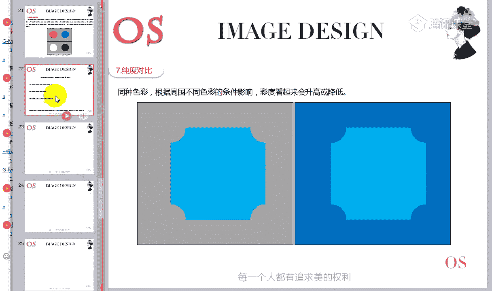

## 本节作业 📝

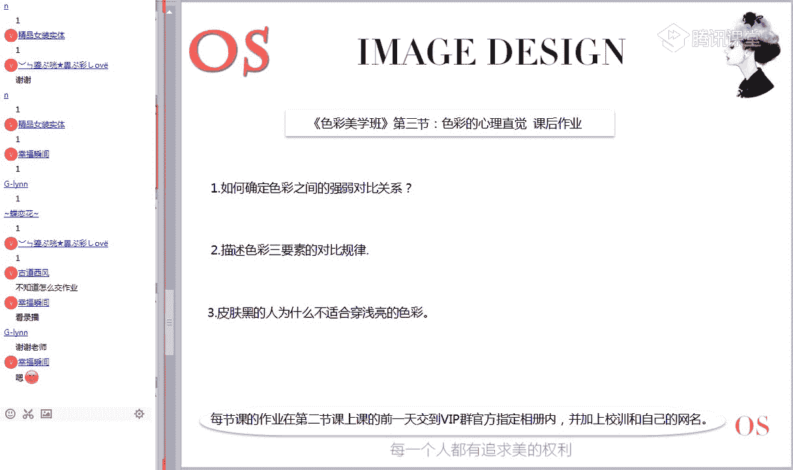

1.  **如何确定色彩之间的强弱对比关系？** 请简述你的判断方法。
2.  **描述色彩三要素（色相、明度、纯度）的对比规律。** 即当两个颜色在某一要素上存在差异时，会产生怎样的视觉变化？
3.  **请运用本节课所学知识分析：为什么皮肤偏黑的人不适合穿大面积浅亮的颜色？** （提示：可从明度对比规律和视觉感受角度分析）