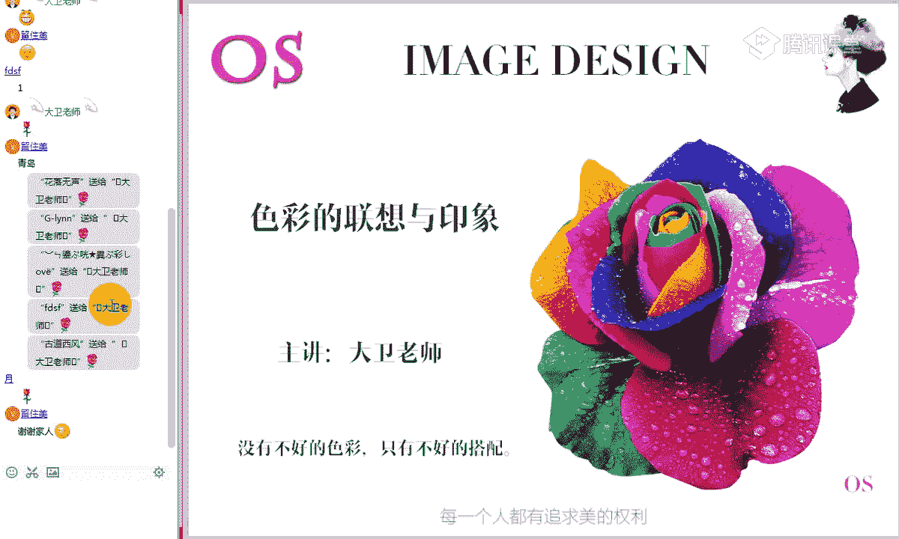
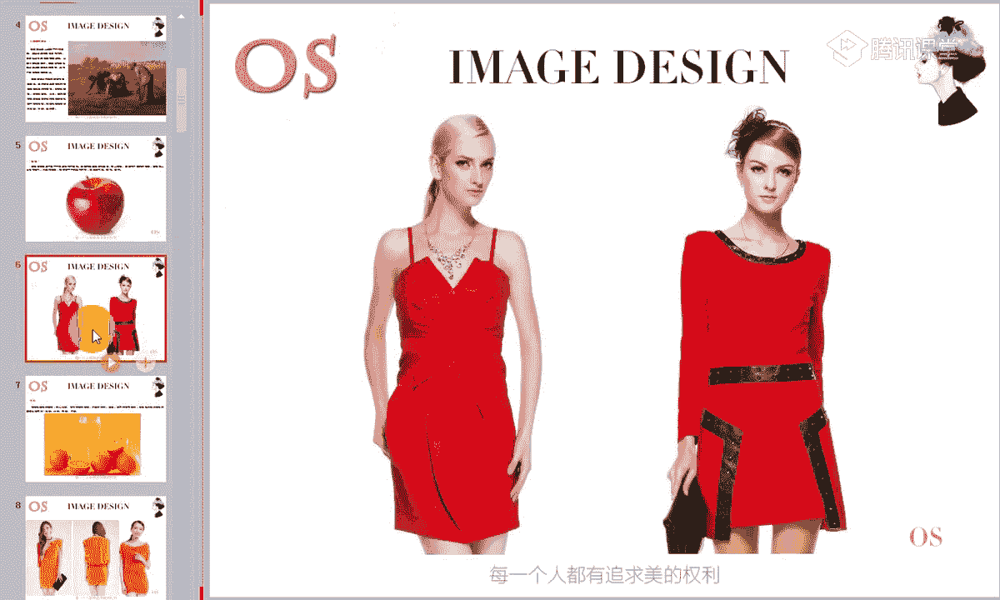
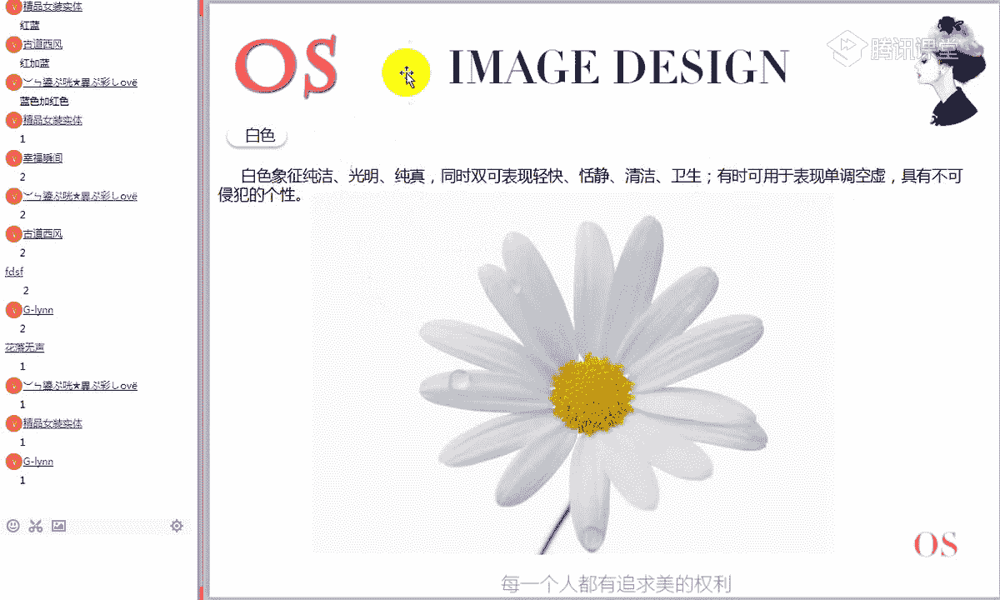
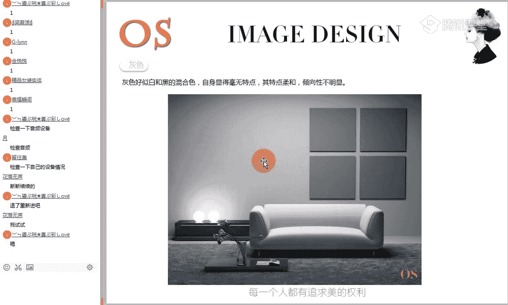
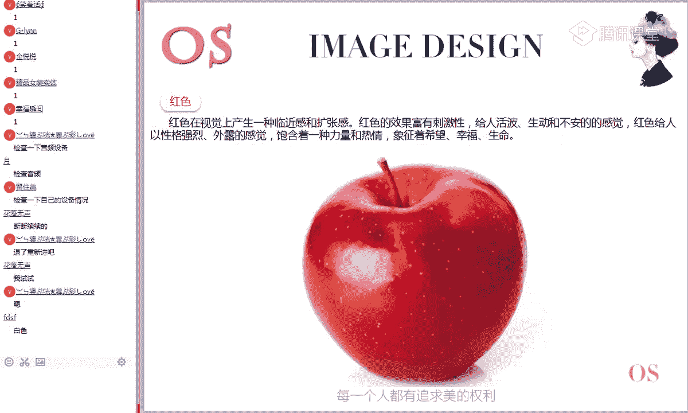
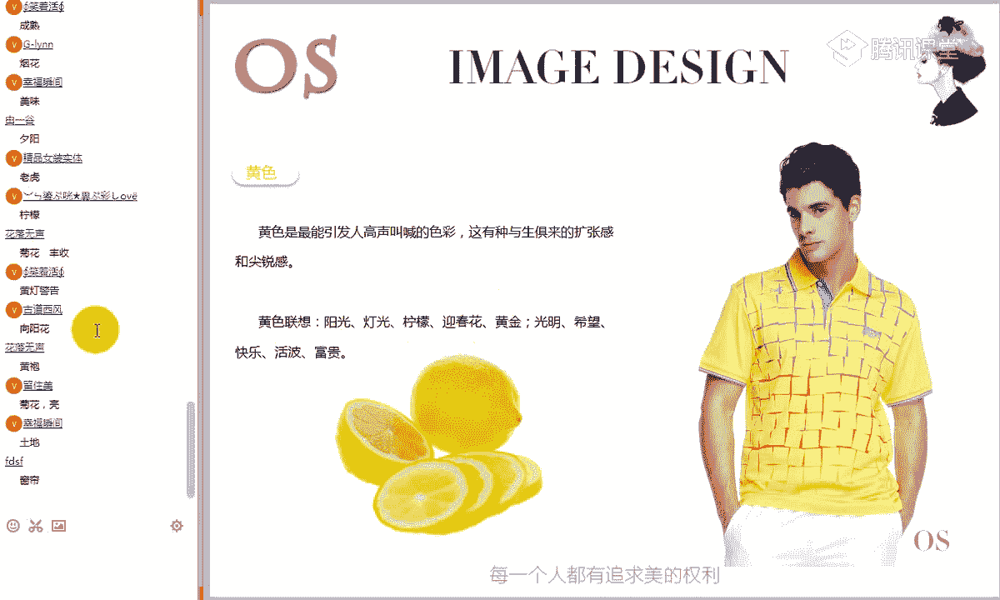
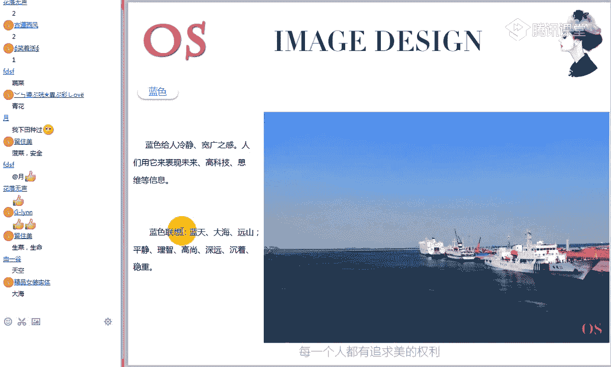

# 15男士形象色彩班VIP课程：第4节：色彩的联想与印象 🎨

在本节课中，我们将要学习色彩如何影响我们的心理和情感。我们将探讨色彩的心理效应、联想的概念，并深入了解九大基本色系（红、黄、蓝、橙、绿、紫、黑、白、灰）各自带给我们的独特感受。通过学习，你将学会如何感受色彩的生命力，并将其应用于未来的形象搭配中。

## 色彩的心理

上一节我们探讨了色彩的对比关系，本节中我们来看看色彩如何作用于我们的内心。色彩的心理，是指当我们看到不同色彩时，内心所产生的不同感受和情绪变化。

例如，观察下面这张充满丰富色彩的图片时，你会产生何种感觉？

面对不同的颜色，人们会产生冷暖、明暗、轻重、强弱、远近、胀缩、快慢等不同的心理反应。这种最直观的感受，是色彩心理的基础。

## 色彩的联想

理解了色彩的心理影响后，我们进一步探讨这种影响是如何产生的。色彩的联想，是人脑在看到色彩时，回忆或联想到与之相关的事物，进而引发情绪变化的思维过程。

色彩的联想主要分为两个方向：

以下是两种联想类型的定义与示例：
*   **具体联想**：看到色彩，联想到具体、有形的事物。
    *   例如：看到**红色**，联想到**太阳、火焰、红旗**。
*   **抽象联想**：看到色彩，联想到某种抽象的概念或感觉。
    *   例如：看到**红色**，联想到**温暖、危险、喜庆**。

这个概念是本节课的重点，务必分清。在后续的色彩感受训练中，我们需要从这两个方向去拓展思维。

## 九大色系特征初探

在对色彩心理和联想有了基本认识后，我们开始逐一了解构成色彩世界基础的九大色系。首先，我们从有彩系的红色开始。

### 1. 红色 🔴
红色在视觉上具有**前进感**和**扩张感**，效果富有刺激性，给人活泼、生动、不安的感觉。它象征着力量、热情、希望、幸福和生命。
*   **小知识**：红色是可见光中波长最长、饱和度最高的颜色，因此最容易引起视觉注意。这也是红绿灯使用红色的原因之一。

### 2. 橙色 🟠
橙色是由红色和黄色混合得到的二次色。它是一个**高明度**、高纯度的颜色。
*   **公式**：`橙色 = 红色 + 黄色`
*   因此，它继承了红色的部分热情与黄色的明亮，给人兴奋、活泼、富丽、辉煌、炙热的感觉。
*   **重要特性**：橙色是一个**极暖的颜色**，属于绝对的暖色调。

### 3. 黄色 🟡
黄色是明度最高的有彩色，纯度也很高。它具有快乐、活泼、希望、光明的特性，但有时也稍带轻薄、冷淡的感觉。
*   **应用思考**：观察下图标题的黄色与白色背景。它们的识别性强吗？为什么？
    *   答案：识别性弱。因为黄色和白色都是高明度颜色，明度对比弱。

### 4. 绿色 🟢
绿色能起到稳定情绪、缓解疲劳的作用，给人以柔顺、温和、优美、抒情的感觉，象征和平、青春与新鲜。
*   **特性**：绿色是人眼长时间观看也不会感到疲劳的颜色。

### 5. 蓝色 🔵
蓝色是原色之一，纯度很高。它使人联想到天空和海洋，能表现沉静、冷静、理智、博爱的性格特征。蓝色在视觉上具有**收缩感**和**后退感**。

### 6. 紫色 🟣
紫色是由红色和蓝色混合得到的二次色。
*   **公式**：`紫色 = 红色 + 蓝色`
*   **重要特性**：在红、黄、蓝、橙、绿、紫这六大色相中，紫色的**明度最低**，**纯度也相对最低**。它常用于表现孤独、高贵、奢华、优雅而神秘的情感。

### 7. 白色 ⚪
白色象征纯洁、光明、纯真，可表现轻快、恬静、清洁的感觉。

### 8. 黑色 ⚫
黑色使人联想到黑暗、黑夜、神秘，意味着悲哀、沉默、恐怖，但也可用于表现严肃、含蓄、庄重。

### 9. 灰色 🔘
灰色是黑色与白色的混合色，其特点是柔和、倾向性不明显。大面积使用灰色容易带来平淡、失落、颓废的感觉。

快速回顾一下九大色系：

## 九大色系的联想训练

初步认识了九大色系后，本节我们通过联想训练，深化对每个颜色的感受。记住，训练的目的是打开思维，让色彩在你的记忆中“活”起来。

### 红色的联想
红色给人温暖、热情、欢乐的感觉，也代表火热、活力与危险。
*   **具体联想**：夕阳、火焰、血液、五星红旗、中国结、红灯笼。
*   **抽象联想**：炎热、战争、革命、热情、激情、危险、恐怖。

**课堂练习**：看到红色，你还能想到什么具体事物和抽象感觉？

### 橙色的联想
橙色给人兴奋、稳重、丰富、喜悦、华丽之感。
*   **具体联想**：香橙、夕阳、灯光、麦穗。
*   **抽象联想**：甜蜜、温暖、喜欢、丰收。

### 黄色的联想
黄色是最能引发欢呼的色彩，有扩张感和尖锐感。
*   **具体联想**：阳光、灯光、柠檬、迎春花、黄金。
*   **抽象联想**：光明、希望、快乐、活泼、富贵。

### 绿色的联想
绿色具有稳定、平静感，是人眼最适应的颜色。
*   **具体联想**：树木、草地、树叶。
*   **抽象联想**：和平、青春、宁静、安全、成长。

### 蓝色的联想
蓝色给人冷静、宽广、理智的感觉。
*   **具体联想**：蓝天、大海、远山。
*   **抽象联想**：平静、理智、高尚、深远、沉着。

### 紫色的联想
紫色给人神秘、含蓄、幽静、高贵之感。
*   **具体联想**：丁香花、紫藤、葡萄。
*   **抽象联想**：梦幻、神秘、优雅、高贵。

### 白色的联想
白色给人明亮、纯洁、洁净、坦率的感觉。
*   **具体联想**：白雪、婚纱、白云。
*   **抽象联想**：纯洁、神圣、干净、简洁。

### 黑色的联想
黑色给人高贵、时尚、重量、坚毅的感觉。
*   **具体联想**：黑夜、墨水、煤炭。
*   **抽象联想**：寂静、恐怖、严肃、正义、邪恶。

### 灰色的联想
灰色给人平凡、失落、中庸、颓废的感觉。
*   **具体联想**：乌云、水泥、烟雾。
*   **抽象联想**：平凡、犹豫、失落、阴郁、丧失信心。

**课后建议**：请将九大色系的“具体联想”和“抽象联想”分别列出，越多越好，这是提升色彩敏感度的核心训练。

## 色彩的属性感受

除了具体的联想，色彩还有一些普遍的属性感受，这些感受直接影响我们的搭配选择。

### 1. 色彩的冷暖
色彩有冷暖之分。这源于我们的生活经验（如火焰的暖、海水的凉），是一种条件反射。
*   **冷暖色相**：
    *   暖色相：**红、橙、黄**
    *   冷色相：**蓝**
*   **冷暖色调**：
    *   暖色调：带有**黄**底调的一系列颜色。
    *   冷色调：带有**蓝**底调的一系列颜色。
*   **中性色**：**绿、紫**的冷暖倾向不分明，需通过对比判断（如黄绿偏暖，蓝绿偏冷）。

### 2. 色彩的轻重
这是一种视觉错觉。通常，浅色给人“轻”的感觉，深色给人“重”的感觉。在穿搭中需注意平衡。

### 3. 兴奋色与冷静色
*   **兴奋色**：暖色系、高纯度的色彩，能带来膨胀、兴奋感。
*   **冷静色**：冷色系、低纯度的色彩，能带来收缩、冷静感。

### 4. 华丽色与朴素色
*   **华丽色**：高纯度的色彩，给人以华丽、气派的感觉。
*   **朴素色**：低纯度的色彩，给人以朴素、低调的感觉。

### 5. 色彩的情感坐标
色彩学家根据冷暖、轻重等属性，将色彩划分到不同的情感象限中，这构成了“色彩情感坐标”的基础，也是后续学习“四季色彩理论”的雏形。

## 总结与作业

本节课中，我们一起学习了色彩如何影响我们的心理与情感。我们从“色彩心理”和“色彩联想”的概念入手，深入探讨了九大色系的基本特征和象征意义，并进行了联想训练。最后，我们了解了色彩的几种基本属性感受，如冷暖、轻重等。

**本节课作业**：
1.  **理论阐述**：请阐述“色彩联想”的概念，并解释“具体联想”与“抽象联想”的区别。
2.  **实践应用**：分别寻找两张暖色调服装图片和两张冷色调服装图片（冷暖倾向明显的即可）。
3.  **拓展训练（建议）**：在笔记本上，为九大色系分别列出“具体联想”和“抽象联想”的词汇，尽可能多地拓展你的思维。

色彩是有生命的，它连接着我们的记忆与情感。希望通过本节课的学习，你能打开感受色彩的大门，在未来的生活和形象塑造中，更敏锐、更自信地运用色彩的力量。