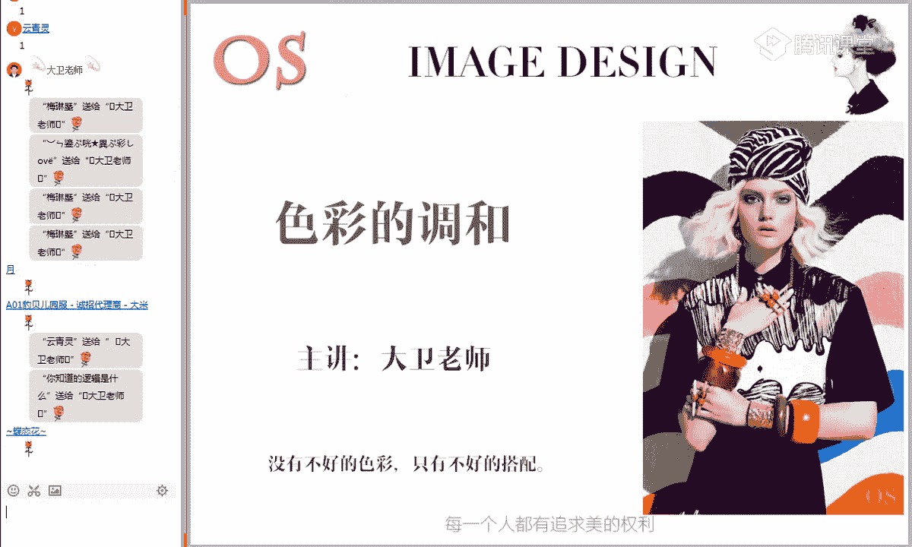
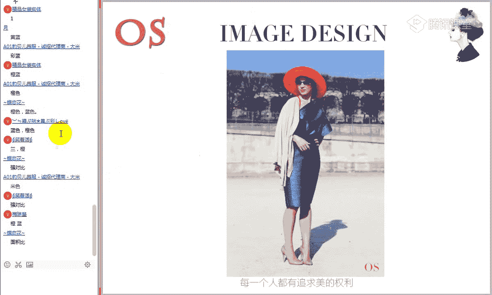
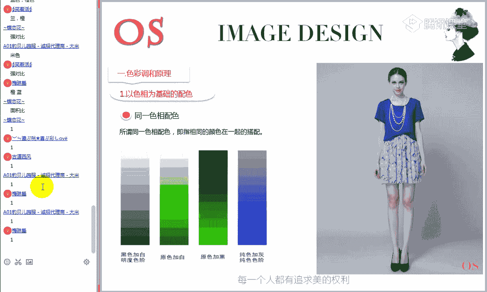
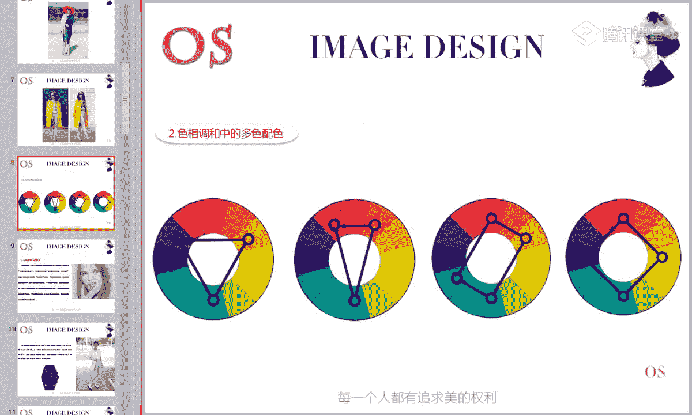
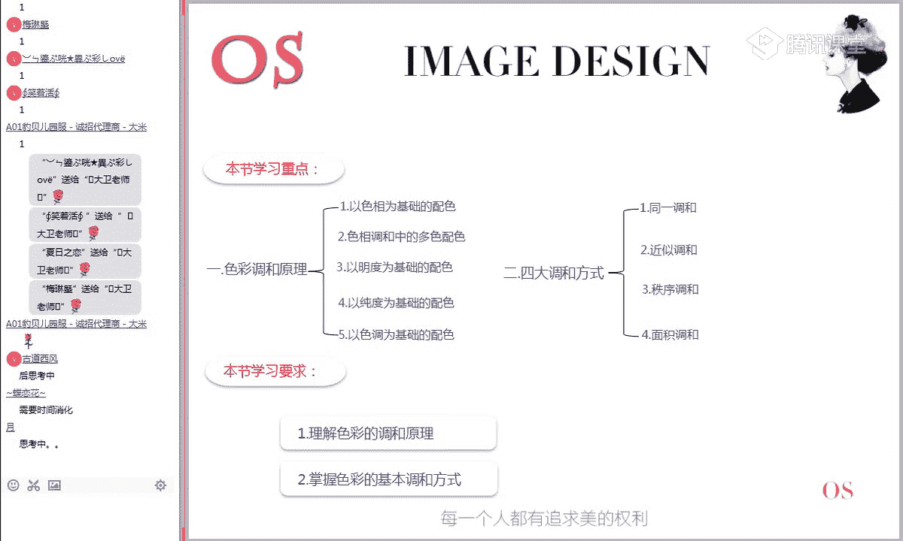

# 男士形象色彩班VIP课程：第5节：色彩的调和 🎨

在本节课中，我们将要学习色彩调和的核心原理与具体方法。色彩调和是解决颜色搭配冲突、实现视觉和谐的关键技能。我们将从以色相、明度、纯度为基础的配色方法入手，并深入探讨四大调和方式，帮助你掌握让任何颜色都能和谐共处的技巧。

---

## 第一部分：色彩的调和原理

上一节我们学习了色彩的情感与联想，本节中我们来看看如何让不同的色彩和谐地搭配在一起。色彩的调和原理为我们提供了系统分析配色方式的框架。

### 以色相为基础的配色

以色相为基础的配色，主要依据颜色在色相环上的位置关系来组合。以下是三种基本关系：

1.  **同一色相配色**
    *   指使用相同色相，但明度或纯度不同的颜色进行搭配。
    *   公式：`同一色相 + 不同明度/纯度`
    *   这种搭配对比关系最弱，视觉效果统一、柔和。

2.  **类似色相配色**
    *   指使用在色相环上相邻的颜色进行搭配。
    *   公式：`色相环上相邻色相（如红与橙）`
    *   由于相邻颜色含有大量相同色相成分，搭配起来和谐且富有变化。

3.  **对比色相配色**
    *   指使用在色相环上位置相距较远、没有共同色相成分的颜色进行搭配。
    *   公式：`色相环上相对或间隔较远的色相（如红与绿、蓝与橙）`
    *   这种搭配对比强烈，视觉冲击力大，但若处理不当容易产生冲突。

**核心概念解析：为什么强对比色搭配容易冲突？**
当两个颜色（如大红和大绿）没有任何相同的色相成分时，它们在视觉上缺乏连贯性，就像两个没有共同话题的人聊天会不愉快一样。因此，强对比色在进行大面积搭配时需要特别的调和技巧。

然而，“没有不好的色彩，只有不好的搭配”。通过巧妙的调和（例如，控制面积比、加入共同成分），强对比色也能搭配出彩。

---

### 色相调和中的多色配色

在理解了基本色相关系后，我们来看看几种经典的多色配色方案。以下是几种专属的配色方法：

1.  **三角色系配色法**
    *   在色相环上选取呈正三角形（120度）关系的三个颜色进行组合。
    *   例如：红、黄、蓝（三原色）或橙、绿、紫（三间色）。
    *   **配色原则**：通常采用“主色-辅助色-点缀色”的面积比例。建议主色占50%-60%，辅助色占30%-40%，点缀色占10%-15%。橙、绿、紫的组合因彼此含有共同色相成分，通常比红、黄、蓝的组合更柔和、易用。

2.  **分割互补配色**
    *   选取一组互补色（如红和绿），然后用其中一色的两个相邻色（如红紫、红橙）来替换它，与另一色（绿）进行三色搭配。
    *   公式：`互补色A + (互补色B的相邻色1 + 相邻色2)`
    *   这种配色既保持了互补色的活力，又比直接使用互补色更柔和、丰富。

3.  **矩形配色与正方形配色**
    *   **矩形配色**：在色相环上选取能构成矩形的四个颜色。
    *   **正方形配色**：在色相环上选取能构成正方形的四个颜色。
    *   这两种配色较为复杂，使用时需注意让画面中的冷暖色调保持均衡，否则容易显得杂乱。

---

### 以明度为基础的配色

现在，我们暂时抛开色相，来看看如何依据颜色的明暗（明度）进行搭配。明度配色主要分为以下三类：

1.  **同一明度配色**：使用明度相同的颜色搭配，稳定而平和。
2.  **类似明度配色**：使用明度相近的颜色搭配，柔和且有层次感。
3.  **对比明度配色**：使用明度差异大的颜色搭配，清晰、醒目，视觉冲击力强。

**应用提示**：高明度搭配给人轻盈、柔美之感，适合女性或柔和主题；低明度搭配显得沉稳、坚硬，更具男性气质；高明度与低明度的强对比则识别性极高，常用于警示或需要突出显示的场合。

---

### 以纯度为基础的配色

与明度类似，我们也可以依据颜色的鲜艳程度（纯度）来搭配。纯度配色也分为三类：

1.  **同一纯度配色**：使用纯度相同的颜色搭配。
2.  **类似纯度配色**：使用纯度相近的颜色搭配。
3.  **对比纯度配色**：使用纯度差异大的颜色搭配（如鲜艳色配灰浊色）。

这种配色方式能营造出或鲜明活泼、或含蓄沉稳的不同氛围。

---

### 以色调为基础的配色

最后，我们结合色相、明度和纯度，从更整体的“色调”角度来配色。依据PCCS色调图，可分为：

1.  **同一色调配色**：使用同一色调环内的颜色搭配，非常和谐统一。
2.  **类似色调配色**：使用相邻色调环的颜色搭配，和谐中富有变化。
3.  **对比色调配色**：使用相隔较远的色调环颜色搭配，对比鲜明，富有张力。

---

## 第二部分：四大调和方式 🛠️

认识了各种配色关系后，本节我们来看看当颜色搭配发生冲突时，具体有哪些方法可以进行调和。调和的核心目的是为有冲突的颜色建立视觉上的联系。

### 1. 同一调和

为冲突的颜色加入共同的成分，使它们产生内在联系。
*   **同一黑白灰调和**：在冲突色中同时加入白、黑或灰。
    *   例如：大红和大蓝冲突，但“浅红+浅蓝”（加白）或“深红+深蓝”（加黑）就变得和谐。
    *   **注意**：调和后的颜色虽和谐，但适合的穿着者不同。浅色调适合肤色白皙者，深色调适合肤色较深者。

### 2. 近似调和

让冲突的颜色彼此靠近，变成色相环上的邻居（类似色）。
*   方法：通过混合，让两个颜色含有大量相同的色相成分。
*   例如：想让黄和蓝和谐，可以往蓝色里加黄，使其变成黄绿色，再与黄色搭配。

### 3. 秩序调和

通过有规律、有秩序的排列，来组织杂乱或冲突的色彩。
*   这不是颜色成分的调和，而是形式美的运用。
*   例如：彩虹色、条纹衫、格纹图案。将色彩按一定序列排列，就能产生节奏感和美感。

### 4. 面积调和

通过控制冲突颜色在画面中所占的面积比例来实现和谐。
*   **核心原则**：拉开面积差距，通常采用“主色+点缀色”的形式。
*   公式：`主色（大面积，60%-90%）+ 点缀色（小面积，10%-40%）`
*   经典案例：“万绿丛中一点红”。强对比色（红与绿）因面积悬殊，反而成为点睛之笔。

---

## 如何选择：强对比还是弱对比？ 🤔

学完所有技巧后，你可能会问：我到底该用强对比色还是弱对比色来搭配？
答案取决于：**你想要表达什么样的主题和感觉**。
*   **弱对比搭配**（同一/类似色相）：感觉柔和、安静、温婉、稳重。
*   **强对比搭配**（对比色相）：感觉活泼、动感、时尚、具有视觉冲击力。
因此，在选择配色方案前，先明确你想要传递的情感与风格。

---

## 总结与作业 📚

本节课中，我们一起学习了色彩调和的核心体系。我们从以色相、明度、纯度、色调为基础的配色原理入手，系统掌握了多种配色方法。接着，我们深入探讨了解决颜色冲突的四大调和方式：同一调和、近似调和、秩序调和与面积调和。记住，关键在于理解颜色之间的关系，并灵活运用调和技巧，真正做到“没有不好的色彩，只有不好的搭配”。

**课后作业：**
1.  **思考题**：在进行一套服装搭配时，如何判定应该使用强对比色组合还是弱对比色组合？
2.  **实践题**：寻找运用了“同一调和”、“近似调和”、“秩序调和”、“面积调和”这四种方式的服装搭配图片各两张，并简要分析其调和原理。

请认真完成作业，这将帮助你更好地消化和理解本节课的核心知识。如有疑问，请及时提出。