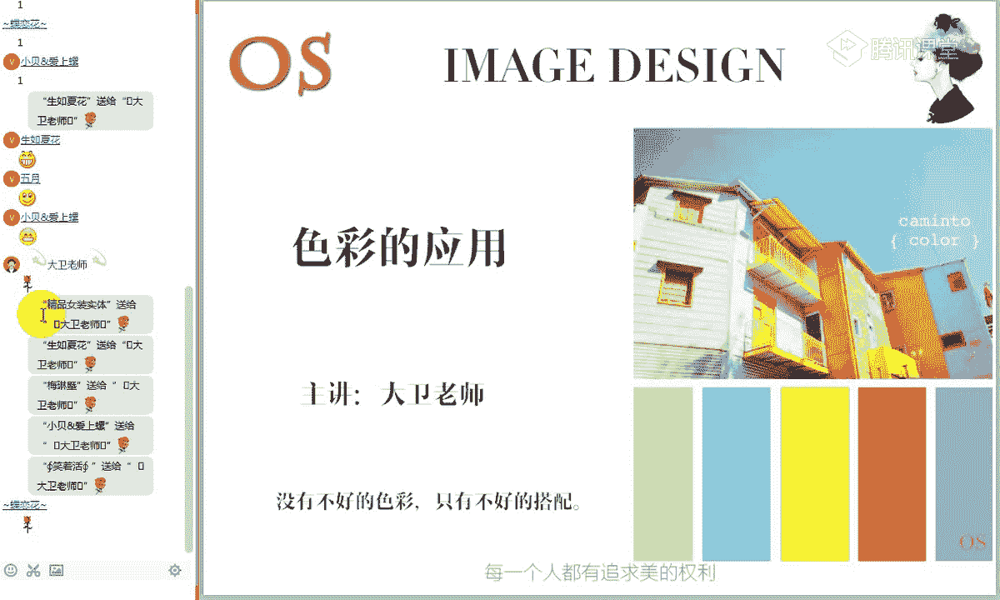
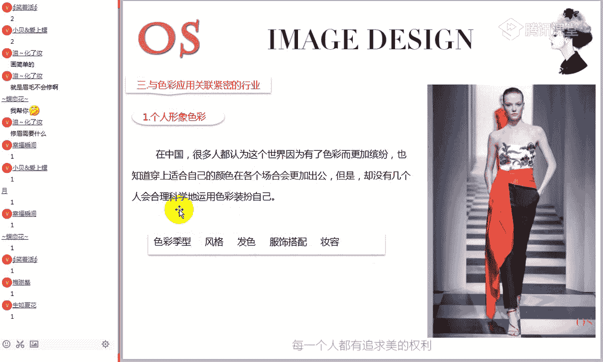
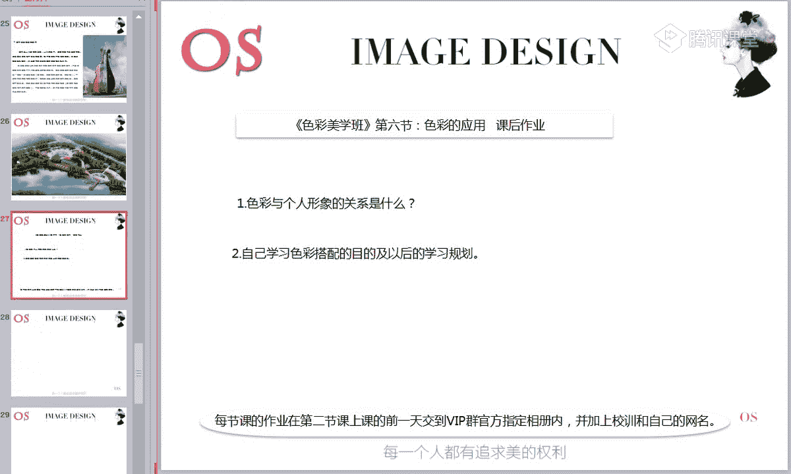
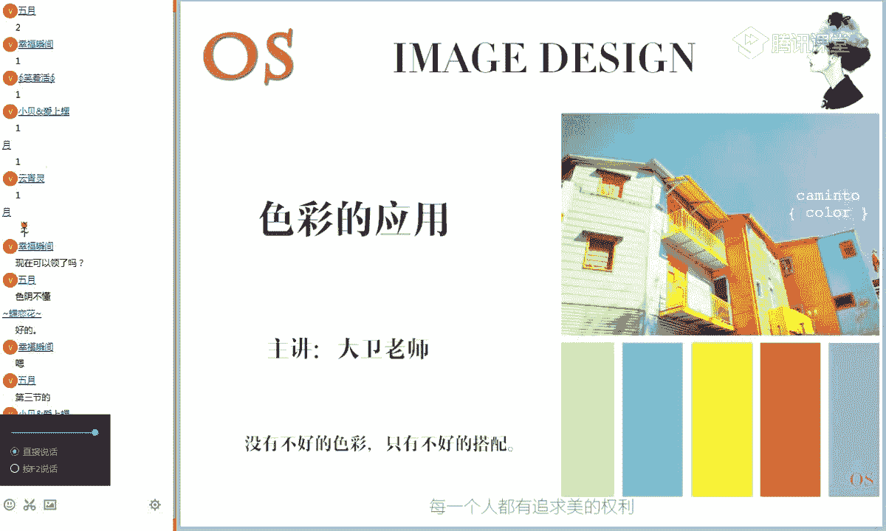
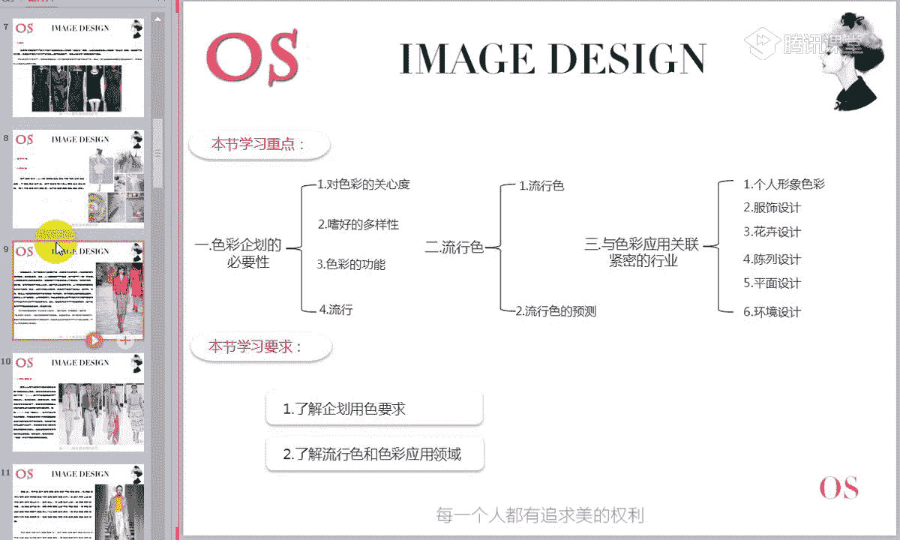

# 15男士形象色彩班VIP课程：第6节：色彩的应用

在本节课中，我们将要学习色彩在实际生活中的价值与应用方向。这是色彩美学班的最后一节课，我们将重点探讨色彩如何影响商业决策、个人形象以及各行各业，帮助大家拓展视野，理解色彩的广泛用途。

---

## 第一部分：色彩企划的必要性

上一节我们学习了具体的配色技巧，本节中我们来看看色彩在商业实践中的宏观规划——色彩企划。

色彩企划，是指结合商品特有的环境、目的与性格，在客观上指导色彩应用，并进行实践实施的工作。在大型公司中，通常会有专门的色彩顾问进行专业的用色指导。

以下是关于大众对色彩关注度的调查数据：
*   不关心色彩：24.5%
*   关心色彩：62.2%
*   非常关心色彩：11.68%

数据显示，超过70%的人会关注色彩。这说明色彩对我们的心理和商业选择有着重要影响。

### 嗜好的多样性

在商业用色时，需要考虑人群的色彩偏好。以下是两种不同的用色策略：

1.  **大众化日用品**：如厨房用品、卫生用品。这类产品倾向于使用蓝色系、绿色系、红色系或白色系等大多数人都容易喜欢的颜色。
    *   **公式**：`产品用色 = 大众普遍偏好色`
2.  **个性化产品**：如特定服饰、婴儿用品、女士用品等。这类产品需要考虑到专属人群的特别喜好。
    *   **公式**：`产品用色 = 目标人群专属偏好色`

### 色彩的功能

在广告、包装、办公室等商业或特定场所，用色不能仅凭个人喜好，而应看重其功能价值。

*   **广告与包装**：需要用醒目、识别性强的色彩组合来吸引顾客注意。这运用了色彩的识别性原则，通常通过**强烈反差**来实现。
*   **信息传达**：配色方案需要让人容易理解产品。这关联到**色彩的联想与印象**知识，例如，食品包装用色应能唤起“美味”的感觉。
*   **环境设计**：在办公室、工厂等场所，为提高效率，周围应使用明快的颜色。环境配色需结合场所目的与人的心理特征。

---

## 第二部分：关于流行色

了解了色彩的基础规划后，我们来看看一个动态的概念——流行色。

流行色表现了在特定时代中被很多人应用的颜色，它影响着人们对色彩的价值观。流行色的动向通常每两个季节变化一次。

### 流行色的由来

流行色不断变化的核心原因在于人的心理需求——喜新厌旧。当一种颜色被广泛使用一段时间后，人们会产生厌倦感，进而渴望看到新的色彩。

以流行的眼光看色彩，便有了美与不美之分。但这并非颜色本身不美，而是受流行趋势和心理影响的结果。

### 流行色的预测

流行色并非由个人随意规定，而是由全球色彩专家联盟，通过持续收集信息、开会研讨、反复磋商，最终预测并发布下一季度的色彩方案。这些方案通常最先在国际时装周上发布，随后波及全球。

---

## 第三部分：色彩的应用领域

前面我们探讨了色彩的理论与趋势，本节中我们来看看色彩具体在哪些行业发挥着关键作用。

以下是色彩应用紧密关联的几个主要领域：

1.  **个人形象色彩**
    *   **服饰色彩和谐**：解决服装颜色之间，以及服装颜色与人的肤色之间的和谐问题。每个人都有专属的色彩群，选择范围内的颜色能让人显年轻、显精神。
    *   **服饰风格关联**：不同服饰风格（如戏剧型、自然型）对色彩对比度、鲜艳度有不同要求。
    *   **发型设计**：头发染什么颜色，需考虑个人肤色的冷暖与深浅。
    *   **妆容**：化妆品（粉底、眼影等）颜色的冷暖、深浅选择，需与肤色协调，否则妆面会显假。

2.  **服饰设计**
    *   时装的色彩和配色随时代变化。设计师需关注社会文化动向（如环保意识催生生态色彩）并灵活运用各类配色方法（如单色调、对比色、多色混合等）。

3.  **花卉设计**
    *   在插花艺术中，色彩效果至关重要。其配色逻辑与平面设计相通，通常遵循**三色配色法**：先确定**基调色**（主色调），再搭配**辅助色**，必要时加入**强调色**突出重点。
    *   **实例分析**：一盆以绿色为主、红色点缀的花卉。红绿是强对比互补色，易冲突。此处通过**面积调和**（绿色占绝对大面积，红色少量点缀）实现了和谐，即“万绿丛中一点红”。

4.  **陈列设计**
    *   在商场、展会中，好的陈列能吸引目光，促进销售。陈列最基本的要素就是**色彩搭配**，和谐的色彩组合能让陈列效果更加赏心悦目。

5.  **平面设计**
    *   涉及广告、包装、网页、海报等方方面面。色彩搭配直接影响作品的视觉效果和情感传递，是设计师必须深入掌握的技能。

6.  **室内与环境设计**
    *   **室内设计**：公共空间（客厅、餐厅）多用大众接受度高的色彩；私人空间可按喜好搭配。注意：儿童房可用鲜艳色彩刺激发育；老人房宜用舒缓、积极的色彩，避免过于灰暗或强烈。
    *   **城市景观色彩**：现代城市规划中，会考虑整体建筑色调的和谐统一，由专业的环境色彩顾问参与设计，以提升城市美观度。

---

## 总结与作业

本节课中我们一起学习了色彩在商业企划中的必要性、流行色的由来与预测，以及色彩在个人形象、服饰设计、花卉设计、陈列设计、平面设计和环境设计等六大领域的广泛应用。这些知识旨在拓展大家对色彩价值的认知。

**本节课作业：**
1.  简述色彩与个人形象的关系是什么？
2.  阐述自己学习色彩搭配的目的，以及今后的学习规划。（请认真思考并如实回答）

**课程考核提醒：**
色彩美学班最终考核包含调制色相环（8学分）、六次作业（每次2学分）和笔试（80学分）。总学分80分以上为合格。请同学们在确保掌握所有知识后再参加考试。

---

本节课是色彩美学班的最后一课，内容以了解和拓展为主。希望大家能将色彩知识与生活实际联系起来，发现色彩的无限可能。扎实的色彩基础将是您后续学习个人形象课程或其他相关领域的坚实基石。