# 16男士衣品速成穿搭指南：第10课：认识体型，扬长避短，穿出好身材！👔

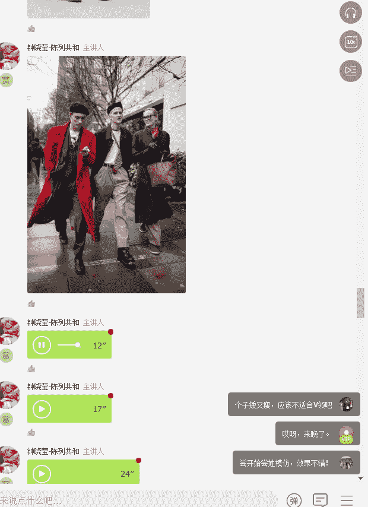

在本节课中，我们将要学习如何根据不同的男性体型进行穿搭，核心目标是“扬长避短”，通过服装搭配优化身材比例，穿出自信与魅力。课程将涵盖肥胖、瘦弱、健壮（倒三角）及矮小等常见体型的穿搭法则。

知识本身并非力量，运用知识才是力量。穿衣品味的提升并非一蹴而就，它需要不断学习、实践、总结与调整。风格是由内而外的自我表达，而非盲目追随流行。对于男士而言，内外兼修是一种美德，得体的外在形象是展现内在魅力的重要窗口。

没有人愿意透过邋遢的外表去了解丰富的内在。要穿出好身材，第一步是客观认识自己的真实体型。

## 认识常见男性体型 🧍‍♂️

男性的体型大致可分为以下几种：
*   **H型**：肩部、腰部、臀部宽度接近，像长方形。这种体型穿衣难度较低。
*   **倒三角型**：肩部明显宽于臀部，是健身人士的常见体型。
*   **正三角型**：肩部窄，腹部或臀部较宽，常见于缺乏锻炼的体型。
*   **O型**：整体圆润，腹部突出，即微胖或肥胖体型。
*   **瘦弱型**：整体纤细，缺乏肌肉感。

为简化教学，我们将其归纳为**肥胖型、瘦弱型、健壮型（倒三角）和矮小型**进行重点讲解。中等匀称体型（H型）穿搭限制较少。

## 肥胖体型穿搭法则 🐘

肥胖体型穿搭的核心是**视觉收缩**和**避免膨胀感**。

以下是具体的穿搭建议：

1.  **色彩选择**：优先选择**素色**和**深色**。避免鲜艳色、大图案和具象图案。若想穿浅色，务必在外叠加深色外套进行叠穿。
    *   **公式**：`优选色彩 = 深色/素色`；`避免色彩 = 鲜艳色/复杂图案`
2.  **面料与图案**：忌讳**宽条纹、密集条纹和明显格子**（如Burberry格纹）。避免过于柔软贴身的面料，以免暴露身体轮廓。选择有一定挺括感的面料。
3.  **版型与搭配**：避免紧身和过于宽大的衣服，选择**合身或微宽松**的版型。切忌单穿一件T恤，务必采用**叠穿**法（如T恤+衬衫+外套）来增加层次感和纵向线条。避免衣长过长。

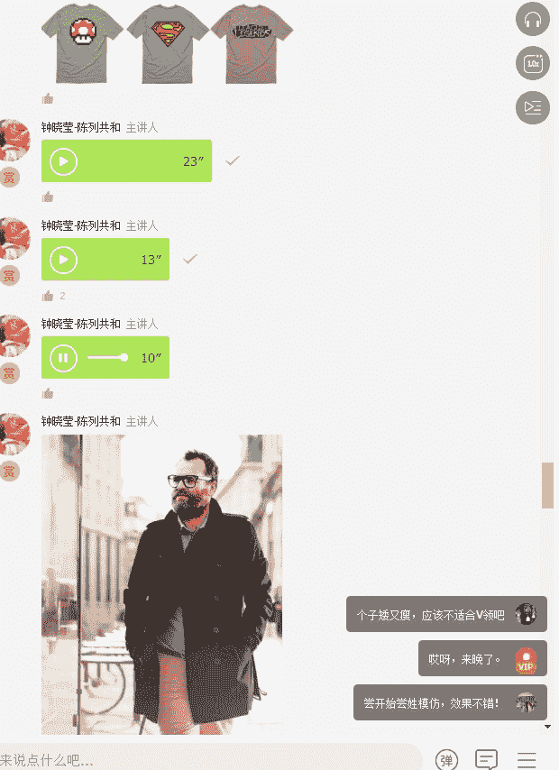

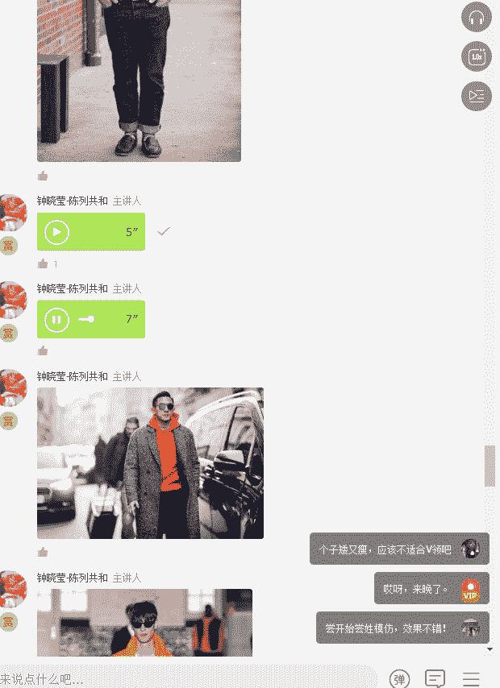

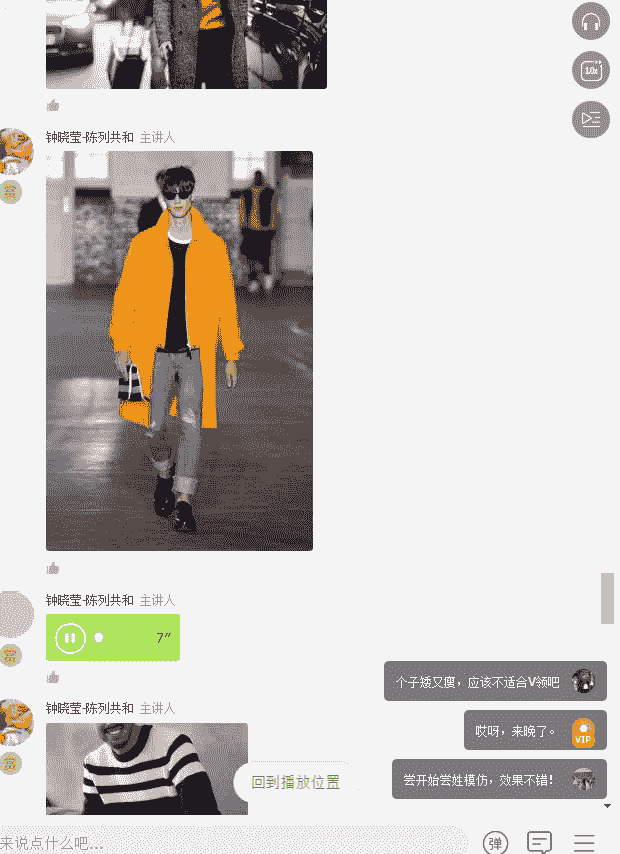

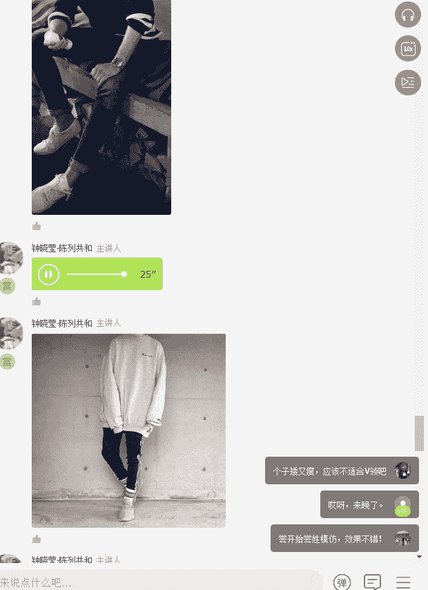

## 瘦弱体型穿搭法则 🦒

瘦弱体型穿搭的核心是**视觉增重**和**营造层次感**。

以下是具体的穿搭建议：

1.  **核心技巧：叠穿**：这是瘦子最重要的穿搭法则。通过**里三层外三层**的穿法增加身体维度。例如，搭配夹克、格子衬衫、毛衣、双排扣外套。
    *   **代码**：`穿搭方案 = 打底衫 + 衬衫/毛衣 + 外套`
2.  **图案与色彩**：适合穿着**横条纹、方格纹**的上衣。选择**低明度**（颜色较深、较浊）的衣服，能在视觉上显得丰满。
3.  **下半身禁忌**：绝对避免**过于紧身**的裤子，否则会显得腿更细。应选择**合身**的直筒或微锥形裤。

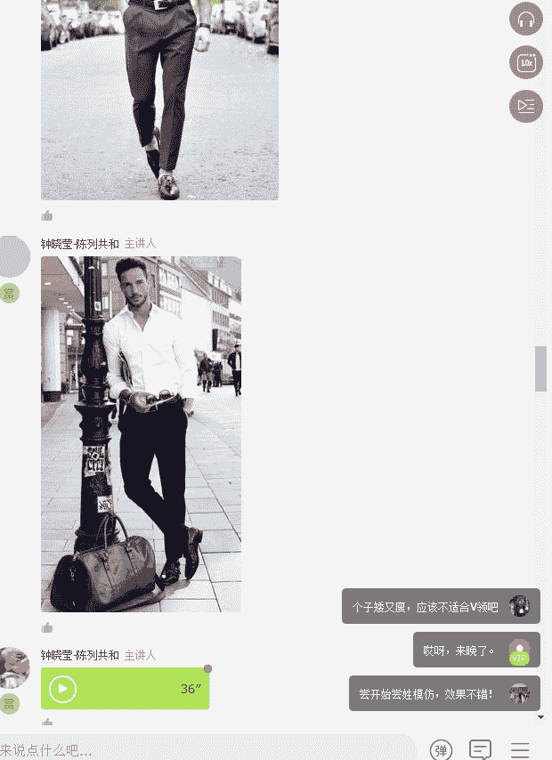

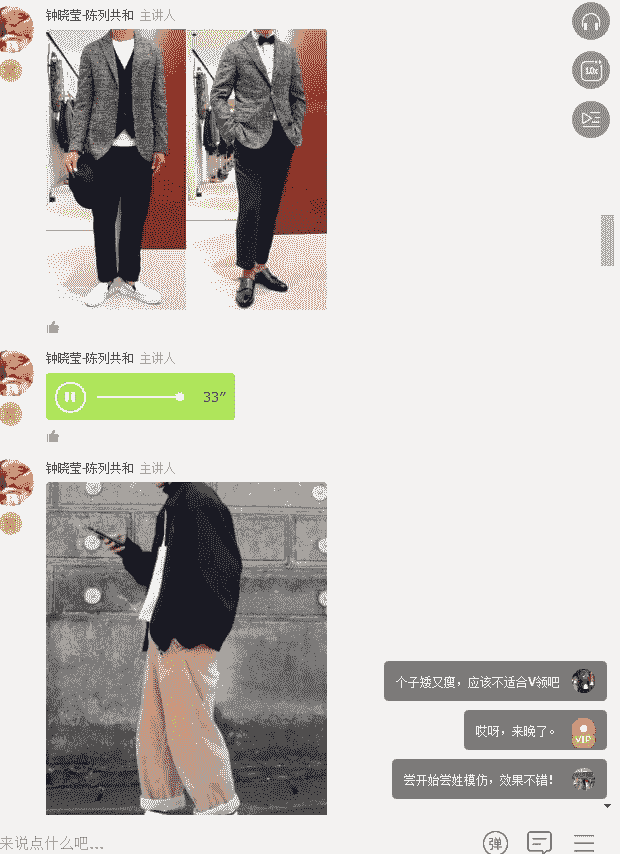

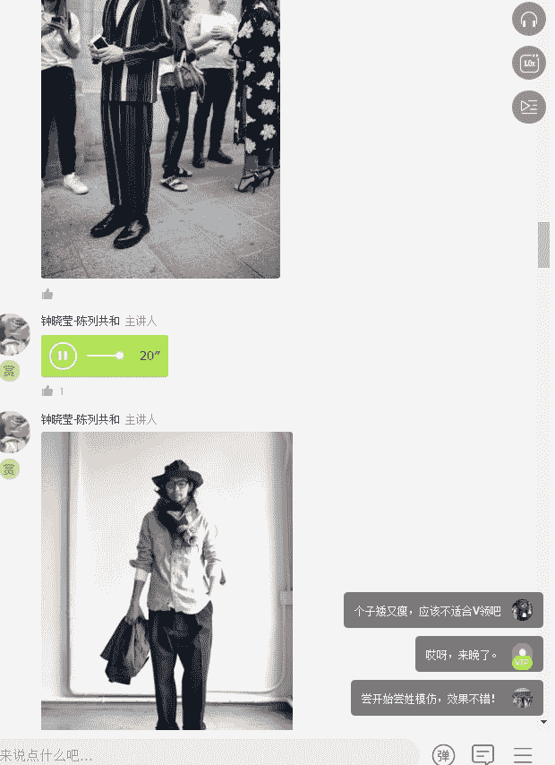

> **胖瘦体型共同禁忌**：都应避免单穿一件过于紧身或宽大的上衣，以及模糊身材比例的搭配。

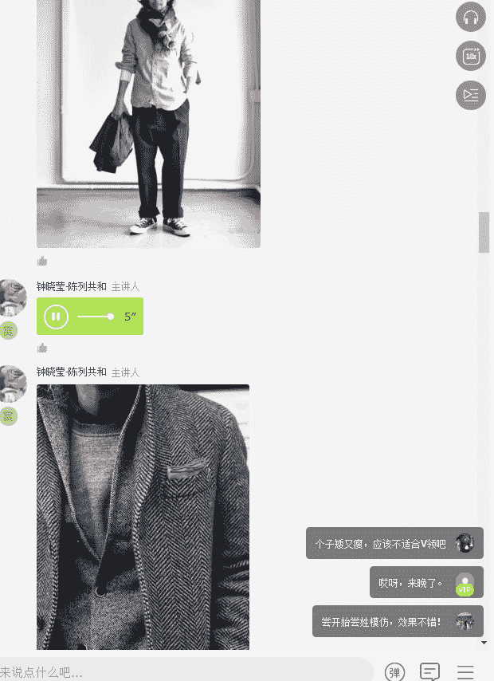

## 健壮体型（倒三角）穿搭法则 🏋️

健壮体型（肩宽胸厚）穿搭的核心是**平衡上下比例**，避免显得笨重。

以下是具体的穿搭建议：

1.  **领型选择**：避免**高领**和**紧身圆领T恤**，它们会强化胸肩宽度，显得脖子短粗。应选择**有领款式**（如衬衫、Polo衫）或**宽松圆领**。
2.  **上衣版型**：选择**松紧适度**的上衣，以能伸进一个拳头为佳。避免过于紧身或过于宽松。
3.  **下半身搭配**：适合搭配**修身或直筒裤**来平衡上宽下窄的感觉。切忌穿**宽腿裤**，以免头重脚轻。
4.  **利用配饰**：可通过搭配**V领针织衫、衬衫**或系一条**轻薄围巾**来塑造纵向线条，使视觉更精神。

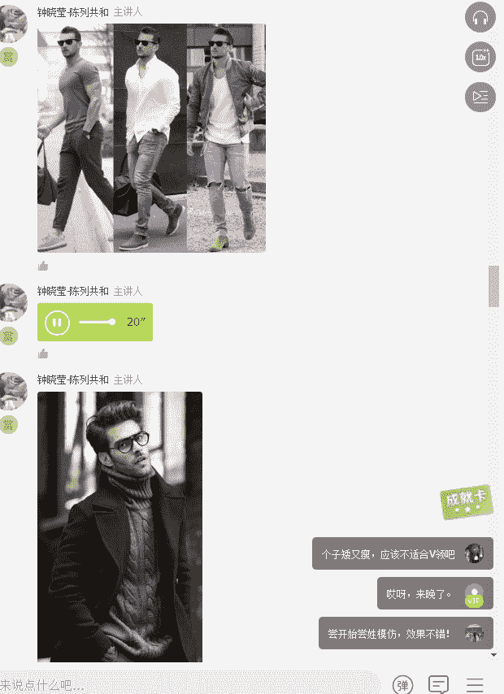

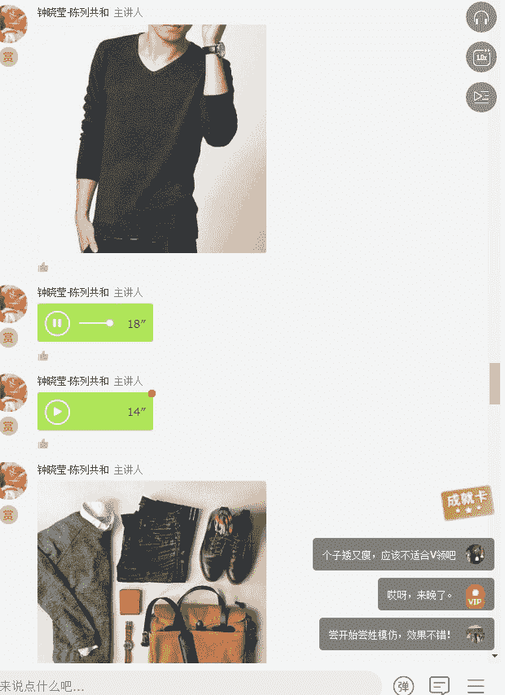

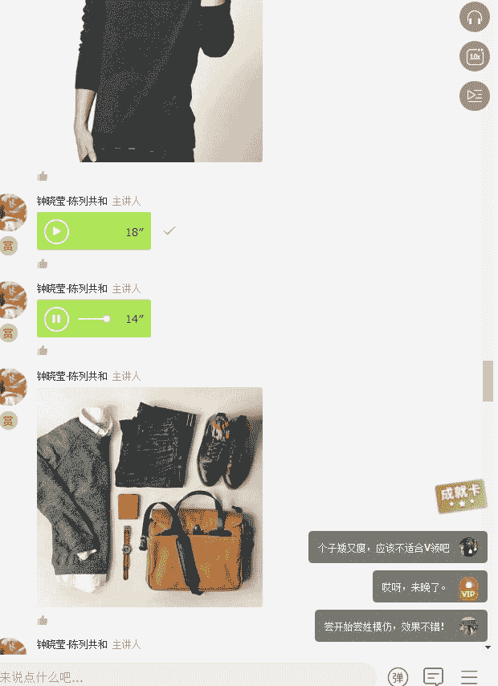

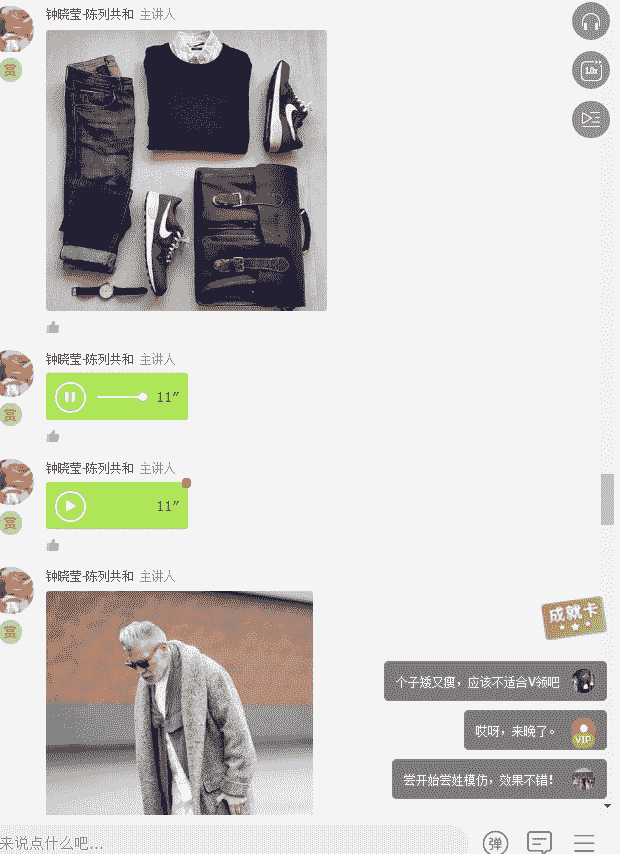

## 矮小体型穿搭法则 📏

矮小体型穿搭的核心是**视觉增高**和**优化比例**，将焦点上移。

以下是需要避免的雷区：

1.  **不合身的Oversize服装**：显得拖沓，压身高。
2.  **低腰裤、哈伦裤**：破坏比例，易形成“六四身”。
3.  **下摆过长的上衣**：缩短下肢视觉长度。
4.  **七分裤**：明确分割腿长，反而显腿短。
5.  **花色繁杂的裤子**：将视觉焦点下移，显矮。

以下是推荐的穿搭技巧：

1.  **视觉上移**：通过**亮色上衣、帽子、围巾、领带**等配饰将焦点集中在上半身。
    *   **公式**：`视觉焦点 = 上半身（亮色/配饰）`
2.  **纵向延伸**：穿着**V领上衣**和**竖条纹单品**，利用纵向线条拉长身形。
3.  **优化比例**：
    *   将**衬衫下摆**部分或前半部分塞进裤子。
    *   使用**腰带**明确腰线。
    *   确保裤子**合身修身**，避免堆积。
4.  **色彩连贯**：让**裤子与鞋子颜色统一**，能有效延长腿部线条。
5.  **上下色彩法则**：**上浅下深**或**上亮下暗**。避免下半身穿鲜艳色（如橘、黄、绿），尤其避免难以驾驭的白色裤子。

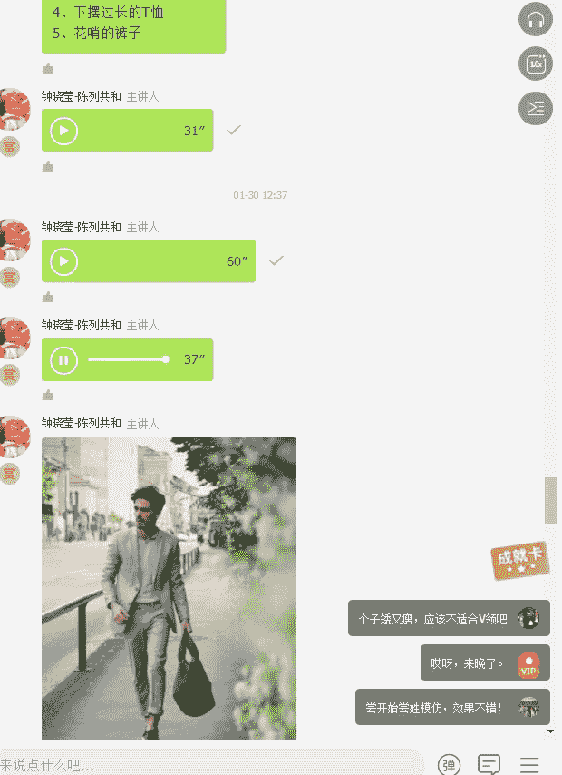

## 总结 📝

本节课我们一起学习了针对不同男性体型的穿搭技巧：
*   **肥胖型**：重在“收”，用深色素色、合身版型和叠穿法。
*   **瘦弱型**：重在“增”，用叠穿、格纹和低明度色彩增加量感。
*   **健壮型（倒三角）**：重在“平衡”，用有领上衣、合身下装避免头重脚轻。
*   **矮小型**：重在“拉长”，通过视觉上移、纵向线条和色彩连贯来优化比例。

记住，好的穿搭始于了解自己，并勇于尝试和调整。穿衣的最终目的是展现自信、得体的自我。

今天的课程到此结束。我们明天同一时间再见。

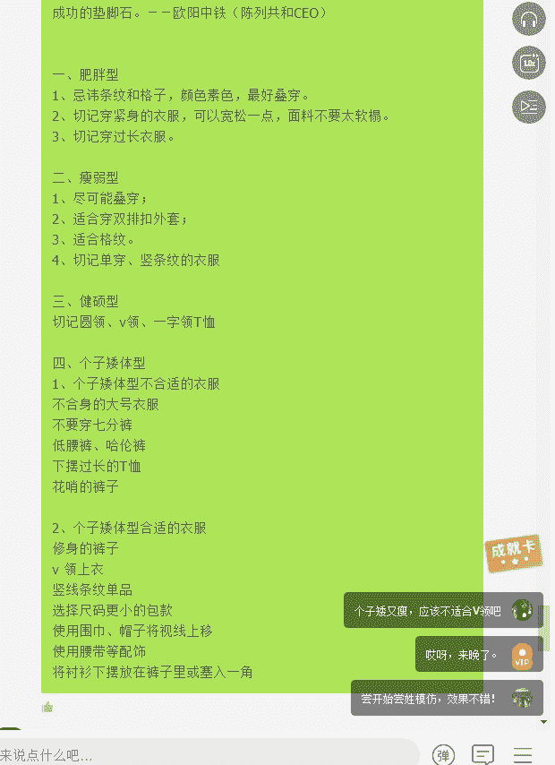

