# 16男士衣品速成穿搭指南：第11课：玩转场合着装 👔

在本节课中，我们将要学习男士场合着装的核心原则与技巧。场合着装是个人职业素养与形象管理的关键，它关乎你在不同环境下的得体与自信。我们将系统性地了解如何根据工作、休闲和社交等不同场景，选择合适的服装，避免尴尬，提升个人形象价值。

上一节课程中，我们重点学习了针对不同体型的穿衣法则。本节中，我们来看看如何将这些法则应用到具体的场合中，实现“要帅、要得体、要有逼格”的目标。

---

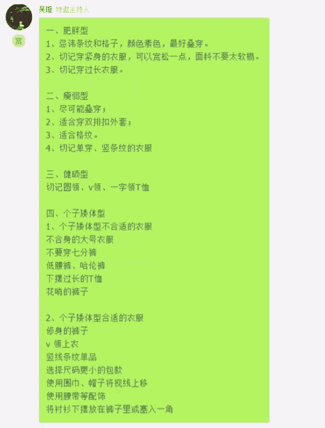

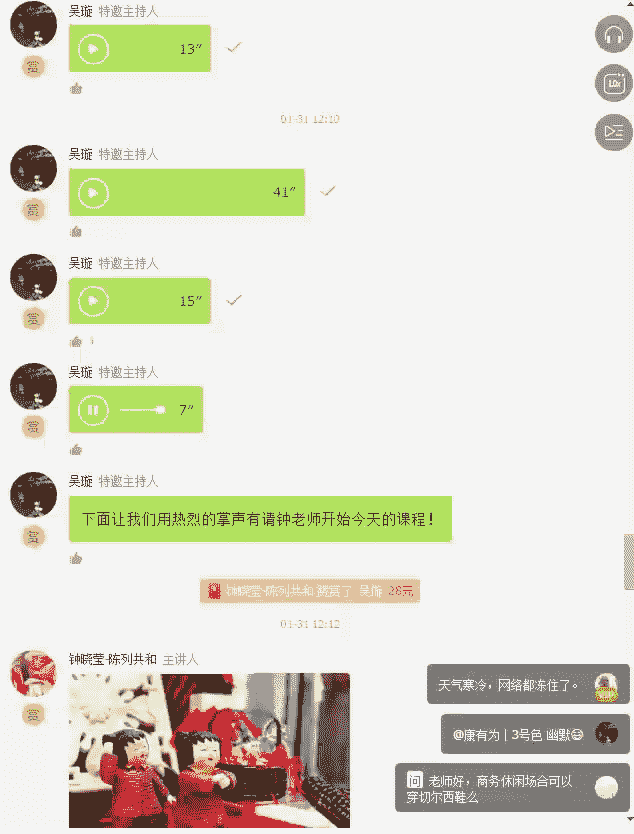

## 场合着装的重要性 💼

莎士比亚曾说：“服饰往往可以表现人格。”在人际交往中，服装在很大程度上反映了一个人的社会地位、职业、文化素养和审美品味。即使不开口说话，我们的衣着、体态和举止也会传递信息。

一个公司的老板和员工的形象，就是公司最好的说明书。如果从老板到员工都具有得体的形象，客户会更愿意为这些优秀的形象支付更高的价格。因此，场合着装不仅关乎个人，也影响着他人对你的专业度和信任度的判断。

## 什么是TPO场合着装原则？ 🧭

场合着装，在西方也称为 **TPO原则**。**TPO** 是三个英文单词的缩写：
*   **T (Time)**: 时间
*   **P (Place)**: 地点
*   **O (Occasion)**: 场合（目的）

这个原则告诉我们，着装时必须考虑**时间、地点和场合目的**这三个要素。所谓的场合着装，就是依据不同场合的规则进行服装搭配，以打造完美的个人形象。

在欧美国家，许多场合都对着装有着明确要求。例如，晚宴请柬会注明着装要求（Dress Code），一些高级餐厅也会提醒顾客需着正装方可入内。这并非歧视，而是一种贴心的服务，确保每位客人都能融入环境，避免因穿着不当而感到尴尬。

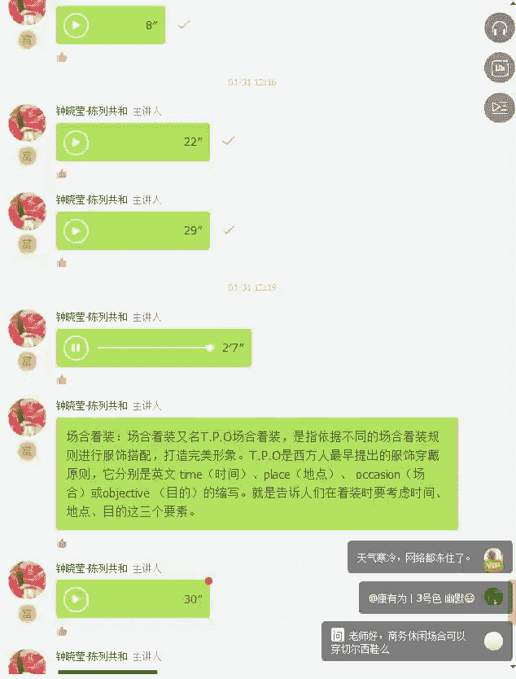

---

## 三大日常场合着装指南 🗺️

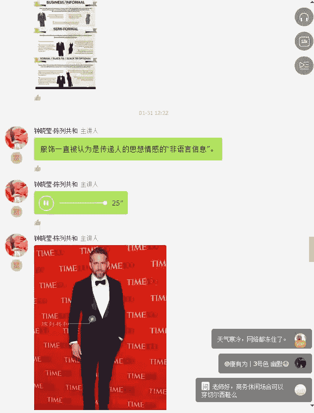

我们日常遇到的场合主要可分为三类：工作场合、休闲场合和社交场合。每种场合都有其特定的着装逻辑。

### 1. 工作场合：专业与信任感

工作场合的着装要求因公司类型而异，可分为非常正式、商务休闲和时尚创意等。着装没有绝对的对错，关键在于是否**合适**。

#### 商务正装 (Business Formal)

商务正装适用于半正式的隆重场合，如重要商务会议、白天举行的正式活动、拜访重要客户或进行关键谈判。

**核心公式：**
`商务正装 = 中性色/深色成套西服 + 素净衬衫 + 优雅领带`

*   **推荐颜色**：深蓝色、深灰色、黑色。其中，深蓝色和灰色最能体现气质与权威感。
*   **关键点**：着装目的是**尊重场合、表现专业、约束举止**，因此不应过分突出个性。
*   **搭配示例**：合身的深蓝色西服套装，内搭白色或浅蓝色衬衫，配一条颜色协调的丝绸领带。天冷时可外搭羊绒大衣或风衣。

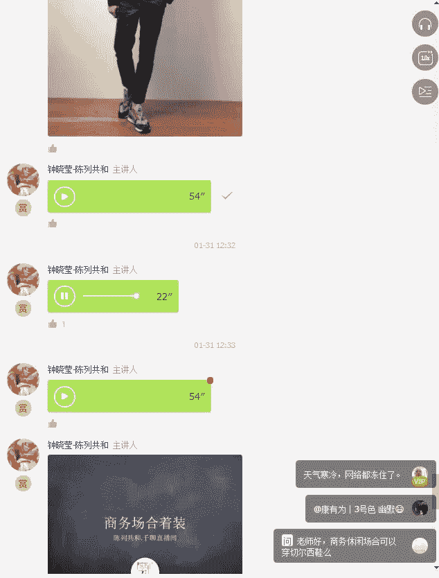

以下是商务正装的着装禁忌列表：
*   避免穿着白色西服（更适合演艺或休闲场合）。
*   避免穿着带有夸张图案的西服、衬衫或领带。
*   避免穿着运动鞋、马丁靴或露脚踝的休闲鞋。
*   禁止穿着连帽衫、羽绒背心、运动夹克或冲锋衣。
*   避免穿着过于宽松的裤子。

#### 商务休闲 (Business Casual)

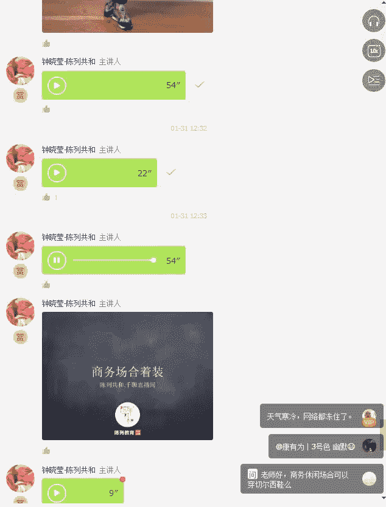

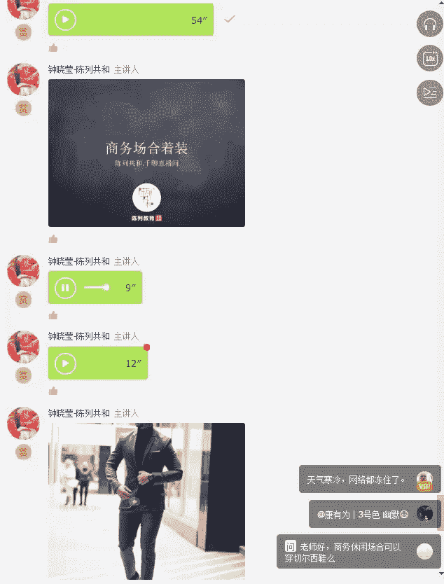

商务休闲装起源于上世纪90年代的西方，尤其在硅谷IT行业流行。它没有严格定义，但核心是**比正装随意，比休闲装正式**。

**核心公式：**
`商务休闲 = 单件西服/针织衫 + 休闲裤/卡其裤 + 不打领带（可选配饰巾）`

*   **常见组合**：单西搭配不同颜色的裤子；Polo衫或牛津纺衬衫搭配卡其裤。
*   **关键点**：在保持得体的前提下，可以更多地表达个人风格。是否搭配球鞋取决于公司文化。

### 2. 休闲场合：舒适与个人风格

休闲场合主要分为周末日常和旅行。

#### 周末休闲

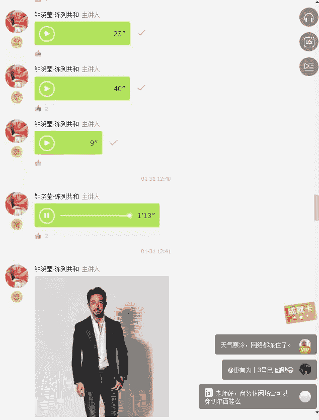

周末穿衣的主题是**轻松、舒适、得体**。适合与朋友聚会、家庭活动或看电影等场景。

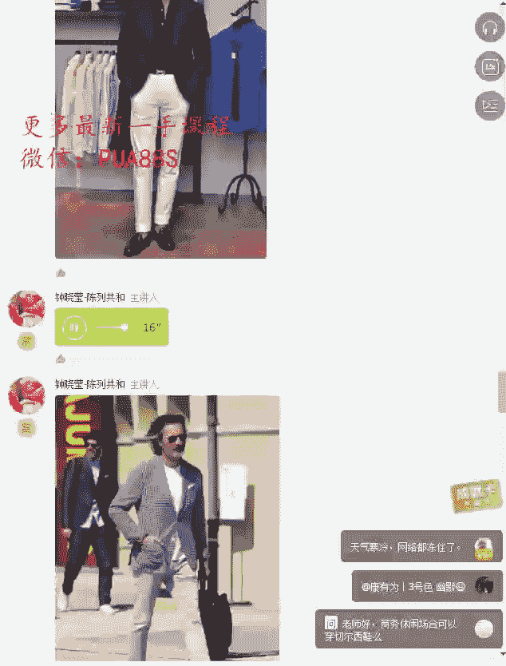

**核心公式：**
`周末休闲 = 舒适上衣（针织衫/卫衣/牛仔外套）+ 休闲裤/牛仔裤 + 小白鞋/休闲鞋`

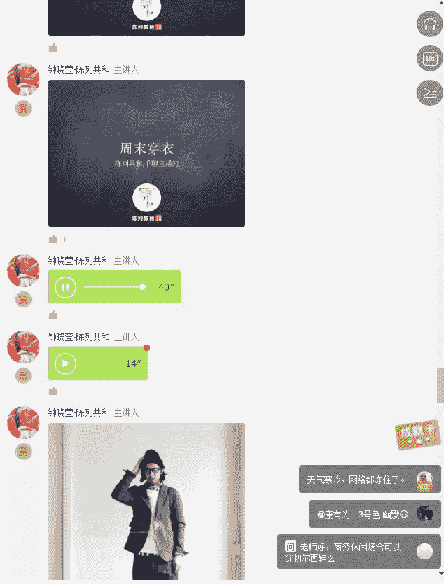

*   **关键点**：避免穿着正式的成套西服。注重服装的**比例协调**，合身的剪裁更能凸显好身材。
*   **搭配示例**：灰色休闲裤搭配小白鞋和针织衫；牛仔外套内搭条纹T恤；高领羊毛衫搭配卡其裤。

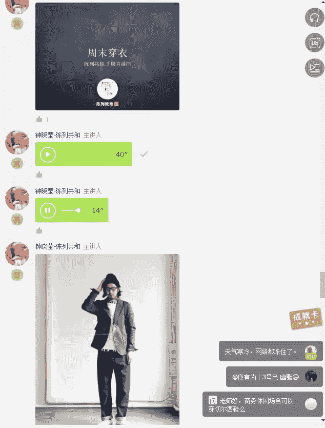

#### 旅行着装

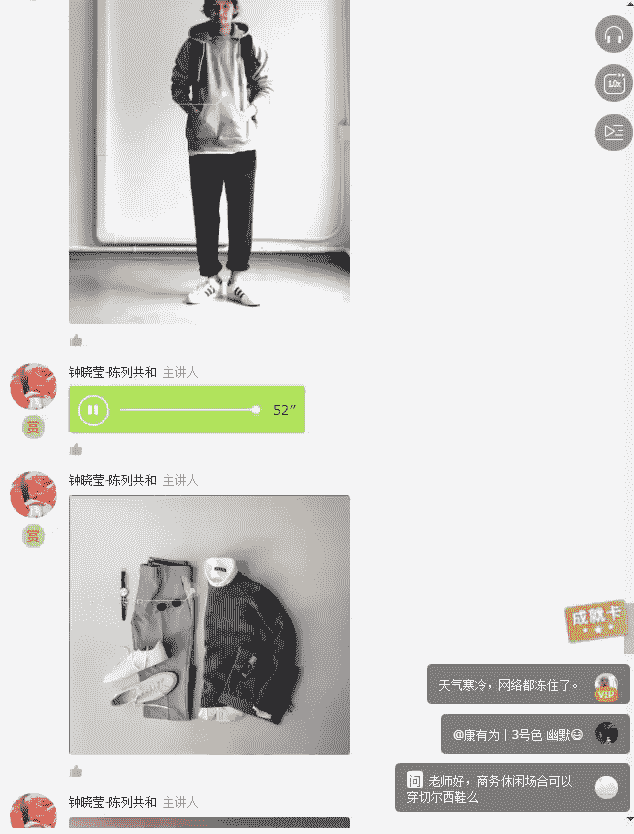

旅行着装需符合**旅行目的地的国情与气候**，以及旅行的目的。

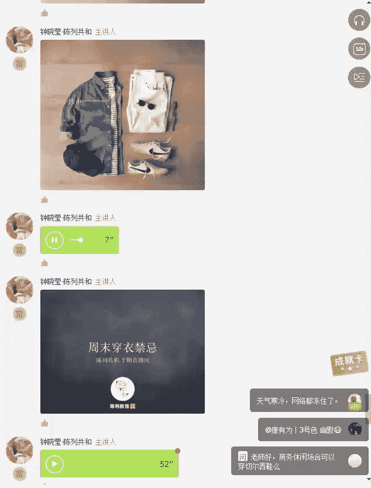

**核心原则：**
`旅行着装 ≈ 目的地风格 + 活动类型`

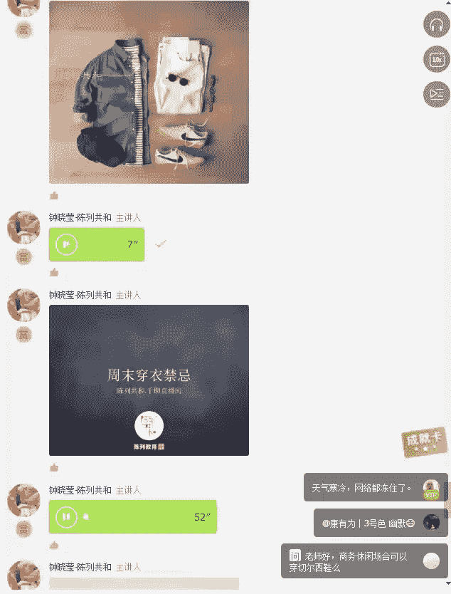

*   **热带海滩**：短裤、T恤、拖鞋，风格轻松随意。
*   **欧洲城市**：建议穿着更阳刚、利落的服装，如休闲西装、质感好的夹克。
*   **日韩都市**：可选择文艺、简约的穿搭风格，注重层次和细节。

### 3. 社交场合：礼仪与魅力

社交场合包括正式晚宴、私人派对、公司年会等。

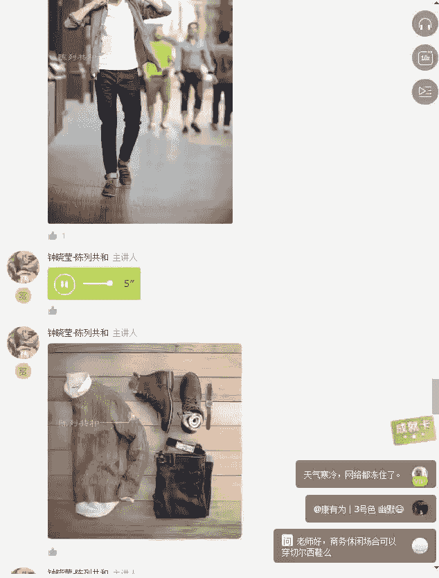

#### 正式晚宴

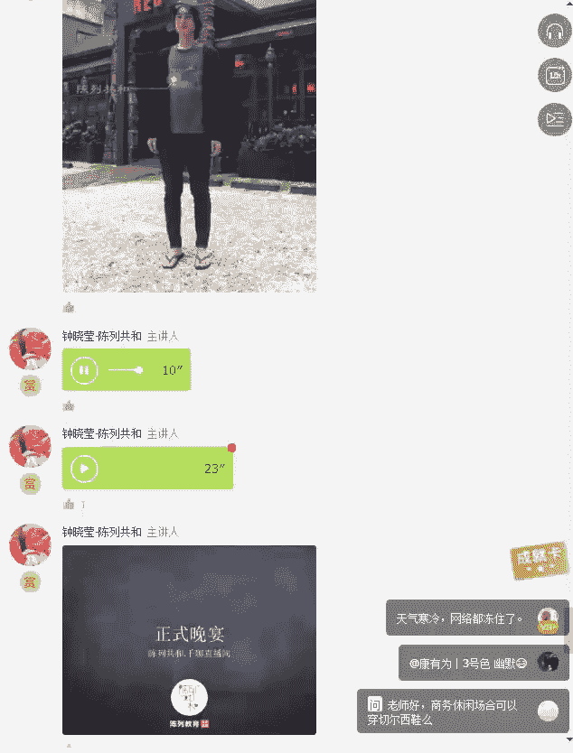

这是要求最高的社交场合之一，通常请柬会注明“Black Tie”（黑领结）。

**核心公式：**
`正式晚宴着装 = 燕尾服或深色正式西服 + 白衬衫 + 领结（必备）`

*   **关键技能**：学会自己打领结。
*   **注意**：有些晚宴可能只要求打领带，务必提前确认要求。

#### 私人派对与年会

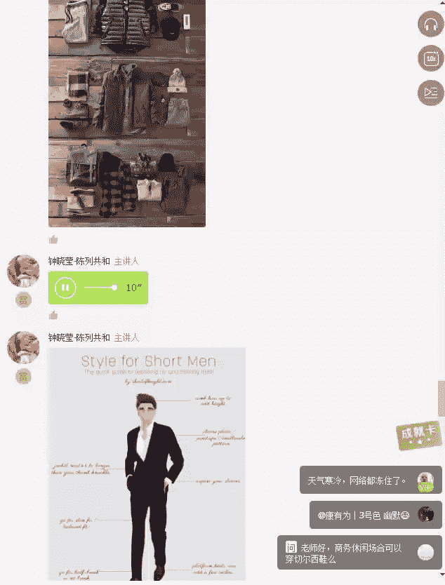

私人派对着装可选择**大地色系**或暖色调，营造温暖亲切感。

年会着装则需根据**主题**决定。如果是化妆舞会（Cosplay），则按角色穿着；如果是正式晚宴，则参照上述规则；若无明确主题，一套有型的休闲西装或时尚搭配即可脱颖而出。

---

## 核心总结与行动指南 🎯

本节课我们一起学习了男士场合着装的核心体系。记住，场合着装的关键不在于衣服有多贵，而在于穿得**有多合适**。

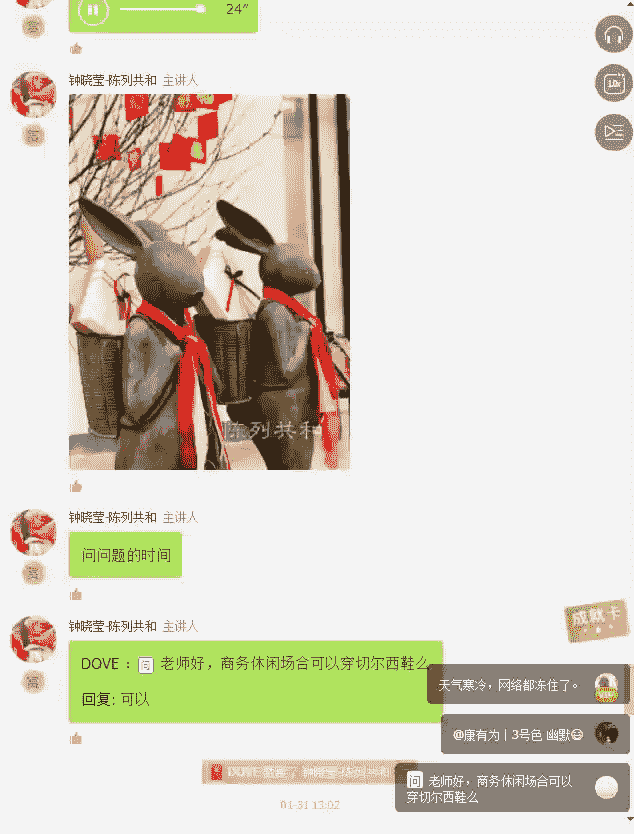

**行动指南：**
1.  **判断场合**：在出席任何场合前，先明确其性质（工作/休闲/社交）及具体着装要求。
2.  **遵循TPO**：根据时间、地点和场合目的选择服装。
3.  **合适优于昂贵**：最贵的衣服若不适合场合，反而会让你尴尬。得体的搭配更能为你加分。
4.  **投资经典单品**：一两套质地上乘的深色西服、一件好的白衬衫，是应对多种正式场合的可靠投资。
5.  **注重细节**：袜子、鞋子、配饰等细节往往更能体现品味。

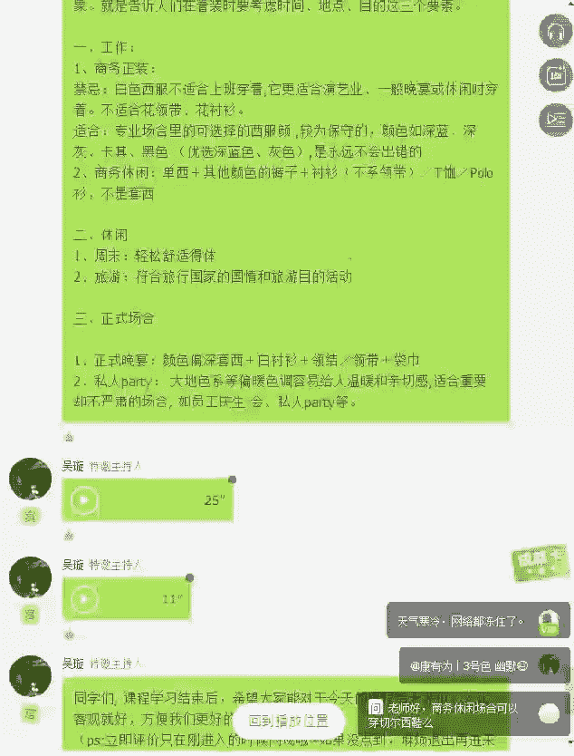

正如美国前总统夫人杰奎琳·肯尼迪所做的那样，她总是在出访前了解环境色，以确保自己的形象完美融入又不失突出。你的形象价值百万，它由你掌控。从今天起，开始用心经营你的场合着装，让你在每一个场景中都自信得体，光芒四射。

本系列课程到此告一段落，但这不是结束，而是你精彩形象之旅的开始。期待未来与你再次相聚！