# 男士衣品速成穿搭指南：第8课：男人服装搭的好，这些配饰不可少！ 👔

在本节课中，我们将要学习男士穿搭中至关重要的配饰部分。配饰是个人品味的起点，也是凸显品味的重要标签。那些衣品出众的人，都有一个共同点：非常注重搭配的细节。本节课我们将逐一讲解腰带、手表、围巾、领巾、手饰、太阳镜和包包这七类核心配饰的选择与搭配法则，帮助你通过细节提升整体造型的精致度。

## 概述

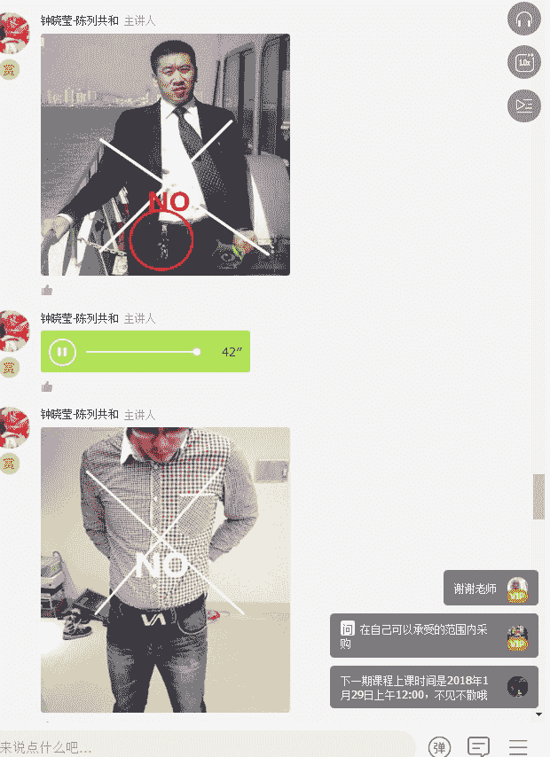

配饰是穿搭中的“魔鬼细节”，它能决定整体造型的成败。本节课作为基本衣橱构建的最后一课，将系统性地讲解各类男士配饰的挑选原则、搭配技巧以及需要避免的禁忌。掌握这些知识，能让你在职场、休闲等不同场合都显得更加得体、自信。

---

## 腰带：决定气质的关键一环 🎩

腰带是区分普通男人与男神的关键配饰。一条合适的腰带能立刻提升整体造型的质感。

以下是选择和使用腰带时需要避免的禁忌：

*   **避免悬挂钥匙**：在皮带上悬挂钥匙串，走路时叮当作响，会显得非常不精致。
*   **慎用超大Logo皮带**：带有粗大不锈钢Logo的皮带，通常更适合身材高大魁梧的欧洲人，不适合腹部突出、裤腰穿得较低的身材，容易形成反差。
*   **正装需配皮带**：穿着需要打领带的正式西服时，如果西裤有扣袢，就必须系上正装皮带。若不系领带，则可以不系皮带。

上一节我们介绍了腰带的重要性，本节中我们来看看腰带的具体搭配原则。

首先，男士应至少准备两条腰带：一条正装皮带，一条休闲皮带。

*   **正装皮带**：皮质光滑，以黑色为主，也有卡其色、咖啡色等。皮带扣设计简洁。
*   **休闲皮带**：材质相对粗犷（如牛皮），宽度通常比正装皮带宽0.5-1厘米左右，颜色和款式更多元化（如铆钉、编织、布料等）。

关于皮带长度，合适的标准是：系好后，皮带穿过裤腰第一个袢带，余量长约两公分。过长或过短都会显得邋遢。

**搭配核心原则**：皮带颜色应与鞋子颜色相呼应，这是最不易出错的搭配法则。例如，棕色皮鞋搭配棕色皮带。

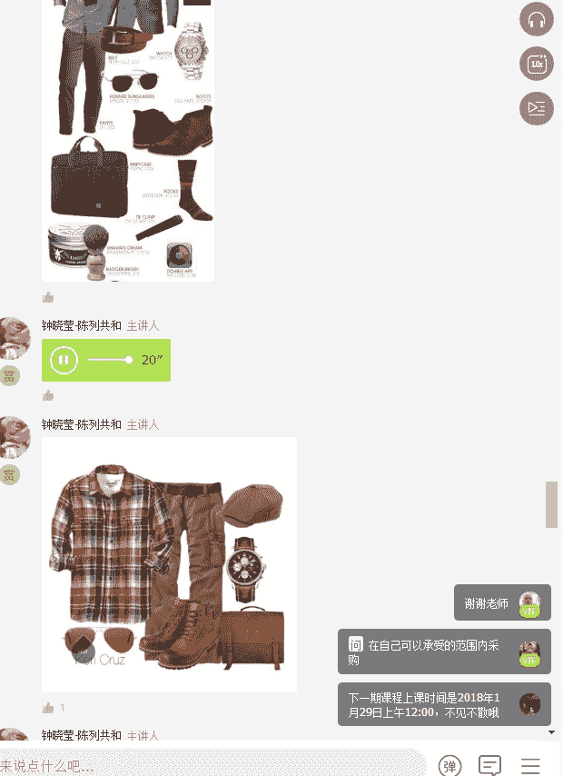

---

## 手表：彰显品味的腕间艺术 ⌚

手表是男士最重要的配饰之一，它能直观地体现个人品味与经济实力。

佩戴手表最大的禁忌是：**选择超出自身年龄与经济能力范围的手表**。例如，一个乘坐公交上班的年轻人佩戴一块价格高昂的百达翡丽，很容易被识破是仿品，反而显得不自信。

男士通常准备两块手表即可满足需求：

*   **一块用于正式/商务场合**：设计经典、表盘简洁的机械表或皮质表带手表。
*   **一块用于休闲/运动场合**：运动风格、电子表或设计更个性的手表。

选择手表时，应考虑个人风格：
*   **运动型男士**：可选择卡西欧G-SHOCK等运动手表。
*   **优雅文艺型男士**：可选择表盘娟秀、厚度适中的圆盘皮质表带手表。

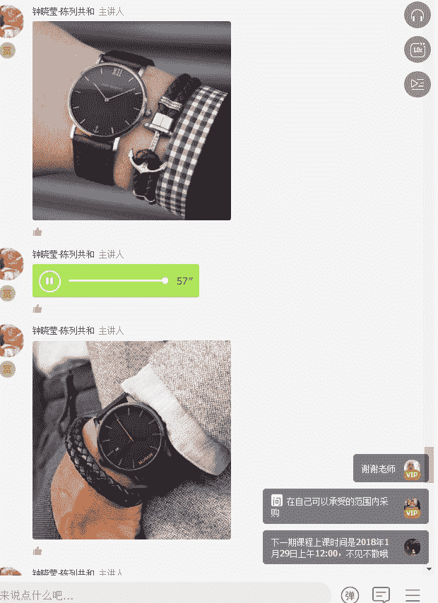

**搭配原则**：手表的颜色（黑、棕为主）应尽量与皮带、鞋子、包包的颜色形成呼应。

---

## 围巾与领巾：颈间的风度 🧣

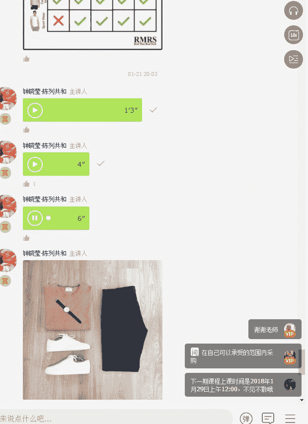

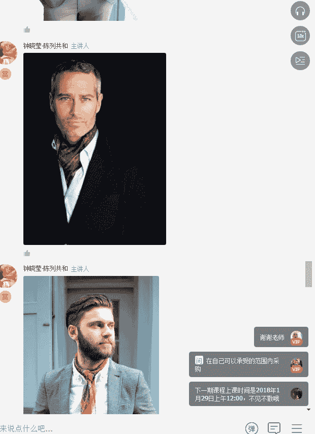

围巾是秋冬季节实用又时尚的配饰，而领巾则能增添一份精致的贵族气息。

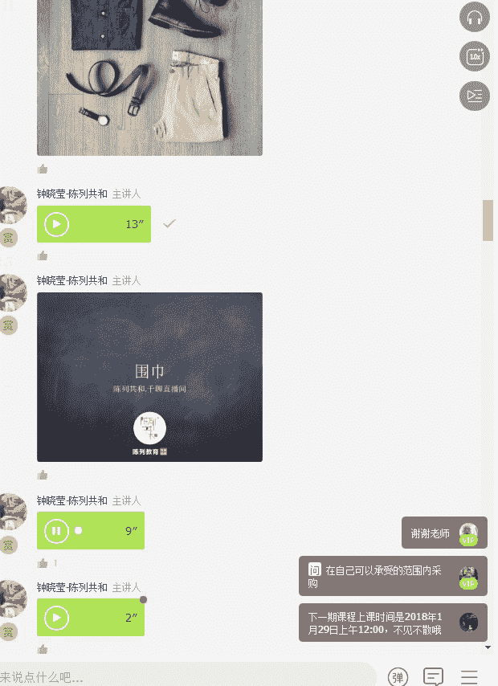

### 围巾

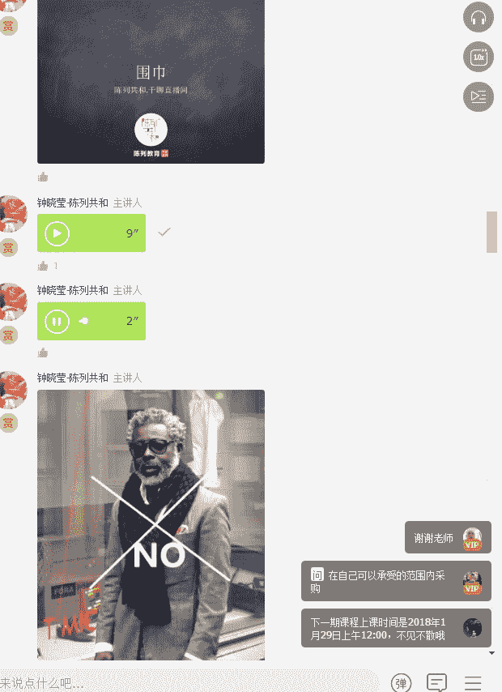

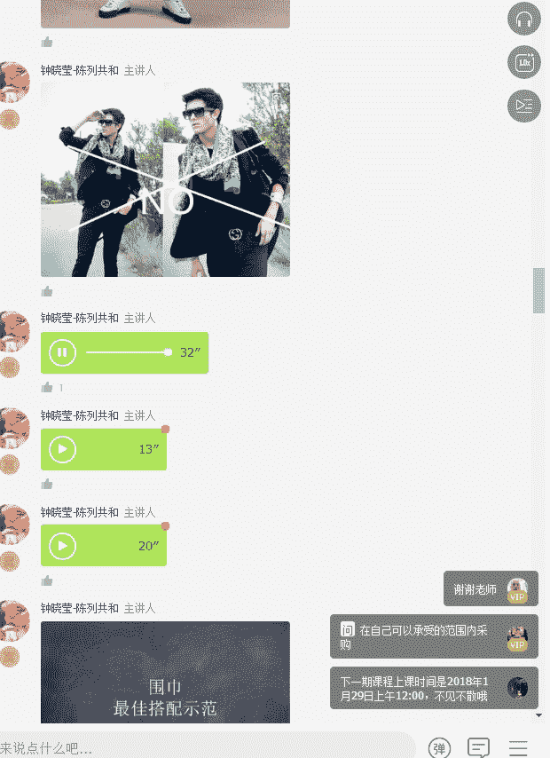

使用围巾时需避免以下情况：
1.  缠绕过厚，显得脖子短。
2.  与外套颜色对比过于强烈（如一黑一白）。
3.  使用过于花哨或女性化的丝巾。

**搭配核心原则**：围巾的颜色应呼应外套或内搭的颜色，保持整体色调和谐。例如，灰色大衣可以搭配浅灰或藏蓝色的围巾。

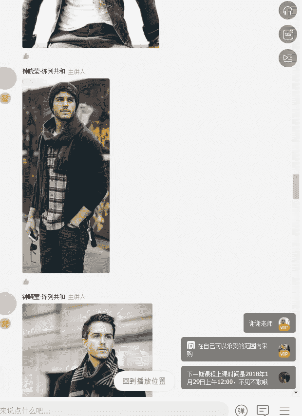

常见的系法有一长一短的自然垂挂法，或简单交叉置于大衣内的潇洒系法。

### 领巾

领巾多用于搭配衬衫、V领毛衣或T恤，常见于欧洲和日本男士的穿搭中，能极大提升精致感。

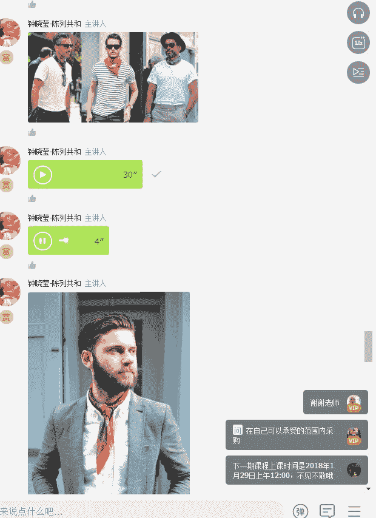

领巾有方形和长条形，系法多样。虽然在国内使用较少，但在秋冬季节尝试，能非常体现个人品味。

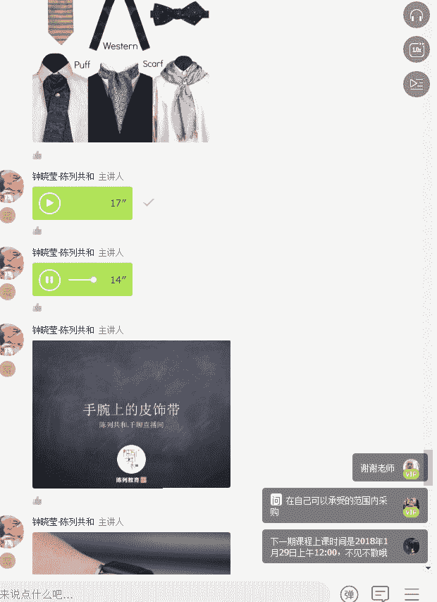

---

## 手部皮饰带：细节的叠加 ⛓️

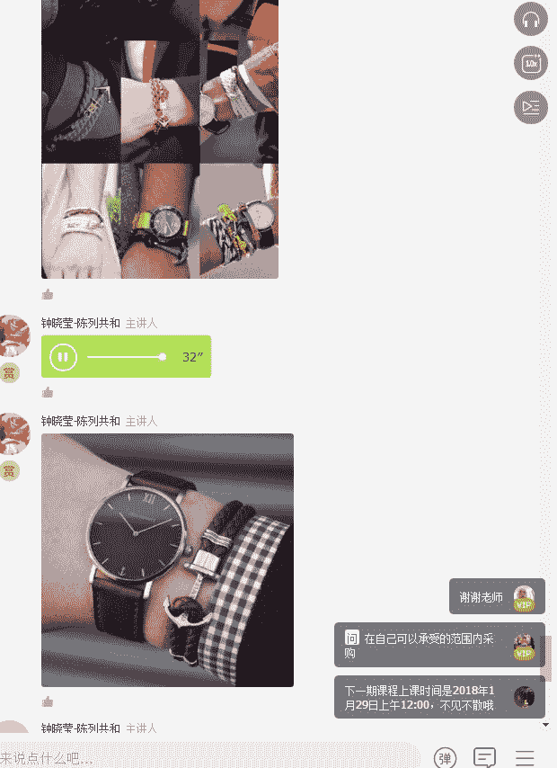

手部皮饰带常与手表叠戴，增添层次感和个性。

**重要禁忌**：**穿正装时，切勿将手表与手串、佛珠等饰物叠戴**，这会破坏正装的严肃感，显得不伦不类。

**搭配原则**：皮饰带的颜色应尽可能与手表表带或衣服的颜色相呼应。选择细款比粗款更显精致，避免“暴发户”气质。

---

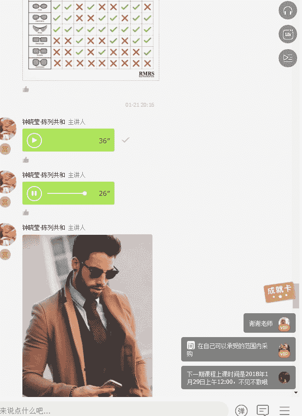

## 太阳镜：脸型的时尚滤镜 😎

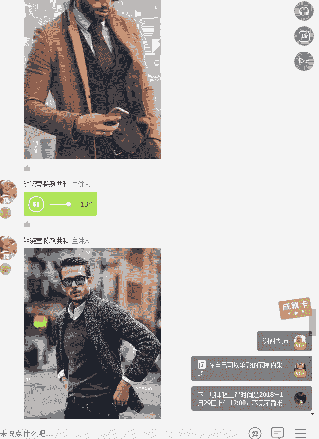

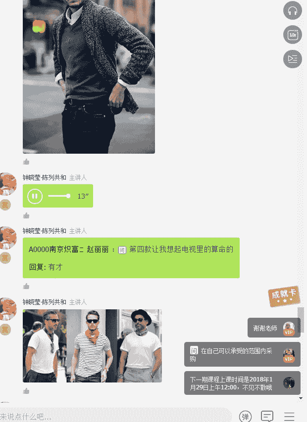

太阳镜是提升气场的利器，但选错款式会适得其反，显得像“盲人”或很做作。

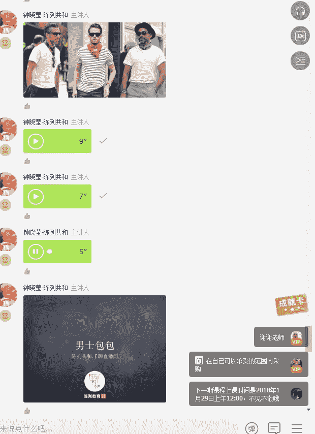

选择太阳镜的关键在于**镜框形状必须与脸型匹配**。

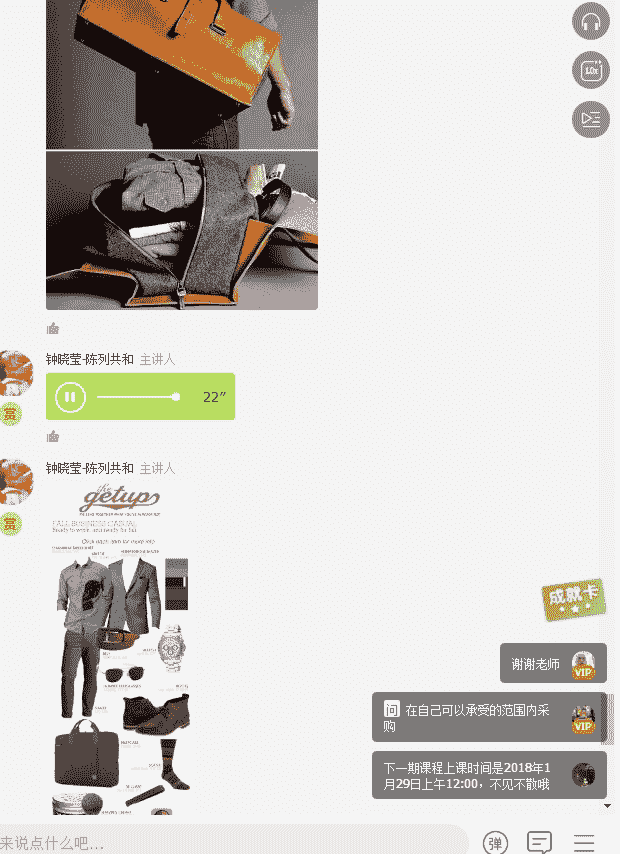

以下是不同脸型与镜框形状的匹配建议（可参考常见的六种脸型图）：
*   **圆形脸**：适合有棱角的方形或矩形镜框。
*   **长形脸**：适合镜框高度较大、能平衡脸长的款式。
*   **心形脸（尖下巴）**：适合底部较宽的圆形或椭圆形镜框。
*   **方形脸**：适合圆形或椭圆形镜框，以柔化脸部线条。
*   **椭圆形脸（鹅蛋脸）**：大多数镜框形状都适合。

有两款眼镜相对百搭：
1.  类似飞行员镜款式的深色墨镜。
2.  设计简洁的方形或圆形细框眼镜。

但需注意，气质和身高也会影响佩戴效果。例如，缺乏硬汉气质或身高不足1.78米的男士，佩戴过大的飞行员墨镜可能无法驾驭。

---

## 包包：功能与品味的结合 💼

一个得体的包包是男士职场和生活的必需品。建议男士拥有以下三个基础款包包：

1.  **短途出差包/旅行袋**：用于1-2天的短途出行，手提或单肩背，设计简洁。
2.  **公文包/邮差包**：用于日常通勤，可容纳电脑、文件等。邮差包兼具手提和斜跨功能，非常实用。
3.  **双肩背包**：用于需要解放双手的场合，或搭配休闲、商务休闲装。选择设计简约的款式。

**颜色选择建议**：优先选择**黑、灰、卡其、咖啡、墨绿**等中性色。避免过于鲜艳的白、黄、绿、红色。
**材质选择建议**：正装居多选皮质，休闲装居多可选帆布等材质。

---

## 总结与思考

本节课我们一起学习了构成男士精致形象的七大配饰：**腰带、手表、围巾、领巾、手部皮饰带、太阳镜和包包**。

配饰虽小，却是“细节决定成败”的最佳诠释。它们不仅能完善整体造型，更能体现一个人的审美、态度以及对场合的尊重。记住“先进罗衣后进人”，得体的外表是获得他人尊重和信任的第一步。构建一个完整、精致的衣橱，目的不是为了炫耀，而是为了让自己在任何场合都更自信、更高效。

在配饰的选择上，牢记“不求多，但求精”的原则。投资几件有质感的经典配饰，远胜于拥有一堆廉价单品。同时，配饰的搭配要遵循**色彩呼应、风格统一**的核心逻辑，让它们和谐地为你的整体形象服务。

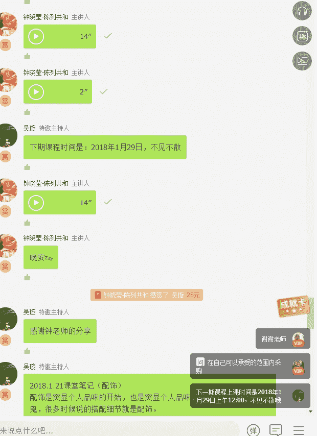

希望本课能帮助你认识到配饰的力量，并开始打造属于自己的细节魅力。