# 16男士衣品速成穿搭指南（完结）：第9课：男人，掌握色彩搭配，穿出好衣品！ 👔🎨

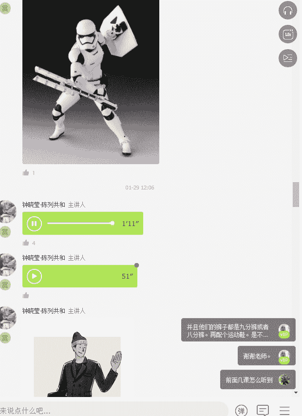

在本节课中，我们将要学习男士穿搭中最核心、最基础的一环——色彩搭配。我们将探讨如何通过简单的色彩组合，构建经典、得体的个人形象，避免常见的搭配误区，并掌握让基础色系焕发光彩的实用技巧。

## 核心理念：成为时间的朋友 ⏳

追逐流行，只会让我们成为时间的敌人，因为流行易逝且易过时。保持简单和基础的搭配，则会让我们成为时间的朋友。经典、基础的着装风格能让我们在任何年龄都保持魅力。

相对于女性，男士可供选择的颜色本身就比较少。最不易出错的颜色是**黑**与**白**。在此基础上，可以加入**灰**、**卡其**和**蓝**色。这五个基础色，几乎构成了男士衣橱80%以上的单品。

## 男士衣橱色彩构成 🎨

以下是构建男士衣橱的色彩建议：

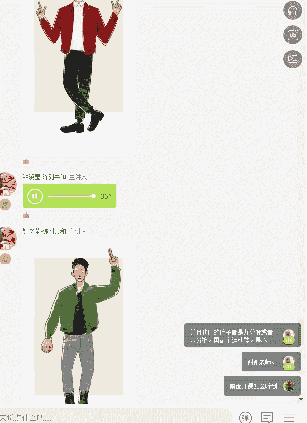

*   **五个百搭基础色**：**黑**、**白**、**灰**、**蓝**、**卡其**。
*   **一个点缀色**：例如**绿**、**酒红**、**紫**或**蓝紫**。这个颜色用于在基础搭配中作为亮点。

特别需要强调的是，**灰色**是一种非常好的中性色，它能与任何颜色搭配，并使整体造型显得冷静、优雅。白色具有活泼感和年轻感，黑色则富有神秘感。

## 色彩搭配禁忌 🚫

在了解正确搭配之前，我们先来看看需要避免的错误。以下是男装色彩搭配的几个禁忌点：

1.  **全身超过4个颜色**。
2.  **身上出现三个有彩色**（例如绿、黄、红同时出现）。
3.  **穿着过于花哨、鲜艳或紧身**，这容易显得不够阳刚。

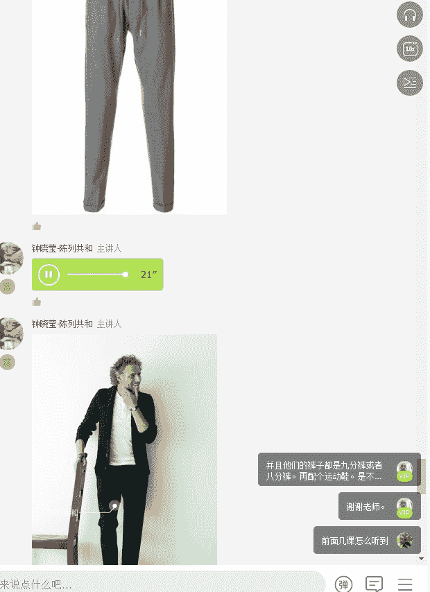

记住，男士的阳刚之气通常通过简洁、有力量的色彩（如黑、白、灰）和合身的剪裁来体现。

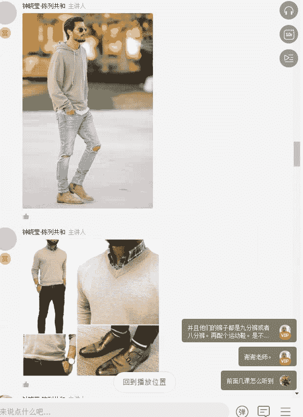

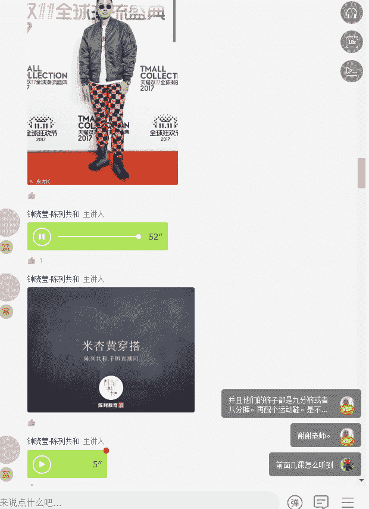

## 核心搭配原则 ✨

上一节我们了解了需要避免的误区，本节中我们来看看正确的色彩搭配原则。

### 原则一：中性色互搭

这是最保险的搭配方法。例如：
*   **黑白灰三色相搭**
*   **米、杏、蓝三色相搭**

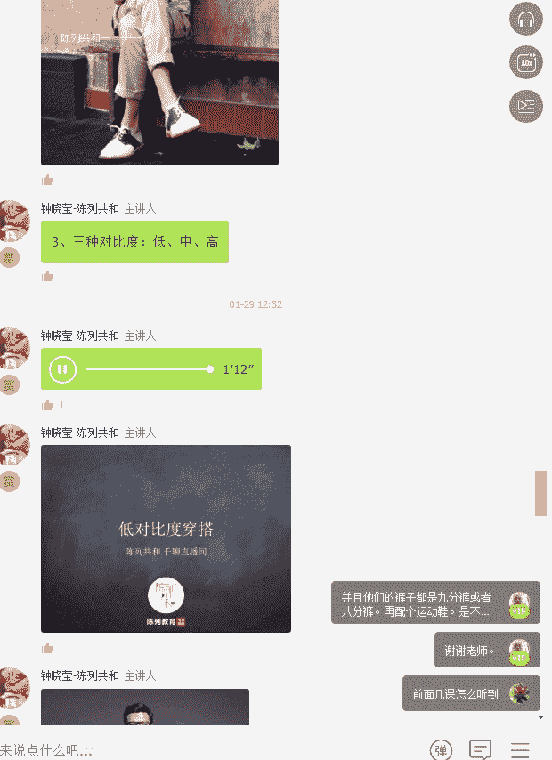

大家现在看到的就是黑白灰互相搭配，以及不同明度灰色组合的示例。常规的搭配逻辑是上衣颜色浅，下装颜色深，以避免头重脚轻。

### 原则二：控制色彩欲望，全身只保留一个亮点

这是色彩搭配中至关重要的原则。全身只保留**一件**有彩色或亮色单品，其余部分用基础色（黑白灰蓝卡其）进行搭配。

例如，在一身黑、灰的搭配中，用一件红色毛衣或一双亮色鞋子作为点缀，会显得非常精致。

### 原则三：根据自身对比度选择服装对比度

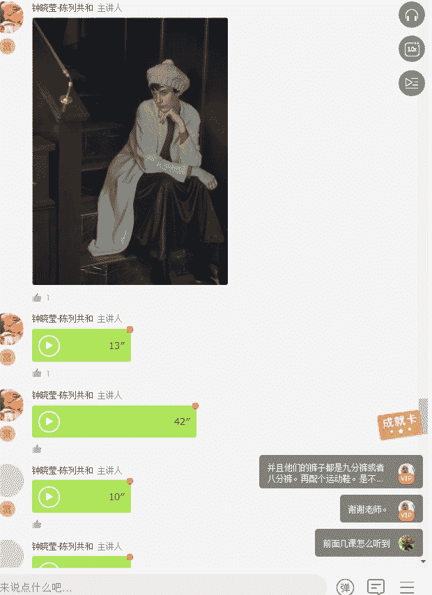

服装颜色的对比度应与你的肤色和发色的对比度保持一致，这样会让脸色显得更精神。

*   **低对比度**：适合肤色很白的人。例如，一身白或一身灰的搭配。
*   **中对比度**：适合大多数亚洲人（黑头发、偏黄皮肤）。例如，**外深内浅**（深蓝外套配浅灰T恤）或**上浅下深**的搭配。
*   **高对比度**：适合肤色很白且发色深，或肤色很黑且发色深的人。例如，**深黑与纯白**的强烈对比。

## 实用搭配技巧总结 📝

综合以上原则，以下是几条实用的色彩搭配技巧：

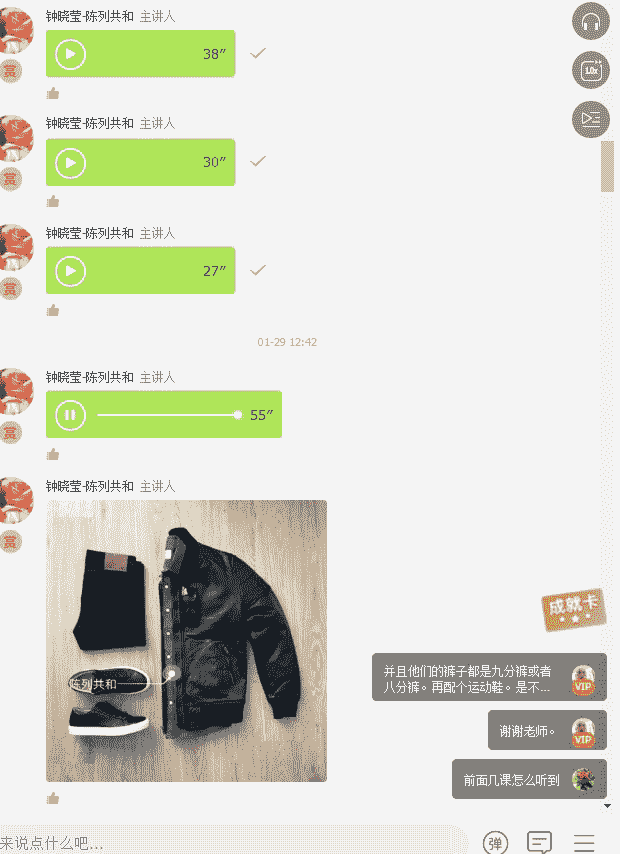

1.  **有图案的上衣，不要配相同图案的衬衣和领带**。
2.  **条纹或花纹上衣，需搭配素色裤子**。
3.  **鞋子的颜色要与服装的色彩相协调**。
4.  **内外两件套穿着时，色彩最好同色系或反差大**。
5.  采用 **“基础色（2或3种）+ 1个点缀色”** 的公式，例如：黑白+红，或黑白灰+蓝。

搭配的精髓在于**从简单入手，而非复杂**。对于新手，不要盲目追求流行色，应从最简单的白、灰、蓝、卡其、米色开始构建衣橱。

## 课后练习与行动指南 📚

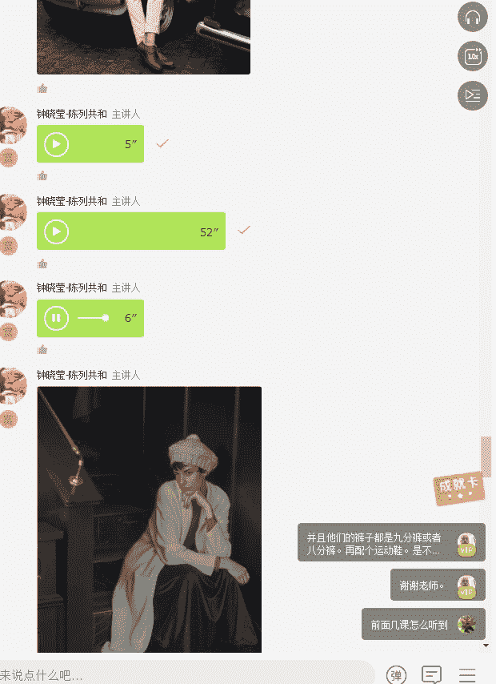

本节课我们一起学习了男士色彩搭配的核心原则与技巧。知识需要运用才能产生力量，以下是留给你的行动指南：

1.  **整理衣橱**：将衣物按**黑白灰**和**有彩色**（红、黄、蓝等）分类。
2.  **实践搭配**：以黑白灰中的两件作为基础，尝试插入一件有彩色单品（如内搭或外套），进行搭配。
3.  **拍照分享**：将你的搭配成果拍照，上传到学习群中，与同学互相交流点评。

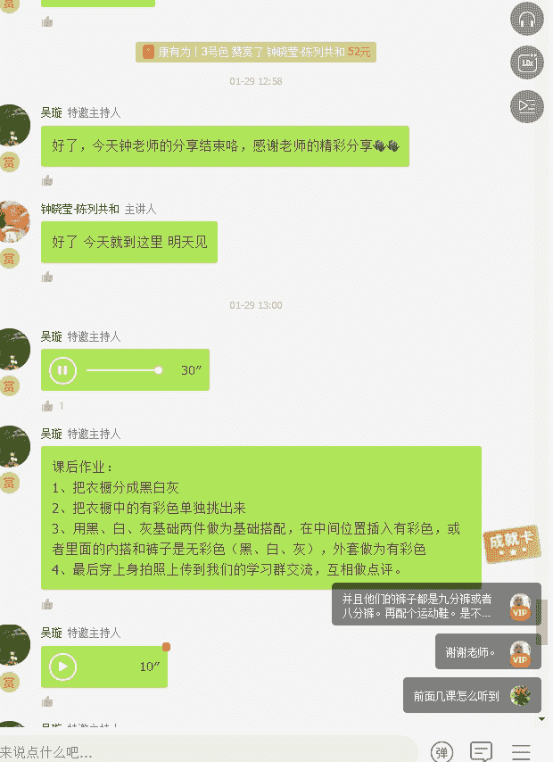

记住，干净比时髦更重要。得体、简洁的形象，能为你赢得更好的第一印象，这往往是成功的第一步。

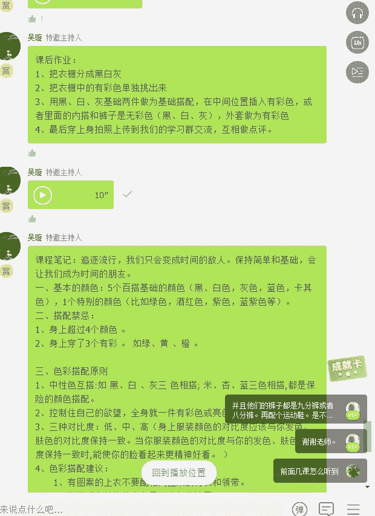

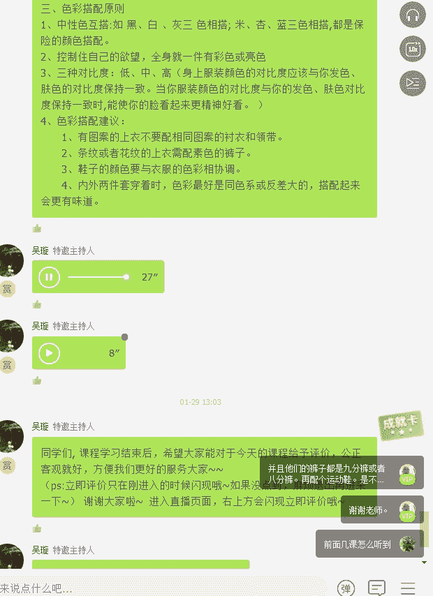

期待看到大家的练习成果，我们下节课再见！