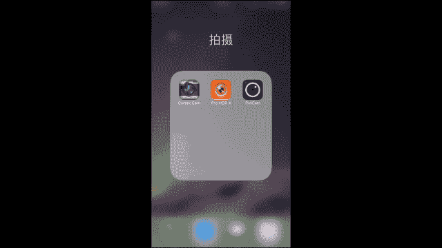
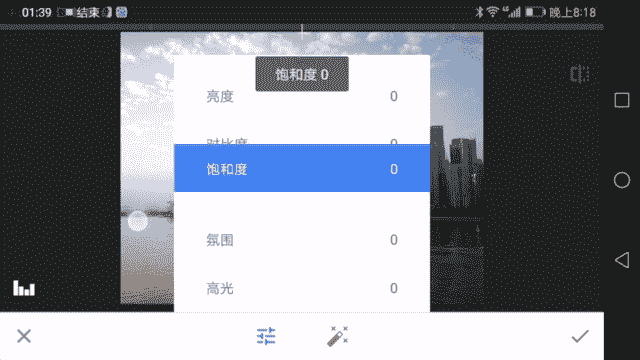

# 手机摄影视频课：第1课：手机摄影基础知识

## 概述

在本节课中，我们将要学习手机摄影的基础知识。课程将涵盖手机摄影的潜力与局限、必要的配件使用方法、以及前期拍摄与后期处理的核心应用。通过本课，你将建立起对手机摄影的全面初步认识。

## 讲师介绍

我是摄影师木西，一名90后风光与建筑摄影师。我拥有经济学背景，在摄影领域从业五年，是中国创意摄影展的十佳创意摄影师，也是CN签约摄影师。我的作品曾发表于《摄影旅游》、《中国国家地理》等专业杂志，并被多家厂商与企业选用。

今年初我开始专注于手机摄影。我参加了美国《国家地理》全球摄影大赛手机组并获奖，也参与了华为Mate9全球发布会的样片拍摄。此外，我测评了十余台不同品牌的旗舰手机，在手机摄影领域积累了一定经验。

本课程将系统讲解摄影基本原理、手机操作技巧，并涵盖风光、建筑、人像、美食等实战拍摄。同时，我也会介绍必要的拍摄配件。课程最后设有答疑环节，并可能根据情况安排直播拍摄演示。

## 手机摄影的作品展示

以下是使用不同品牌手机拍摄的作品实例，它们展示了手机摄影的多种可能性。

*   **城市夜景**：这张广州夜景照片中，城市流光溢彩，建筑幕墙反光、地面车流、路灯及远方城市细节均清晰可辨。
*   **对称构图**：这张香港彩虹邨的照片采用了典型的对称式构图，画面清新漂亮，给人以安稳感。
*   **街头抓拍**：在挪威奥斯陆市政厅抓拍的人物照片，明暗与色彩舒适，暗部保有细节，亮部不过曝，整体呈现温润的油画质感。
*   **生态微距**：抓拍到荷花上采蜜的小蜜蜂，展现了手机捕捉动态细节的能力。
*   **人文纪实**：在色达格尔登寺的酥油茶坊，拍摄了僧侣在蒸汽中劳作的场景。这张照片曾获《国家地理》全球摄影大赛手机组优秀奖。
*   **生活小品**：在贝加尔湖午后阳光下拍摄的小猫，画面温馨可爱。
*   **等待与瞬间**：在奥斯陆市政厅，等待有人经过一扇精美的门时按下快门，为静态建筑增添了动感。
*   **自然与人的对比**：冰岛斯科加瀑布前的人物，通过大小对比展现了人在自然面前的渺小与奋进精神。
*   **街头趣味**：意大利锡耶纳的街拍，通过牵狗者与骑车者头部的重叠与动静对比，构成了画面的趣味点。
*   **城市地标**：上海南北高架与延安高架交汇处的“龙柱”夜景。这张照片入选了华为Mate9全球发布会样片，画面光线平衡，建筑质感与立体感出色。
*   **都市风貌**：在东京世贸中心观景台拍摄的东京塔与城市全景，细节精细，呈现出科技感十足的城市夜景。
*   **自然静物**：川西流水中的落叶，晶莹剔透的溪水与落叶结合，传达出岁月静好的意境。
*   **风光长曝**：九寨沟静海雨后的清晨，使用模仿长曝光的工具拍摄，获得了云雾缭绕的仙境效果。
*   **人像摄影**：使用手机专门拍摄的姑娘人像作品。

从上述作品可以看出，手机能够胜任自然风光、城市夜景、街头抓拍、人文纪实、生态微距、建筑及生活小品等多种题材的拍摄。

## 手机摄影的局限性

上一节我们看到了手机摄影的强大潜力，但任何工具都有其边界。本节中，我们来看看手机摄影在哪些场景下存在局限。

必须明确指出，手机并非万能。在以下场景中，手机难以拍摄或无法达到专业相机的画质：

*   **星空摄影**：在漆黑夜晚拍摄纯净的银河星空，手机难以达到相机的高画质与低噪点水平。
*   **无人机航拍**：手机无法实现空中视角的拍摄，这需要专门的航拍设备。
*   **超长焦拍摄**：例如使用400毫米左右长焦镜头从远处拍摄山谷小镇，手机目前无法通过原生或附加镜头实现同等焦距。
*   **超广角场景**：极其广阔的场景，即便是手机全景模式配合广角附加镜也难以完美捕捉，尤其是夜景接片。
*   **极暗光环境**：例如仅靠一盏烛光照亮人脸的场景，需要大光圈相机才能捕捉足够的光线与细节。

此外，在体育摄影等需要高速连拍与追焦的领域，手机也较难企及专业相机。了解这些局限后，我们可以选择避开这些场景，或寻找替代拍摄方案。在日常生活中，手机足以应对绝大多数拍摄需求。

## 手机摄影的配件

在学习摄影时，了解设备功能只是第一步，合适的配件能极大拓展创作空间。本节我们来看看手机摄影需要哪些配件，它们是否像相机配件一样沉重复杂。

与传统相机相比，手机配件的体积和重量具有巨大优势。手机三脚架、附加镜头等全套设备的总重量，可能远低于一只相机长焦镜头。

以下是核心配件的简要介绍，具体使用将在后续实战课程中详细讲解。

*   **三脚架**：三脚架为拍摄提供稳定视角，对手机摄影同样至关重要。手机三脚架通常小巧轻便。使用方法如下：
    1.  展开三脚架的三只脚，将其放置于平稳表面。
    2.  升起中轴以调整高度。
    3.  使用专用夹子将手机固定在三脚架云台上。
    完成上述步骤后，即可获得稳定的拍摄平台，有效避免手抖。

*   **附加镜头**：手机镜头通常为固定焦距，通过屏幕缩放是数码变焦，会损失画质。附加镜头可以实现光学级别的视角变化。常见类型有长焦、广角、鱼眼和微距镜头。使用方法主要有两种：
    1.  **通用夹式**：使用一个万能夹子将镜头夹在手机摄像头前，对准即可。
    2.  **专用卡口式**：某些镜头设计为套在特定手机型号上使用，通过卡口固定。
    安装后，打开手机拍照应用，即可观察到视角的变化。

## 前期拍摄APP

了解了配件，我们回到手机本身的操作。相比相机丰富的专业模式（如光圈优先、快门优先），手机原生相机功能可能显得简单。本节我们介绍几款能增强手机拍摄能力的前期APP。

对于iPhone用户而言，其原生相机缺少手动设置参数（如快门速度、ISO）的功能，在暗光等复杂环境下比较被动。以下APP可以弥补这一不足：

*   **ProCam（专业相机）**：这是最重要的APP之一，核心功能是提供**手动调节**。用户可以手动设置**ISO**（感光度）和**曝光时间**等参数。虽然其最长曝光时间可能有限（例如1/4秒），但已是iPhone上实现手动控制的最佳工具之一。它还可以选择摄像头、设置HDR、图片格式（如TIFF或RAW）和图像尺寸。
*   **Pro HDR X**：当需要更自主地控制HDR（高动态范围）效果时，可以使用此APP。它能让人为选择多张不同曝光的照片进行合成，比原生相机的自动HDR更可控。
*   **Cortex Camera**：这款APP可以**模仿长曝光**效果，用于拍摄光轨、柔化水流等。它可以设置曝光时间（如30秒），并选择输出格式。

## 后期处理APP

我们已经学会了使用前期APP来获取更好的原片。在这个人人都会修饰照片的时代，掌握后期技巧能让你的作品在社交平台上更出色。本节将介绍两款常用的手机后期处理APP。

更多详细的后期技巧将在专门的后期课程中讲解，这里先做基础介绍。

*   **Snapseed（指划修图）**
    Snapseed 的设计逻辑是直接导入照片开始编辑。其主编辑界面分为“工具”和“滤镜”两大部分。
    *   **工具**：这是学习的重点，建议优先掌握手动调整，而非依赖滤镜。
        *   **调整图片**：进行基础调节，包括**亮度**、**对比度**、**饱和度**、**氛围**、**高光**、**阴影**、**暖色调**。
        *   **突出细节**：增强画面锐度和结构。
        *   **剪裁**/**旋转**/**透视**：调整画面构图与视角。
        *   **白平衡**：调节画面冷暖色调。
        *   **画笔**/**局部**：进行精细的局部调整。
        *   **修复**：去除污点或多余物体。
        *   **晕影**：添加暗角以突出主体。
        *   **文字**：添加文字。
    *   **滤镜**：提供一键风格化效果，如“魅力光晕”、“色调对比度”、“复古”。初学者应谨慎使用，以免破坏画面。
    *   **直方图**：点击左下角图标可打开直方图。**直方图**是判断照片**曝光状况**的重要工具。其横轴从左到右代表从黑（暗部）到白（亮部）的亮度，纵轴代表像素数量。通过观察波形分布，可以了解图像的整体明暗情况，避免过曝或欠曝。

*   **VSCO**
    VSCO 的设计逻辑是先导入照片到图库，再通过滤镜进行风格化调整。
    1.  导入照片后，选择一张进入编辑界面。
    2.  点击调节图标，会看到一系列以字母数字命名的滤镜（如M3、P5），它们模拟了不同胶片的风格。
    3.  双击某个滤镜可以应用，并通过滑块调整滤镜强度。
    4.  点击菜单图标，可以进行更基础的参数微调（如曝光、对比度、暗角），但精细度不如Snapseed。
    5.  编辑完成后，点击保存图标即可将照片导出到手机相册。

一个常规的修图流程可以是：先用 **Snapseed** 进行曝光、色彩等基础校正和精细调整；然后导入 **VSCO**，添加喜欢的胶片风格滤镜并微调强度；最后导出保存。我个人在风光摄影中更追求准确色彩，因此99%的时间只使用Snapseed。

## 总结与展望

本节课中，我们一起学习了手机摄影的基础框架：我们看到了手机能拍出怎样的精彩作品，也了解了它的能力边界；我们认识了如三脚架、附加镜头这样的实用配件及其基本用法；我们还掌握了能提升拍摄能力的专业前期APP（如ProCam），以及用于照片美化的核心后期APP（如Snapseed和VSCO）。

手机作为影像器材，其发展符合历史趋势：更便携、更易用、更便于分享。它降低了摄影的门槛，让我们能随时随地记录和创作。我期待未来手机能在画质上持续进步，以更便捷的方式生产高质量的影像。

本节课主要介绍了功能和附件，你可能还无法立即拍出理想的作品。下一节课，我们将从最基本的摄影原理入手，详细讲解如何正确使用手机进行拍摄，一步步带你掌握实战技巧。