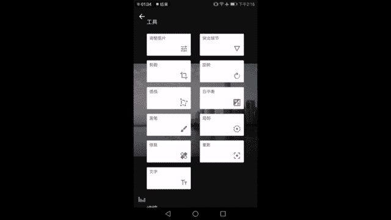
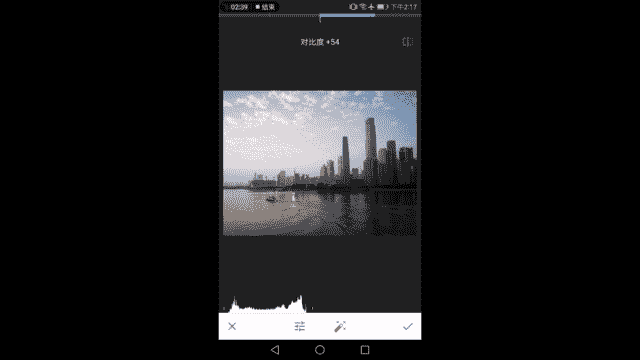
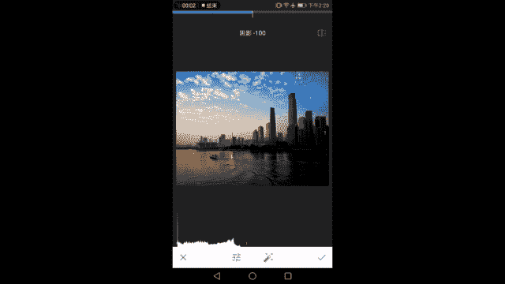
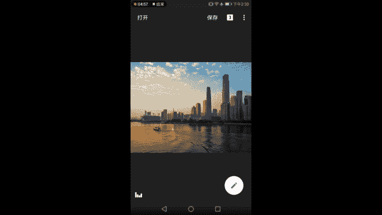
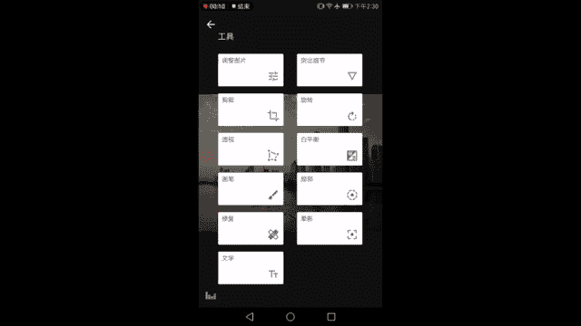
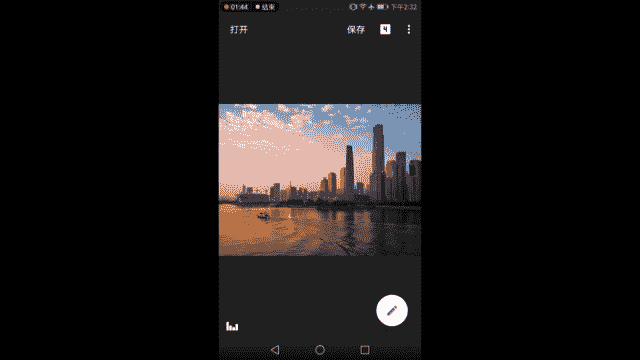
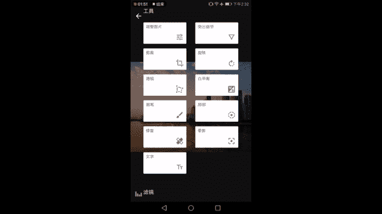
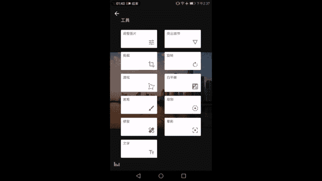
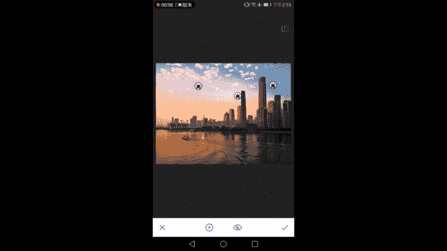

# 手机摄影视频课：第3课：手机照片后期处理（1）

在本节课中，我们将要学习如何使用手机APP对照片进行后期处理，让照片变得更美观。我们将重点介绍两款主流修图APP的基本操作，并通过一个具体的城市风光照片案例，详细讲解调整明暗、色彩、细节和透视的核心原则与步骤。

上一节课我们深入学习了曝光与用光的基础知识。掌握了如何拍摄之后，本节课我们来看看如何修图。

对于手机后期修图，我推荐两款APP。第一款是 **Snapseed**（中文名：指划修图），通过它可以学习画面明暗、对比度、色温等最基础的调整知识。第二款是 **VSCO**，它主要用于为画面添加个性化的胶片风格。本节课我们将主要使用Snapseed进行讲解。

---

## 理解直方图：照片的“体检报告”

为了让课程有延续性，我们继续使用之前课程中出现过的一张照片。这是在广州猎德大桥黄昏时拍摄的画面。

画面左下角是**直方图**。它分为左右两端：
*   **左端**代表画面中最暗的部分。最左边的点意味着该区域没有任何光线信息（纯黑）。
*   **右端**代表画面中最亮的部分。最右边的点意味着该区域光线信息达到最高值（纯白），不再包含任何细节。
*   **中间**是从最暗到最亮的过渡区域。直方图中像小山一样的白色图形，代表了整张照片中不同亮度的像素分布。

通过观察直方图，我们可以直观地了解画面中暗部、中间调和亮部的像素分布情况，从而知道该如何调整。

---

## 后期处理的核心原则

在开始动手修图前，我们需要了解几个核心原则。

### 1. 明暗协调原则

明暗协调有两个要点：
1.  **避免“顶死”**：理想的直方图，其左右两端不应完全贴边。如果像示例图中右边那样“顶死”，意味着高光部分（如白云）细节丢失。我们应该让像素比较均匀地分布在整个亮度区间。
2.  **保持立体感**：像素均匀分布不等于让画面变“灰”。我们需要保证适度的**整体反差**（对比度）和**局部反差**，让画面看起来有质感和立体感。

### 2. 色彩协调原则

色彩协调也有两个标准：
1.  **符合观察习惯**：照片应大致反映真实世界的色彩状态。例如，黄昏的场景就不应调得过于冷峻或过分昏黄。
2.  **色相与饱和度协调**：色彩不宜过度夸张。饱和度太高会导致颜色“炸”开，很不自然。

在符合真实观测的大框架内，你可以根据自己的喜好和心情进行微调。例如，你可以让温暖的黄昏更显温馨，也可以让它带有一丝清冷感，但都需要把握好尺度。

---

## 实战演练：基础调整

现在，我们参照直方图，以这张照片为范本进行实际操作。

首先进入 **【工具】>【调整图片】**。

以下是调整步骤：

1.  **亮度**：原图整体偏亮，暗部细节少。我们稍微向左**降低亮度**，让画面更平衡。此时直方图两端都空出来了，像素集中在中间区域。
2.  **对比度**：降低亮度后画面可能偏灰。我们**增加对比度**，让该黑的地方黑，该亮的地方亮，同时最亮处又不过曝。你可以按住右上角的**对比按钮**来查看调整前后的变化。
3.  **饱和度**：原图色彩惨白，不像黄昏。我们**增加饱和度**，让夕阳呈现金色，天空呈现蓝色，且程度符合日常观察。
4.  **氛围**：增加“氛围”可以平衡画面明暗。它会让高光部分不那么刺眼，同时提亮暗部细节，增强建筑的立体感。对比调整前后，效果显著。
5.  **高光与阴影**：这是进行个性化调整的好时机。
    *   **高光**：如果你希望阳光照射的云朵更耀眼，可以**增加高光**；如果你希望云彩内部细节更立体，可以**降低高光**。
    *   **阴影**：如果你希望建筑暗部的窗户等细节显现，可以**增加阴影**；如果你想强调明暗对比，可以**降低阴影**。但注意不要过度，避免暗部完全失去细节（直方图像素紧贴最左端）。
6.  **暖色调**：你可以根据喜好，让画面偏暖（黄）或偏冷（蓝）。调整需在真实范围内，避免出现天空发绿等不自然效果。

长按屏幕可以对比调整前与调整后的效果。至此，照片的基础调整就完成了。

---

## 突出细节：让照片更清晰

基础调整后，我们来学习如何让照片看起来更清晰、更高级。这就要用到 **【突出细节】** 工具。

*   **结构**：增加局部的反差，让物体边缘更清晰、更有质感。但**切忌过度**，否则在明暗交界处（如深色建筑与明亮天空之间）会产生难看的白边。降低结构则会让边缘模糊，产生类似油画的笔触感，有时可用于弱化噪点。
*   **锐化**：无差别地增加画面颗粒感，让整体看起来更锐利。加多了会使画面显得粗糙。

我们适度增加一点**结构**和**锐度**，让建筑轮廓和水面波纹更清晰即可。

---

## 校正透视：让建筑“站直”

观察原图，你会发现建筑有些倾斜。在生活中，楼宇应该是垂直于地面的。我们需要使用 **【透视】** 工具进行校正。

校正透视不仅仅是摆平水平线，还要修正因仰拍/俯拍产生的“近大远小”的透视变形。

**安卓版Snapseed的透视调整**非常自由，允许你对画面进行任意拉伸扭曲，但这对新手可能不太友好。

调整方法：
1.  尽量**一次只拖动一个角**，对照建筑线条和软件提供的网格参考线进行微调。
2.  目标是让所有建筑的垂直线尽可能与垂直参考线平行。
3.  调整后，画面边缘可能会出现空白或扭曲。软件提供**自动填充**功能，但效果通常不理想，建议关闭此功能，通过前期构图或后期裁剪来处理。

调整后，建筑变得笔直挺拔，地平线也恢复了水平。

---

## 精细调色：使用白平衡工具

**【白平衡】** 工具比简单的“暖色调”调节更精细。它将色彩调节分为两个维度：

*   **色温**：调节画面偏黄还是偏蓝。
*   **着色**：调节画面偏品红还是偏绿。

例如，如果你觉得画面太黄且有点发绿，可以在**色温**中减黄（加蓝），同时在**着色**中加红来中和绿色。你可以根据个人喜好，在符合真实感的前提下进行微调，让黄昏的氛围更浓郁或更清冷。

---

## 局部调整工具

Snapseed提供了强大的局部调整功能，允许你对画面的特定区域进行精确修改。

### 1. 画笔工具

**【画笔】** 允许你用手指像画画一样对任意区域进行涂抹式调整。

*   **类型**：包括加光、减光、曝光、色温、饱和度。
*   **强度**：通过上下按钮调节画笔的影响程度。
*   **查看蒙版**：点击“眼睛”图标，可以**以红色蒙版显示你涂抹过的区域**，这对于查看和修改局部调整范围至关重要。
*   **橡皮擦**：可以擦除已应用的画笔效果。

### 2. 局部工具

**【局部】** 工具比画笔更智能。你只需在画面某处点一下，它会自动识别并选中**亮度与采样点相近的区域**进行调节，而不仅仅是一个圆圈范围。

*   **功能**：可以对选中的局部区域进行亮度、对比度、饱和度的调整。
*   **多点控制**：你可以添加多个控制点，分别对画面中不同亮度的区域（如天空、建筑阴影、水面）进行独立调整。
*   **智能识别**：将控制点放在蓝天上，它主要调节蓝天部分；放在建筑阴影上，则主要调节阴影区域。这让我们可以非常灵活地强化或弱化画面中的特定部分。

---

## 本节课总结

在本节课中，我们一起学习了手机照片后期处理的基础流程与核心思想：
1.  **读懂直方图**，它是调整明暗的指南针。
2.  **掌握两大原则**：明暗协调（避免死黑/过曝、保持立体感）与色彩协调（符合真实、适度个性化）。
3.  **使用Snapseed进行全流程调整**：从基础的光影、色彩调整，到突出细节、校正透视，再到使用白平衡进行精细调色。
4.  **初识局部调整工具**：了解了“画笔”和“局部”工具的基本用法，它们能实现对画面特定区域的精确控制。

经过这些步骤，一张原本普通的照片在明暗、色彩、清晰度和构图上都得到了显著改善。记住，后期处理的目的是优化照片，表达你的视角和情绪，而不是脱离现实。多练习，你就能逐渐掌握让照片焕然一新的技巧。