# 手机摄影视频课：第3课：手机照片后期处理（2）

在本节课中，我们将继续学习Snapseed的进阶工具，包括修复、晕影、文字以及几个实用的滤镜。我们还将探索强大的蒙版功能，学习如何对照片进行精细的局部调整，让后期处理更加得心应手。

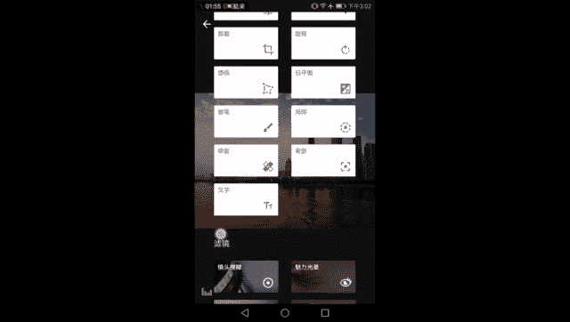

## 🛠️ 修复工具：移除画面小瑕疵

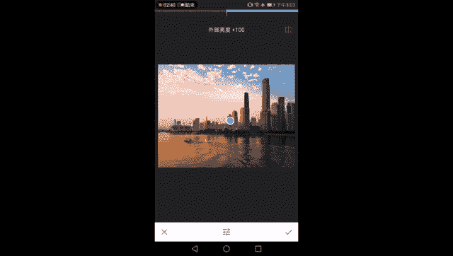

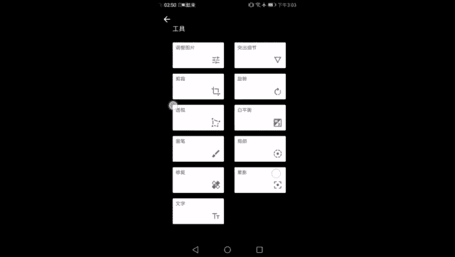

上一节我们介绍了局部调整工具，本节中我们来看看修复工具如何使用。修复工具，顾名思义，用于修正画面中的小瑕疵。

它的工作原理是：**通过识别选中区域周围的像素信息，自动覆盖掉不需要的物体**。

以下是使用修复工具的步骤：
1.  选择修复工具，画面中央会出现一个圆圈，代表画笔大小。
2.  通过双指缩放画面来调整画笔大小，使其略大于要移除的物体。
3.  点击或涂抹想要移除的物体（例如画面中多余的浮标）。
4.  App会自动用周围的图像（例如水面）填充该区域，使其消失。

**核心要点**：此工具**仅适用于小范围、背景简单的瑕疵**。如果要移除的物体过大（如整艘船）或周围没有足够相似的像素信息（如用天空填补大楼），则会产生不自然的效果。在人像处理中，它常用于去除脸部污渍，比在风景中更实用。

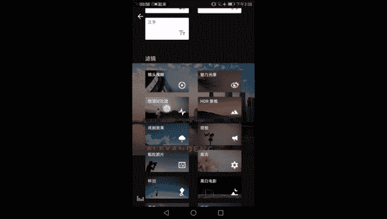

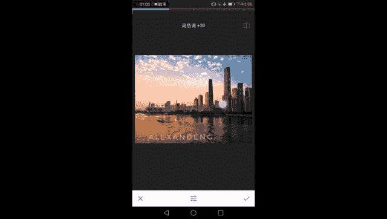

## 🌓 晕影工具：营造画面氛围

接下来是晕影工具。晕影，其实就是我们常说的“暗角”效果。

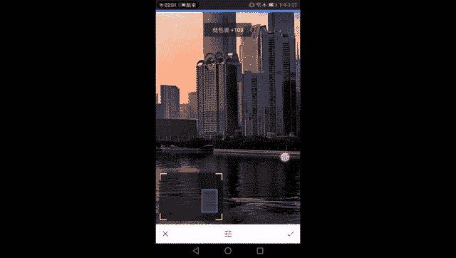

Snapseed的晕影工具更智能，它允许你分别调整**内部**和**外部**的亮度。
*   **外部亮度降低**：产生传统的暗角效果。
*   **外部亮度提高**：产生亮角效果。
*   **内部亮度调整**：可以单独提亮或压暗画面中心区域。

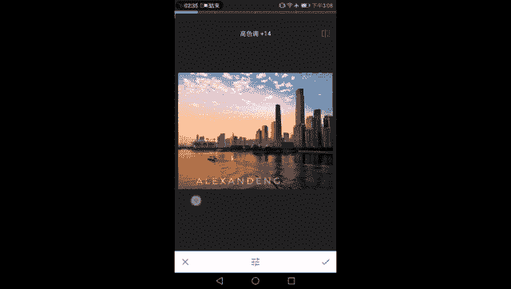

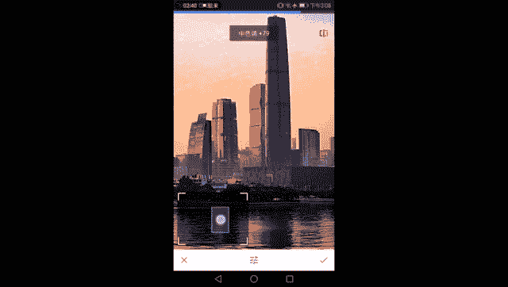

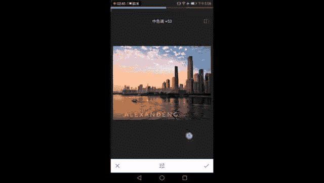

此外，你还可以通过缩放画面来调整晕影覆盖范围的大小，从而更精确地控制光影氛围。

## 🔤 文字工具：添加个性水印

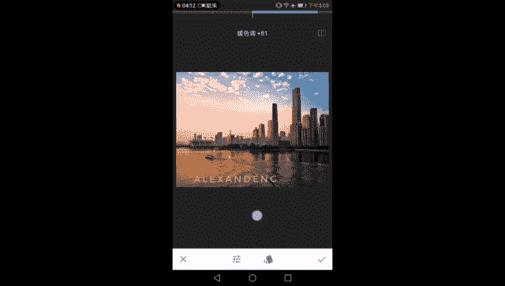

文字工具用于在画面上添加水印或文字。虽然不建议添加过于花哨的文字，但一个简洁的水印可以彰显版权和个人风格。

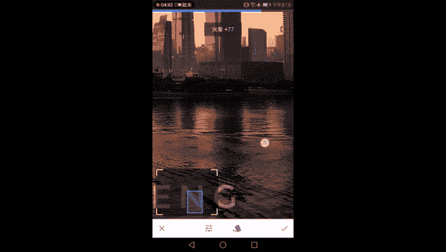

以下是文字工具的主要调节选项：
*   **颜色**：选择文字的颜色。
*   **不透明度**：控制文字显示的透明程度。向左滑动更透明，向右滑动更清晰。
*   **倒置**：这是一个有趣的功能。启用后，会将不透明度效果反转，形成一种“镂空”效果，让文字区域透出背景画面，有时能突出文字主体。
*   **字体与样式**：提供多种字体和预设样式（如圆形、六边形框），可以组合出类似Logo的效果。

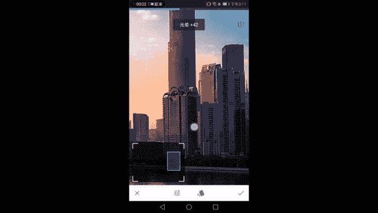

## 🎨 精选滤镜：提升画面质感

通常不推荐滥用滤镜，但Snapseed中有几个滤镜非常实用，可以有针对性地提升画面。

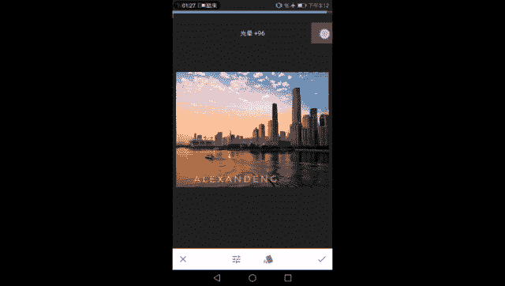

### 色调对比度：增强局部立体感

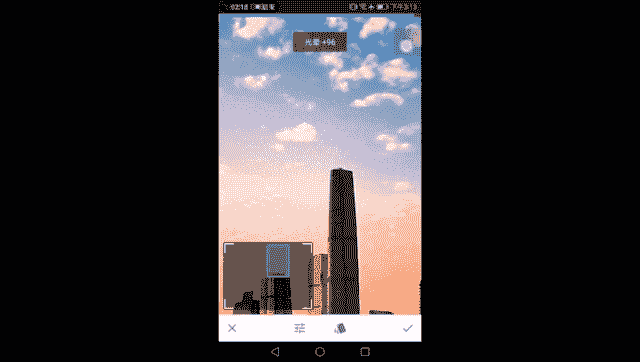

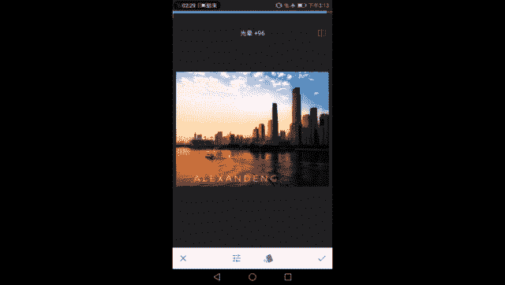

我们知道，画面的立体感由对比度带来。普通对比度调整是针对全局的，容易导致亮部过曝、暗部死黑。

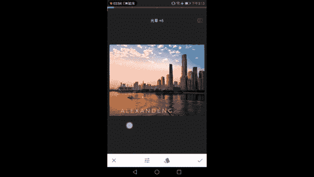

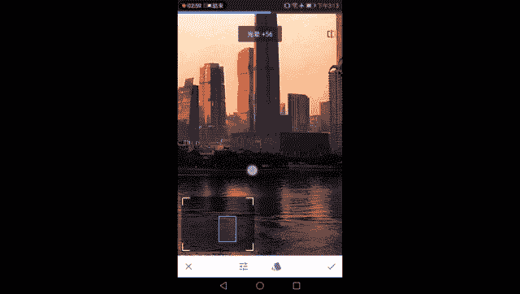

**色调对比度**滤镜则将画面按亮度分为**高光、中间调、阴影**三部分，允许你**分别调整**这三部分的对比度。

**应用示例**：
*   只想让建筑（多处于阴影区）更立体：只增加 **“低色调”** 对比度。
*   只想让天空云彩（多处于高光区）更有层次：只增加 **“高色调”** 对比度。
*   这样就能实现**局部立体感的精准加强**，而其他部分保持不变。

### 魅力光晕：添加柔和氛围

这个滤镜可以为画面添加柔光效果，降低生硬的锐利感，使过渡更自然。

它的作用主要有两个：
1.  **软化边缘**：让建筑等物体尖锐的明暗交界线变得柔和，增添几分温柔、朦胧的艺术感。
2.  **修复过度调整**：如果之前锐化或对比度调整过度，导致天空出现色斑或颗粒，魅力光晕可以显著减轻这些不自然的痕迹，让过渡恢复平滑。

使用时需注意**“光晕强度”** 参数，适度添加即可，避免让画面过于模糊。同时，它也可以配合调整**饱和度**和**暖色调**，改变整体氛围。

### 复古滤镜（12号）：无损增强反差

在众多复古滤镜中，**12号预设**非常独特。它**几乎不改变画面原有色彩**，主要作用是**增强画面的整体反差和立体感**。

这种反差增强与基础调整中的“对比度”不同，效果更自然。你还可以在应用滤镜后，继续微调其**亮度、饱和度**和**样式强度**，以达到最佳效果。通常会将自带的“晕影”效果降为0。

## 🎭 蒙版工具：局部调整的终极利器

调完全局后，你可能希望某些效果只应用于特定区域。这时就需要**蒙版工具**。

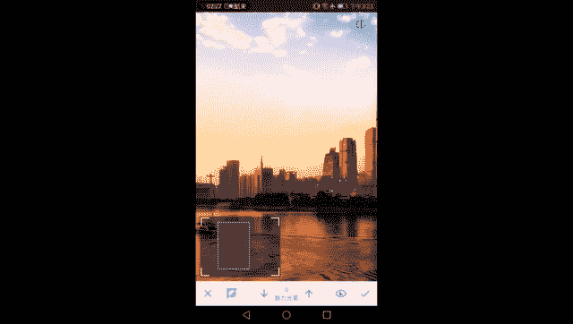

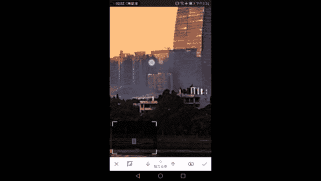

**蒙版的作用是：将任何全局调整（如滤镜、基础调整）转化为局部调整。**

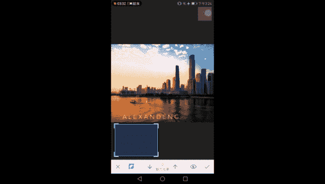

以下是使用蒙版的方法：
1.  点击右上角的**步骤数字**（例如“9”），查看所有历史操作。
2.  选择想要局部应用的那一步（如“魅力光晕”），点击中间的**蒙版图标**（画笔与木板）。
3.  进入蒙版界面。默认情况下，调整效果应用于全图（显示为红色覆盖）。
4.  使用**画笔**进行擦除：
    *   **画笔数值为0**：完全擦除该处的调整效果。
    *   **画笔数值为100**：完全应用调整效果。
    *   数值25、50、75代表不同程度的效果应用。
5.  点击**“眼睛”图标**可以查看/隐藏蒙版覆盖区域。
6.  使用**“反向”按钮**可以快速交换已调整和未调整的区域。

**应用示例**：希望“魅力光晕”只作用于天空和水面，让建筑保持锐利。
*   进入“魅力光晕”的蒙版。
*   使用数值为0的画笔，仔细涂抹建筑部分，将其从柔光效果中“擦除”。
*   擦除后，建筑恢复原状，而天空和水面依然保持柔和。

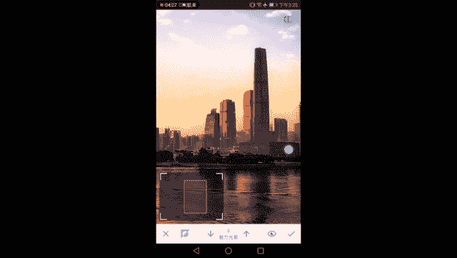

通过蒙版，你可以实现极其精细的局部控制，例如只对水面增加饱和度，或只对建筑使用色调对比度。

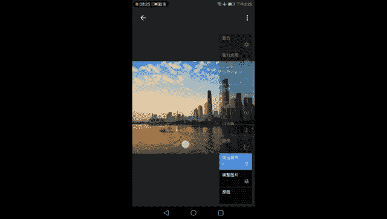

## 📝 课程总结

本节课中，我们一起学习了Snapseed后期处理的进阶部分：

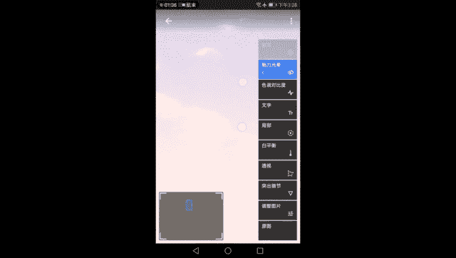

1.  **修复工具**：用于移除画面中的小瑕疵。
2.  **晕影工具**：通过控制画面边缘亮度来营造氛围。
3.  **文字工具**：为照片添加水印或装饰性文字。
4.  **精选滤镜**：
    *   **色调对比度**：分区域增强画面立体感。
    *   **魅力光晕**：添加柔光，软化边缘，修复过度调整痕迹。
    *   **复古（12号）**：在不改变色调的前提下增强画面反差。
5.  **蒙版工具**：**核心进阶技巧**，能将任何全局调整转化为局部调整，实现像素级精准控制。

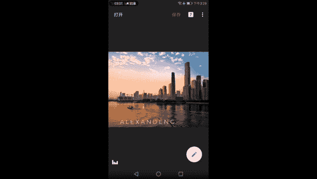

通过结合这些工具，你便能够完成从基础曝光校正到局部氛围塑造的完整后期流程，将一张普通的照片调整得层次分明、质感出众。记住，后期是创作的延伸，多练习才能熟能生巧。