# 手机摄影视频课：第3课：手机照片后期处理（3）

在本节课中，我们将学习如何使用Snapseed对自然风光和人像照片进行后期处理。我们将延续上一课的建筑后期思路，并针对不同题材的特点，调整处理策略和标准，最终获得曝光准确、色彩和谐、细节丰富的照片。

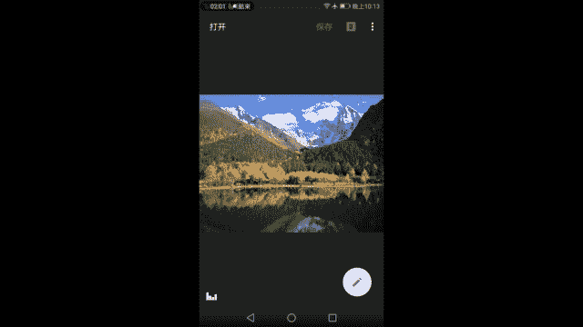

## 自然风光后期处理

上一节我们介绍了城市建筑风光的后期处理，本节中我们来看看自然风光。自然风光与城市建筑在后期处理上有许多相似之处，它们都涉及宏观场景，并受到日光、天气等自然条件的影响。因此，调整明暗、对比度和色彩的核心原则是相通的。

### 核心调整原则回顾

在处理任何照片时，我们都需要关注两个基本方面：**明暗**与**色彩**。

*   **明暗**：控制画面的整体**亮度**和**对比度**。目标是亮部不过曝，暗部不死黑，画面有反差的同时保留细节。
*   **色彩**：调整色彩的**冷暖**和**饱和度**。目标是在接近人眼观察的真实感基础上，融入适度的个人风格，避免过度夸张。

掌握“适度”的尺度，需要通过大量观察优秀作品和持续练习来培养。

现在，我们开始对一张在毕棚沟拍摄的雪山风光照进行后期处理。

### 第一步：基础明暗与色彩调整

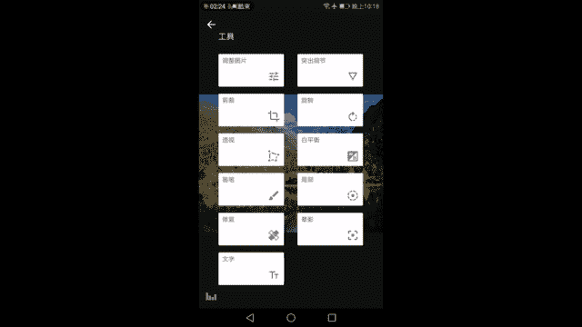

首先，点击工具菜单，选择 **`调整图片`** 功能。

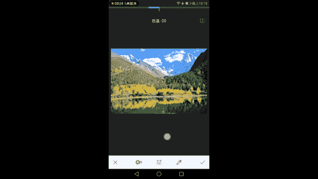

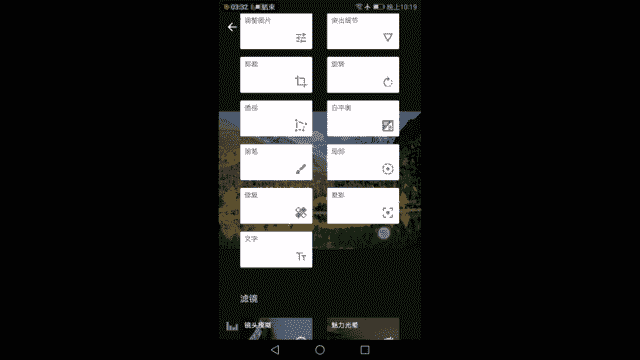

1.  **亮度**：观察直方图，原图整体偏暗。向右增加亮度，使天空和山体变亮。
    *   `亮度 = +（适量）`
2.  **对比度与氛围**：增加对比度后，雪山高光区域可能过曝，而暗部山体可能过暗。此时使用 **`氛围`** 功能来平衡光比。增加氛围值，可以让过亮处变暗，过暗处提亮，使直方图分布更向中间集中。
    *   `对比度 = +（适量）`
    *   `氛围 = +（较大值，用于平衡）`
3.  **饱和度**：高原的蓝天饱和度通常很高。适当增加饱和度，让天空和倒影的色彩更接近真实观感。
    *   `饱和度 = +（适量）`
4.  **高光与阴影**：
    *   **高光**：降低高光以恢复云朵的细节。注意不要降得太多，以免在高光边缘产生不自然的亮边。
        *   `高光 = -（适量，直到云朵细节出现且无假亮边）`
    *   **阴影**：稍微降低阴影，让画面中该暗的部分（如左侧山体）暗下去，以增强立体感。注意不要让暗部完全失去细节。
        *   `阴影 = -（微量）`

完成基本调节后，白平衡在大白天通常很准确，无需调整。点击勾号进入下一步。

### 第二步：增强细节

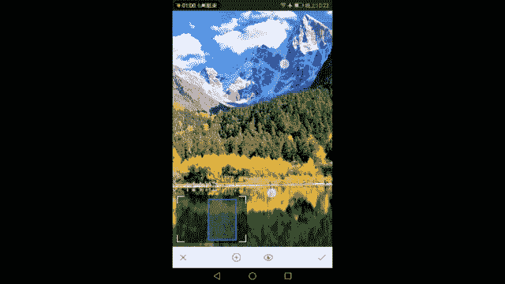

接下来，选择 **`突出细节`** 工具。

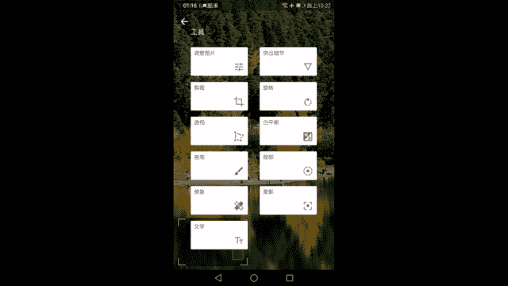

1.  **结构**：增加结构可以强化山体、树木的纹理质感。但需谨慎，加得过多会使画面（尤其是天空）出现杂色色块。
    *   `结构 = +（30左右）`
2.  **锐化**：适当增加锐化，让画面看起来更清晰。
    *   `锐化 = +（适量）`

### 第三步：构图与透视调整

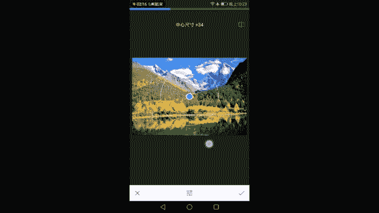

选择 **`裁剪`** 和 **`透视`** 工具。

1.  **裁剪**：原图采用三分法构图，上方三分之二是雪山主体。若想进一步突出雪山，可以稍微裁剪掉一部分水面。
2.  **旋转**：检查地平线是否水平，进行微调。
3.  **透视**：对于自然山脉，其本身具有近大远小的自然透视，通常不需要进行垂直或水平透视校正。

### 第四步：局部调整

这是风光后期的关键步骤，用于针对性增强主体。选择 **`局部`** 工具。

1.  在觉得灰蒙蒙、缺乏立体感的山体上添加一个调整点。
2.  对该点进行以下操作：
    *   **增加对比度**：让山体的明暗反差变大。
        *   `对比度 = +`
    *   **降低亮度**：进一步压暗暗部，增强立体感。
        *   `亮度 = -`
    *   **微调饱和度**：因为增加对比度会附带提升饱和度，可根据情况略微降低。
        *   `饱和度 = -（微量）`
3.  可以添加多个局部点，对画面中不同的山体进行类似调整。通过对比开启/关闭局部效果，可以看到只有选中的山体立体感得到了增强，其他部分保持不变。

### 第五步：修复与增强

1.  **修复**：使用 **`修复`** 工具可以抹去画面中干扰的小元素（如远处的游客）。但需注意，修复大面积或复杂区域时容易产生BUG（如重复的纹理或残留的影子）。
2.  **晕影**：使用 **`晕影`** 工具为画面添加暗角，可以引导视线聚焦于中心。风光片中可加可不加，程度宜轻。
    *   `外部亮度 = -（微量）`

### 第六步：色调对比度与魅力光晕

1.  **色调对比度**：选择 **`色调对比度`** 工具。分别调整高色调、中色调、低色调的对比度，可以精细地增强不同亮度区域的质感。
    *   **高色调**：适当增加，让云朵的反差更明显。
    *   **低色调**：适当增加，增强暗部山体和树林的立体感。
    *   注意控制强度，避免画质受损。
2.  **魅力光晕**：选择 **`魅力光晕`** 工具。添加少量光晕可以使画面中某些生硬的过渡（如天空与山的交界）变得柔和，增添氛围。但需避免过度使用导致画面过于模糊。
    *   `光晕 = +（40左右）`

### 第七步：最终风格化定调

选择 **`复古`** 滤镜（例如12号）。复古滤镜不仅能添加风格色彩，其自带的“样式强度”和“晕影强度”调节，可以进一步整体压暗画面、增强对比，让照片的立体感和氛围达到更佳状态。

**自然风光后期总结**：回顾整个流程，我们从灰蒙蒙的原图出发，通过调整图片平衡了明暗与色彩，用突出细节增强了清晰度，利用局部工具强化了山体的立体感，最后通过色调对比度、魅力光晕和复古滤镜进行了质感与风格的最终塑造。后期处理的首要目的是弥补相机与人眼的差距，使照片更接近“所见即所得”；其次是在符合人眼视觉规律的基础上，进行个性化的适度调整。

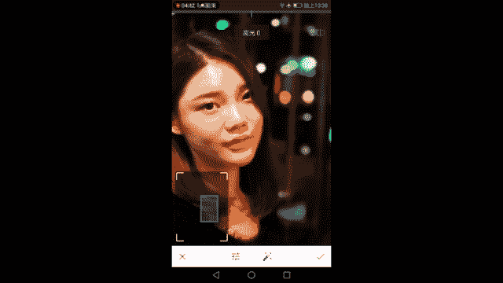

## 人像摄影后期处理

讲完了自然风光，我们最后来到人像摄影的后期。与人像相比，风光建筑更依赖时机和角度，而人像的前期（光线、模特状态、妆容、环境）至关重要，许多效果无法全靠后期弥补。本例中，我们将处理一张利用手机虚化功能拍摄的半身人像。

**人像后期的核心标准**：**以人物的皮肤（尤其是面部）为调整基准**，放弃风光片中依赖的直方图。目标是皮肤白皙红润有细节，五官立体清晰。

### 第一步：基础调整（以人脸为准）

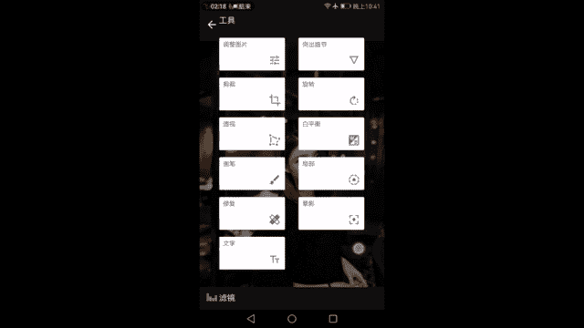

进入 **`调整图片`** 工具。

1.  **亮度**：观察人物脸部，确保不过曝也不欠曝。遵循“宁曝勿欠”原则，因为过曝显白，欠曝显黑。让人脸略微显白并保留细节为佳。
    *   `亮度 = +（以脸部肤色为准）`
2.  **对比度**：适当增加，让人物五官更立体。但切忌过高，以免皮肤细节丢失。
    *   `对比度 = +（微量）`
3.  **饱和度**：小心增加饱和度，以突出妆容（如口红）和整体气色。注意观察皮肤是否因此变得过黄或过红。
    *   `饱和度 = +（微量）`
4.  **暖色调**：可稍向左（冷调）调节，使皮肤看起来更白皙；或稍向右（暖调）调节，使气色更红润。根据喜好微调。
    *   `暖色调 = -（微量，偏向白皙）`

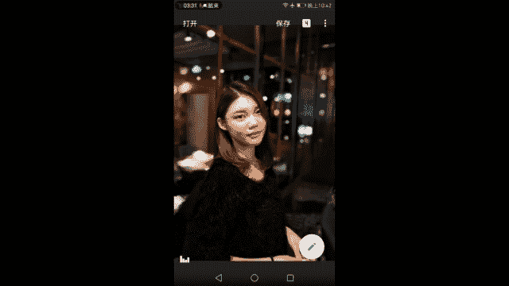

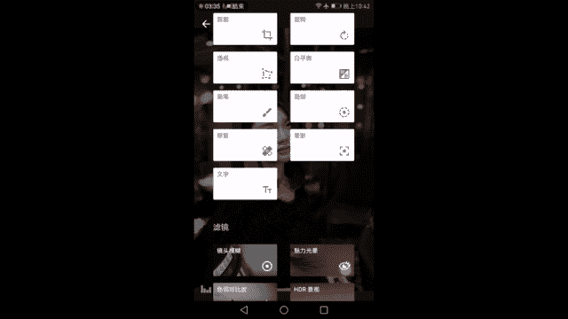

### 第二步：细节处理（磨皮与锐化）

进入 **`突出细节`** 工具。这是人像后期的关键步骤，常结合蒙版使用。

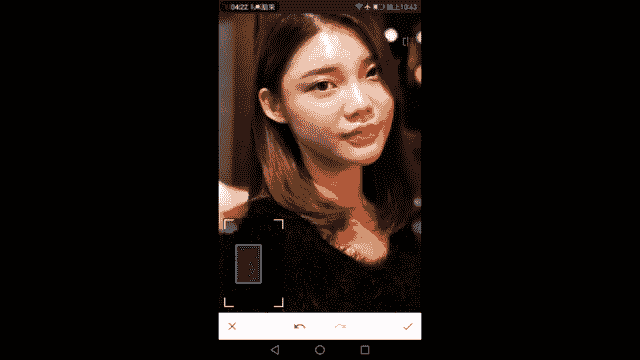

1.  **结构**：
    *   正向调节（+）能增强发丝、眉毛、衣物纹理的质感。
    *   **反向调节（-）可以实现磨皮效果**，让皮肤更平滑。
    *   通常先适量增加结构以提升整体质感（如头发），后续再用蒙版将磨皮效果单独作用于皮肤。
    *   `结构 = +（适量）`
2.  **锐化**：轻微增加，使眼睛等细节更清晰。避免过度导致皮肤出现颗粒感。
    *   `锐化 = +（微量）`

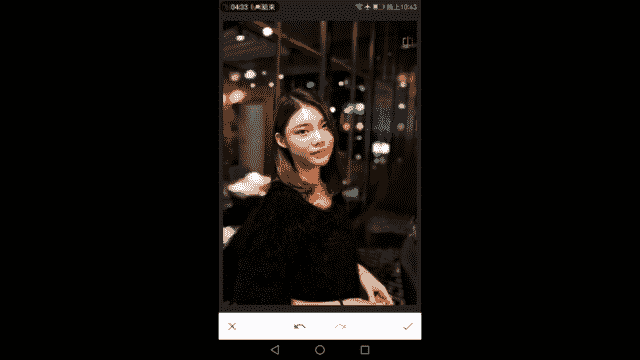

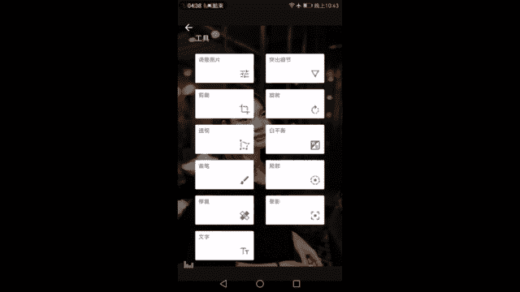

### 第三步：构图与白平衡

1.  **裁剪**：使用 **`裁剪`** 工具，按照黄金分割或三分法构图，将人物置于视觉焦点。注意不要裁切掉手部等重要部位。
2.  **白平衡**：在 **`白平衡`** 工具中可进行更精细的色调调整，原理与基础调整中的暖色调类似。

### 第四步：瑕疵修复

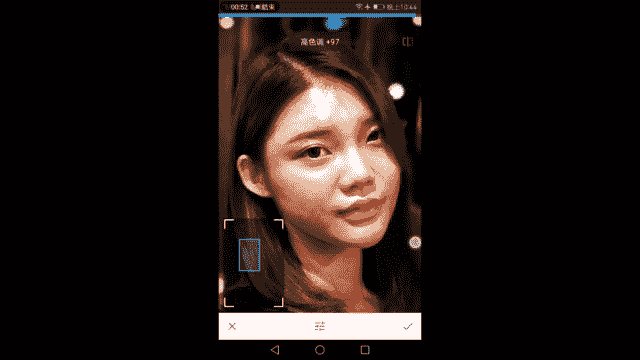

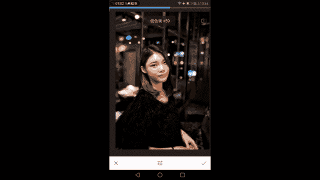

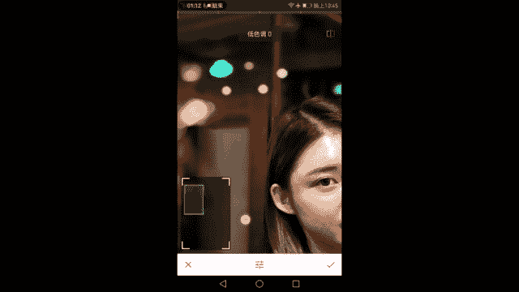

使用 **`修复`** 工具，点除人物面部明显的痘痘、斑点等小瑕疵。相当于简易版的一键美颜。处理面部阴影等大面积区域时需谨慎，容易造成肤色不均。

### 第五步：突出主体与质感增强

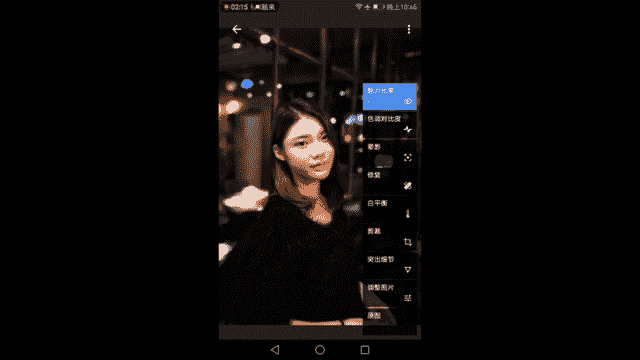

1.  **晕影**：使用 **`晕影`** 工具添加暗角，能有效让人物从背景中突出。光线好时可轻加或不加。
    *   `外部亮度 = -（微量）`
2.  **色调对比度**：使用 **`色调对比度`** 工具。
    *   **中色调**：增加可显著增强头发、毛衣等纹理的质感。
    *   **高色调**：降至最低，避免高光区域（脸部）对比过强。
    *   **低色调**：适当增加，增强深色衣物或背景的质感。
3.  **魅力光晕**：使用 **`魅力光晕`** 工具。为人脸添加适量光晕，可以使皮肤过渡更柔和，增添柔美效果。同样需要后续使用蒙版控制作用范围。

### 第六步：蒙版精修（关键步骤）

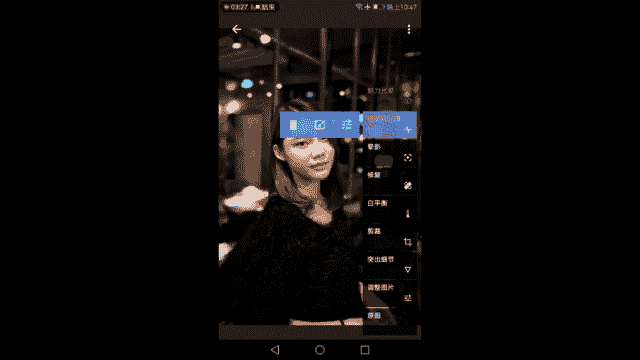

人像处理的精髓在于使用 **蒙版** 进行局部控制。在历史记录中，可以找到“突出细节”、“色调对比度”、“魅力光晕”等步骤，点击并选择“蒙版”功能。

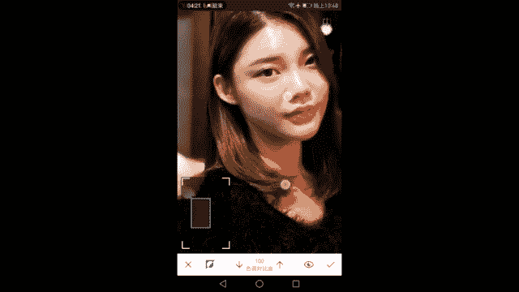

以下是蒙版精修的典型操作：

1.  **磨皮**：在“突出细节”步骤的蒙版中，将画笔数值设为 **`0`**（即完全消除该步骤的效果），然后仔细涂抹人物的脸部、颈部皮肤。这样就去除了皮肤上因增加结构带来的粗糙感，实现了磨皮，而头发和背景的质感得以保留。
2.  **保护皮肤**：在“色调对比度”步骤的蒙版中，同样用数值为 **`0`** 的画笔涂抹皮肤区域，防止高对比度效果让皮肤变粗糙。
3.  **控制光晕**：在“魅力光晕”步骤的蒙版中，用数值为 **`50-75`** 的画笔（而非0或100）涂抹皮肤。这样可以让皮肤获得适度的柔化效果，既不过度模糊失去立体感，又能增添柔美气质。用数值为 **`0`** 的画笔涂抹头发和背景，消除这些区域不必要的模糊。

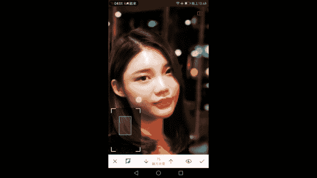

**人像后期总结**：我们从原图出发，以提高脸部肤色为标准调整了明暗和色彩；利用“突出细节”和蒙版结合实现了精细的磨皮与锐化；通过裁剪优化构图；用修复工具去除了瑕疵；最后运用色调对比度、魅力光晕及蒙版技术，全方位提升了发丝、衣物质感，并美化了肤色。整个过程始终围绕人物主体进行局部和整体的平衡。

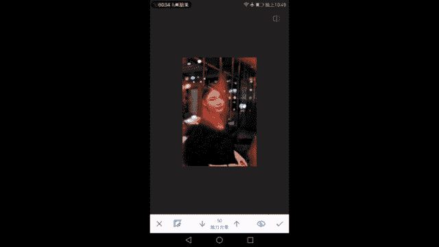

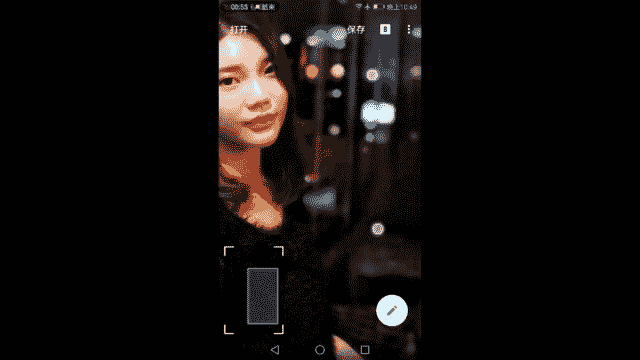

## 课程总结

本节课中，我们一起学习了自然风光和人像摄影的Snapseed后期处理流程。

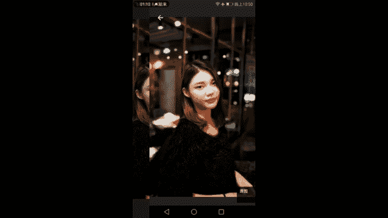

*   **风光后期**：核心在于全局光影的平衡与局部主体的强化。我们运用了**调整图片**、**局部**、**色调对比度**等工具，旨在还原场景的宏伟与细节，并适度增强视觉冲击力。
*   **人像后期**：核心在于以人物皮肤为基准进行曝光和色彩控制，并大量依赖**蒙版**工具进行局部精修。我们学习了如何利用**结构**的反向调节实现磨皮，以及如何用蒙版分离对皮肤、头发、背景的不同处理，达到既美化人物又不失质感的效果。

通过这两类题材的实践，我们已经掌握了使用Snapseed进行基础曝光校正、色彩优化、细节增强和局部调整的方法。这为照片打下了良好的基础。在接下来的课程中，我们将学习使用VSCO等APP，为照片添加更丰富的胶片风格等个性化滤镜，完成风格化定调。