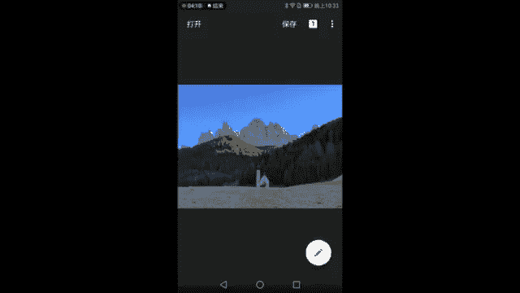
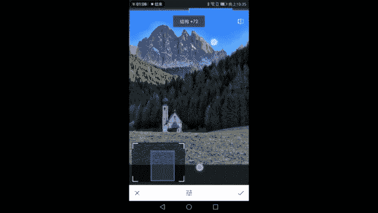
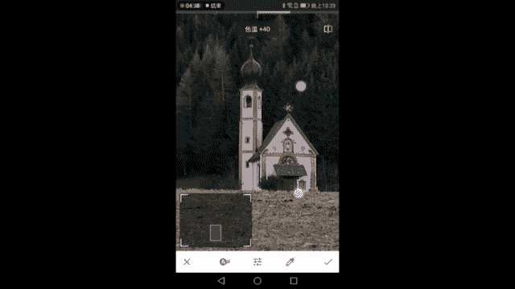
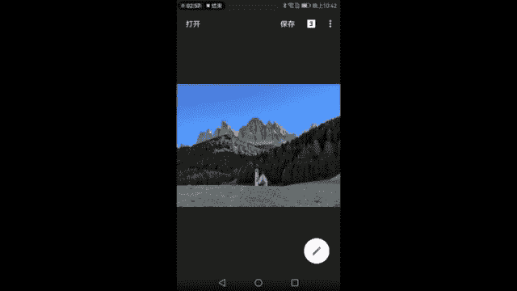
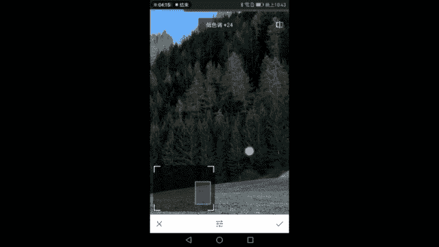
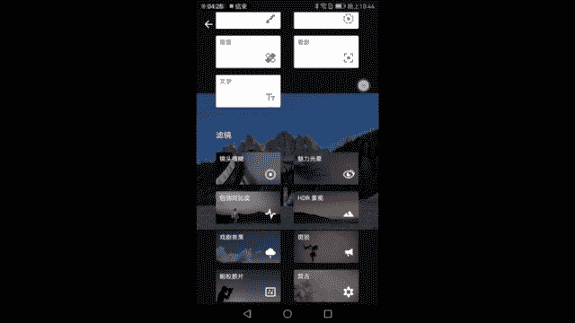
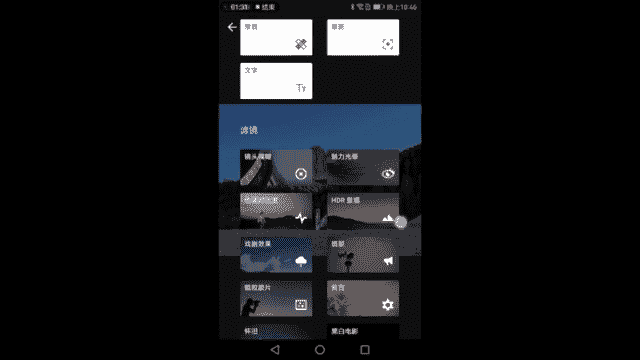

# 手机摄影视频课：第4课：拍摄城市风光、自然风光

在本节课中，我们将学习风光摄影的核心技巧，包括构图、测光、透视以及后期处理。课程将以意大利多洛米蒂山区的实景为例，演示如何将眼前的风景转化为一张出色的照片。

## 构图基础：三分法与主体摆放

构图是风光摄影的基础，它决定了画面的结构和美感。因为构图很难通过后期完全修正，所以前期拍摄时就需要仔细考虑。

上一节我们介绍了课程概述，本节中我们来看看如何运用基础的构图法则。

首先，观察场景中的主要元素：一座小教堂、背后的群山、颜色较深的森林以及颜色较浅的平原。一个简单有效的构图方法是**三分法**。

以下是运用三分法的具体观察方法：
*   以森林与天空的分界线作为参考，将其放置在画面的上三分之一处。
*   以森林与平原的分界线作为参考，将其放置在画面的下三分之一处。
*   这样，画面就自然地形成了天空、山体森林带、地面平原各占三分之一的均衡结构。

接下来需要考虑主体的摆放。教堂颜色较浅，在深色背景中很突出。通常有两种选择：
1.  放在画面的左或右三分之一处（兴趣中心点）。
2.  采用中心对称构图，放在画面正中央。

经过尝试，将教堂放在右侧会导致左侧杂乱的建筑入镜，画面失衡；放在左侧则会让右侧深色山坡显得过于沉重。因此，将教堂置于画面中央能获得最平衡、稳定的构图。

为了让主体更突出，我们需要调整焦距。如果使用手机，可以进行数码变焦；使用相机则可用光学变焦。放大后，画面依然遵循三分法，教堂位于下三分之一处的中央，左右元素对称，画面充实且留有想象空间。

## 准确曝光：测光与HDR模式

构图完成后，下一步是确保照片曝光准确。这涉及到测光点的选择。

由于手机通常是自动测光，我们需要手动选择测光点来引导相机。画面中同时存在明亮的天空、山峰和阴暗的森林，选择不同的测光点会导致完全不同的结果。

以下是测光点选择不当的后果：
*   对深色森林测光：会导致天空和山峰过曝，失去细节。
*   对明亮天空测光：会导致森林部分欠曝，过于黑暗。

解决这种大光比场景的最佳方法是使用**HDR（高动态范围）模式**。HDR模式会拍摄多张不同曝光的照片并合成，从而最大程度地保留亮部和暗部的细节。

如果开启HDR后仍不满意，可以手动调整曝光补偿（屏幕上那个带有加减号的小太阳图标），上下拖动即可整体提亮或压暗画面。

选择测光点的原则是：寻找画面中亮度适中的区域。例如，选择一块既不像天空那么亮，也不像树林那么暗的山坡进行测光，再配合HDR模式，通常就能得到一张曝光均衡的照片。

## 透视与机位：用脚步寻找最佳视角

透视规律指的是“近大远小”。在风光摄影中，虽然景物庞大，透视变化不明显，但通过移动机位改变与前景主体的距离，可以显著调整主体与背景的比例关系。

例如，以教堂为主体：
*   想要体现教堂的渺小和山的宏伟，就需要远离教堂拍摄。
*   想要让教堂显得更大、更突出，就需要靠近教堂拍摄。

除了前后移动，左右走动和调整拍摄高度同样至关重要。在现场，你可能需要寻找一个前景（如一个小土坡）来遮挡画面中不想要的杂乱元素（如未完工的滑雪场）。通过蹲下或调整位置，让这个小坡刚好挡住杂物，从而净化画面。

这种“用脚构图”的方式是风光摄影的黄金法则。多角度观察，亲自探索，往往能发现意想不到的绝佳机位。

## 光线时机与再构图

选择正确的拍摄时间至关重要。理想的光线能塑造主体，例如让阳光只照亮教堂，而背景的山谷处于阴影中。这样形成的明暗对比能极大地突出主体。

即使找到了好光线，也可能遇到意外干扰（如画面中出现的塔吊）。这时，需要再次移动位置，寻找新的角度来规避干扰物。

通过左右移动，我们可以调整主体在画面中的位置。例如，如果教堂太偏左，会导致画面重心不稳。向前走一段距离，找到能让教堂更居中的位置，就能获得更平衡的构图。

再次强调，不要局限于常见的“经典机位”。多走动、多观察，你总能发现属于自己的独特视角。

## 后期处理：从原图到成片

后期处理能让照片焕然一新。我们使用一张采用中心对称和三分法构图的照片进行演示。

**1. 基础调整**
首先检查直方图，确认曝光是否合理。原图因暗部树林较多，直方图偏左，但整体曝光正常。主要问题是画面偏“灰”，缺乏立体感。
*   适当增加**对比度**和**氛围**（或去雾）工具，增强画面整体层次。
*   增加**饱和度**，还原景物色彩。
*   调整**色温**，让画面色调更符合现场感受或个人偏好（例如让画面稍微偏暖）。

**2. 局部增强细节**
使用**突出细节**工具，增加“结构”和“锐化”可以强化山体的岩石质感。但直接全局调整可能会在天空与山的交界处产生难看的白边。

这时需要用到**局部调整工具（蒙版）**。我们创建一个只针对山体和树林的调整蒙版。
*   在蒙版界面，用画笔仔细涂抹山体和森林区域。
*   对于教堂，使用较低透明度的画笔（如50%）轻微涂抹，避免过度锐化。
*   操作时，可以开启“查看修改区域”功能来辅助，确保涂抹精确。

**3. 局部调整色彩**
感觉山体颜色可以更暖黄一些，使用**白平衡**工具，增加色温和少许色调（向洋红方向）。
*   同样，通过蒙版将色彩调整只应用于山体和部分树林，避免影响天空和地面。

**小技巧**：在擦拭蒙版边缘时，宁可让笔触略微侵入山体内部，也不要涂到纯净的天空上。因为天空颜色均匀，任何污染都会非常明显；而山体内部细节丰富，轻微的边缘不准确不易察觉。

**4. 精细化处理**
*   **修复工具**：可以点除地面上一两块过于突兀的草皮，让前景更干净。
*   **色调对比度**：分别增强“中色调”和“低色调”，可以进一步强化山体和树林的中间层次与暗部细节，增加质感。
*   **魅力光晕**：为画面高光部分添加柔和的光晕效果，能让阳光照射下对比强烈的山体过渡更自然。同样建议使用蒙版，主要应用于上半部分画面。
*   **复古滤镜**：选择合适的滤镜（如复古12号），可以增强整体立体感和质感。适度增加“样式强度”，并轻微添加“晕影”（暗角），能将观众视线引导至画面中心的教堂和山体。

**后期流程总结**：
1.  **基础调整**：对比度、氛围、饱和度、色温。
2.  **局部锐化**：通过蒙版强化山体、树林细节。
3.  **局部调色**：通过蒙版让山体色彩更暖。
4.  **细节修复**：去除画面杂物。
5.  **质感增强**：使用色调对比度、魅力光晕、复古滤镜等工具，逐步提升画面整体立体感和艺术感。

**最终效果对比**：经过一系列调整，照片从原始灰暗、平淡的状态，转变为色彩鲜明、细节丰富、质感突出、主体鲜明的风光作品。

---

本节课中我们一起学习了风光摄影的完整流程：从运用三分法进行基础构图，到在复杂光线下使用HDR和测光技巧确保曝光准确；从理解透视规律并勤于走动寻找最佳机位，到把握拍摄时机利用光线；最后，通过一套系统的后期处理流程，将原始照片优化为具有感染力的成品。记住，前期构图是骨架，光线是灵魂，而后期则是锦上添花的妆容。