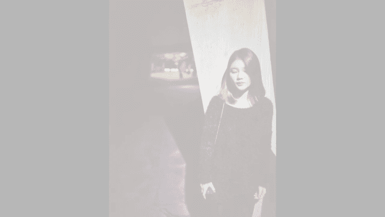

# 手机摄影视频课：第5课：拍摄人像与静物

在本节课中，我们将学习手机摄影中最常见的两个题材：人像摄影与静物（美食）摄影。我们将通过实战演练，掌握如何选择场景、运用光线、与模特沟通、摆盘构图，以及如何通过后期处理让照片更具美感。

## 回顾与课程概述

上一节我们以城市风光为例，学习了户外风光摄影的拍摄与后期技巧。本节中，我们将目光转向日常生活，学习如何拍摄人像和美食。

人像摄影是记录生活、表达情感的重要方式。静物（尤其是美食）摄影则能展现生活的精致与美好。本课将以实战形式，分别讲解这两个题材的核心技巧。

## 第一部分：人像摄影实战

在拍摄人像的过程中，我们最常遇到办公室、餐厅、咖啡厅等室内场景。本次我们选择一间常见的餐厅作为示范地点。

由于餐厅空间通常较小且客人较多，我们大多拍摄半身或大半身人像。在这种限制下，用光成为关键——我们需要利用好环境中的自然光线来呈现人物最美的一面。

### 环境与光线的选择

以下是选择拍摄位置的核心要点：

1.  **主动寻找光源**：在光线复杂的餐厅里（如无方向的白炽灯、有方向的射灯），需要带着模特不断移动，寻找最适合其脸型、衣着和气质的光线位置。
2.  **与模特充分沟通**：这是至关重要的一步。即使对于专业摄影师或相处多年的伴侣，也不一定完全了解对方心中“最美的自己”。可以请模特用你的手机自拍，观察她喜欢的角度和效果，这能让你事半功倍。
3.  **理解光线的特性**：光线有强弱、方向和色温（冷暖）之分。例如，窗外的冷光能让皮肤更白，气质显得高冷；室内的暖光则让人显得热情。需要根据模特的特质和想表达的情绪来选择光线。
4.  **善用“蝴蝶光”**：当灯光来自人物正上方时，会在脸颊形成阴影，鼻梁下方形成蝴蝶状高光，这种光线能让人脸看起来更瘦、更立体。公式可理解为：**顶光 → 脸颊阴影 + 鼻下高光 = 视觉显瘦**。
5.  **利用背景虚化**：如果手机具备人像模式或背景虚化功能，可以主动寻找灯光密集或分布有致的背景（如成串的灯饰），它们能虚化成美丽的光斑，提升照片的艺术感。

### 户外人像拍摄要点

来到户外，人物可以与更大的背景互动，展现更多姿态。以下是几个关键点：

1.  **避免线条切割**：不要让地平线、建筑线条等贯穿人物的头部或身体主要部位。
2.  **注意色彩搭配**：人物的衣着颜色应与背景形成对比。例如，穿黑色衣服应避免以深色背景拍摄，选择蓝天或浅色建筑能更好地衬托出人物轮廓。
3.  **灵活补光**：天色渐晚时，手机在暗光下拍摄效果不佳。此时可以请同伴用另一部手机打开手电筒功能进行补光，效果对比显著。
4.  **调整拍摄角度**：
    *   拍摄全身像时，摄影师蹲低一点，从下往上拍，可以让模特的腿显得更长。
    *   拍摄半身像时，从稍高的角度往下拍，可以让下巴显得更小，人物更显年轻。
5.  **与环境互动**：观察环境中的特色元素（如建筑的曲线），让人物与之结合，可以拍出既干净又有故事感的画面。
6.  **捕捉环境光**：城市中有各种颜色的光源。可以利用街头的射灯等，为人脸制造强烈的明暗对比，突出脸部线条和立体感。

## 第二部分：静物（美食）摄影实战

拍摄美食与室内拍摄人像有相通之处，核心同样是对光线的把握和画面的经营。

### 光线与摆盘的核心技巧

以下是拍摄美食的两个基本技巧：

1.  **寻找并避开主光源**：在咖啡厅等室内，通常有一盏最亮的灯作为主光源。如果拿着手机直接在灯下拍摄，会在食物上形成难看的手机或人的影子。聪明的做法是绕到侧面拍摄，避开影子。
2.  **精心布置画面**：食物体积小，可以随意摆弄。上菜后，先将无关的纸巾、杂乱的餐具移开，重新将餐具、食物摆放到美观的位置。甚至可以调整配菜（如巧克力）的角度作为陪衬。

### 创造性解决光线问题

有时无论如何调整角度，影子仍难以避免。此时可以创造性地使用补光：

如果有多部手机，可以使用另一部手机的手电筒功能进行补光。将补光手机拿远一些，让光线更柔和、分散，避免形成新的生硬阴影。通过不断调整补光角度和距离，找到最合适的效果。

## 第三部分：静物照片后期处理

完成拍摄后，后期处理能进一步提升照片质感。我们以常用的Snapseed软件为例，进行美食照片的后期演示。

静物后期相对于人像更简单，因为其颜色和质感的可塑性更强，容错率更高。后期的核心是：**首先符合人眼的观察习惯，其次是表达个性化风格**。

### 后期处理步骤详解

以下是详细的后期步骤：

1.  **调整图片**：
    *   **亮度**：观察直方图，如果像素大多集中在左侧（偏暗），则适当增加亮度，让画面曝光正常，但注意不要使右侧顶格（过曝）。
    *   **对比度**：适当增加，让画面更通透。
    *   **饱和度**：谨慎增加。如果加过头会使颜色失真。若只想增强特定物体（如抹茶蛋糕）的饱和度，可考虑后续使用局部调整工具。
    *   **氛围**：此工具可平衡光比。本例中稍微降低氛围，能让白色盘子和蛋糕更突出。
    *   **高光/阴影**：降低高光以保留盘子等亮部细节（如陶瓷反光）；降低阴影可以增强叉子等物体的金属质感，并让画面对比更鲜明。

2.  **突出细节**：
    *   **结构**：降低结构可以让画面局部细节变柔和，食物看起来更干净、亲切。
    *   **锐化**：降低结构后画面可能变“糊”，此时需要增加锐化，让画面在保持干净的同时恢复清晰度。这是一个让画面“干净又清晰”的重要技巧。

3.  **旋转与裁剪**：
    *   如果构图良好可省略裁剪。
    *   利用“旋转”功能，以画面中垂直的参照物（如灯的倒影）为准，调整画面水平，让照片更平稳。

4.  **视角调整**：
    *   使用“视角”工具，轻微调整透视。例如，让画面下半部分增大，会产生一种透视纵深感；让上半部分（食物）增大，则感觉食物离我们更近。可根据喜好微调。

5.  **修复瑕疵**：
    *   使用“修复”工具，点掉桌面上不想要的污点、白点，让画面更加干净整洁。

6.  **色调对比度**：
    *   此工具可以分别调整高调、中调、低调的对比度。例如，增强低色调可以让叉子的金属感更立体；但本例中盘子的高光部分不需要太强对比，因此可以降低高色调。中色调（桌子、蛋糕）也可适当调整。

7.  **魅力光晕**：
    *   此工具能为画面添加朦胧感，让明暗过渡更柔和。对于食物，增加一些光晕能营造温馨、柔软的质感，让人更有食欲。
    *   可以同时调整光晕的色温（冷暖）和饱和度，以达到理想的氛围。

**后期流程总结**：基础调整（明暗、色彩）→ 突出细节（降结构、加锐化）→ 旋转校正 → 视角微调 → 修复瑕疵 → 色调对比度增强质感 → 魅力光晕营造氛围。

（注：人像后期在之前的课程中已有详细讲解，且范例照片为本课所拍，故此处不再重复演示。）

## 课程总结

本节课中，我们一起学习了人像与静物美食摄影的实战技巧。

我们回顾并应用了第二课的用光知识，学会了如何在室内外利用光线将人拍美、拍瘦、拍出气质。同时，也掌握了与模特沟通的重要性。对于静物摄影，我们重点学习了如何寻找光线、巧妙摆盘，以及如何创造性地使用手机进行补光。最后，我们通过Snapseed软件，一步步完成了对美食照片的后期处理，提升了画面的质感和氛围。

至此，我们的五节手机摄影核心课程就告一段落了。希望大家能将所学知识运用到日常生活中，持续练习，拍出更多精彩的作品。