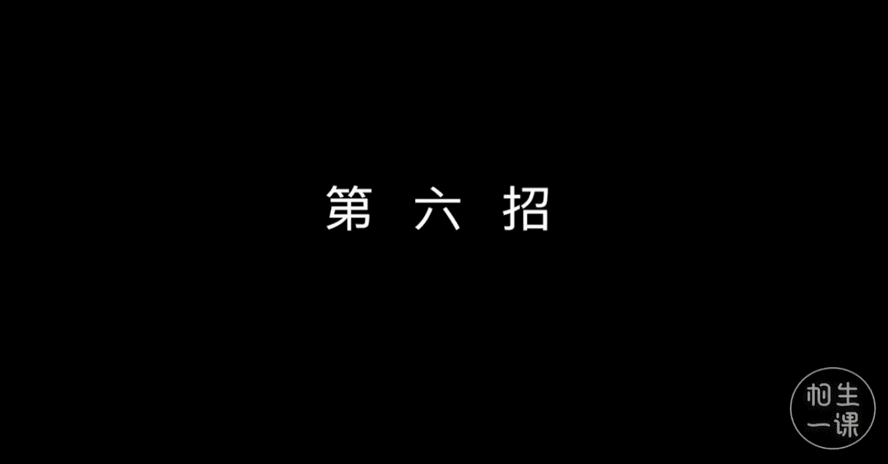
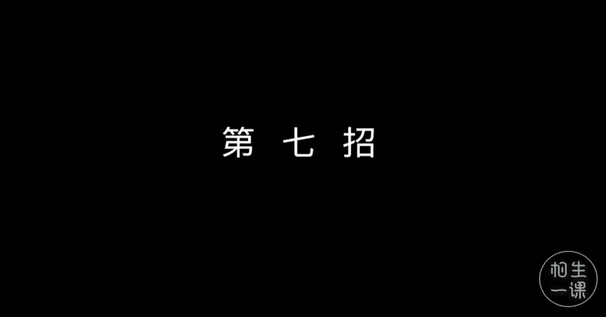
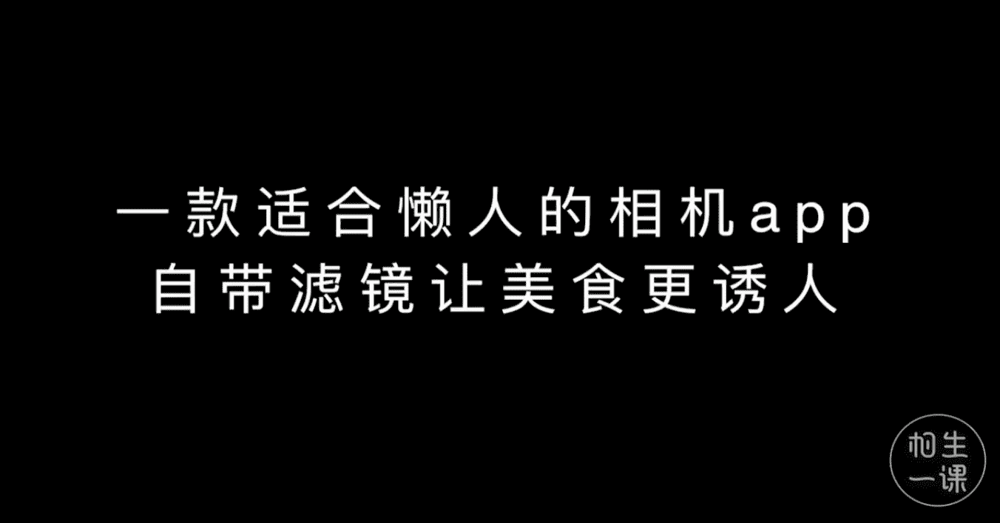
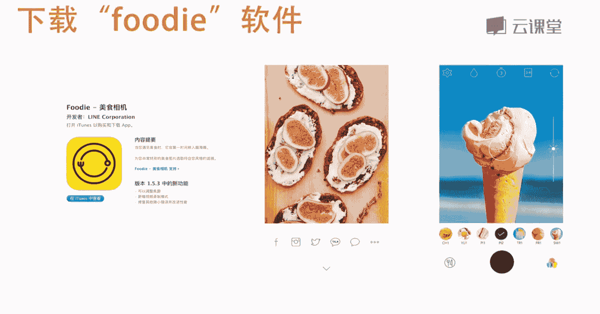
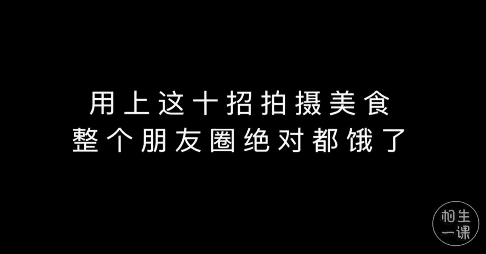

手机摄影：1.7：十招拍出诱人美食照片 🍽️

在本节课中，我们将学习十个简单实用的技巧，帮助你用手机拍出令人垂涎欲滴的美食照片，让你的社交媒体分享脱颖而出。

---

### **第一招：寻找充足光源**
尽量在光线明亮的地方拍照，靠近窗户的自然光源是最佳选择。在餐厅用餐时，建议优先选择靠窗的位置。自然光能提供更好的光线质感，使食物颜色更真实。室内偏暗环境的光源通常是暖黄色灯光，可能导致照片偏色（偏黄或偏冷）。因此，提前选择靠窗座位对拍摄至关重要。

上一节我们介绍了光源的重要性，本节中我们来看看如何为特色美食构图。

### **第二招：拍摄特色美食**
这是杰克的一种传统美食，使用特制面粉发酵后的长条形面团，一圈圈卷在长棍上烤制，裹上颗粒状双糖后，放在炭火上烤制几分钟即可食用。

如何将这类当地特色美食拍得与众不同？显然，随意拍摄背景凌乱的照片效果不佳。

以下是拍摄当地特色美食的正确方式：
*   **寻找漂亮背景**：例如店铺招牌，调整拍摄位置，尽量让拍摄角度与背景面板保持垂直平行。
*   **利用环境元素**：用当地的特色建筑或街道作为食物的背景。

### **第三招：单盘美食构图技巧**
当只拍摄一款美食时，记住这些构图诀窍。
*   **中心点构图**：将一盘美食放置于画面最中心。
*   **饱满构图**：尽量让整盘食物充满画面，但不宜过于拥挤，画面至少需保留餐盘边缘。

构图决定了画面的基础，接下来我们看看拍摄角度的选择。

### **第四招：通用拍摄角度**
大部分食物拍摄的最佳角度是俯拍，保持手机与桌面成 **30到45度** 的角度进行拍摄。这个角度适合大部分食物，能有效拍出诱人的效果。

### **第五招：特殊食物的拍摄角度**
饮料、蛋糕、冰淇淋等有立体感的食物，有时采用平视角度拍摄更加合适。将手机直接放在桌面上，或保持与食物平齐的角度拍摄，能更好地展示其层次和颜色。

拍摄时，可以选用手机的人像模式来虚化杂乱的背景。如果画面偏暗（例如处于背光环境），在对焦锁定后，屏幕上会出现一个**黄色的小太阳图标**。手指按住屏幕上拉可以调亮曝光，使画面光线更合适。

虚化背景能让主体更突出。适合采用平视角度拍摄的食物包括：
*   冰淇淋
*   透明玻璃杯装的饮料
*   马卡龙（除了45度角，也可平视拍摄，将其摆放成特定形状，并利用室内光源虚化成光斑作为背景）

### **第六招：整桌美食的拍摄**
拍摄整桌食物时，更适合采用俯视平拍角度。必须端平手机，确保手机与桌面保持平行。当桌面上物品较多时，甚至需要站起来平举手机进行拍摄。

### **第七招：加入互动元素**
在食物照片中加入手的元素，可以增加互动感和生活气息。

### **第八招：保持画面整洁**
拍摄前，需整理盘内食物的形状，并擦干净盘边的食物残渣。旁边有残渣会影响美观，让照片显得不干净。因此，想拍出好看的美食照，不仅要摆设食物，还需保持餐盘边缘清洁。

### **第九招：利用道具装饰**
如果拍摄全景，需要精心摆设菜品，并可以添加一些装饰物。方正的盘子可能显得单调，缺乏背景时，可以利用菜单或酒店提供的彩色小菜单作为道具装饰桌面。

摆盘相当重要。例如，拍摄贝果时可以稍微揭开一点。拍全景也尽量采用俯拍角度。

同样可以加入手的元素，例如假装端杯子。如果有第二个人协助，假装切东西，从这个角度拍摄效果可能更好。拍摄时手机一定要端平。

以下是利用道具装饰画面的示例：
*   使用大小不一的小植物或宣传单作为装饰。
*   用餐厅小卡片做点缀。
*   以银镜片餐垫作为背景装饰。
*   用绿色的复古菜单做点缀。

### **第十招：使用美食滤镜APP**
推荐一款适合懒人的相机应用“Foodie”，它自带多种滤镜，能让美食看起来更诱人。

下载Foodie软件后，打开并挑选喜欢的滤镜款式。可以从底部名称菜单选择滤镜，也可以直接左右滑动屏幕切换。

运用以上十招拍摄美食，你的朋友圈绝对会为之垂涎。

---

本节课中我们一起学习了用手机拍好美食的十个核心技巧：从寻找光源、选择角度、构图方法，到保持整洁、运用道具和后期滤镜。掌握这些要点，你就能轻松记录并分享每一餐的诱人瞬间。