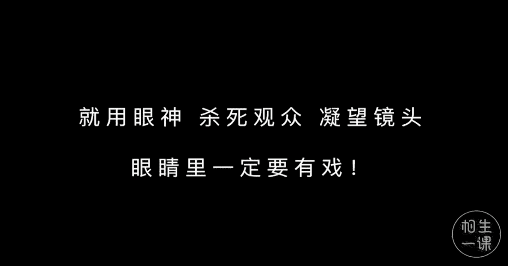

手机摄影：第八节：拯救镜头恐惧症 📸

在本节课中，我们将学习一系列简单实用的拍照姿势，帮助你克服面对镜头时的紧张感，轻松拍出自然好看的照片。这些“万能姿势”适用于多种场景，即使是摄影新手也能快速掌握。

---

### **万能姿势之低头微笑 😊**

通过长期观察与拍摄的经验总结，大部分人低头微笑的这个角度拍出来都不错。

正面拍摄低头微笑适合大部分人，而侧面拍摄就不适合五官扁平的人。

如果能配合一些其他的道具，会让照片显得更自然。

---

### **万能姿势之撩头发 💁‍♀️**

这是女孩子平时也会做的动作，一只手轻轻的撩一撩耳边的头发。

这是真正的撩头发，因为风太大，手指的动作其实可以更优雅一点。

以下是撩头发的关键要点：
*   在撩头发的时候，动作比平时放慢节奏，这样利于摄影师抓拍。
*   瞬间撩发时需要注意手的位置，不能把脸给遮住了。
*   想要显得更温柔，可以撩完头发以后，将手轻轻放在脸颊旁边。

---

### **万能姿势之回眸一笑 😌**

上一节我们介绍了静态的姿势，本节中我们来看看更具动感的“回眸一笑”。

静态的回眸难度较小，站在原地，直接回眸一笑就可以了。

动态的回眸一笑，可以一直按住手机快门连拍，模特一边慢慢的奔跑，一边回眸。在回眸的瞬间，模特需要控制好脸部表情。

以下是回眸的诀窍：
*   **回眸时压低头**，否则容易拍出大脸。
*   **回眸瞬间记得用头发遮下脸**，别用力太猛，把头发甩开了。
*   **回头时可以保持微笑**，头与身体朝镜头方向倾斜一点，这样可以显瘦。
*   若想要自然的状态可以不看镜头，看自己的斜后方。

---

### **万能姿势之托住脸颊 🤗**

这个也是假动作，并不是真正的托住脸颊，双手轻轻的放在脸颊旁边。真正托住脸颊的话，脸会被压变形。

以下是两种托脸方式：
*   可以双手托住脸颊，这样显得可爱。
*   也可以单手托住脸颊。

最好是坐着或蹲着，有可以支撑手肘的时候采用这个姿势。

务必记住，轻轻的不要认真托脸颊。

---

### **万能姿势之：不看镜头，等待/观望/凝视 👀**

比如静静的望着远方，撩头发时结合凝望远方的姿势。

注意下巴只是微微的碰着手指，并没有让脸完全放在手背上。

以下是此姿势的应用场景：
*   站在街角摆拍时不用直视镜头，只需要把脸转向一边，凝望远方，给到镜头的侧脸，一定是你最好看的一边侧脸。
*   在车站、街道、餐厅等地方，都可以选择这个姿势，营造出自然抓拍效果。

---

### **万能姿势之：借助食物、饮料等作为道具 🍦**

解决了手不知道往哪里放的尴尬。

以下是使用道具的实例：
*   买好冰淇淋，自然的握在手里，对着镜头满足的微笑。
*   在法国，法棍是特色食物，捧着几根法棍，解决了手不知道往哪里放的尴尬。
*   坐在街边，除了凝望之外，还可以买一杯咖啡握在手里，让姿势更自然。
*   站在街角拍照，时常不知道手往哪里放，一杯饮料绝对可以助你一臂之力。

---

### **万能姿势之：抬头闭眼微笑 🌞**

当有微风吹过时，站在樱花树下，抬头闭眼微笑，营造出轻松惬意的氛围。

以下是此姿势的多种应用：
*   配合逆光拍摄，手里再握一颗松果，闭上眼，把芬芳清新的感觉传达出来。
*   面朝大海的时候，这个姿势也超级适合，能够带出氛围。
*   当阳光很刺眼，睁不开眼睛的时候，只需要抬头闭眼微笑。
*   面对阳光开怀大笑，仿佛很享受阳光，配合手里的饮料道具。

只需要抬头闭眼微笑，就轻松摆出自然的姿势。

---

### **万能姿势之：坐下来 🪑**

有板凳、横梁的这些地方可以坐下来。

以下是不同场景下的坐姿建议：
*   小木屋前的台阶上席地而坐，不看镜头。
*   夜市里，为了借助灯光给人物补光，选择坐下来更融入环境。
*   穿裙子的时候可以双腿平放，像图片里这样坐着。或者一只脚屈膝，靠近镜头的一只脚伸出来，这样显腿长一点。
*   穿裤子坐下来时，可以双腿交叉平放，尽量打直背部。
*   在乡间野外的马路上，穿着裤子也可以双腿抱膝坐着。

总之，不放过任何可以坐的地方。

---

### **万能姿势之奔跑 🏃‍♀️**

奔跑的速度比平时慢一点，动作比平时夸张。

以下是拍摄奔跑的要点：
*   拍摄角度最好从侧面拍摄，从正面拍奔跑姿势，对动作和表情要求更高。
*   从正面拍摄奔跑姿势的时候，最好进行连拍，从中选取合适的表情动作。

秘诀就是：**慢慢的跑，夸张的跑**。

---

### **万能姿势之走路 🚶‍♀️**

谁都会走路，但是我们走路姿势也有窍门。

以下是拍摄走路的技巧：
*   拍摄需要开启手机连拍，让模特在选好的画面线路范围内走动，步子迈的明显一些，走得夸张一点点。
*   还有一个偷懒的办法，可以站在原地静态摆出走路的动作。只需要将前脚踢出去，保持不动，也能假装在走路。

---

### **万能姿势之跳跃 🤸**

跳跃的话，机位蹲低一点，可以更显高，也可以尝试从高处向低一点的地方跳就不那么费力。

跳跃时，人脸容易变形，表情不受控制，采用侧面拍摄能避免尴尬。

---

### **万能姿势之旋转 💃**

转圈女孩子身着裙子的时候，尤其是大裙摆，特别适合旋转的姿势。

以下是旋转姿势的要点：
*   旋转时可以低头微笑看裙边，也可以望向一旁。
*   再借助手挥动裙摆，这样裙摆形状会更好看。模特记得面带微笑。
*   而没有穿裙子时，旋转的动感只能靠头发和手体现出来。

---

### **终极挑战：眼神杀 😎**

如果以上姿势都能轻松自如的应对，可以挑战终极姿势。

不用动作，就用眼神杀死观众，凝望镜头，眼睛里一定要有戏。

当然也可以不看镜头。

---

本节课中我们一起学习了十余种简单易学的拍照姿势，从低头微笑到动态的奔跑旋转，旨在帮助你摆脱镜头前的僵硬感。记住核心要点：**动作放缓、表情自然、善用道具和连拍功能**。多加练习，你也能轻松拍出充满故事感的照片。

我们下节后期课程见。