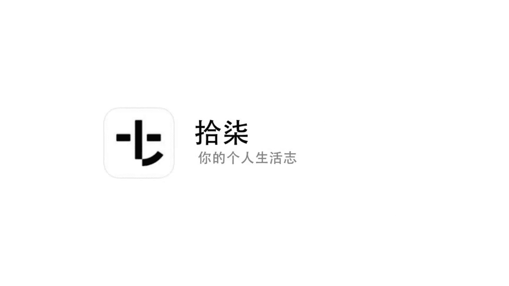
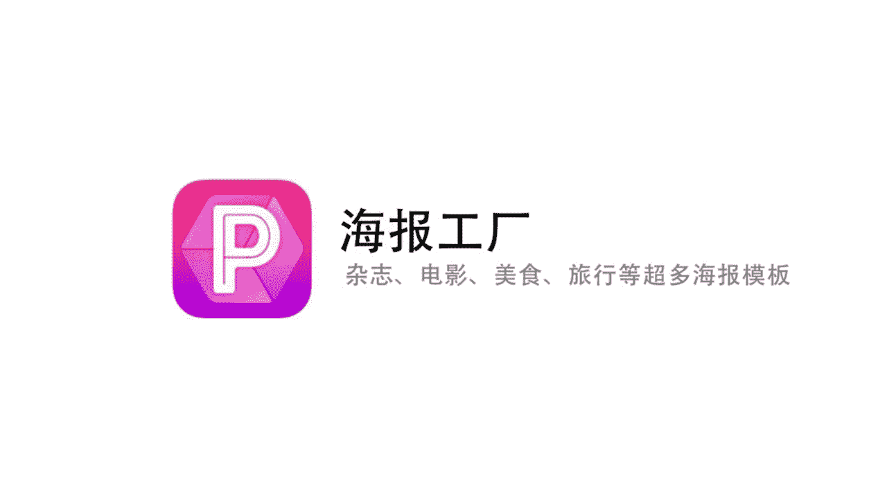
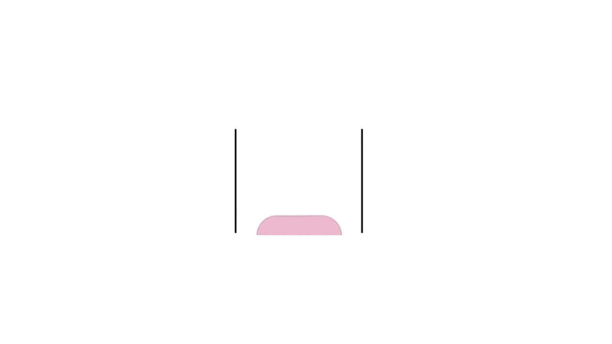
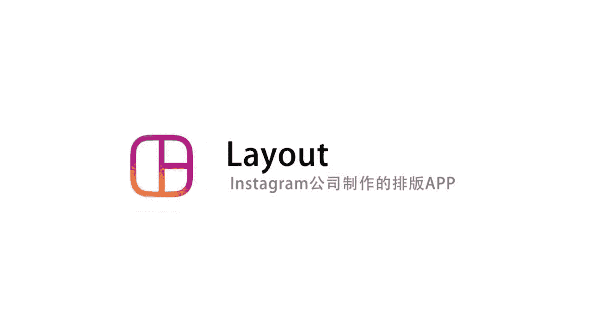
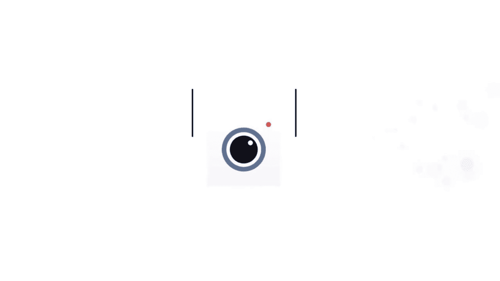

# 小北摄影课（完结）：第10期：拼图排版APP攻略

在本节课中，我们将学习如何使用手机APP进行图片排版，制作出精美的杂志效果、拼图和图文日记。我们将介绍多款功能各异的APP，帮助你轻松记录和分享生活点滴。

## 📚 制作个人电子书：17 APP

上一节我们介绍了课程目标，本节中我们来看看如何用“17”APP制作个人电子书。这款APP界面简洁，能帮助你将日常图文记录整理成精美的电子书册。

首先，我们进入APP。其主界面为黑白风格，底部有四个菜单。我们先查看样书示例，了解不同风格的书籍模板。

以下是查看示例的步骤：
1.  点击进入“我的旅行日记”示例，这是一本可自定义的电子书。
2.  书籍的标题、作者、封面图片均可自行修改。
3.  书籍会自动按时间顺序整理你的日记，生成完整的日志。

看过了示例，下面我们来亲手制作一本属于自己的书。

制作个人日记的步骤如下：
1.  点击主界面中央的“写下生活一键成册”按钮。
2.  输入日记标题和正文内容。
3.  点击插入图片按钮，从相册选择一张图片。
4.  编辑完成后，点击保存，日记即被保存。

我们已经学会了写单篇日记，那么如何将多篇日记合成一本书呢？

将日记整理成书的步骤如下：
1.  打开一篇已保存的日记，点击“修改”。
2.  选择“添加至书册”，并为这本书选择一个分类（如“生活杂记”）。
3.  点击保存并确认同步。
4.  进入右下角的“书架”，即可看到自动生成的对应分类的书籍。
5.  将其他日记也按此方法添加到同一书册，书籍内容会自动更新。

除了手动写日记，这款APP还有一个强大的功能：自动导入社交媒体内容。

以下是导入社交媒体内容的步骤：
1.  点击底部“制作”菜单。
2.  选择“微博书”、“微信书”等选项。
3.  登录对应社交账号后，APP会自动将你的历史内容整理成书。
4.  生成书籍的封面、标题、作者等信息均可自定义。

## 🔪 创意切图工具：九格切图 APP

学会了制作电子书，我们再来看看如何让单张图片在社交媒体上更具创意。接下来介绍的“九格切图”APP，能将一张图片分割成九宫格或其他形状。

打开APP后，其操作非常简单。

使用九格切图的基本步骤如下：
1.  点击“打开一张图片”，从相册选择照片。
2.  图片会自动被划分为九宫格。
3.  点击下方特效按钮（如“复古特效”），可为图片随机应用滤镜。
4.  多次点击特效按钮，可以更换不同的滤镜组合。

除了基础九宫格，你还可以改变切图的形状。

更改切图形状的步骤如下：
1.  点击左上角的“形状”图标。
2.  在弹出的菜单中选择喜欢的形状，如圆形、爱心或苹果形。
3.  图片会立即按照新形状进行切割。
4.  编辑满意后，点击保存。分享到朋友圈时，按1到9的顺序发布，即可呈现完整的切割效果。

## 🎬 一键生成海报：海报工厂 APP

如果你想制作更具设计感的图片，可以试试“海报工厂”APP。它提供了杂志封面、电影海报等多种模板，能一键生成精美海报。

其核心操作是选择模板并替换图片。

制作海报的步骤如下：
1.  点击“开始制作”，从相册选择一张或多张图片。
2.  系统会自动套用模板，你可以在底部的“清新”、“时尚”、“简约”等分类中切换不同风格。
3.  拖动图片可以调整其在海报中的位置和显示部分。
4.  单击某张图片，还可以为其单独添加滤镜，使整套图片风格统一。
5.  在“更多素材”中，可以下载海量的额外模板。
6.  编辑完成后，点击保存即可。

## ✍️ 记录每日意图：留白 APP

下面这款“留白”APP风格文艺，适合用来制作每日一张的图文卡片，记录内心独白。

我们先欣赏一下其他用户的作品，再开始制作。

制作留白图文的步骤如下：
1.  点击底部加号，选择一个简洁的文字排版模板。
2.  点击相机图标，从相册选择一张图片，并选择合适的比例。
3.  点击下一步，进入文字编辑页面。
4.  点击文本框，输入你想搭配的句子。
5.  编辑完成后，即可保存或分享。整个过程非常快捷，适合每日记录。

## 🧩 简单多样拼图：简拼 APP

“简拼”APP如其名，操作简单，模板丰富，能满足多种拼图需求。

APP首页提供了大量模板，分为不同类别。

以下是其主要功能分类：
*   **长图拼接**：适合制作化妆教程、穿搭分享等需要连续图文说明的内容。
*   **封面制作**：提供类似杂志封面的模板，适合突出单张人像或主题图片。
*   **名片制作**：可添加头像、个人简介、联系方式二维码，用于个人展示。
*   **明信片**：提供多种明信片版式，用于制作电子贺卡。

选择任意模板后，按提示添加图片，即可轻松完成拼图。

## 📐 海量模板库：Moldiv APP

如果你觉得之前的APP模板还不够多，那么“Moldiv”APP可能适合你。它拥有海量的拼图和杂志排版模板。

APP主要分为“拼图”和“杂志”两大功能区。

使用Moldiv的步骤如下：
1.  在“拼图”区，有海量基础模板可供选择。
2.  选择模板后，点击占位符即可插入自己的图片。
3.  在“杂志”区，则有更精美、复杂的版面设计模板，适合制作高质量排版。
4.  高级模板需要付费购买，但价格较为亲民。

## ⚪ 极简主义拼图：Layout APP

看过了太多复杂模板，我们来换换口味。由Instagram出品的“Layout”APP主打极简，几乎没有模板，专注于图片本身的排列组合。

它的操作极其简单直观。

使用Layout拼图的步骤如下：
1.  选择1到4张图片，上方会自动出现几种基础的布局方式（如并列、网格）。
2.  功能按钮极少：可替换图片、镜像翻转图片、为整组图片添加边框。
3.  它还有一个特色功能：支持对单张图片进行创意切割（如切成九宫格或特殊形状），再结合镜像功能，可以玩出有趣的效果。

## 🖼️ 精细化拼贴编辑：PicCollage APP

最后介绍的“PicCollage”APP功能全面，除了拼图，还支持对每张图片进行精细调整，并添加丰富的边框、背景和叠层特效。

我们从基础拼贴开始。

进行精细化拼贴编辑的步骤如下：
1.  进入APP后选择图片，点击“拼贴”功能，选择一个版式（如田字格）。
2.  **单图精细调整**：选中拼贴中的某张图片，可以单独调整其亮度、对比度、饱和度，或添加滤镜。
3.  **添加叠层特效**：使用“叠层”功能，可以为图片添加纹理、光影等特效，并且可以针对单张图片应用或取消。
4.  **添加边框与背景**：点击“边框”选项，可以为整个拼图添加各种颜色、纹理的边框，并能更换背景图案。
5.  此外，还可以添加文字、贴纸等元素。
6.  这款APP适合需要批量处理多张图片并进行统一风格化编辑的用户。

---

本节课中，我们一起学习了多款用于图片排版和拼图的手机APP。从制作个人电子书、创意切图，到一键生成海报、文艺留白，再到简单拼图和精细化编辑，这些工具能帮助你以更美观的方式记录和分享生活。希望你不止学会技巧，更能真正用它们留下生活的珍贵印记。