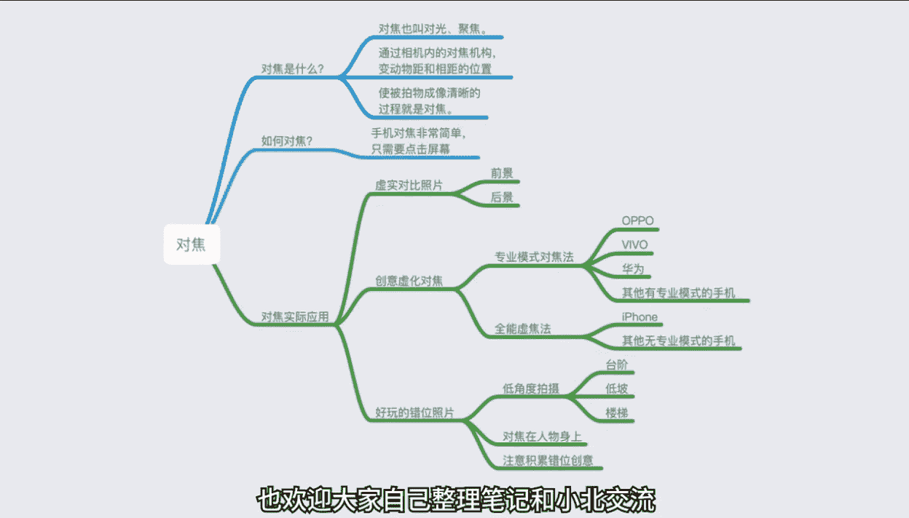
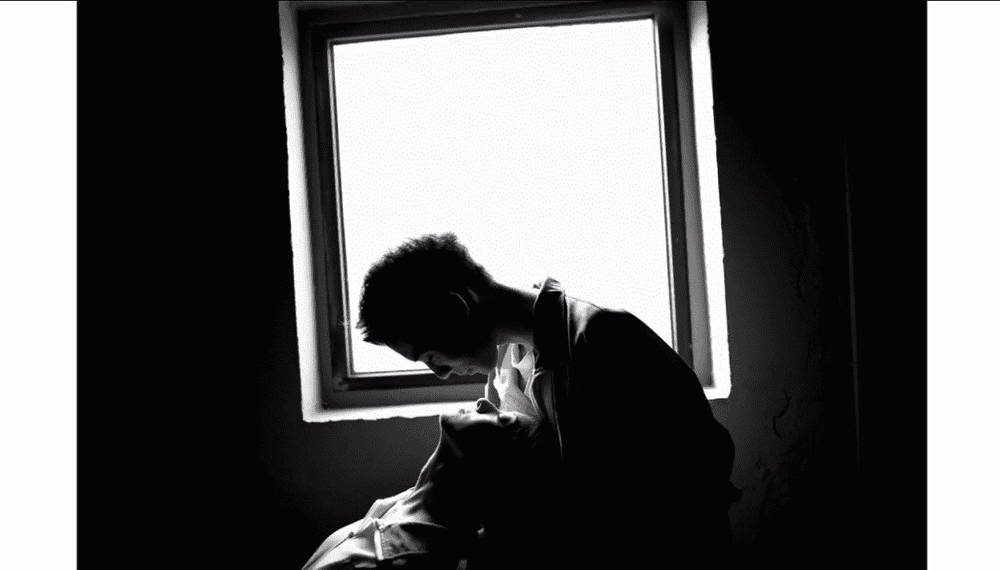

# 手机摄影入门：第1期：第一节：熟悉你的手机相机 📱

在本节课中，我们将从零开始，学习手机摄影最基础、最核心的操作。你将了解如何利用手机自带的相机功能，拍出清晰、有创意的好照片。课程将围绕对焦、光线控制、拍摄技巧和创意模式展开。

---

## 对焦：拍出清晰照片的第一步

上一节我们介绍了课程的整体框架，本节中我们来看看如何确保照片主体清晰，即对焦。

对焦，也称为对光聚焦，是通过调整相机内部结构，使被拍摄物体成像清晰的过程。我们通常希望拍摄的主体是清晰（实焦）的。

好消息是，几乎所有主流智能手机都支持触屏对焦。你只需点击屏幕，相机就会对点击的位置进行对焦，使其变得清晰。

以下是触屏对焦的操作步骤：

1.  打开手机相机应用。
2.  在取景画面中，用手指点击你想要清晰呈现的主体。
3.  点击后，该主体区域会变得清晰，而其他区域可能变模糊（虚焦）。
4.  确认对焦准确后，按下快门拍照。

利用这个功能，我们可以轻松拍出具有虚实对比效果的照片，突出主体。

---

## 虚焦：创造朦胧的艺术效果

明白了如何拍出清晰的照片后，我们来看看它的反面——如何故意拍出模糊的虚焦效果。有时，虚焦能营造出独特的氛围和艺术感。

例如，夜晚的灯光在虚焦下会变成斑斓的光斑，将杂乱场景转化为梦幻画面。

手机拍出虚焦效果主要有两种方法。

### 方法一：使用专业模式（适用于部分安卓手机）

如果你的手机相机有“专业模式”，可以按以下步骤操作：

1.  打开相机，切换到 **专业模式**。
2.  在参数选项中，找到 **焦距** 或 **MF（手动对焦）** 选项。
3.  你会看到一个横向滑杆，通常一端标有“近”，另一端标有“远”。
4.  滑动滑杆，画面会随之变清晰或模糊。将滑杆向“近”端滑动，对焦点变近，远处的景物就会虚化。

**核心操作**：在专业模式中，手动调整焦距滑杆，改变对焦点的远近，从而实现虚实变化。

### 方法二：锁定近处对焦（适用于所有手机，包括iPhone）

如果你的手机没有专业模式，可以尝试这个方法：

1.  打开相机，对准想要拍成虚化的远景（如灯光）。
2.  请一位朋友将手伸到镜头前很近的位置。
3.  点击屏幕，对手指进行对焦。
4.  **长按屏幕约1.5秒**，直到出现“对焦锁定”或类似提示。
5.  将手移开，此时对焦点仍锁定在近处，远处的景物就会变得模糊。

**关键点**：通过长按屏幕锁定对焦在近处物体上，移开近物后，相机依然认为对焦点在近处，从而导致远景虚化。

---

## 错位摄影：对焦的趣味玩法

掌握了基础对焦后，我们可以结合“近大远小”的透视原理，玩出有趣的错位照片。

拍摄错位照片时，请记住一个核心原则：**将对焦点放在后景的人物身上**，确保人物清晰，错位效果才更真实。

以下是几个错位创意示例：

*   **踢水瓶**：近处放一个水瓶，远处的人摆出踢球的姿势。
*   **举空气**：远处的人做出举起重物的动作，近处的人配合表现出被压到的样子。
*   **打恐龙**：近处放置恐龙玩具，远处的人摆出战斗姿势。

拍摄时，手机尽量保持低角度仰拍，能增强视觉冲击力。多积累创意，你也能拍出令人称奇的照片。

---

## 光线控制：决定照片的明暗基调

解决了清晰度问题后，我们来看看另一个决定照片成败的关键因素：光线。

手机可以自由控制画面亮度。操作很简单：点击屏幕对焦后，旁边会出现一个小太阳图标。向上拖动小太阳可以增加亮度（补光），向下拖动则降低亮度（减光）。

然而，我们应尽量避免在“大光比”环境下拍照。大光比是指画面中亮部（如天空）和暗部（如人物）的亮度差异极大。在这种环境下，无论以亮部还是暗部为准曝光，都会导致另一部分细节丢失（死白或死黑）。

如果不幸遇到大光比环境，可以尝试以下方法：

1.  **避开强光源**：调整构图，用树木、建筑等遮挡住过亮的天空。
2.  **使用物理滤镜**：在手机镜头前加一片墨镜片或ND滤镜，减少进光量。

---

## 光线的方向：顺光、逆光与侧光

了解如何控制光线强度后，我们进一步学习光线的方向如何影响照片效果。

*   **顺光**：光线从摄影师背后射向被摄体。画面明亮，细节清晰，但立体感较弱。
*   **逆光**：光线从被摄体背后射向镜头。可以拍出漂亮的轮廓光（发丝光）或剪影效果。
    *   **拍摄剪影技巧**：让被摄主体背对强光源（如日落时的太阳），对焦在亮部，人物就会变成黑色剪影。
*   **侧光**：光线从被摄体侧面射来。能产生强烈的明暗对比，突出物体的纹理和质感，被称为“质感之光”。

**需要避免的光线**：
*   **顶光**：正午阳光从头顶照射，会在眼窝、鼻子下形成难看的阴影。
*   **底光**：光线从下巴下方照上来，容易产生恐怖、阴森的效果。

记住，摄影是用光的艺术，调整光线方向是提升照片质感的一大步。

---

## 拍摄技巧与创意模式

掌握了对焦和用光，我们来看看如何“按下快门”，以及手机还有哪些创意功能。

### 快门的不同按法

*   **音量键快门**：自拍或特殊角度拍摄时，按音量键比按屏幕快门更方便。
*   **连拍模式**：长按快门键不放，可以连续拍摄多张照片，适合捕捉运动瞬间（如跳跃）。拍摄跳跃时，摄影师采用**低角度仰拍**，能让跳跃看起来更高。

### 慢动作与视频拍摄

*   **慢动作**：使用“慢动作”模式拍摄水流、跳跃等，可以将瞬间之美延长，展现不同寻常的视觉效果。
*   **视频拍摄推荐App——VUE**：这款App操作简单，提供多种电影级滤镜和画幅比例（如圆形、宽银幕），能轻松提升视频质感。拍摄时注意引导模特，并多尝试不同滤镜。

### 全景模式的创意用法

除了拍摄广阔风景，全景模式还能拍出“分身照”。
**操作方法**：开启全景模式，开始拍摄后，让小伙伴在镜头扫过之前跑到下一个位置摆好姿势，如此反复。注意，小伙伴要从摄影师**身后**绕过去，不能直接从画面中横穿，否则会出现“残影”。

### 制造朦胧效果

想拍出柔光朦胧感？很简单：找一块透明的塑料纸（如烟盒外的包装膜），轻轻覆盖或放在手机镜头前，画面立刻变得柔和梦幻，适用于拍照和录像。

---

## 本章总结与课后导图

本节课中，我们一起学习了手机摄影的四大基础模块：
1.  **对焦**：通过点击屏幕拍出清晰主体，或利用手动对焦/锁定对焦创造虚化效果。
2.  **光线控制**：使用曝光补偿滑杆调整明暗，并理解顺光、逆光、侧光的不同效果，避免顶光、底光和大光比环境。
3.  **拍摄技巧**：活用音量键快门、连拍、低角度仰拍，以及慢动作模式。
4.  **创意功能**：探索了全景分身照、利用VUE拍摄视频，以及制造朦胧感等趣味玩法。

请记住，所有复杂的照片都源于这些基础功能的灵活运用。多加练习，你就能越来越熟悉手中的创作工具。

以下是本节重点知识的思维导图，供你复习巩固：

（此处应为思维导图图片，内容涵盖：对焦【自动/手动、虚焦玩法、错位摄影】、光线【控制、方向（顺/逆/侧）、避免项】、拍摄【快门技巧、慢动作、视频App】、创意【全景分身、朦胧效果】）

---

**下节预告**：在下一节课中，我们将进入后期处理环节，针对不同类型的手机修图APP进行学习。我们将了解常用的修图软件，并通过实例演示，教你如何从零开始修出一张好看的照片。