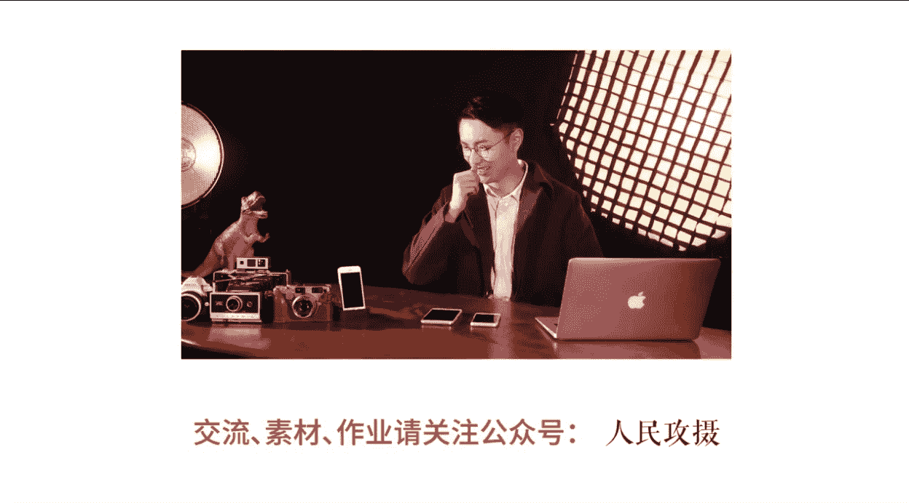

# 19小北摄影课（完结）：第2期：第二节：手机修图APP入门与VSCO调色实战 🎨

在本节课中，我们将要学习手机修图的基础知识，了解不同类型的修图APP，并重点掌握使用VSCO进行照片调色的完整流程。课程内容简单直白，适合初学者快速上手。

## 概述：走进手机修图的世界

大家好，我是小北。两年前，我沉迷于Photoshop、Lightroom等电脑专业修图软件，每天讨论图层、蒙版、通道等技术。直到一次拍照后，朋友小天用手机快速修出好看的照片并抢先分享，这让我意识到手机修图的便捷与强大。从此，我决定苦练手机修图。在本系列课程中，我们将针对不同类型的手机修图APP进行学习。本节课，我们先了解常用的手机修图APP有哪些，并通过实例演示如何从零开始修出一张好看的照片。

## 手机修图APP分类安利

以下是常用的手机修图软件，我将它们分为五大类，每类介绍其核心用途。

### 第一类：滤镜调色类
这类APP主要用于调整照片的色彩、色调和风格。通过简单操作即可获得多样效果。
*   **VSCO**：风靡全球的胶片风调色软件。
*   **Snapseed**：谷歌旗下的强力修图工具。
*   **MIX滤镜大师**：功能丰富的国产滤镜APP。

### 第二类：美颜自拍类
这类APP主要针对人像进行美化处理。
*   **Facetune**：售价25元，功能强大的专业人像修图软件。
*   **B612**：风格清新的日本自拍软件。
*   **美图秀秀/美妆相机**：国产美颜修图界的代表软件，功能全面。

### 第三类：贴纸标注类
这类APP可以为照片添加文字、贴纸和相框等装饰元素。
*   **黄油相机**：模板丰富，字体和贴图选择多样。
*   **Emoji相机**：可以使用超大Emoji遮挡面部。
*   **VOUN**：可以为照片添加艺术感相框。
*   **in**：贴纸库庞大，风格涵盖文艺与搞笑。

### 第四类：特殊效果类
这类APP能实现各种创意视觉效果。
*   **Fused**：轻松制作双重曝光效果。
*   **Prisma**：能将照片转换为名画艺术风格。
*   **PicsArt**：功能近乎全能的创意修图APP。

### 第五类：拼图排版类
这类APP专注于多图拼接和版式设计。
*   **简拼/Jane**：拥有海量拼图模板和杂志版式。
*   **留白/简拼**：同样优秀的国产拼图APP，对中文排版友好。

对于日常修图，无需安装所有APP。每个类别保留3到5款最好用的即可。接下来的课程，我将从每个分类中挑选最值得使用的APP进行详细演示。

## VSCO滤镜调色实战

在众多滤镜调色APP中，**VSCO**是我重点推荐的一款。它集相机、相册管理和多种仿胶片滤镜于一身。衡量一款滤镜APP的关键在于：滤镜数量是否丰富、滤镜质量是否够高、以及留给用户自主调整的操作空间是否足够。

### VSCO基础操作与相册管理

首先打开VSCO，主界面是相册面板。首次使用时，点击右上角 **`+`** 号可导入图片，支持批量选择。

**小技巧**：导入VSCO相册的图片独立于系统相册，可节省手机空间。VSCO的相册管理功能也能提升选图效率：
*   **双击**查看图片，**滑动**浏览。
*   **双指**可缩放图片。
*   **长按**图片可快速预览大图，松手返回。

利用**长按预览**功能，可以高效地进行图片批量筛选：长按预览，点击选中喜欢的图片，继续预览其他图片并点选，最后点击右下角 **`...`** 图标，即可**批量导出**到手机相册或**批量删除**不喜欢的图片。

### 调色面板与基础功能

双击进入一张图片，点击底部第二个按钮进入调整面板。

**底部菜单栏操作**：
*   点击或上滑屏幕底部小三角，可调出/隐藏底部菜单。
*   第二个按钮（**`⋮`**）：进入**参数调整面板**，可细调亮度、对比度、裁剪、色调等。
*   第三个按钮（**`↶`**）：**撤销**上一步操作。
*   第四个按钮（**`⏱`** 或 **`↶↶`**）：查看**操作历史**或**全部撤销**（安卓版直接是全部撤销）。

**隐藏技巧**：
*   **对比查看**：**长按**图片任意位置，可对比修改前与修改后的效果。
*   **获取免费滤镜**：进入VSCO商店，可以下载几个免费的滤镜包，例如 **`HB`** 系列滤镜就很好用。

### 案例一：调出日系小清新风格

在开始调色前，我们先分析日系小清新风格的特点：
1.  **画面明亮**。
2.  **整体反差小，画面柔和**。
3.  **色彩清淡，饱和度低**。

我推荐的修图工作流程是：**原始调整 → 添加滤镜 → 最终调整**。这样可以避免因原图基础不佳而导致套用任何滤镜都不好看的问题。

**第一步：原始调整**
我们根据上述三个特点，对原图进行针对性基础调整。
*   **提高画面亮度**：增加 **`曝光`**。使用 **`阴影补偿`** 提亮画面暗部。
*   **降低反差，使画面柔和**：降低 **`对比度`**。增加 **`高光减淡`** 以压暗过亮的高光区域。
*   **使色彩清淡**：适当降低 **`饱和度`**。增加 **`褪色`** 功能值，为画面蒙上一层灰色，降低鲜艳度。
*   **增强细节**：微调增加 **`清晰度`** 和 **`锐化`**，使画面不过于模糊。**注意**：人像照片不宜过多增加清晰度，以免突出皮肤瑕疵。

**第二步：添加滤镜**
完成原始调整后，再进入滤镜面板选择喜欢的滤镜。此时你会发现，可用的滤镜选择变多了，效果也更好。

**第三步：最终调整**
添加滤镜后，照片可能有些变化，需要做最终微调。
*   可再次微调 **`曝光`**、**`对比度`** 等参数。
*   调整 **`色温`**，控制画面冷暖倾向。
*   添加 **`暗角`**，突出画面中心。
*   尝试 **`阴影色调`** 和 **`高光色调`**，为暗部或亮部增添色彩倾向。

**实用技巧：批量应用色调**
修好一张图片后，点击右下角 **`...`**，选择 **`复制编辑`**。然后选中其他需要应用同样色调的图片，再次点击 **`...`** 选择 **`粘贴编辑`** 即可。这能快速统一多张照片的风格。

### 案例二：调出暗调城市风格

暗调城市风格的特点是：画面偏暗、反差较大、色彩厚重但不鲜艳。
1.  **原始调整**：降低 **`曝光`**；增加 **`对比度`** 解决发灰问题；微增 **`褪色`** 避免暗部死黑；增加 **`清晰度`** 与 **`锐化`**；降低 **`饱和度`**。
2.  **添加滤镜**：尝试 **`F2`**、**`HB1`**、**`HB2`** 等适合暗调风格的滤镜。
3.  **最终调整**：根据感觉再次微调曝光、对比度、褪色，并添加暗角强化氛围。

## 其他优秀APP推荐：MIX滤镜大师

除了VSCO，**MIX滤镜大师**也是一款优秀的调色软件，苹果和安卓平台均可使用。
其界面底部有三个主要菜单：
1.  **裁剪**：可进行旋转、更改比例、透视校正等操作。
2.  **滤镜**：滤镜按类别（如反转胶片、电影色、人像）命名，更直观。
3.  **编辑**：包含详细的参数调整工具（效果、纹理、曲线、色调分离等）。其 **`纹理`** 工具中的天气效果（如雨、雪）和 **`效果`** 工具中的炫光、漏光等功能颇具趣味性。

## 总结

本节课中我们一起学习了手机修图的基础知识。首先，我们了解了五大类常用手机修图APP及其特点。接着，我们深入学习了VSCO的操作方法，并按照 **`原始调整 → 添加滤镜 → 最终调整`** 的流程，实战演练了调出“日系小清新”和“暗调城市风”两种风格的照片。最后，我还为大家推荐了另一款功能强大的修图软件MIX滤镜大师。希望大家多多练习，掌握手机修图的技巧。

**课后作业**：尝试使用VSCO或MIX，为你的一张照片进行调色练习。如果需要课程中的图片素材，可以关注相关资源获取方式。