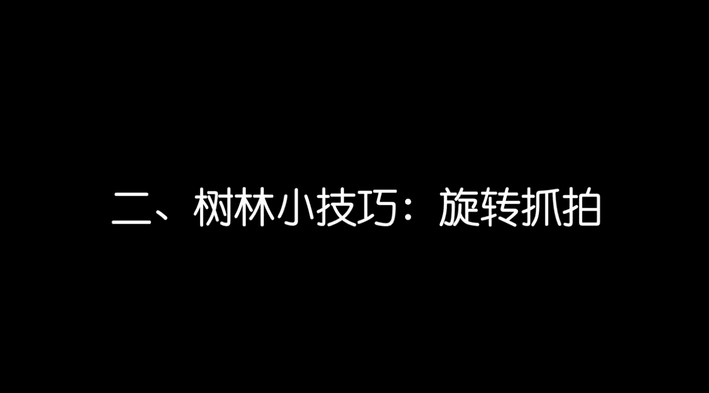
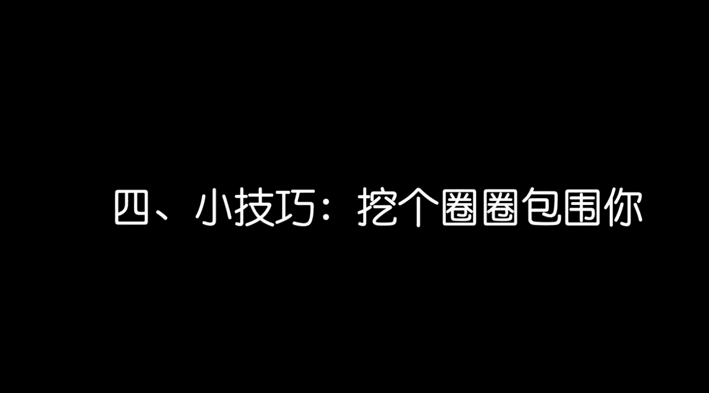

# 小北摄影课（完结）：第3期：第三节：在普通场景中拍出好照片 📸

在本节课中，我们将学习如何利用身边普通的环境和道具，结合实用的摄影技巧，为照片增添色彩与故事感。我们将从观察环境、巧妙构图、引导互动等多个方面入手，帮助你即使在平凡的日常场景中，也能拍出令人印象深刻的作品。

---

上一节我们学习了手机摄影的基础操作，本节中我们来看看如何将基础技巧应用于实际拍摄。

## 利用环境辅助构图 🏗️

许多同学认为，没有华丽的场景就拍不出好照片。其实，只要善于观察和利用，普通场景也能成为绝佳的拍摄背景。关键在于发现环境的特点并加以运用。

### 发现线条，分割画面

环境中存在许多线条元素，如栏杆、电线、斑马线等。这些线条可以有效地分割画面，引导视线，从而简化构图并突出主体。

以下是利用线条构图的几种方法：

*   **借助栏杆的延伸性**：不要从正面平拍栏杆。可以尝试从栏杆的一端，采用低角度斜向拍摄。延伸出去的栏杆能自然地将画面分割，形成视觉引导线。
*   **利用电线的对角线**：头顶的电线是典型的直线元素。找到合适的位置，让一条电线以对角线形式贯穿画面，可以简洁有力地突出停在电线上的小鸟等主体。
*   **俯拍斑马线的韵律**：站在高处俯拍人行横道，一道道直线会构成富有节奏感和形式美的分割，让普通的街道场景变得与众不同。

### 变换视角，打破常规

改变拍摄角度是打破平庸构图最直接的方法。楼梯等场景提供了天然的视角变化条件。

*   **利用楼梯的高低差**：除了正面平拍，可以走到楼梯高处向下俯拍。这种俯拍视角能带来新鲜的视觉感受，结合栏杆等线条进行对角线分割，能立刻让照片跳出常规。

### 营造前景，增加层次

在拍摄时，有意识地在镜头与主体之间加入一些元素作为前景，可以增强画面的空间感和层次感。

以下是前景遮挡的应用技巧：

*   **靠近前景元素**：将手机靠近栏杆、树叶或门框，让它们虚化成为画面前景。这不仅能辅助构图，还能让观众的视线更集中地落在清晰的主体人物身上。
*   **划分画面空间**：利用楼梯拐角或两扇门形成的“V”字形或框架作为前景，可以将主体人物限定在一个特定的视觉空间内，使其更加突出。

---

上一节我们介绍了如何利用环境来辅助构图，本节中我们来看看如何引导模特与环境互动，拍出更自然生动的照片。

## 引导模特与环境互动 🎭

在拍摄人像时，让模特与环境产生互动，能有效消除他们的紧张感和摆拍痕迹，使照片更具生活气息和故事感。

### 利用常见场景互动

我们身边有许多可以互动的小场景，关键在于发现它们的趣味性。

*   **玻璃窗的趣味互动**：引导模特将鼻子轻轻靠在玻璃窗上，从正面平拍，就能拍出有趣的“猪鼻子”效果。这个小游戏能迅速让模特放松下来。
*   **营造文艺氛围**：在咖啡厅等场景，可以引导模特进行“一杯咖啡一本书”的经典动作，如端起咖啡眺望窗外，或侧拍认真看书的瞬间。让模特坐在窗边，借助玻璃的光影，能增加照片的文艺感。
*   **捕捉居家慵懒瞬间**：居家场景适合表现放松的情绪。可以拍摄模特早晨伸懒腰、端起牛奶看书等自然的生活片段。利用窗帘制造朦胧前景，能强化这种慵懒、私密的情绪氛围。

> **拍摄提示**：当从较暗的室内拍摄窗外亮处的模特时，记得点击屏幕对焦在人物脸部，然后向上滑动曝光滑竿，提升画面亮度，避免人物脸部过暗。

### 融入场景，记录真实

最高级的情绪表达，往往来自于最真实的记录。摄影师可以尝试两种角色：

1.  **引导者角色**：帮助模特完全融入场景，甚至使用简单的道具（如相框）来构建情景，让模特相信自己就是故事的主角。
2.  **旁观者角色**：不做过多的干预，让模特在环境中自由活动，摄影师则在一旁安静地捕捉他们最自然的状态和真实的情绪流露。

> 本节推荐两位擅长记录日常生活的日本摄影师：**滨田英明** 和 **森友治**。他们的作品充满了对平凡家庭生活细节的深情凝视，展现了日常中的美好与幸福，非常值得学习。

### 通过互动缓解紧张

如果模特感到拘束，摄影师可以主动创造互动来打破僵局。

*   **假装互拍**：站在玻璃窗外，引导模特与你进行“互拍”，这能转移ta对镜头的注意力。
*   **设置小任务**：让模特尝试在玻璃上哈气并画一颗心，在其专注完成的过程中进行抓拍。
*   **模仿与游戏**：在抓娃娃等游戏场景，让模特模仿娃娃的可爱动作，在玩耍中忘记紧张。

---

我们前面学习了如何借助环境构图以及如何引导互动。那么，最重要的是培养一双善于观察生活的眼睛。

## 观察并利用光影与反射 ✨

生活中充满了光影和反射的美，只要用心观察，它们就能成为你照片中的点睛之笔。

### 捕捉光影之美

光线是摄影的灵魂，即使是普通的建筑物，在特定光线下也能产生迷人的效果。

*   **利用建筑阴影**：在日落时分，注意观察房檐、栏杆等结构投下的长长阴影。将这些光影线条纳入构图，能极大提升照片的质感和格调。

### 发现倒影之趣

光滑的表面能映出有趣的倒影，为照片增加对称美和趣味性。

*   **墙面倒影**：有些光滑的墙面能映出清晰的人物倒影。将手机紧贴墙面拍摄，可以获得中心对称的创意照片。
*   **水面倒影**：寻找平静的湖面或雨后的积水，可以轻松捕获清晰的人物或景物倒影。

### 巧用日常道具补光

无需专业设备，日常物品也能成为你的摄影帮手。

*   **白纸反光板**：一张白纸就能起到反射光线的作用。在户外拍摄人像时，用白纸为人物面部补光，效果立竿见影。
*   **书本反光**：在阳光下看书时，光滑的书页会自然地向面部反光。通过翻动书页，可以观察到人物脸部光线的明暗变化，这是一个简单有效的补光方法。

> **核心原理**：`补光效果 = 光源强度 × 反射物反光率`。书页越白、纸质越光滑，反光效果越好。

书本本身也是一个很好的互动道具，可以让模特顶在头上、抱在怀里或做出各种可爱的动作。

---

## 更多创意拍摄技巧 💡

除了以上方法，还有一些简单的小技巧能让你的照片脱颖而出。

*   **制造虚化效果**：如果觉得手机虚化效果不够，可以尝试在镜头前加一副普通的近视眼镜镜片，这能模拟出类似大光圈镜头的浅景深虚化效果。
*   **利用手机闪光灯**：在夜晚或非常暗的环境下，从侧面用手机闪光灯照射人物面部，然后将照片处理成黑白，可以拍出质感强烈、风格冷酷的肖像照。

---

## 总结与练习 📝

本节课我们一起学习了如何在普通场景中拍出好照片。核心要点包括：
1.  **观察并利用环境**：发现线条、变换视角、营造前景来辅助构图。
2.  **引导互动记录真实**：让模特与环境互动，捕捉自然生动的瞬间。
3.  **善用光影与反射**：捕捉光影线条，利用倒影和日常物品为照片增色。

学习构图最好的方法就是持续练习。建议大家每周为自己设定一个主题小目标（例如“对角线构图”、“发现阴影之美”），进行针对性拍摄，必定会有所收获。

最后，希望你能通过摄影这门艺术，更认真地生活，用心发现平凡中的美好，记录下生命中每一个独一无二的精彩瞬间。