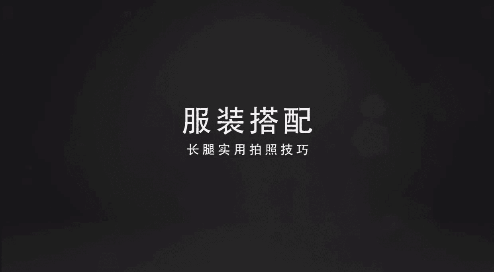
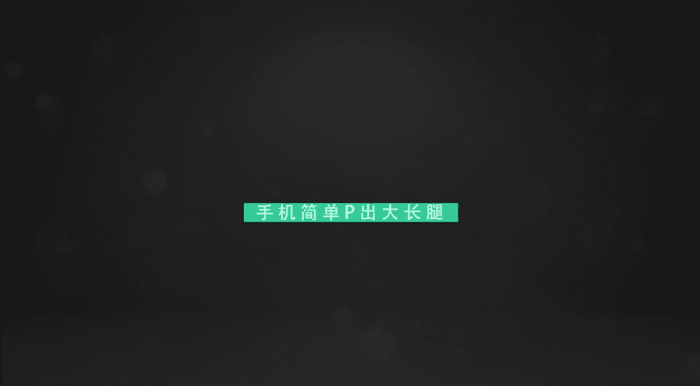

# 小北摄影课（完结）：第5期：学会这几招，分分钟拍出大长腿

在本节课中，我们将学习如何通过服装搭配、前期拍摄技巧与后期修图，轻松拍出显高显瘦的“大长腿”效果。课程分为两个主要部分：前期准备与拍摄技巧，以及后期修饰方法。

上一节我们介绍了从普通场景中发现美，本节中我们来看看如何针对“大长腿”这个特定主题进行拍摄。

## 第一部分：服装搭配与前期准备



想要拍出大长腿，仅懂拍照技巧是不够的。合适的服装搭配能优化身材比例，为拍摄打下良好基础。

### 核心原则：提高腰线

影响身材比例视觉观感的关键因素是腰线位置。腰线越高，视觉上腿部占比就越大。

**核心公式**：`视觉腿长 ≈ 腰线以下部分`

我们通过一个案例来理解。下图展示了同一人物因服装搭配不同而产生的巨大差异：


左图中，腰线位置低，形成上下等长的“五五分”比例，即使摆造型也显腿短。右图中，通过穿着高腰裤提高腰线，视觉上腿部占比达到三分之二，身材显得修长苗条。

因此，选择高腰款式的下装是优化比例的第一步。


### 服装搭配的具体技巧

以下是基于“提高腰线”原则的具体穿搭建议：

1.  **鞋子的选择**：个子不高的同学选择高跟鞋时，应尽量选择能露出脚背的款式。露出的脚背在视觉上可成为腿部的延伸，从而拉长腿部线条。
2.  **长款外套的穿法**：穿着大衣或长款外套时，应避免单纯拍摄背影，因为背面无法体现腰线。正确的做法是敞开外套，通过内搭（如高腰裤+短上衣）明确标出高腰线位置，再拍摄正面或侧面。


如上图所示，敞开大衣露出内搭的高腰线，就能将外套的修长感与优秀的身材比例结合。

## 第二部分：拍摄角度与姿势技巧

掌握了服装搭配，我们进入具体的拍摄环节。错误的拍摄角度会毁掉所有搭配努力。

### 避免俯拍：从低角度仰拍


最常见的错误是拍摄者站立，以高角度俯拍被摄者。这会导致镜头透视变形，拉长上身、缩短腿部。

**错误示范代码**：
```python
# 错误：高角度俯拍
camera.position = ‘high’
camera.angle = ‘look_down’
result = ‘short_legs’
```

正确的做法是降低机位，从低角度向上仰拍。这能拉伸和强调腿部线条。

**正确示范代码**：
```python
# 正确：低角度仰拍
camera.position = ‘low’  # 在被摄者腰部以下
camera.angle = ‘look_up’
result = ‘long_legs’
```

拍摄者可以蹲下，甚至必要时坐下，将手机置于较低位置。但需注意，仰拍角度不宜过大，距离被摄者不宜过近，否则会导致腿部畸形变粗。

### 实用拍摄技巧：反向持机

一个屡试不爽的小技巧是：将手机倒置（镜头朝下）进行拍摄。这样可以在不改变拍摄者姿势（如蹲得更低）的情况下，进一步降低镜头的实际高度，从而获得更显著的拉腿效果。操作时，手机屏幕画面依然是正向的，只是快门按钮位置变了。

### 利用环境：楼梯是天然帮手

如果觉得蹲拍麻烦，可以利用楼梯制造高度差。让被摄者站在台阶上，拍摄者在下方平地拍摄，自然形成仰拍角度。被摄者可以向前或向下伸腿，使腿型更修长。

### 摆姿核心：伸腿与绷直

摆姿对于突出腿长至关重要。以下是几个有效姿势：

以下是几个关键姿势要点：

*   **向前伸腿**：一条腿向前伸直，脚尖用力绷直点地，使腿形成一条直线。
*   **交叉腿**：双腿交叉站立，视觉上显得又细又长。
*   **走路抓拍**：大步向前走时抓拍，注意后腿要用力绷直，上身挺直。
*   **坐姿技巧**：坐下时只坐椅子边缘，腿部全力向前或向画面角落伸展。避免大腿完全贴合座椅，以免压出赘肉。在楼梯上坐姿拍摄时，腿要向下伸。
*   **倚靠垫脚**：倚靠墙壁时，可偷偷垫起脚尖，这能无形中增加腿长。





## 第三部分：后期修图塑形


前期拍摄完成后，可以通过手机APP进行精细调整，使腿型更完美。

### 拉长腿部

使用美图秀秀等软件的“增高”或“拉腿”功能。
1.  用选区框住需要拉长的腿部区域。
2.  滑动拉杆，向右滑动拉长。建议分多次、分区域（如大腿、小腿分开）微调，避免失真。
3.  如果全身比例仍需调整，可以单独框选上身，进行缩短微调，使比例更协调。

### 修饰腿型

仅拉长不够，还需塑形。使用“瘦脸瘦身”功能：
1.  放大图片，针对腿部曲线不理想的地方（如小腿外翻、大腿轮廓）进行推动修饰。
2.  关键点：每次推动幅度要小，通过多次细微操作叠加出自然效果。
3.  结合“拉腿”功能，最终实现既长又直的完美腿型。


---


本节课中我们一起学习了拍出“大长腿”的完整流程：从**提高腰线**的服装搭配原则，到**低角度仰拍**和**巧妙摆姿**的拍摄技巧，最后辅以**后期拉腿塑形**的精细调整。记住核心在于优化视觉比例，并通过实践找到最适合自己的方法。欢迎大家持续练习与探索。