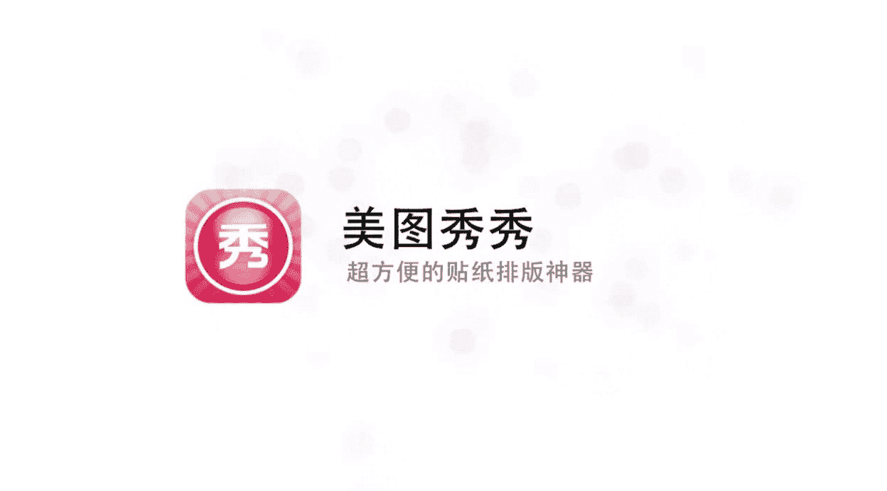

# 手机P图课：第3期：贴纸标注类APP全攻略 🎨

在本节课中，我们将学习如何使用几款主流的贴纸标注类手机APP，为照片添加文字、图形和创意模板，从而快速提升图片的视觉效果和趣味性。我们将详细介绍黄油相机、足迹、风塔、In和美图秀秀这五款软件的核心功能与操作步骤。

---

## 黄油相机：基础操作与模板套用 📱

黄油相机是一款功能全面的图文编辑应用，用户可以为图片添加时间、地点、心情文字，并能一键套用其他用户分享的精美模板。

首先，我们点开黄油相机应用。应用首页会展示许多用户上传并排版好的图片。这些图片都经过了版式设计和文字添加。例如，一张原本是方形的图片，通过黄油相机的加工可以变成圆形并配上文字。所有用户上传的版式，我们都可以一键套用。但在学习套用模板前，我们先来熟悉一下黄油相机的基本操作。

点击屏幕中间的小图标，从相册中选择一张图片。例如，我们选择一张春天的图片。

以下是图片编辑的第一步——裁剪与画布调整。屏幕下方有五个小图标，分别对应**白边**、**画布比**、**旋转**、**翻转**和**背景色**功能。

*   **白边**：为图片添加一个白色边框。点击即可添加或取消。
*   **画布比**：调整画布的形状和比例。例如，选择**1:1**会得到方形画布，适合文艺风格；选择**16:9**会得到更宽的画布，适合处理电影风格的图片。
*   **旋转**：旋转图片角度。
*   **翻转**：对图片进行水平或垂直镜像对称。
*   **背景色**：更改边框的颜色。默认是白色，你可以更改为黑色、红色等。部分高级颜色（如抹茶绿、樱花粉）可能需要付费解锁。

完成初步调整后，点击勾号进入下一步。

接下来是滤镜和色调调整步骤。这里的功能类似于VSCO等调色软件。

*   **滤镜**：根据喜好选择滤镜，并可以滑动调整滤镜的强度。
*   **调整**：进入更详细的手动调色面板。常用功能包括：
    *   **曝光**：调整图片整体明暗。
    *   **锐化**：提高图片细节的清晰度。向右拖动滑块，图片会变得更清晰。
    *   **暗角**：将图片四角压暗，营造LOMO相机风格的效果。

如果你习惯用一个软件完成所有操作，可以使用黄油相机的调色功能。否则，也可以将调色和排版步骤分开，在其他软件中完成。

上一节我们介绍了图片的基础调整，本节中我们来看看如何添加文字和图形元素。

点击屏幕下方的 **“元素”** 选项卡。第一个选项是**艺术字和文字贴纸**。点击任意一个，它就会被添加到图片上。你可以通过右下角的手柄对其进行**放大**、**缩小**和**旋转**。

第二个选项是**添加自定义文字**。点击后，会出现“双击修改”的提示。双击并输入文字，例如“你好”。输入的文字可以随意拖动位置。屏幕下方提供了丰富的编辑选项：

*   **字体**：点击“字”图标，可以更换各种字体。
*   **颜色**：点击画板图标，可以更改文字颜色，并调整颜色的**透明度**。
*   **阴影与描边**：可以为文字添加阴影或描边效果。
*   **背景**：为文字区域添加一个底色块。
*   **排版**：点击“T”图标，可以切换文字的**横向**或**纵向**排列，以及**左对齐**、**居中对齐**、**右对齐**。
*   **间距**：调整**字间距**和**行间距**。
*   **新增文本框**：点击“+”号，可以添加新的文字输入框。

第三个选项是**添加图形**。点击进入后，有大量基础图形可供选择。例如，选择一个**实心圆形**，将其拖到图片上并放大，可以给照片添加一个圆形框选效果，改变图片的视觉形状。你还可以添加线条、箭头等各种图形。

最后，我们来看看最强大的 **“模板”** 功能。这里汇集了海量用户设计的模板，可以一键套用。

点击一个模板，它会自动应用到你的图片上，并添加预设的文字和图形。所有元素都可以**再次编辑**。例如，点击模板上的文字，可以修改内容、字体和颜色。如果对当前模板不满意，可以点击“模板”重新选择。你还可以在“更多”分类下（如“每周热门”、“春天”），寻找与图片风格更匹配的模板。

此外，在黄油相机的首页浏览时，如果看到喜欢的用户作品，可以点击图片右下角的 **“Ding”** 按钮。点击后，该作品的模板会自动载入，你只需要从相册替换成自己的图片即可。

如果觉得内置的字体、图形或颜色不够用，可以进入 **“商店”** 购买更多资源，价格通常比较便宜。

---

## 足迹：电影感模板与视频特效 🎬

足迹是一款擅长制作电影风格图片和视频的APP。它内置了大量创意模板，甚至能将图片一秒变成《时代周刊》封面。

打开足迹APP，界面与黄油相机类似。点击中间按钮，从相册添加一张图片。

添加图片后，下方有多个功能选项卡。第一个是 **“主题模板”**。

以下是足迹提供的丰富模板类型：
*   **电影风格**：如“电影8月”，能营造电影截图感。
*   **创意恶搞**：如“通缉令”模板。
*   **文艺风格**：如“节气”相关模板。
*   **杂志封面**：如“时代周刊”模板，能将你的图片变成杂志封面。
*   **热门电影**：如“月光男孩”、“爱乐之城”等电影同名风格模板。

第二个选项卡是 **“滤镜”**，可以为照片添加额外的色彩滤镜。

第三个选项卡是 **“贴纸”**。足迹的贴纸库包含许多具有电影感、文艺风的飘逸文字，以及一些搞笑、可爱的图案（如猫耳朵），适合自拍。

第四个选项卡 **“字幕”** 是懒人必备功能。如果你不知道配什么文字，可以在这里直接选择系统提供的电影台词或经典句子。点击即可添加，并且可以拖动调整位置。双击已添加的文字，还可以从更多台词库中替换。

除了图片，足迹还能为**视频**添加炫酷的文字特效。

在首页选择“视频”，导入几段视频片段，点击下一步。足迹会自动为你的视频套用各种动态模板。加载完成后，你可以看到诸如**KTV歌词风格**、**新闻联播风格**、**游戏界面风格**等脑洞大开的特效。在KTV模板中，你甚至可以修改歌名、歌手和每一句歌词。

足迹还有一个 **“广场”** 功能，在这里你可以浏览其他用户的作品，获取拍照灵感和创意想法，分类包括脑洞、旅拍、美食等。

---

## 风塔：极简主义与3D文字特效 ✨

风塔是一款设计感极强的文字添加APP，操作简单却能轻松制造高级感。

打开风塔，默认会载入一张示例图片并覆盖一段文字。你可以双击文字进行修改。

第一个图标用于**更改字体**。风塔内置了大量优质的英文字体，任选其一都能提升质感。

第二个图标用于**更改文字颜色**。通常，使用黑、白、灰等中性色更能保持高级感。选择颜色后，下方的横杆可以调整**不透明度**。风塔的不透明度调整是智能的：滑动时，文字与图片中明暗反差大的区域（如人物轮廓）会产生交互，文字在这些区域会变透明，仿佛被人物“挡住”。

第三个图标代表 **“3D文字”** 功能。拖动滑块，文字会产生立体倾斜的视觉效果。你还可以拖动屏幕上的弧形控制器，让文字沿曲线排列。右侧的图标可以调整**字间距**、**行间距**和**对齐方式**。

在编辑栏中，点击 **“T”** 是文字模式，点击 **“A1”** 可以插入简单的图形（如五角星），点击 **“A2”** 可以插入立体的几何图形。

最后一个 **“FR”** 选项用于添加边框。

底部的附加功能包括：
*   **模糊**：向右拖动水滴图标，可以为背景添加模糊效果，突出主体。
*   **颜色遮罩**：通过调整RGB（红、绿、蓝）三个颜色通道的滑块，可以为整个画面覆盖一层有色的透明遮罩，从而改变图片的整体色调和氛围。

使用风塔通常只需简单调整几下，比如增加一些模糊或应用一个3D文字效果，就能让图片立刻显得与众不同。

---

## In：海量贴纸与趣味玩法 🌈

In是一款深受欢迎的贴纸类APP，拥有数量庞大、分类细致的贴纸库。

打开一张图片，点击下方的 **“玩字”** 选项，这里提供了一些文字模板，用法与前面介绍的软件类似。

如果打开一张**人像图片**，点击左下角的魔法棒图标，APP会**自动推荐并套用**适合人像的滤镜和贴纸组合，点击“立即使用”即可快速完成装饰。

当然，你也可以手动点击 **“贴纸”** 选项。

以下是In贴纸库的主要分类：
*   In拥有浩瀚如海的贴纸库，分类极其细致，涵盖表情、装饰、文字、节日等方方面面。
*   每个主分类下又有众多子分类，能满足各种场景和风格的需求。

In还有两个特色功能：
1.  **世界名画贴纸**：在贴纸分类中找到“世界名画”，可以选择如梵高的《星空》等名画图案，将其叠加到你的照片上，营造艺术融合效果。
2.  **动态贴纸**：部分贴纸带有简单的动画效果，让图片更生动。

---

## 美图秀秀：简单粗暴的效果之王 💖

美图秀秀以其操作简单、效果直接而闻名，拥有强大的贴纸和特效功能。

打开美图秀秀，首页的 **“一键美图”** 里展示了大量用户作品。你可以从中寻找灵感。

例如，想制作“星芒效果”，就点击对应的作品，选择“马上制作”，然后导入你的图片。你会发现，这种效果是通过 **“魔幻笔”** 功能实现的。选择星芒笔刷，在图片上轻轻滑动即可画出星光。你还可以切换为“爱心”笔刷或“花瓣”笔刷。

“一键美图”里还有诸如“钱币飞舞”等有趣特效，同样是一键套用。

美图秀秀的 **“贴纸”** 库也非常庞大。进入“更多素材”，可以看到全部贴纸。其中 **“马赛克贴纸”** 很有创意，它提供了示例图教你如何使用，比如用卡通图案遮挡面部。

此外，美图秀秀的 **“马赛克”** 功能（非贴纸）玩法多样。除了常规的模糊遮挡，你还可以选择“钱多多”等趣味笔刷，将背景中的杂物涂成各种图案。更高级的用法是：将人物背景全部打上马赛克，从而使主体人物更加突出。

---

本节课中，我们一起学习了五款贴纸标注类APP的核心功能：从黄油相机的全面排版，到足迹的电影感模板与视频特效；从风塔的极简3D文字，到In的海量趣味贴纸，最后是美图秀秀的简单直出。希望你能通过练习，熟练运用这些工具，用精致的图文记录生活中的美好故事与心情。