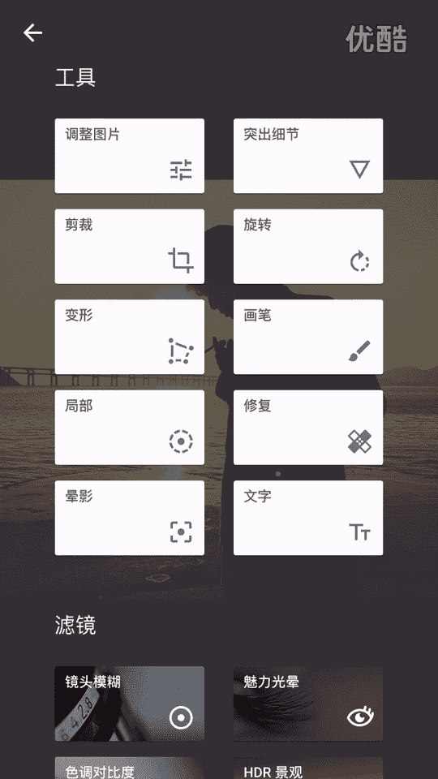

# 20游绅度最牛修图视频课：01：修图软件介绍 📱

在本节课中，我们将学习修图所需的核心软件及其基本功能。课程将详细介绍四款必备软件：Snapseed、VSCO、美图秀秀和Facetune，并讲解它们各自的核心用途与操作顺序。

---

## 软件准备与分类

开始修图前，需要下载四款软件。以下是软件列表及其主要用途：

*   **Snapseed**：用于调整照片的光影。
*   **VSCO**：用于添加滤镜。
*   **美图秀秀**：用于调整人物的形体特征。
*   **Facetune**：用于精细的皮肤处理。

Snapseed、VSCO和美图秀秀是免费软件。Facetune在苹果官方App Store中需要付费，但可以通过PP助手等第三方平台免费下载。

照片主要分为三类：**实物**、**景物**和**人物**。修实物和景物通常只需要前两款软件。而修人物照片，则需要用到全部四款软件。

---

## Snapseed 核心功能详解

上一节我们介绍了软件清单，本节中我们来看看Snapseed的具体用法。打开Snapseed，导入照片后，点击右下角的铅笔图标进入编辑界面。众多功能中，我们主要使用以下两项：

1.  **调整图片**
2.  **突出细节**

### 调整图片功能

点击“调整图片”后，向上滑动可以看到多个参数。我们只需要使用其中四个：

*   **亮度**：调整照片的整体曝光。
*   **氛围**：增强或减弱环境色彩的浓度，与饱和度类似。
*   **高光**：**通常需要降低（设为负值）**，以恢复天空等过亮区域的细节。
*   **阴影**：调整照片中暗部区域的明暗程度。

饱和度（调整色彩鲜艳度）在修实物时可能会用到，但修人物时通常不使用。这些参数没有固定值，建议通过滑动滑块观察最大和最小值的区别来感受其效果。

### 突出细节功能

此功能下包含两个子项：

*   **结构**：效果更强的锐化。
*   **锐化**：**通常需要大幅增加**，以提升照片的清晰度和文件质量。但过度锐化会增加照片颗粒感，不过后续可以用其他软件处理。

总结一下，Snapseed的核心操作是：使用“调整图片”功能调整**亮度、氛围、高光、阴影**，再使用“突出细节”功能增加**锐化**。

---

## VSCO 滤镜与色调调整

了解了基础光影调整后，我们进入调色环节。VSCO是一款拥有大量优质滤镜的软件。其内置滤镜购买价格较高，建议在淘宝花费约5元购买共享账号，即可解锁全部滤镜。使用前可能需要通过VPN（翻墙）登录账号。

VSCO的基本使用流程如下：

1.  选择一张照片。
2.  点击底部图标，选择一个喜欢的滤镜（例如：A6）。
3.  调整该滤镜的强度。

滤镜选好后，点击右下角的圆圈进入微调界面。在众多参数中，我们只需使用以下两项：

*   **阴影色调**：为照片的暗部区域添加颜色。
*   **高光色调**：为照片的亮部区域添加颜色。

为阴影和高光分别添加不同的色调（例如阴影加绿色，高光加黄色），是让照片富有风格感的关键步骤。

---

## 美图秀秀 形体调整技巧

完成色调处理，接下来处理人物形体。美图秀秀功能繁多，但请避免使用“一键美颜”、“磨皮”和“美白”功能，这些会让照片质感变假、变差。

我们主要使用以下四个功能：

*   **瘦脸瘦身**：调整脸部及身体轮廓。
*   **增高**：拉长腿部，调整身高比例。
*   **眼睛放大**：使眼睛显得更大。
*   **去黑眼圈**：这个功能有特殊妙用，可用于提亮法令纹、嘴角等面部暗沉区域，不仅是去除黑眼圈。

---

## Facetune 精细皮肤处理

最后，我们对皮肤进行精细化处理。Facetune是一款强大的磨皮与细节增强工具，主要使用两个功能：

*   **平滑**：即磨皮功能。建议使用“更加平滑”选项，可以非常精细地涂抹需要柔化的皮肤区域。
*   **细节**：即局部锐化功能。可以用在眉毛、眼睛、嘴唇等部位，增强其纹理和清晰度。

---

## 课程总结

本节课我们一起学习了四款修图软件的核心功能。虽然部分软件是英文界面，但只需记住以下关键点即可轻松上手：

*   **Snapseed**：调整**亮度、氛围、高光、阴影**，并增加**锐化**。
*   **VSCO**：选择**滤镜**，并调整**阴影色调**与**高光色调**。
*   **美图秀秀**：使用**瘦脸瘦身、增高、去黑眼圈、眼睛放大**功能。
*   **Facetune**：使用**平滑**功能磨皮，使用**细节**功能局部锐化。

熟练掌握这些核心功能，你就能修出高质量的照片。我们下节课再见。