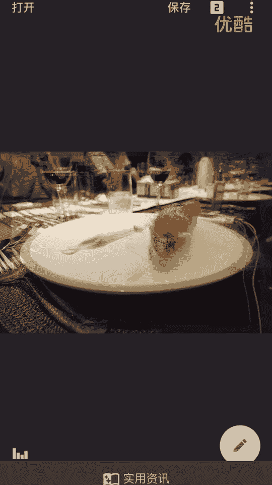
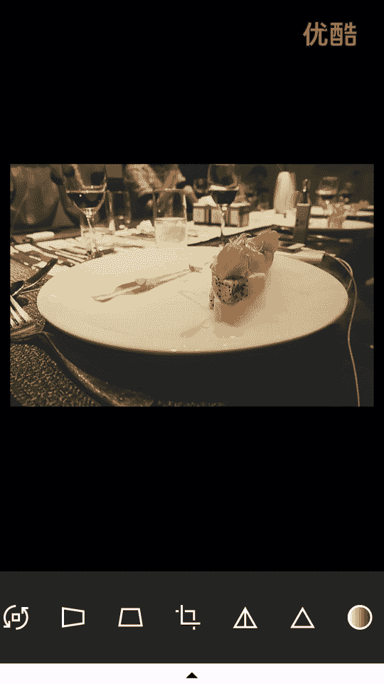
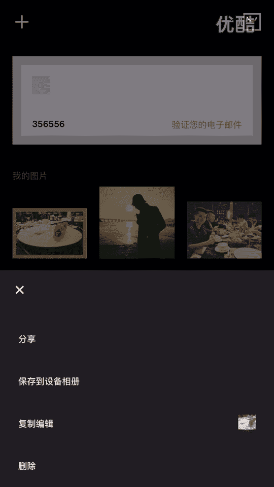
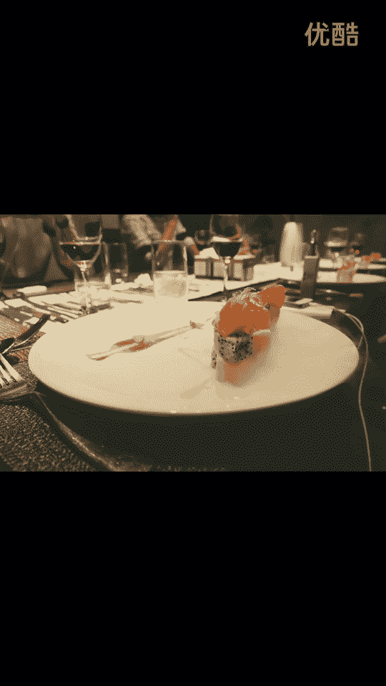
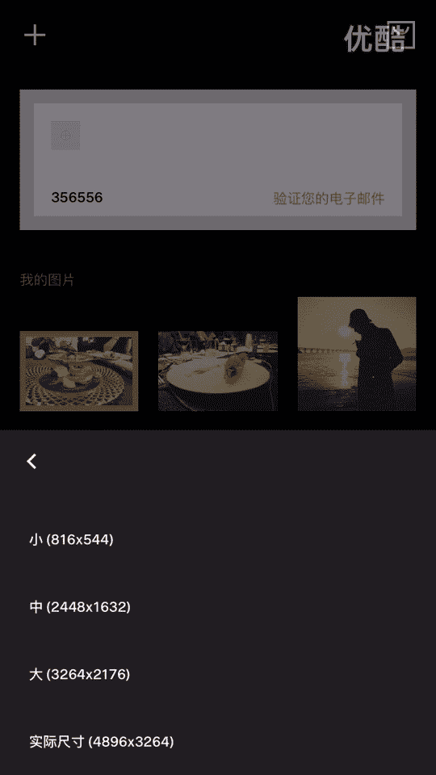

# 20游绅度最牛修图视频课：02：修食物 🍽️

在本节课中，我们将学习如何使用手机修图软件对食物照片进行美化处理。课程将分为两个主要部分：首先使用Snapseed进行基础光影调整，然后使用VSCO添加滤镜和色调，最终提升照片的质感与氛围。

---

上一节课我们介绍了修图需要用到的四个软件及其基本功能。本节中，我们将通过实际操作，演示如何修一张食物照片。我上节课提到，图片主要分为食物、景物和人像三类。今天，我们就从食物修图开始。

## 第一步：基础光影调整（使用Snapseed）

任何照片处理的第一步，都是进行基础的光影调整和初步锐化。这能为后续的调色打下良好基础。

以下是使用Snapseed调整一张食物照片的具体步骤：

1.  **观察原图**：打开照片后，首先观察整体效果。这张照片本身尚可，但周围环境略显暗淡。
2.  **调整亮度**：点击“工具”->“调整图片”。将“亮度”参数适当提高，例如调整到 **+30** 左右，让画面整体更明亮。
3.  **调整氛围**：在同一个界面中，轻微提升“氛围”值，可以增强画面的层次感，但不宜过度。
4.  **提升饱和度**：食物照片通常需要更鲜艳的色彩来激发食欲。因此，将“饱和度”参数适当调高一些。
5.  **处理阴影与高光**：“高光”参数本次可以不做调整。将“阴影”值适当降低（例如 **-10**），可以减少暗部细节，让主体更突出。
6.  **最终微调与锐化**：如果觉得整体还不够亮，可以再次微调亮度。接着，点击“工具”->“突出细节”。提升“结构”和“锐化”值，可以增强食物的纹理和清晰度。

完成以上步骤后，点击“导出”保存照片。第一步的基础调整就完成了。

## 第二步：添加滤镜与色调（使用VSCO）

基础调整完成后，我们使用VSCO为照片添加风格化的滤镜和色调，赋予其独特的质感与情绪。

以下是使用VSCO进行风格化处理的具体步骤：

1.  **导入并选择滤镜**：在VSCO中导入上一步保存的照片。点击下方的滤镜图标。我个人比较偏爱“A5”这个滤镜，它带有复古胶片感。
2.  **调整滤镜强度**：选择滤镜后，可以通过滑块调整其浓度。我觉得调到 **8** 左右比较合适。
3.  **调整色调**：点击编辑界面下方的第二个图标（色调调整）。首先调整“阴影色调”，选择一种颜色为暗部染色。例如，选择绿色或紫色可以营造特别的氛围，这里我选择绿色，强度调到 **4** 左右。
4.  **调整高光色调**：接着调整“高光色调”。选择黄色为高光区域染色，这能模拟出老照片的胶片发黄效果，增加复古感。
5.  **最终锐化与导出**：最后，可以再次轻微提升“锐化”值，让细节更 crisp。完成后，点击保存，选择“实际尺寸”导出到相册。

## 效果对比与总结

现在，让我们来对比一下修图前后的效果。

*   **原图**：画面朴实，色彩平淡，缺乏吸引人的质感。
*   **修图后**：画面更明亮通透，色彩鲜艳富有食欲，同时通过滤镜和色调的添加，照片多了一份复古的质感与氛围。

通过这个案例可以看到，修一张食物照片，我们主要运用了 **Snapseed** 进行光影和清晰度的基础修正，以及 **VSCO** 进行风格化的滤镜与色调渲染。掌握这两个软件的核心功能，就能显著提升食物照片的观感。

本节课中，我们一起学习了食物修图的两步核心流程。关键在于先做好基础曝光和细节，再通过滤镜赋予风格。下节课，我们将探讨景物照片的修图思路与参数设置。