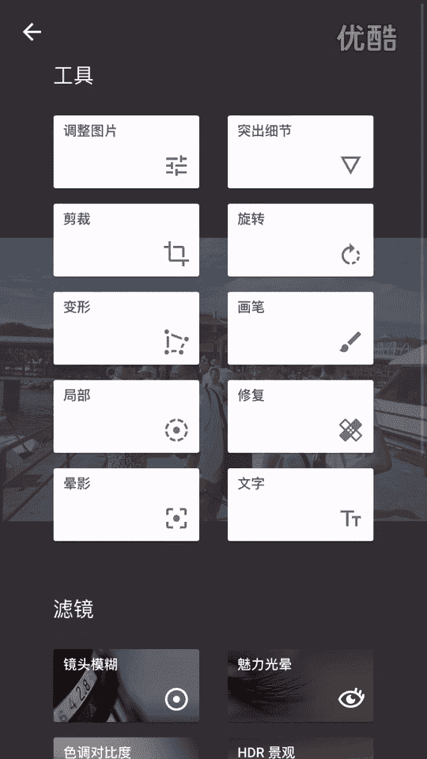
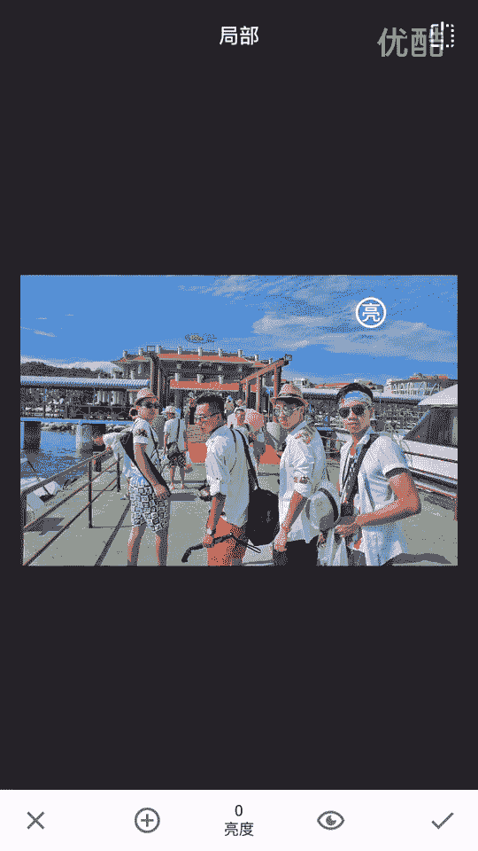
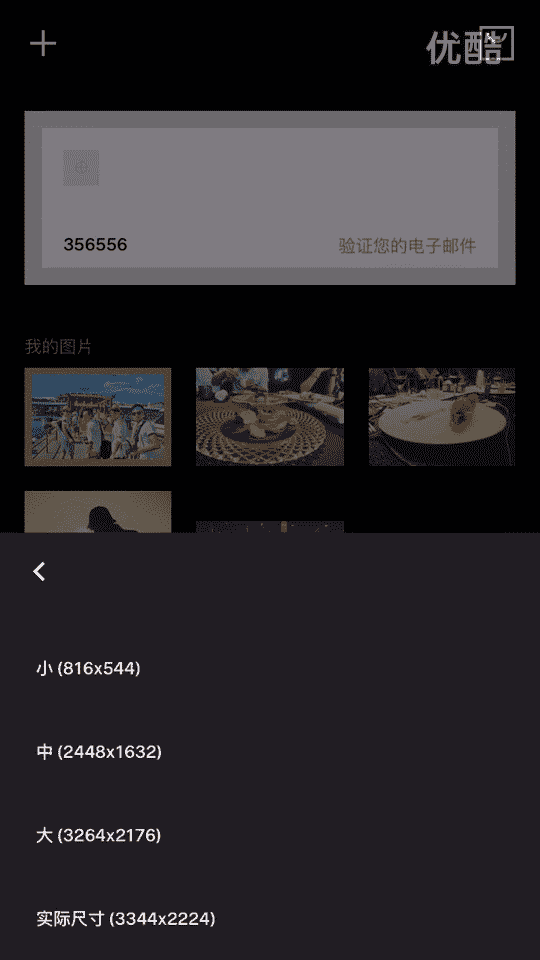
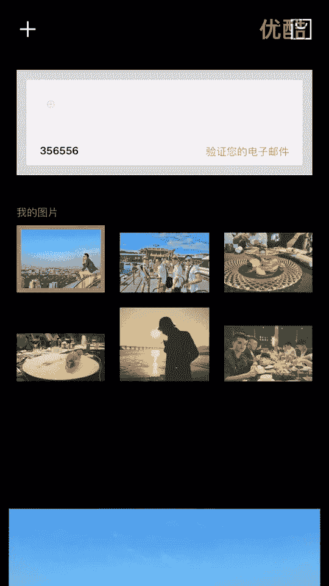

# 20游绅度最牛修图视频课：03：修风景 🏞️

在本节课中，我们将学习如何使用手机修图软件来美化风景照片。我们将通过调整几个核心参数，让天空更蓝、云彩更清晰，并改善整体画面的氛围。课程将使用具体的照片案例，一步步演示操作过程。

## 概述

在前两节课中，我们分别介绍了四个软件的基本用法以及如何修实物照片。本节课程将聚焦于风景照片的修饰。修风景与修实物类似，只需要用到软件中的几个关键功能。掌握这些功能，就能显著提升照片的视觉效果。

## 核心工具与思路

修风景照片主要会用到两个核心工具：**全局调整**和**局部调整**。全局调整用于改善整张照片的曝光、色彩和氛围；局部调整则允许我们对特定区域（如天空）进行精细处理。

以下是本节课将用到的几个核心参数，它们通常以滑块形式存在：
*   **亮度/曝光**：控制画面整体明暗。
*   **对比度**：增加明暗部分的差异，让画面更通透。
*   **饱和度**：控制色彩的鲜艳程度。
*   **氛围**：一个智能调整参数，能同时平衡高光与阴影，并增强色彩。
*   **高光**：控制画面中最亮部分的明暗。
*   **阴影**：控制画面中最暗部分的明暗。
*   **局部调整工具**：允许对照片的特定区域进行独立的亮度、对比度、饱和度等调整。

## 实战案例一：海岛街拍

我们以一张在海岛拍摄的街拍照片为例。这张照片人物神态不错，主要问题是环境较暗，天空的细节没有显现出来。

首先，我们点击右下角的编辑按钮（铅笔图标），进入调整界面。

### 第一步：全局基础调整

点击“调整图片”功能，开始对整张照片进行初步优化。

1.  **调整亮度**：由于人物脸部较暗，我们适当增加亮度，让人物更清晰。
2.  **调整氛围**：将“氛围”参数调高（例如调到100）。这个操作能立刻让天空的蓝色显现出来，并平衡画面光比。
3.  **调整高光与阴影**：降低“高光”可以让过亮的天空恢复更多细节（如云层）。提升“阴影”可以让暗部（如建筑背光面）的细节更明显。

### 第二步：局部精细调整

完成全局调整后，我们发现天空还可以更出彩。这时需要使用局部调整工具。

1.  点击“局部”功能，在天空区域点击一下，创建一个调整点。
2.  用双指缩放可以控制这个调整点的影响范围，将其覆盖到整个天空区域。
3.  在这个局部调整点上，我们可以单独进行以下操作：
    *   稍微提高亮度。
    *   增加对比度，让云层更立体。
    *   增加饱和度，让蓝天更湛蓝。

### 第三步：最终微调与保存

局部调整后，如果觉得人物脸部还需要提亮，可以再新建一个局部调整点，范围缩小到脸部区域，单独提高亮度。

最后，我们可以为照片添加一个喜欢的滤镜（例如案例中选择的“06”号滤镜），为照片统一色调风格。调整满意后，点击保存即可。

让我们对比一下修图前后的效果：

**原图**：天空灰暗，画面整体沉闷，缺乏活力。

**修图后**：天空变得湛蓝，云层细节丰富，整体画面通透，色彩鲜明，人物也从昏暗的背景中凸显出来。

通过这个案例可以看到，仅仅通过调整几个关键参数，照片的整体质感和观感就得到了巨大提升。

## 实战案例二：城市天台风景

为了让印象更深刻，我们再处理一张在城市天台拍摄的照片。操作逻辑与第一个案例完全一致。

1.  **使用局部工具**：首先使用局部调整工具，在人物脸部创建一个点，缩小范围后提高亮度，确保人物主体曝光正确。
2.  **全局调色**：接着进行全局颜色调整，沿用之前熟悉的参数思路——调整亮度、对比度、饱和度、氛围等。
3.  **添加风格化滤镜**：再次选择“06”滤镜，获得一致的色调风格。
4.  **尝试风格化效果**：我们还可以尝试“褪色”效果，它能给照片增添一种朦胧的胶片感，让画面看起来更柔和、有老照片的韵味。

完成调整后保存照片。

**原图**：色彩平淡，光影对比不强，画面略显普通。

**修图后**：天空颜色更加饱和蔚蓝，建筑线条和明暗对比更加分明，人物肤色也得到了改善，整体风格更具视觉冲击力和艺术感。

## 总结与进阶建议

本节课我们一起学习了风景照片的修饰流程。核心步骤可以总结为：**先全局调整定基础，再局部调整做精细，最后用滤镜统一风格**。修风景与修实物的工具和思路是相通的，关键在于熟练运用那几个核心参数。

很多朋友在学会操作后，可能仍无法调出满意的照片，这往往不是因为技术，而是因为**审美**差异。修图技术是工具，最终呈现的效果取决于个人的审美眼光。

因此，建议大家通过以下方式主动提升审美：
*   **多浏览优质图片**：经常查看新浪微博上的时尚博主、摄影师、官方媒体发布的优质照片。
*   **分析借鉴**：留意并保存你喜欢的照片，分析它们的色调、构图和风格。
*   **建立视觉库**：看得多了，自然能培养出鉴别好坏的能力，并在自己修图时形成更明确的风格取向。

审美提升是一个长期积累的过程。掌握了本节课的技术基础，再加上有意识的审美训练，你就能越来越得心应手地创造出令人惊艳的作品。

好了，今天的第三节修图课就到这里，我们下期再见。