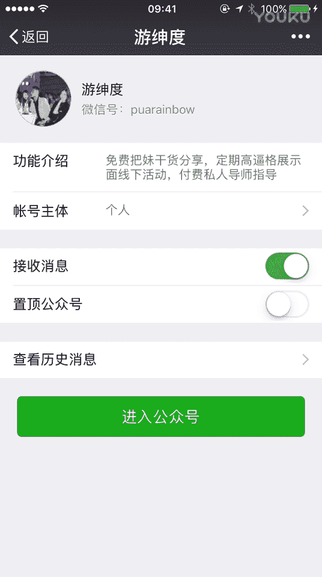
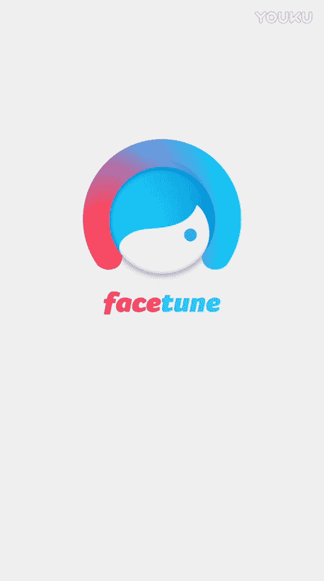

# 修图大师课：第5节：鼻子精修与磨皮过度修复 🎨

在本节课中，我们将学习两个核心的后期修图技巧：如何精细地修饰鼻子，以及当使用软件磨皮导致面部轮廓丢失时，如何进行有效的修复。课程将结合具体操作步骤，帮助你掌握这些实用技能。

---

上一节我们介绍了面部轮廓的初步调整，本节中我们来看看如何对鼻子进行精细修饰。

鼻子是面部修图中较难处理的部分。从示例图中可以看到，模特的鼻子存在鼻翼较宽、鼻梁不直、鼻孔外翻等问题。我们的目标是使其更挺拔、协调。

以下是鼻子精修的具体步骤与思路：

1.  **缩小鼻翼**：首先，适当缩小鼻翼的宽度。这类似于微整形中注射玻尿酸的思路，为塑造鼻型打下基础。
2.  **塑造鼻尖与鼻梁**：将鼻尖向上提拉，使其更立体。同时，将歪斜的鼻梁向中间“推直”，使其线条笔挺。
3.  **调整鼻孔形态**：将外翻的鼻孔向内收，使其不那么明显。
4.  **反复微调**：这是一个需要耐心和审美的过程。需不断左右、上下微调鼻翼、鼻梁和鼻尖的位置，直至整体比例协调，鼻尖、嘴唇、下巴基本处于一条水平线上。

通过以上步骤，我们可以将一个有缺陷的鼻子修饰得挺拔、标准。需要强调的是，在前期拍摄时，让模特呈现约45度的侧脸角度，能为后期修图提供更大的调整空间和更自然的效果。

---

在完成五官修饰后，我们通常会进行磨皮处理。但有时使用自动磨皮工具（如演示中的Fstton2）会导致磨皮过度，使皮肤质感完全丢失，面部像塑料一样平整。

当遇到磨皮过度的问题时，可以按以下方法修复：

1.  **使用纹理恢复功能**：在Fstton2软件中，找到“纹理”或类似的功能选项。
2.  **局部涂抹**：使用该功能在面部皮肤区域进行涂抹。此操作会为皮肤恢复适当的颗粒感和纹理。
3.  **调整强度**：通过控制涂抹的强度或次数，使恢复的纹理既自然又不突兀，从而解决磨皮过度导致的“假面”问题。

这个方法能有效找回皮肤的真实质感，让妆容看起来更自然。

---

本节课中我们一起学习了两个关键技巧：一是通过逐步调整鼻翼、鼻梁和鼻尖来精细修饰鼻子；二是利用软件的纹理恢复功能来修复因磨皮过度而丢失的面部细节。掌握这些方法，能让你的修图作品在美化人物的同时，保持自然与真实。敬请期待下期课程。