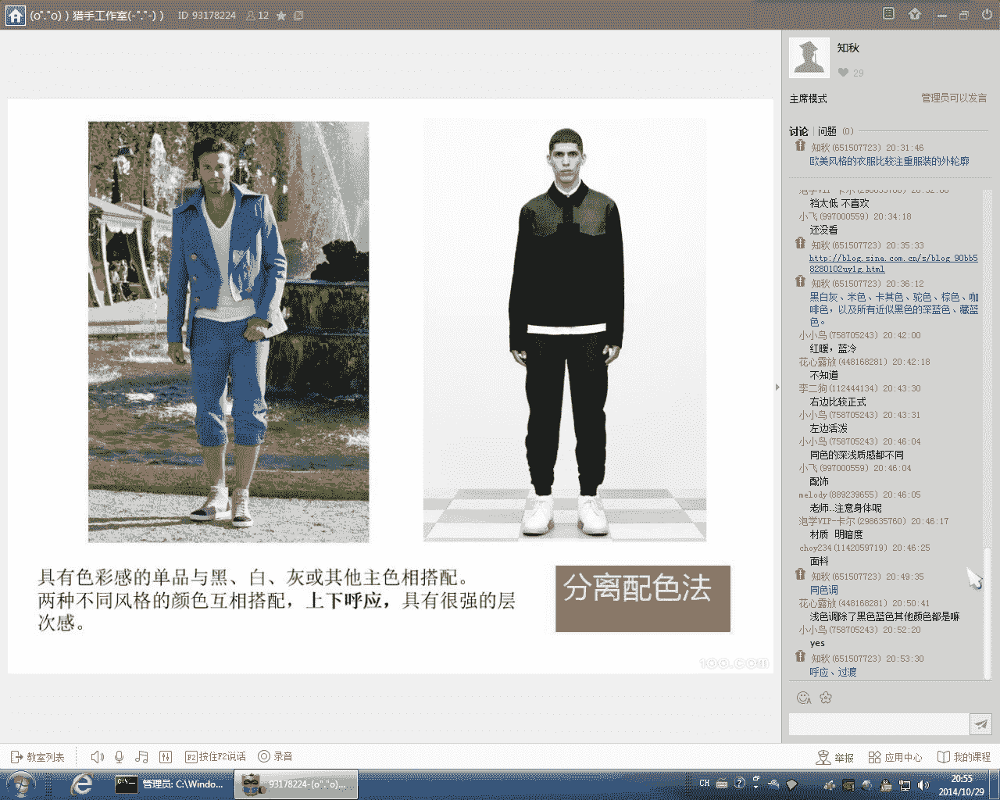

# 时尚型男养成计划：1：服装搭配核心法则

在本节课中，我们将要学习服装搭配的三个核心法则，帮助你摆脱搭配困惑，建立有秩序、有美感的个人造型。

## 概述

搭配是许多人关心且困惑的问题。你是否经常遇到买了一件衣服，却不知道应该搭配什么样的裤子、包包或其他配饰？最常见的困惑集中在风格和颜色两个方面。在第一节课中，我们提到，**秩序产生美感**。普通人最常出现的问题就是缺乏秩序和层次感。

我们来看一张图片。

这张图片是典型的反面教材。图中四个人的着装完全没有秩序，显得脏乱，缺乏搭配的美感。穿衣有三个层次：第一是整齐干净，第二是好看有美感，第三是穿出自己的风格。但很多人连第一层次都未能达到。

颜色方面，最常见的困惑是上下半身颜色面积对等，例如红配绿且面积各占一半。这种5:5的配色同样缺乏层次感和秩序，效果不好看。

服装搭配有其核心法则。今天，我们就来讲解服装搭配的三个核心要素。

## 核心法则一：廓形

廓形是指服装的外部轮廓线条。现代服装廓形基本可分为欧美风格和日韩风格。欧美风格注重服装的外轮廓，远看有清晰的线条，如X型或A字型。日韩风格则更注重服装细节，如在领口、袖口运用拼色或小配饰。

服装廓形对应人的身材。主要廓形包括直线型的H型、T型、A型，以及曲线型的X型和O型。对于男士而言，最常穿的是H型和T型。

### H型（直筒型）

H型服装的肩宽与下摆宽度相同，整体呈长方形。这种廓形包容性最强，无论高矮胖瘦、肩宽肩窄、有无小肚子或臀部较大，H型服装都能较好地包容。尤其在冬天穿着层次较多时，能更好地遮掩身材缺陷。任何身形的人都可以穿着H型服装。

### T型（倒三角型）

T型服装对应倒三角形身材，能很好地衬托男士的肩膀线条。男士最理想的穿衣廓形就是塑造出倒三角线条，即肩宽收腰。每个男人都梦想拥有倒三角身材。

### A型

A型廓形常见于冬季外套，如长款风衣。其特点是下摆外放，肩部较窄。H型或倒三角身材的人都可以穿着，但倒三角身材的人穿着可能不太合适。

### O型

O型属于特殊廓形，常见于时尚潮牌或设计师品牌，个性较强，正常人很少穿着。

### 廓形的搭配印象

廓形的长短影响整体印象。**长款搭配**显得成熟、大气、稳重。**短款搭配**则显得年轻、时尚、前卫。衣服越长，印象越传统稳重；衣服越短，印象越年轻时尚。这也是现在流行卷裤脚的原因——露出更多皮肤面积，显得更时尚、年轻、前卫。

男士服装廓形搭配的关键在于长短搭配。以下是两种基本搭配方式：

*   **上长下短**：需要一定身高才能驾驭。
*   **上短下长**：更显身高，适合大多数人。

对于身高不特别高的人，建议尽量穿长裤，避免短裤和七分裤，九分裤比较显腿长和身高。

秋冬内搭可参考基本搭配：**下身穿深色裤子，上身穿浅色衣服**。外套可根据个人长相气质、风格及场合选择，如皮夹克、牛仔外套、棉衣或长风衣等。

### 松与紧的廓形

衣服版型越宽松，感觉越舒适、洒脱；版型越紧，感觉越拘束、正式、严谨，甚至带有些许女性化感觉。通常，我们采用**下紧上松**的搭配，这样最显身高。

如果身高不高的同学想穿宽松一点的裤子，需注意裤子宽松但要有型，整体线条笔直，不能松松垮垮。**上松下松**的搭配体现街头、休闲感，一般只出现在休闲场合。

廓形方面，需掌握长短比例，根据身高身材搭配，力求显高显瘦。松紧搭配上，多数人采用下紧上松。若选择宽松版型，需选择有型的款式，这类衣服通常价格稍高。

我们来看一套全身宽松的搭配。

这套搭配体现慵懒、街头甚至嘻哈风格。之所以看起来还行，是因为模特长相帅气。普通人这样穿会显得邋遢、没精神。其颜色搭配没有问题，问题在于廓形太宽松。

这引出一个重要观点：**穿衣首先要穿好廓形和身形**。如果身形没穿好，即使颜色搭配正确，整体效果也不好看。太多人颜色穿对了，但衣服不合身，没有体现显高显瘦的效果。

总的来说，选择衣服廓形要根据自身身材条件，尽量选择显高显瘦的廓形。

## 核心法则二：色彩

色彩是一个非常大且专业的系统知识。对于男装搭配而言，不需要太专业的色彩知识，因为男装本身色彩变化不多，且色彩非常集中。男装颜色基本集中在中性色。

### 中性色（百搭色）

中性色指百搭、包容性强，能很好与其他鲜艳颜色搭配的颜色。例如：

*   **黑白灰**：最经典的百搭色。
*   **米色、卡其色、驼色、棕色**。
*   **所有近似黑色的颜色**，如深蓝色、藏蓝色（宝蓝或海军蓝）。

其中，**海军蓝**是男装中适用性最高、范围最广的色系。蓝色系在男生中的应用率非常高。

### 色彩基础知识

*   **三原色**：红、黄、蓝。
*   **间色**：红+黄=橙，黄+蓝=绿，蓝+红=紫。
*   **色相环**：由这六种颜色及其调和色组成。

每种颜色都有深浅和冷暖之分。例如红色，有偏黄调的红和偏紫调的红。皮肤白的人适合穿浅而鲜亮的红色；皮肤暗黑的人适合穿酒红、暗红色。

*   **明度**：指颜色的深浅。每种颜色都有深浅之分。选择时应尽量选择与肤色深浅程度接近的颜色。
*   **纯度**：指颜色的鲜艳程度。颜色中含色成分比例越大，纯度越高，越鲜艳。肤色黑或肤质不好的人，应避免穿太鲜艳的颜色，以免暴露皮肤瑕疵。
*   **冷暖色**：
    *   **暖色**：红、橙、黄，给人温暖、积极的感觉。
    *   **冷色**：绿、蓝、紫，给人寒冷、沉静的感觉。
*   **轻重感**：浅色感觉轻，深色感觉重。

### 色彩的位置

色彩的位置也会影响形象。一个人的气质主要集中在头面部。颜色越往上，越能影响整体气质。

*   **想体现严肃、正式**：尽量把深色放在上半身，越接近脸部越好。
*   **想体现年轻、时尚、活泼**：尽量把深色放在下半身，把鲜艳明亮的颜色放在上半身。

### 色彩搭配方法

以下是几种实用的色彩搭配方法。

#### 1. 同色系/同色调配色法

搭配一整身相同或相近颜色时，需注意营造层次感，避免过于平面。

*   **利用深浅和材质**：例如一身黑色搭配，可通过不同单品的深浅和材质光泽度（如亮面皮衣与哑光裤子）来制造层次。
*   **加入过渡色**：在一身颜色中加入小面积其他颜色进行过渡，例如黑色外套内搭配灰色拼接设计。

同色调搭配指一整身浅色调或深色调，虽不是同一种颜色，但色调统一，同样需要注意层次。

#### 2. 分离配色法

此方法的关键词是**呼应**和**过渡**。

*   **颜色呼应**：使不同部位的色彩相互呼应，增强整体感和秩序感。例如，帽子、围巾、裤子、鞋子采用同色系，上衣用另一种颜色。
*   **颜色过渡**：利用内搭、配饰等在不同色块之间形成过渡，避免生硬分割。例如，深蓝色上衣和裤子之间用白色T恤过渡；黑色外套内露出白衬衫下摆。

最简单的搭配技巧就是**呼应**。当你选择了某件单品（如黑色鞋子），可以在其他部位（如上衣、配饰）使用相同或相近颜色与之呼应。

对于下半身，皮带、裤子和鞋子尽量使用相近颜色，这样会增强下半身的整体感，更显身高。

## 核心法则三：面料与图案

面料和图案是塑造风格和质感的重要元素。

### 条纹图案

*   **横条纹**：通常适合较瘦的人。但有一个关键点：**当横条纹很密集时，会产生反效果，反而显瘦**。
*   **竖条纹**：通常显瘦显长。但**当竖条纹很宽、很粗时，也会产生反效果，反而显胖**。

### 鞋履搭配

例如**松糕鞋**，其特点是底厚，适合腿细或身高不高的同学。它一般搭配休闲、廓形宽松的衣服较好，不太适合搭配面料精致、修身的小西装。

## 总结

本节课我们一起学习了服装搭配的三个核心法则：**廓形、色彩、面料与图案**。

1.  **廓形**是基础，需根据身材选择显高显瘦的款式，注意长短、松紧的搭配比例。
2.  **色彩**搭配需掌握秩序感，利用中性色、同色系、分离配色等方法来营造层次，并通过颜色呼应和过渡提升整体感。
3.  **面料与图案**影响风格和质感，需根据个人情况选择合适的图案和单品进行搭配。

记住，对于男装而言，穿好廓形和身形是首要任务。即使颜色简单如黑白灰，只要廓形合身、搭配有序，就能穿出很好的效果。关键在于根据自身条件，灵活运用这些法则，打造有秩序、有美感的个人造型。