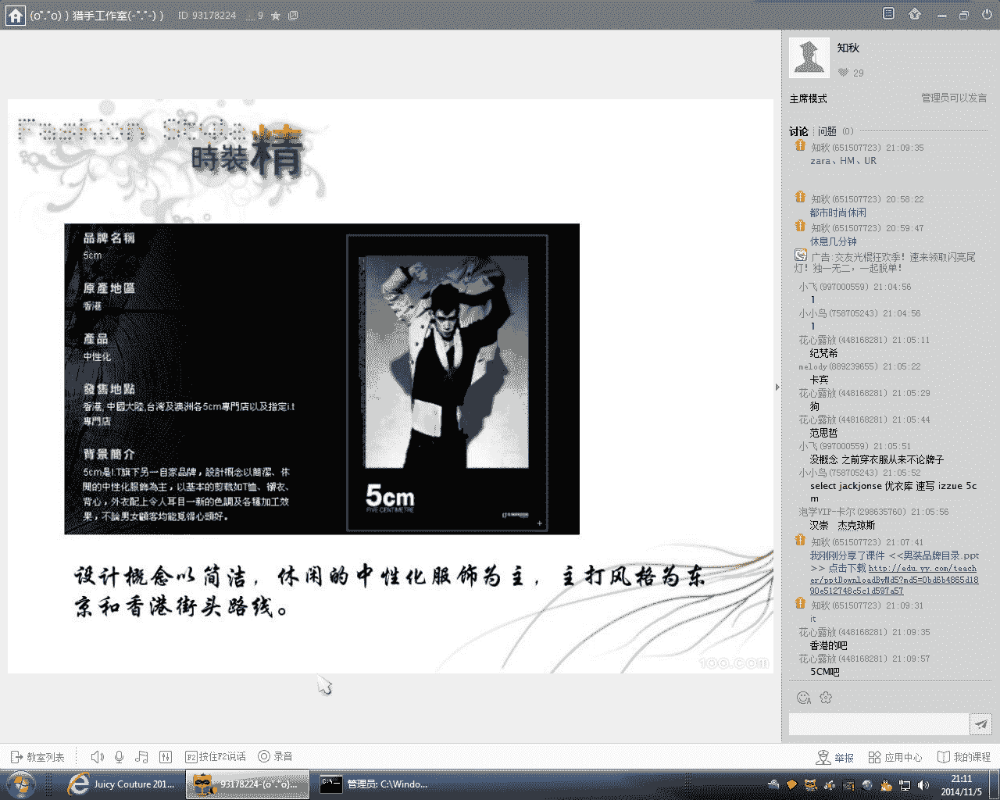
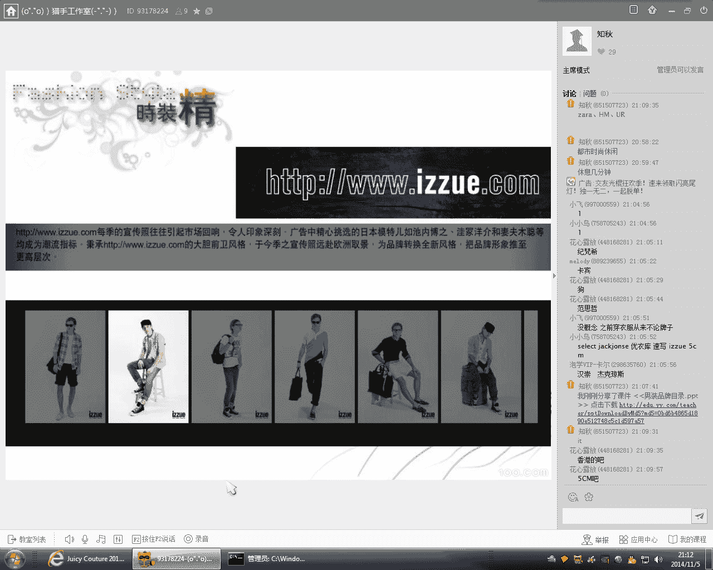
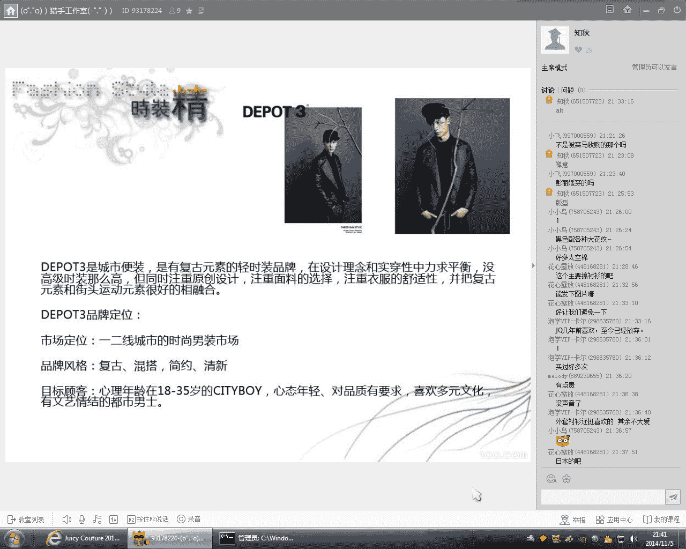

# 时尚型男养成计划：1：男装品牌认知与选择指南

在本节课中，我们将要学习如何认识和选择适合自己风格与预算的男装品牌。课程将介绍多个不同定位的品牌，从快时尚到设计师品牌，帮助你建立一个清晰的品牌认知框架，为日常穿搭提供参考。

## 品牌认知与定位

首先，我想了解一下大家对男装品牌的认知程度。请说出你们平时了解或能说出口的品牌名字。

例如，纪梵希是一个知名品牌，其图案设计非常出名，早些年经常使用狗头、老虎头或老鹰等动物图案，艺术气息浓厚。

对于大多数人而言，我们主要依靠搭配来提升形象，因为国际一线大牌的价格通常较高，单品动辄几千甚至上万元。因此，本课程将推荐一些单价在200到500元之间、外套不超过1000元或略超的经济实惠的大众品牌。这些品牌适合都市白领或轻熟男风格。

## 快时尚品牌介绍

以下是几个常见的快时尚品牌及其特点：

*   **ZARA**：设计注重线条感，版型通常按照欧洲人身形设计，款式不会过于花哨。但版型普遍偏大，中等或个子较小的身材可能难以驾驭。
*   **H&M**：风格更偏美式，廓形控制不如ZARA精准，做工相对随意，版型偏向宽松休闲。其面料质量近年有所下降，但款式设计的多样性优于ZARA。
*   **UR**：目前主要在一线城市设有店铺。其设计感比ZARA和H&M更时尚，风格多元化，涵盖正式、商务休闲和时尚街头等多种风格。建议去实体店亲身感受。

## 潮流与设计师品牌

上一节我们介绍了大众快时尚品牌，本节中我们来看看一些更具风格特色的潮流与设计师品牌。

*   **IT集团与5CM**：IT是香港一个大型时尚潮牌集团。旗下品牌5CM早期设计以简洁休闲的中性化服饰为主，色系偏暗黑（黑白灰），营造街头潮人或酷感风格，适合年轻型男。
*   **izzue**：同属IT集团，风格比5CM更偏休闲与年轻活力，在颜色和款式上更加多样化。
*   **chocolate**：同样隶属于IT集团，定位更加年轻化（18-23岁），主打青春活力款式，如校园风或街头潮人风格。
*   **速写**：这是一个设计师品牌，风格比较个性。其衣服廓形松垮，少有收身硬挺的版型，多采用棉、麻等自然面料，追求一种随意、休闲且有禅意的状态，适合文艺青年或艺术从业者。
*   **initial**：这是一个我个人非常喜欢的香港品牌，风格走复古和混搭路线，很好地结合了当下潮流趋势。其产品线覆盖时尚商务、商务休闲、运动及街头潮人等多种风格。

## 商务休闲与都市时尚品牌

了解了个性化的潮流品牌后，我们转向更日常的商务休闲与都市时尚领域。

*   **i.t（定制）**：主打商务休闲风格的定制男装。定制服装能更贴合个人身形，但款式通常较为中规中矩，以衬衫、马甲、西装等为主，缺乏太潮流的款式。
*   **太平鸟**：定位23-30岁的都市男士，核心消费层为26-27岁。其形象自信自由，敢于追求潮流。衣服版型适合瘦高身材，近年风格也趋向时尚潮流。
*   **GXG**：风格与太平鸟接近，同属都市时尚休闲范畴，但更注重细节设计，如剪裁、纽扣、拉链、绣花印花等元素。整体做工和质量略逊于太平鸟。
*   **TRENDIANO**：欧时力旗下的男装品牌，风格偏时尚休闲和潮人路线。其版型比较特别，修身但不紧身，包容性较强，颜色和花纹运用大胆，有些设计借鉴一线大牌，适合身材较壮或喜欢宽松版型的人。
*   **马克华菲**：一个偏年轻时尚的品牌，色彩绚丽，对比感强，风格奔放，适合个性张扬的穿着者。
*   **汉崇**：广州品牌，在商务休闲领域较为成功，定位25-45岁消费力成熟人士。设计感在商务装中较好，但面料一般，适合对着装有专业度要求但不想太古板的人士。
*   **杰克琼斯**：经典的欧美休闲风格品牌，版型比较宽松。款式有好有坏，需要会挑选和搭配。
*   **SELECTED（思莱德）**：风格偏成熟，定位20-45岁，实际更适合26-30岁出头。版型较大较宽松，涵盖商务休闲和时尚休闲类，设计感、做工和面料优于杰克琼斯，两者价位接近。
*   **卡宾**：一个知名品牌，款式参差不齐，有些搭配好能出效果，有些则显得普通。

## 休闲与街头风格品牌

最后，我们来看一些主打休闲和街头风格的品牌。

*   **GAP**：快时尚品牌，风格偏向日常居家休闲，面料松软，裤型宽松，适合非常休闲的场合，难以穿出很型格的感觉。类似风格的还有无印良品和优衣库。
*   **Bershka**：西班牙街头风格年轻品牌，风格接近H&M但更偏休闲和街头，色彩和图案更加丰富。版型偏大，对亚洲身材是挑战。
*   **NPC**：近年来比较火的复古时装品牌，设计理念融合复古与街头运动潮流元素。风格时尚休闲，版型也比较宽松。

## 如何深入了解品牌

今天我通过PPT和文字描述了这些品牌的风格特点，大家可能只有一个大概的概念。服装这种东西，一定要去实体店亲身感受，试穿后才知道上身效果。这样才能对品牌的风格和文化有更深刻的理解。

像initial、IT这类店铺，其装修、音乐和香薰都在营造一种生活方式和态度，让你在购衣的同时融入其品牌文化。

## 常见问题与建议

*   **身材瘦小适合什么风格？** 身材瘦小者不太适合版型偏大的欧美风格。建议多尝试韩版风格，例如“时尚起义”这样的网络原创平台。亚洲人穿韩版衣服通常更合适。
*   **如何确定自己的风格路线？** 不必纠结于将自己定位为单一风格。一个人可以适合多种风格。可以从排除法开始，明确自己绝不尝试的风格，剩下的风格多去尝试和模仿。风格是在不断尝试、积累和沉淀中形成的。
*   **如何实践？** 今天所讲的品牌知识属于认知范畴，知道即可。真正的实践需要多逛街、多试穿。现在很多网店支持退货，也可以购买回来试穿，不合适再退换。

## 总结

本节课中我们一起学习了多个男装品牌的定位与风格特点，从快时尚到设计师品牌，从商务休闲到街头潮流。关键在于建立品牌认知框架，并通过亲身试穿去感受和选择最适合自己的品牌与款式。风格的形成需要不断尝试和积累。

---
**注**：课程中提及的品牌名称（如5CM、izzue等）请以其官方最新名称为准。部分品牌中文名可能存在多种译法或已变更。