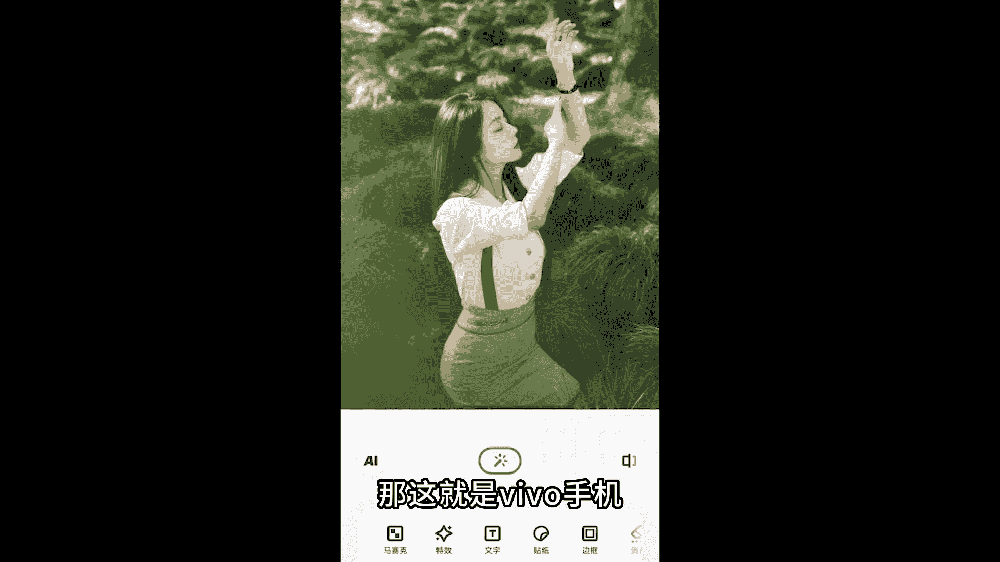
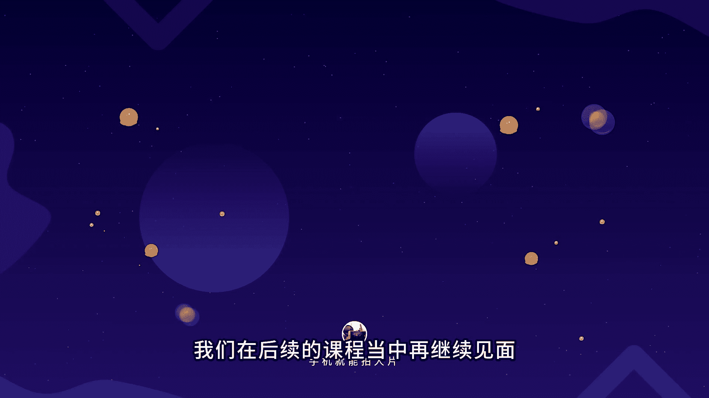

# vivo手机拍照操作课：10：vivo手机自带编辑功能详解 📱

在本节课中，我们将详细学习vivo手机自带的照片编辑功能。这套工具虽然不如专业软件精细，但提供了多种快速调整照片的实用功能，非常适合日常使用和快速出片。我们将逐一了解每个工具的作用和操作方法。

## 进入编辑界面

在vivo手机的相册中，打开任意一张照片，点击底部的“编辑”按钮即可进入自带的编辑工具界面。

## 核心编辑工具详解

上一节我们介绍了如何进入编辑界面，本节中我们来看看各个核心工具的具体功能。

### 1. 构图工具

构图工具主要用于调整照片的裁剪、旋转和翻转。

以下是构图工具的主要功能：
*   **自由裁剪**：可以按照任意比例对照片进行裁剪。
*   **旋转**：可以调整照片的角度。
*   **镜像翻转**：可以对照片进行水平翻转。

### 2. 调节工具

调节工具是后期调色的核心，用于调整照片的亮度、对比度和色彩等基本参数。不建议直接使用顶部的“自动”或“AI”功能，手动调整能获得更符合预期的效果。

以下是调节工具的核心参数及其作用：
*   **亮度**：柔和地调整画面整体明暗。公式：`画面明亮度 = 原始亮度 + 亮度调整值`
*   **对比度**：增强或减弱画面明暗区域的差异，影响层次感。
*   **高光**：专门调节画面中最亮区域（如天空、反光面）的亮度。
*   **阴影**：专门调节画面中最暗区域（如建筑阴影、暗部细节）的亮度。
*   **自然饱和度**：柔和地增加或降低色彩的鲜艳程度。建议优先使用此参数而非“饱和度”。
*   **色温**：调整画面整体色调偏向。向右滑动增加暖黄色调，向左滑动增加清冷蓝色调。
*   **色调**：微调画面色彩倾向。向右滑动增加紫红色，向左滑动增加青绿色。
*   **锐度**：适当增强画面的清晰度和边缘细节。
*   **褪色**：为照片添加怀旧、复古的灰调效果，常用于胶片风格。
*   **暗角**：使画面四角变暗，引导视线聚焦于中心。
*   **增强**：降低画面整体对比度，让照片看起来更通透。降低此值则可增强对比度。
*   **去雾**：降低画面中的朦胧感，使风景照片更清晰。

在这些参数中，**亮度、对比度、高光、阴影、自然饱和度和色温**是最常用且关键的几个。

### 3. 滤镜工具

滤镜工具可以快速为照片套用不同的色彩风格，是提升调色效率的好帮手。

以下是使用滤镜的建议：
*   系统会根据照片内容推荐滤镜，例如人像、风景或胶片风格。
*   **日系、胶片、风景、人像**等分类下的滤镜效果通常不错。
*   高效工作流：**先选择合适的滤镜，再使用“调节”工具微调基本参数**。

### 4. 美颜工具

美颜工具专为人像照片设计，提供了一系列美化功能。

以下是美颜工具的主要功能：
*   **磨皮**：平滑皮肤质感。
*   **肤色**：调整肤色白皙或红润程度。
*   **祛斑祛痘**：消除面部瑕疵。
*   **面部重塑**：包括瘦脸、大眼、调整眼距等。
*   **美妆**：添加口红、眉毛等妆容效果。

**关键原则**：调整需适度，以自然耐看为目标，避免过度修饰。

### 5. 抠图工具

抠图工具能智能识别并分离照片主体，非常实用。

以下是抠图工具的应用场景：
*   自动识别人物并抠图。
*   快速制作证件照：抠图后，点击“证件照”可一键更换纯色背景（如红、蓝底）。

### 6. 其他实用工具

除了上述核心工具，编辑界面还提供了一些特色功能。

以下是其他工具的介绍：
*   **涂鸦**：使用不同画笔在照片上绘画或标注。
*   **马赛克**：涂抹以遮盖照片中不想公开的部分。
*   **特效**：添加光效、虚化或更换天空背景。其中“虚化”和“幻天”效果可能不自然，建议谨慎使用。
*   **文字**：为照片添加文字水印，有多种样式可选。
*   **边框**（新款手机特有）：在“定制”选项中，可为照片添加带有vivo型号的白色边框水印，能提升照片格调。
*   **消除**：使用“消除笔”手动涂抹，或使用“消除路人”自动移除画面中的杂物和路人。
*   **修复**：
    *   **超清图像**：提升人物照片的清晰度（可能产生涂抹感）。
    *   **夜景人像**：优化夜景人像照片。
    *   **文档去影**：使拍摄的文档照片光线更均匀。
*   **高级修图**：提供更专业的精细化调色面板，功能类似Lightroom等专业软件。

## 核心参数总结与课程回顾

本节课我们一起学习了vivo手机自带编辑工具的详细操作方法。最后，我们再次强调后期调色的几个**最基础且重要的参数**，它们适用于任何修图场景：

*   **亮度**：控制画面整体明暗。
*   **对比度**：影响画面的明暗反差和层次感。
*   **饱和度**（建议用自然饱和度）：控制色彩的鲜艳程度。
*   **锐度**：影响画面的清晰度。
*   **阴影与高光**：分别控制画面最暗和最亮区域的细节。
*   **色温**：决定画面色调的冷暖倾向。

掌握这些参数的含义，是学好照片后期处理的基础。希望本课程能帮助你更好地利用vivo手机，快速修出令人满意的照片。