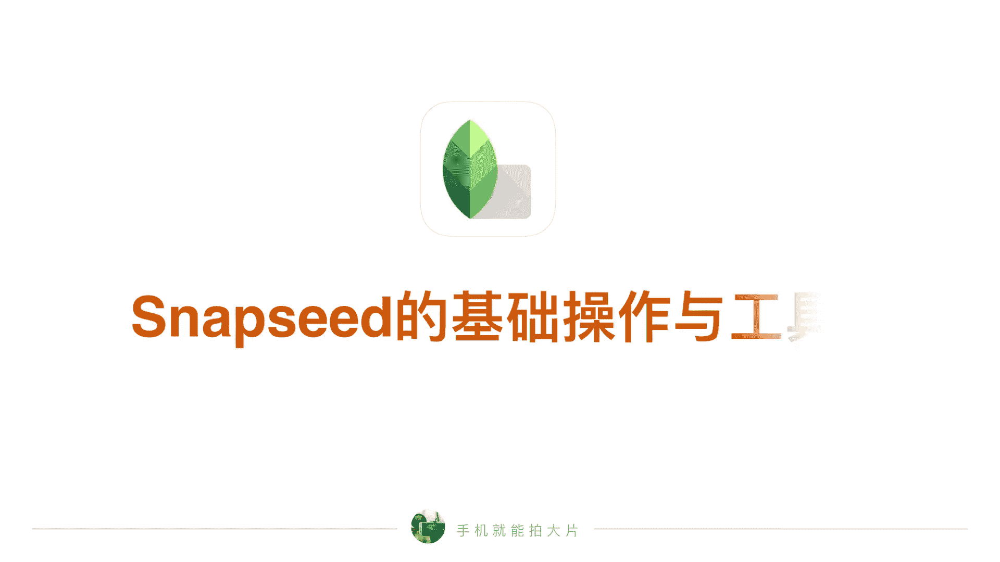
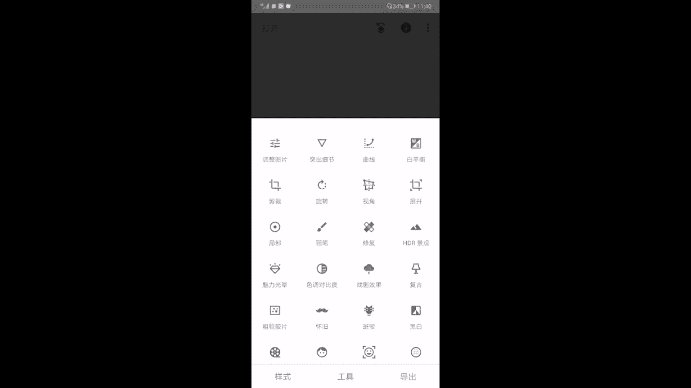
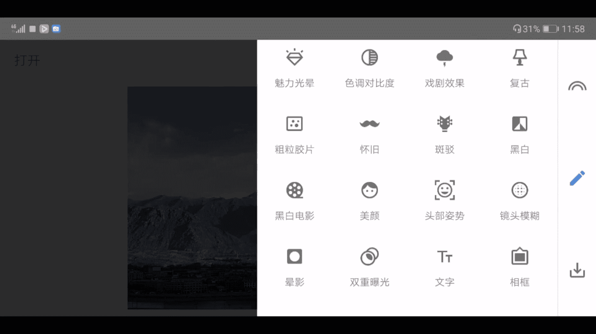
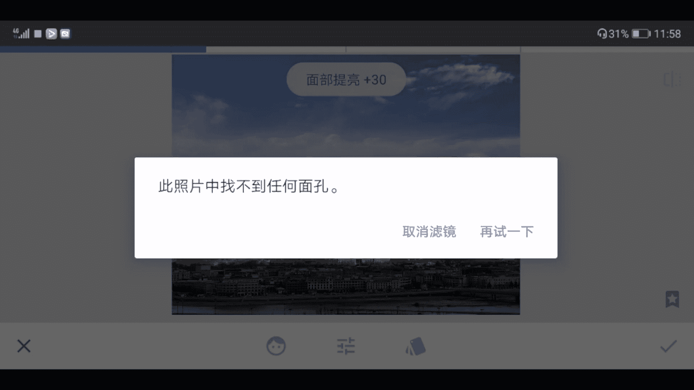

# vivo手机拍照操作课：11：附加课1：Snapseed基础操作教程 📱




在本节课中，我们将学习手机后期修图软件Snapseed的基础操作。我们将逐一了解其核心工具的功能与使用方法，帮助你从零开始掌握这款强大的修图应用。

## 软件界面与基础操作

首先，在手机中打开Snapseed应用。点击界面中央的加号，即可从相册中选择并导入照片。



进入编辑界面后，我们来认识上方的操作按钮：
*   **左上角**：用于打开相册并导入新照片。
*   **右上角**：包含三个按钮。
    *   **三个点**：可进入软件设置，通常保持默认即可。
    *   **感叹号**：点击可查看照片的拍摄信息，如时间、地点、尺寸和参数。
    *   **第三个按钮**：包含“撤销”、“重做”、“还原”和“查看修改内容”等功能。其中“查看修改内容”在后期调整步骤后，可用于查看每一步的修改记录。

界面下方的按钮分别是：
*   **样式**：提供多种一键调色滤镜。但色彩效果可能较为浓烈，使用频率较低。
*   **工具**：这是本节课的核心，包含了所有后期调整工具。
*   **导出**：编辑完成后，点击此处保存照片。通常选择“导出”至相册。

## 核心工具详解

上一节我们介绍了软件界面，本节中我们来看看工具栏里各项核心工具的具体用法。

### 1. 调整图片
这是调整照片基础曝光与色彩的核心工具。进入后，**上下滑动**屏幕可切换不同参数，**左右滑动**可调整选中参数的值。
*   **亮度**：调整画面整体明暗。
*   **对比度**：调整明暗区域之间的反差。
*   **饱和度**：调整颜色的鲜艳程度。右滑增加，左滑减少。
*   其他参数如氛围、高光、阴影、暖色调等，共同用于精细控制照片的基调。

### 2. 突出细节
此工具用于增强画面的清晰度和纹理。
*   **结构**：提升或柔化画面中的细节纹理。公式可理解为：`画面细节清晰度 = 原细节 + 结构调整值`。
*   **锐化**：专门强化物体边缘的清晰度。

### 3. 曲线
曲线是一个强大的工具，用于精确控制照片的影调和色彩。进入后，你可以：
*   拖动RGB曲线调整整体曝光与对比。
*   点击下方图标，切换至红、绿、蓝单色通道曲线，进行色调调整。
*   使用右侧的预设效果，快速应用不同风格的影调。

### 4. 白平衡
用于校正或改变照片的整体色温与色调。
*   **色温**：左滑（降低）使画面偏冷（蓝），右滑（提高）使画面偏暖（黄）。
*   **着色**：左滑增加青绿色调，右滑增加紫红色调。

### 5. 裁剪与旋转
以下是用于构图修正的工具。
*   **裁剪**：可自由裁剪或按固定比例（如16:9、1:1）裁剪画面。
*   **旋转**：可90度旋转或水平/垂直翻转图像。
*   **视角**：用于校正倾斜的地平线或建筑物线条。

### 6. 局部调整工具
这些工具允许你对照片的特定区域进行精细处理。

**局部工具**
点击“+”号在画面放置控制点，通过**双指缩放**调整影响范围（红色区域）。上下滑动选择调整项（亮度、对比度等），左右滑动改变数值。代码逻辑类似：
```伪代码
for 像素 in 红色区域:
    像素.亮度 += 调整值
```

**画笔工具**
你可以像使用画笔一样，手动涂抹需要调整的区域。可选效果包括：
*   **加光/减光**：局部提亮或压暗。
*   **曝光**：更强烈的亮度调整。
*   **色温/饱和度**：局部改变色温和色彩鲜艳度。

**修复工具**
用于移除画面中的小瑕疵（如电线、杂物）。放大画面后，轻轻涂抹需要清除的物体即可。

### 7. 常用滤镜推荐
在众多滤镜中，以下几款效果自然且常用：
*   **魅力光晕**：为画面添加柔和的光晕效果，提升梦幻感。
*   **色调对比度**：分别对高光、中间调、阴影区域的对比度进行微调，增强细节和质感。
*   **粗粒胶片**：模拟胶片质感，添加颗粒感和复古色调。

### 8. 其他实用工具
*   **晕影**：为照片四周添加暗角或亮角，突出画面中心。
*   **双重曝光**：将两张照片叠加合成，创造创意效果。
*   **文字**：为照片添加简单文字说明。





## 课程总结与常用工具梳理

本节课我们一起学习了Snapseed软件的基础操作和核心工具。为了帮助你快速上手，以下是使用频率较高的工具总结：

**核心调整类**：调整图片、曲线、白平衡。
**构图修正类**：裁剪、旋转、视角。
**局部处理类**：局部工具、画笔工具、修复工具。
**创意与滤镜**：双重曝光、魅力光晕、色调对比度、粗粒胶片。

对于初学者，建议从“调整图片”、“裁剪”和“修复”工具开始练习，逐步尝试“局部”和“曲线”等进阶功能。掌握这些基础操作后，你便能利用Snapseed大幅提升手机照片的表现力。


下节课我们将继续深入，学习如何利用这些工具进行实际的案例修图。