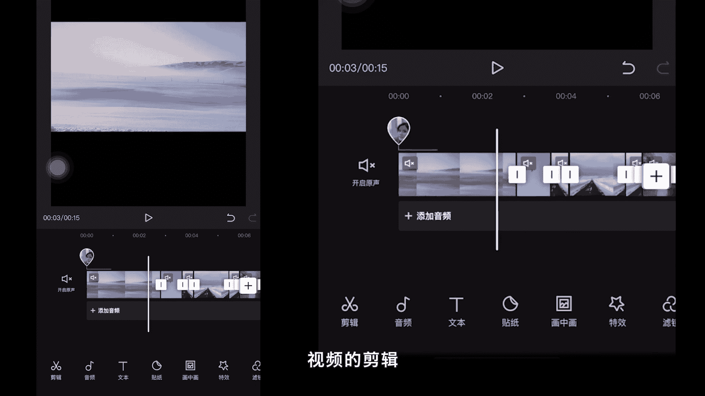

# vivo手机拍照操作课：12：附加课2：视频剪辑软件—剪映的基础操作教程 📱🎬

在本节课程中，我们将学习剪映软件的基础界面和核心操作。通过本教程，您将能够掌握使用剪映进行视频剪辑的基本方法。

## 概述

剪映是一款功能强大且完全免费的手机视频剪辑软件。本节课将带您了解其主界面布局，并逐一讲解各项核心剪辑工具的功能与使用方法。

## 剪辑界面与核心功能栏

当我们导入视频素材后，会进入剪辑主界面。界面下方是视频素材轨道，轨道下方则是剪映的核心功能栏。接下来，我们将详细介绍这些功能。

以下是针对视频素材的核心剪辑功能：

1.  **分割**
    *   点击“分割”功能，视频素材将在白色播放指针处被一分为二。

2.  **变速**
    *   可以调整视频的播放速度，分为**常规变速**和**曲线变速**两种模式。

3.  **音量**
    *   用于调整视频素材原始音量的大小。

4.  **动画**
    *   可以为视频素材添加**入场动画**、**出场动画**或**组合动画**，以制作动感效果。

5.  **删除**
    *   选中不需要的素材片段，点击“删除”即可将其移除。

6.  **编辑**
    *   点击进入后，包含三个子工具：
        *   **镜像**：对视频画面进行左右翻转。
        *   **旋转**：对视频画面进行旋转调整，可用于横竖屏转换。
        *   **裁剪**：对视频画面进行自由裁剪或按比例裁剪。

7.  **蒙版**
    *   此功能可以让视频画面只显示一部分。您可以选择线性、镜面、矩形、圆形等多种蒙版形状。
    *   例如，选择**线性蒙版**后，可以用手指滑动线条调整显示区域，并拖动下方按钮调整**羽化值**，使边缘更柔和。

8.  **替换**
    *   可以从相册中重新选择一段视频，替换掉当前选中的视频素材。

9.  **滤镜**
    *   为当前选中的视频片段添加调色滤镜，并可调节滤镜强度。此效果仅作用于单个片段。

10. **调节**
    *   手动调整视频画面的各项曝光和色彩参数，进行精细调色。

11. **不透明度**
    *   调节视频画面的透明程度，使画面变暗或恢复正常。

12. **美颜**
    *   针对人物视频，提供磨皮、瘦脸等美颜效果。

13. **变声**
    *   对视频的原声进行变声处理。

14. **降噪**
    *   消除视频中的环境杂音。

15. **复制**
    *   复制一段完全相同的视频素材。

16. **倒放**
    *   让视频倒序播放。

17. **定格**
    *   点击后，会在播放指针当前位置截取一帧画面，生成一段时长为3秒的静态图片素材。

## 其他主要功能模块

上一节我们介绍了针对单段视频的剪辑工具，本节中我们来看看软件的其他核心功能模块。

*   **音频**
    *   在此可以添加背景音乐、音效，提取其他视频的音频，或直接录音。若登录抖音账号，还可使用“抖音收藏”中的音乐。

*   **文本**
    *   用于添加文字、识别字幕/歌词，以及添加文字贴纸。

*   **贴纸**
    *   为视频添加动态或静态的贴纸，增加趣味性。请注意，贴纸风格通常较为花哨，需根据视频风格谨慎使用。

*   **画中画**
    *   这是叠加视频图层的关键功能。您可以在主视频上添加新的视频素材。
    *   添加后，可对画中画视频进行拖动缩放、变速、分割等操作。
    *   特别重要的是**混合模式**和**蒙版**功能：
        *   **混合模式**：调节上下视频图层的叠加方式，可创造出类似双重曝光的效果。
        *   **蒙版**：对画中画图层使用蒙版（如圆形、线性），可以合成出更具创意的画面。

*   **特效**
    *   为视频画面添加基础特效，如梦幻、动感、复古、分屏、边框等效果。

*   **滤镜（全局）**
    *   此处的滤镜作用于整个视频轨道。添加滤镜后，可以拖动其首尾两端，使其覆盖全部视频片段，并调节强度。

*   **比例**
    *   设置视频的画幅比例，常用选项有9:16（竖屏）、16:9（横屏）、1:1（正方形）、4:3等。

*   **背景**
    *   当视频比例小于画布时（如设为3:4），可使用此功能填充空白区域。
    *   提供三种方式：
        *   **画布颜色**：用纯色填充背景。
        *   **画布样式**：用预设的图片或图案填充背景。
        *   **画布模糊**：将主视频画面进行模糊处理后作为背景，能增加画面层次感。

*   **调节（全局）**
    *   与针对单片段的“调节”功能类似，但此处调整的参数将应用于轨道上所有视频片段，用于统一全片色调。

## 总结

本节课我们一起学习了剪映软件的基础操作。我们熟悉了其剪辑界面，掌握了**分割、变速、蒙版、画中画**等核心工具的使用方法，并了解了**音频、文本、特效、比例**等辅助功能。剪映是一款完全免费、无水印且功能全面的手机剪辑软件，非常适合初学者入门。建议您多加练习，熟悉各项功能，逐步提升视频剪辑能力。

