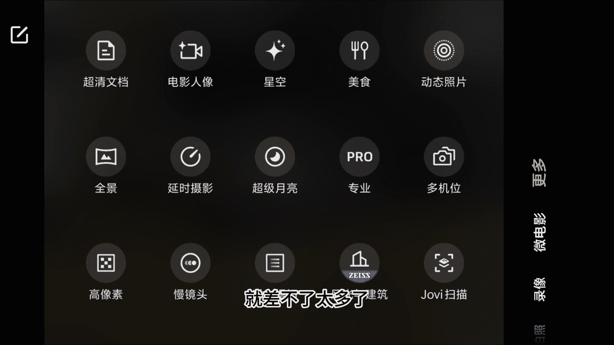

# vivo手机拍照操作课：13：vivo X100 核心功能详解 📱

在本节课中，我们将系统学习 vivo X100 系列手机的摄影功能设置与核心操作。课程将涵盖从基础拍照模式到专业设置的完整流程，帮助你快速掌握这款手机的拍摄技巧。

## 常规拍照模式与焦距调节

首先，我们介绍 vivo X100 手机常规的拍照模式。在这个模式下，我们可以直接调节焦距。

以下是可选的预设焦距：
*   0.6倍（超广角）
*   1倍（常规焦距）
*   2倍
*   3倍
*   10倍

这款手机的变焦功能非常强大。除了点击预设数字，我们还可以通过双手在屏幕上直接滑动来连续变焦。根据测试，在10倍焦距以内，通过滑动变焦获得的画质都相当不错。因此，在光线良好的条件下，例如晴天或白天，我们可以放心使用其长焦和变焦功能。为了操作更便捷，直接滑动或点击预设焦距即可。

## 左侧功能设置详解

上一节我们介绍了基础变焦操作，本节中我们来看看屏幕左侧的功能设置区。

以下是各功能的具体说明：
*   **闪光灯**：建议保持关闭状态。
*   **色彩模式**：提供三种选项。
    *   **鲜明**：整体画面偏向明亮。
    *   **质感**：增强明暗对比，能凸显更强的画面质感。公式可理解为 `对比度增强`。
    *   **自然**：色彩表现相对鲜亮自然。建议在“质感”和“自然”模式中选择。
*   **超级微距**：图标为一朵小花。点击后，手机会自动切换至3倍长焦并进入微距拍摄模式。
*   **设置按钮**：点击可进行更多调整。
    *   **照片比例**：通常选择 **4:3**。
    *   **定时拍摄**：可选择5秒或10秒延迟，一般选“无延迟”。
    *   **构图辅助**：建议开启“构图线”和“水平仪”。
    *   **抖动提示**：建议关闭。
    *   **效果大师**：建议关闭。
    *   **水印**：可以开启，并设置为“蔡司边框”。
    *   **运动追焦**：用于拍摄运动物体，可实现自动或手动追焦效果。
    *   **HDR**：拍摄风景时建议开启，能获得曝光更均匀的画面。代码逻辑类似 `HDR = 合并多张不同曝光照片`。
*   **更多设置**：在此菜单中，建议开启“地理位置”、“自拍镜像”和“超广角校正”，其他选项保持默认即可。

## 视频与特殊模式设置

了解了拍照设置后，我们来看看视频录制及其他拍摄模式的参数配置。

以下是各模式的推荐分辨率设置：
*   **录像**：分辨率选择 **4K 60帧**。
*   **前置录像**：选择 **1080P 30帧** 即可。
*   **电影人像**：选择 **1080P 30帧**。
*   **专业视频**：同样选择 **4K 60帧**，画质更佳但占用存储空间更大。
*   **慢镜头**：选择 **1080P 120帧**。
*   **延时摄影**：选择 **4K 30帧**。

完成以上分辨率设置后，其他选项可保持默认，无需过多调整。

接下来，我们看看其他拍摄模式：
*   **抓拍模式**：用于拍摄快速运动的物体，如奔跑的孩子或飞鸟。
*   **夜景模式**：专门用于拍摄夜景。使用时只需调整焦距，其他参数无需手动调整。
*   **防抖提示**：建议关闭此功能。若开启，屏幕中央会显示黄色圆圈，实际拍摄中只需拿稳手机即可。

## 核心功能：人像模式深度解析

vivo X100 的人像模式是其非常强大的功能，被认为是目前手机中拍摄人像效果最好的之一。

在人像模式下，可以选择五个不同的焦距，分别对应经典的人像焦段：
*   **1倍** → 24毫米
*   **1.5倍** → 35毫米
*   **2.2倍** → 50毫米
*   **3.7倍** → 85毫米
*   **4.3倍** → 100毫米

我们可以根据拍摄场景和构图需求，灵活切换这五个焦距。

此外，人像模式还提供以下调节选项：
*   **虚化效果**：可调节背景虚化程度，默认值为 **F2.0**，效果选择“自然”即可。
*   **美颜**：建议选择“自然”效果。
*   **风格**：提供自然、质感、清爽、复古蓝调、高级灰、黑白等多种人像风格滤镜，默认使用“自然”风格。

## 录像、专业模式及其他功能

现在，我们回到常规的录像功能。开始录像前，可根据需要重新选择分辨率。如果觉得4K分辨率占用空间过大，可以选择1080P，但**帧率建议设置为60帧**，这样拍摄的视频会更加流畅顺滑。

手机还内置了“**拍视频模板**”模式，但该功能使用频率较低，可以忽略。

对于进阶用户，**专业模式**提供了完整的手动控制参数（如ISO、快门速度、白平衡等），其操作逻辑与本系列课程的第三课内容完全一致，可参照学习。

在“更多”菜单中，还有以下实用功能：
*   **时光慢门**：用于拍摄车流、水流等慢门效果，具体操作在慢门专题课中有详细讲解。
*   **超级月亮**：专门用于拍摄月亮。
*   **专业延时摄影**：可以调节拍摄速率和专业参数，操作方式在延时摄影专题课中已涵盖。

## 总结与独特优势

本节课中，我们一起系统学习了 vivo X100 手机的摄影功能。总结其独特优势，主要有以下几点：
1.  **人像模式**：新增多个经典人像焦距（24mm, 35mm, 50mm, 85mm, 100mm），构图选择更灵活。
2.  **长焦画质**：在光线良好的条件下，3倍至10倍变焦范围内画质可靠，支持连续滑动变焦。
3.  **超级微距**：功能表现出色。

除此之外，其他功能（如专业模式、慢门、延时摄影等）的操作与vivo其他系列机型基本一致，可参考本系列其他课程内容。掌握这些核心设置，你就能充分发挥 vivo X100 的影像潜力。