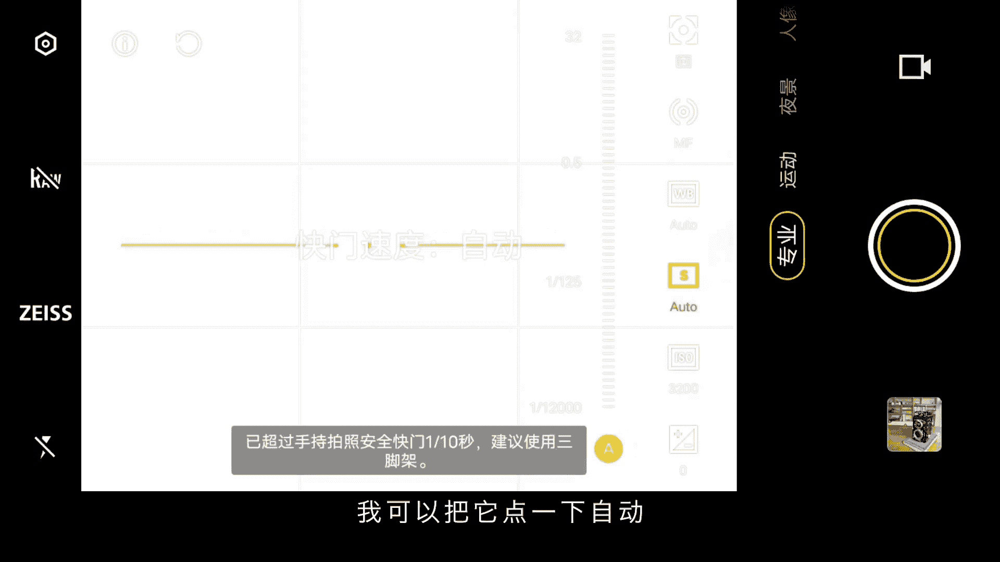
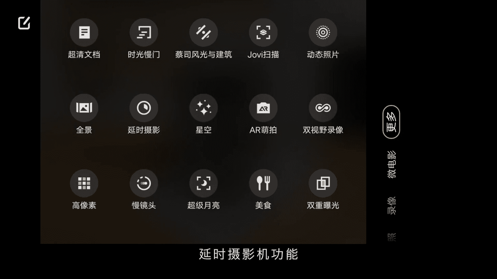

# vivo手机拍照操作课：1：认识相机界面各项功能及设置 📱

在本节课中，我们将学习vivo手机相机界面的各项功能与基础设置。通过了解这些核心按钮和模式，你将能够快速上手，为后续的拍摄实践打下坚实基础。

## 概述

本节课以vivo X90 Pro+为例，介绍相机界面的布局、常用设置项以及各种拍摄模式的基本用途。不同型号的vivo手机功能大致相同，均可参考本教程。

## 相机界面左侧功能设置

进入拍照界面后，左侧有一列功能按钮。首先，我们来看左上角的“设置”按钮。

点击进入设置菜单后，可以看到多项功能：

以下是设置菜单中的主要选项：

1.  **照片比例**：可调节照片画幅比例，包括 **1:1**、**4:3**、**16:9** 和全屏比例。**4:3** 是最常用的默认比例。
2.  **延时拍照**：设定拍照倒计时，例如选择 **3秒** 或 **5秒**，按下快门后手机会在倒计时结束后自动拍摄。
3.  **构图线**：建议开启。开启后画面会显示“井”字格辅助线，方便构图。
4.  **水平仪**：建议开启。开启后屏幕中央会显示一条黄线。当手机完全水平时，黄线保持亮起；若手机倾斜，黄线会变灰，提示画面不水平。

5.  **防抖助手**：拍摄视频时可开启，拍摄照片时一般无需开启。
6.  **效果大师**：效果通常不明显，建议保持默认关闭状态。
7.  **水印**：建议关闭，以免影响画面构图。
8.  **运动追焦**：用于拍摄运动物体，可帮助拍出主体清晰、背景虚化的效果。
9.  **微距**：开启后可以近距离拍摄花草、水珠等微小物体。
10. **蔡司自然色彩**：开启后照片会带有蔡司镜头的色彩风格。根据个人喜好选择即可，色彩差异不大。
11. **HDR（高动态范围）**：建议开启。开启后拍摄的照片亮部和暗部细节更丰富，色彩更柔和均匀。
12. **闪光灯**：日常拍摄建议保持关闭状态。

## 相机界面右侧拍摄模式

设置完左侧功能后，我们转向界面右侧，这里集中了主要的拍摄模式。默认进入的是“拍照”模式。

以下是各拍摄模式的简要介绍：

1.  **专业模式**：允许手动调整相机参数。进入后若画面过曝，可能是因为参数设置不当。点击 **A（自动）** 按钮可恢复自动模式。核心参数包括：
    *   **快门速度（S）**：控制进光时间。
    *   **感光度（ISO）**：控制传感器对光的敏感度。
    *   其他参数如白平衡（WB）、对焦模式（AF）、测光模式、曝光补偿（EV）等。初学者只需记住 **S** 代表快门速度，**ISO** 代表感光度即可，详细用法将在后续课程讲解。

2.  **运动**：专门用于抓拍快速移动的物体，如奔跑的人物或飞鸟，能使主体更清晰。
3.  **夜景**：专为弱光环境设计。在此模式下，手机会自动进行多帧合成，无需调整参数即可获得曝光和色彩都不错的夜景照片。
4.  **人像**：主要用于拍摄人物。在此模式下：
    *   点击 **F** 按钮可调节背景虚化强度，数值越大虚化越强。
    *   点击人头图标可调节磨皮、美颜、肤色等效果，建议选择“自然”风格。
    *   “风格”选项提供不同的人像色调和虚化光斑风格，可按喜好选择。
5.  **拍照（默认模式）**：最常用的模式。
    *   点击滤镜按钮可应用不同滤镜，但建议选择“无”，以便后期自由调色。
    *   点击焦距数字（如 **0.6x**, **1x**, **2x**, **3.5x**）可快速切换镜头，实现超广角到长焦的变焦。
6.  **录像**：用于拍摄普通视频。
7.  **微电影**：内置了短视频拍摄模板，可直接套用。若想自由创作，建议使用“录像”模式拍摄，再用“剪映”等软件后期编辑。

## “更多”模式中的实用功能

点击模式选择区域的“更多”，可以找到一些进阶拍摄功能。

以下是“更多”菜单中常用的几个功能：

1.  **时光慢门**：用于拍摄长曝光效果，如车流轨迹、光绘、流水雾化等。使用时需搭配三脚架，选择相应场景（如“流水瀑布”），按下快门开始拍摄，再次按下结束。
2.  **星空**：专为拍摄星空设计。架上三脚架，对准天空，按下快门即可，手机自动处理参数，属于“傻瓜式”星空拍摄模式。
3.  **超级月亮**：通过算法优化，专门用于拍摄清晰的月亮特写。
4.  **延时摄影**：将长时间的场景变化压缩成短视频，常用于拍摄日出日落、云彩流动、车流人流等。
5.  **慢镜头**：用于拍摄高帧率的慢动作视频，适合记录瞬间动作，增强视觉感染力。

“更多”中的其他功能使用频率较低。vivo手机的核心优势在于人像拍摄，其背景虚化自然，肤色处理出色。

## 总结

本节课我们一起学习了vivo手机相机界面的布局和核心功能。我们熟悉了左侧的设置菜单，了解了右侧各种拍摄模式（如**拍照**、**人像**、**专业**、**录像**）的基本用途，并探索了“更多”菜单中的实用工具（如**时光慢门**、**延时摄影**）。掌握这些是玩转vivo摄影的第一步。下节课，我们将深入更多拍摄技巧与构图方法。

