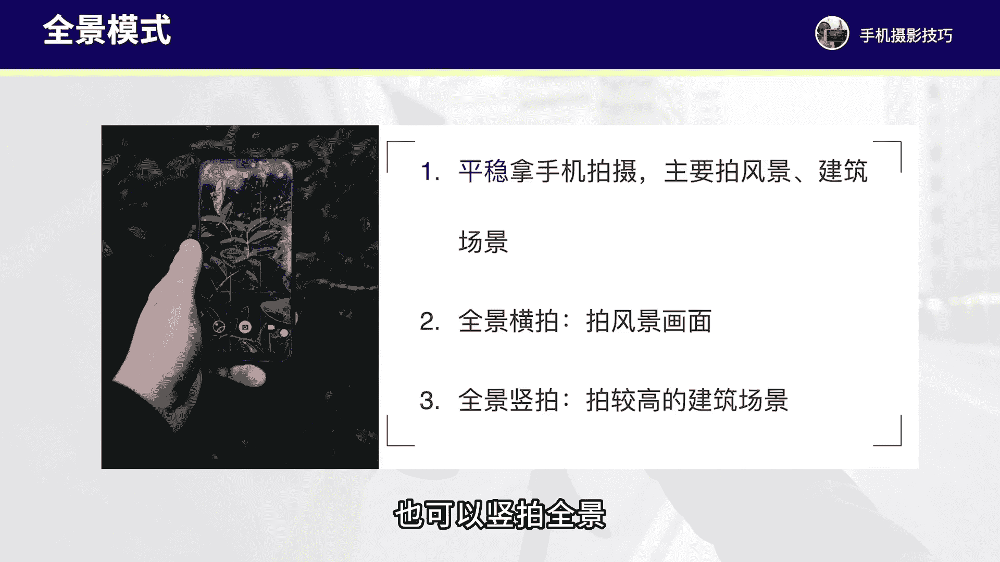
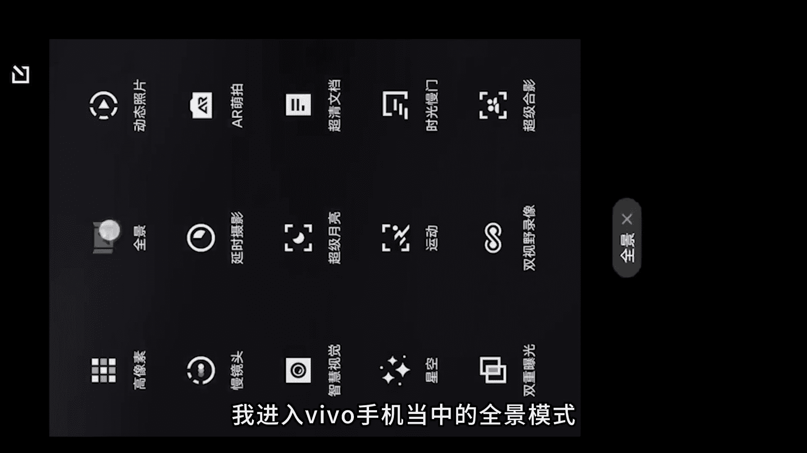
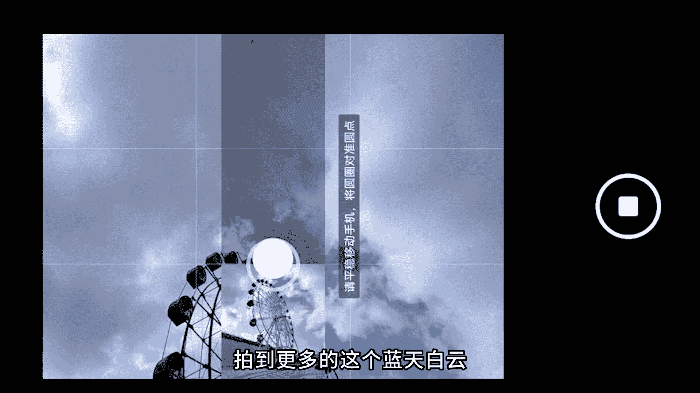
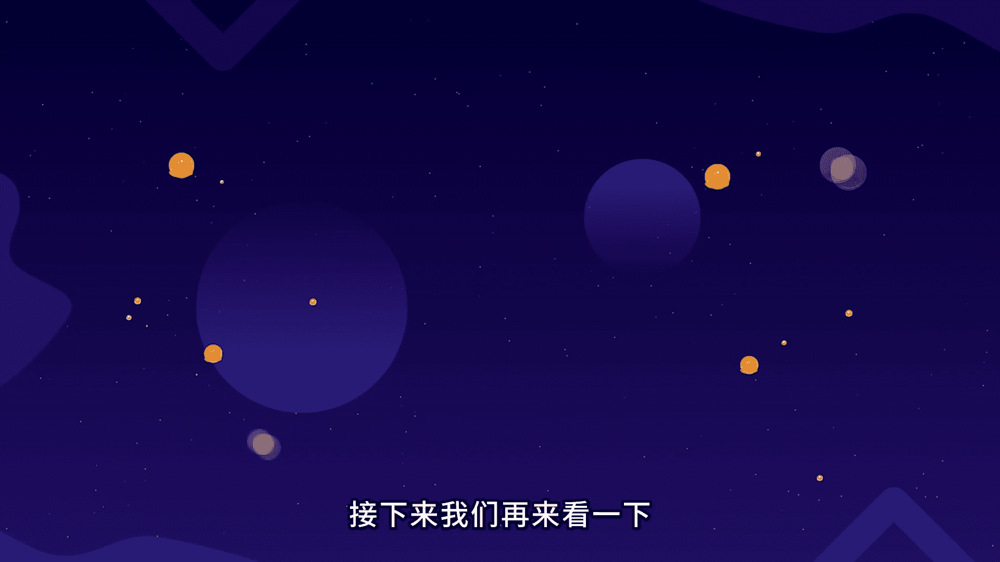
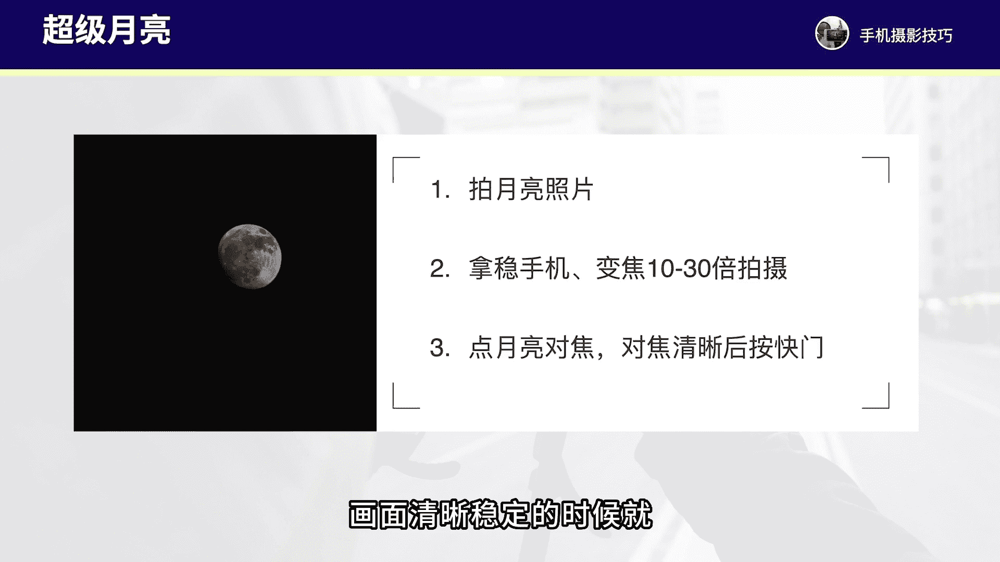
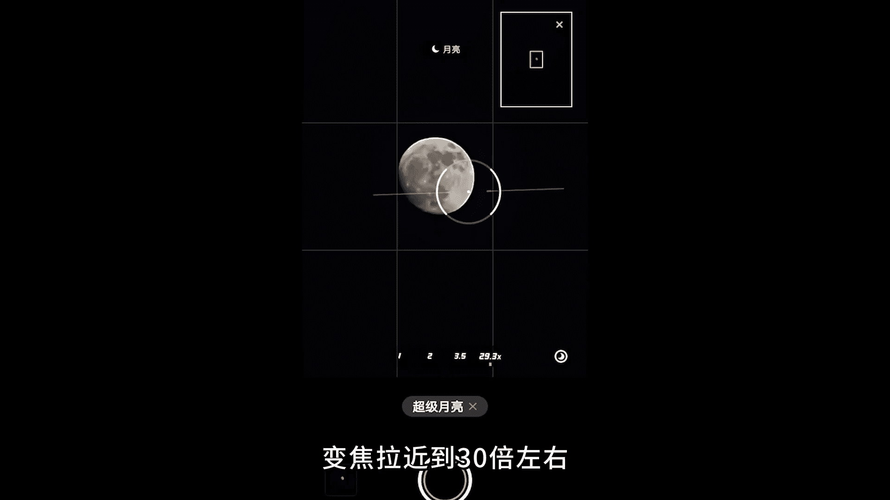
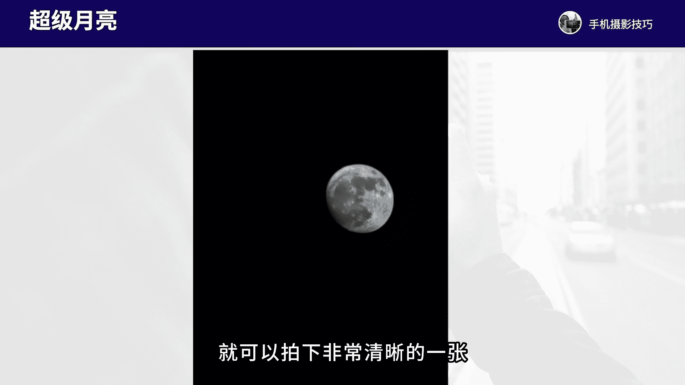
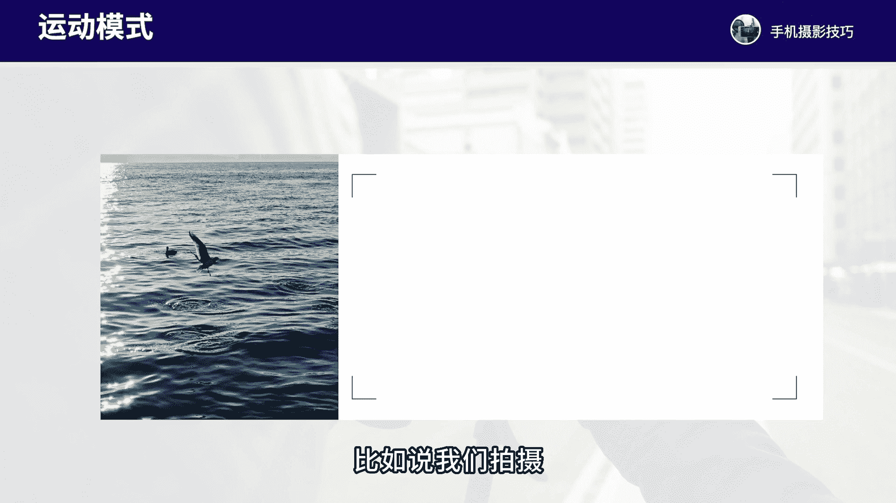
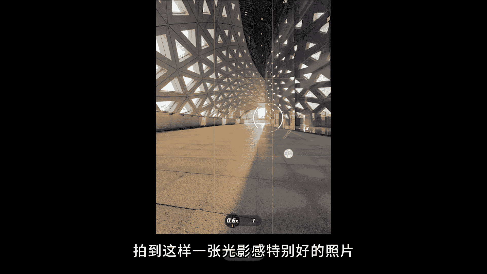
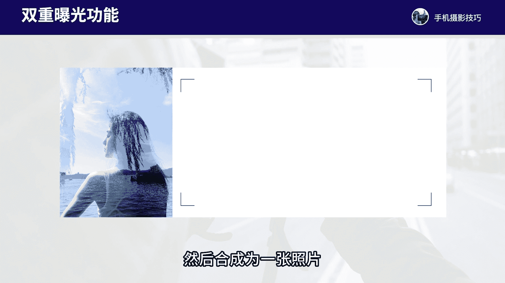

# vivo手机拍照操作课：2：vivo手机特殊拍摄功能详解 📱

在本节课中，我们将学习vivo手机中几个特殊拍摄功能的具体操作方法。这些功能在特定场景下能帮助我们拍出更具创意和视觉冲击力的照片。

上一节我们介绍了基础的拍摄界面，本节中我们来看看如何利用这些特殊模式。

## 🌅 全景模式

全景模式主要用于拍摄视野开阔的风景或高大的建筑。拍摄时需要双手平稳地移动手机。

以下是全景模式的两种拍摄方法：

*   **横拍全景**：适合拍摄广阔的风景。将手机横置，从画面左侧开始，平稳向右移动，直到构图满意即可停止拍摄。
    
    

*   **竖拍全景**：适合拍摄高大的建筑、树木或人物。将手机竖置，从画面底部开始，平稳向上移动，可以拍出具有纵深感的高大画面。
    
    
    

**操作核心**：观察取景框中的圆圈引导按钮，保持其平稳移动，构图完成后即可手动停止，无需环绕一周。

## 🔬 超级微距

超级微距功能用于拍摄极其细微的物体，如水珠、小花或小昆虫。拍摄的关键是稳定和精准对焦。

以下是拍摄微距的要点：

*   **稳定与距离**：手持手机必须非常稳定，并将镜头靠近被摄物体约 **2-3厘米** 的距离。
*   **精准对焦**：在屏幕上反复点击主体（如水珠或昆虫）进行对焦，直到画面清晰。
*   **调整清晰度**：如果拍出的照片不清晰，可轻微调整拍摄距离，重新对焦。

**操作入口**：在拍摄界面顶部找到并点击 **花朵图标** 即可开启微距模式。

## 🌕 超级月亮

超级月亮模式能帮助我们拍摄又大又清晰的月亮照片。其核心是使用长焦并保持稳定。

以下是拍摄月亮的步骤：

1.  **放大变焦**：将变焦倍数调整到 **10倍** 以上，以获得更大的月亮画面。
2.  **稳定手机**：双手握稳手机，防止画面抖动。可使用三脚架辅助。
3.  **对焦与拍摄**：点击屏幕上的月亮进行对焦，待画面清晰稳定后按下快门。

**构图技巧**：可以寻找树枝等作为前景，与月亮形成呼应，让画面更富意境。

## 🏃 运动模式

运动模式专为捕捉高速运动的物体而设计，如奔跑的人物、飞鸟或行驶的车辆。

使用此模式的方法如下：

*   **进入模式**：在相机模式中选择“运动”模式。
*   **跟随拍摄**：将手机对准运动主体，并跟随其运动方向移动，在合适的瞬间按下快门。

该模式能有效凝固动态瞬间，拍出细节清晰的运动照片。

## 🖼️ 高像素模式

高像素模式主要用于对画质有极高要求的场景，如弱光环境或需要大量后期处理的风景照片。它能保留更多的画面细节和色彩信息。

适用场景举例：

*   **弱光环境**：在夜晚或光线不足时拍摄，能获得更好的细节。
*   **风景大片**：拍摄逆光或大场景风景，为后期调整保留充足空间。

## 👥 双重曝光

双重曝光功能可以将两张照片合成为一张，创造出富有抽象感和艺术感的画面。

以下是创作双重曝光照片的流程：

1.  **拍摄第一张（主体）**：通常先拍摄一张人物照片，建议选择简洁的背景以突出主体。
    
2.  **拍摄第二张（叠加层）**：人物离开后，拍摄一张风景或纹理照片（如树枝、天空）。
    
3.  **自动合成**：相机自动将两张照片合成，得到最终的双重曝光效果。
    

---

本节课中我们一起学习了vivo手机的六项特殊拍摄功能：**全景模式**、**超级微距**、**超级月亮**、**运动模式**、**高像素模式**和**双重曝光**。虽然这些功能在日常中可能不常用，但在遇到合适的场景时灵活运用，能极大地提升我们照片的创意性和表现力。建议大家先熟悉这些功能，以便在需要时能随时调用。