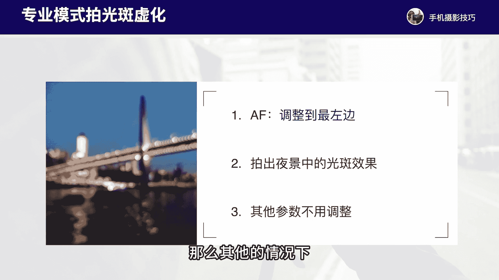

# vivo手机拍照操作课：3：专业模式的参数调整和详细运用 📸

在本节课中，我们将要学习vivo手机专业摄影模式中各个参数的功能与作用，以及如何在不同拍摄场景下进行参数调整，从而拍出更专业的照片。

## 界面与基础设置

上一节我们介绍了如何进入专业模式，本节中我们来看看专业模式的拍摄界面和基础设置。

进入vivo手机的专业模式后，我们首先看到拍摄界面。界面左侧有一列功能按钮。

以下是左侧按钮的功能说明：

*   **设置按钮**：点击进入设置菜单。这里的选项与普通拍照模式类似。建议在“构图限制”中打开水平仪，方便构图。水印和包围曝光功能可根据个人需要选择是否开启，但通常建议关闭。
*   **地平线校正**：开启后，屏幕中央会出现一条黄线，用于辅助校正拍摄时手机的水平状态。
*   **蔡司自然色彩**：此功能可根据个人喜好选择开启或关闭。实际体验中，开启与否对照片色彩的影响并不显著，通常可以保持关闭。
*   **RAW格式**：开启此格式可以保留更多的原始图像信息，为后期调色提供更大空间。但RAW格式文件体积较大，会占用更多存储空间，一般建议关闭。
*   **闪光灯**：在专业模式下，通常建议将闪光灯保持关闭状态。

## 核心参数详解

了解了基础设置后，我们来看界面右侧的核心参数调整区域。这些参数是控制照片效果的关键。

界面顶部有几个镜头切换按钮，分别代表**超广角镜头**、**1倍标准镜头**、**2倍镜头**以及**长焦镜头**。你可以根据构图需要选择合适的焦距。我们通常使用1倍标准镜头进行讲解。

右侧的参数栏，我们从下往上逐一介绍：

*   **曝光补偿 (EV)**：此参数直接、简单地调节画面的整体明亮度。在专业模式中，建议始终将其保持在**0**，无需调整。
*   **感光度 (ISO)**：此参数控制相机感光元件对光线的敏感程度。参数下方有一个字母 **A**，代表自动模式。点击 **A** 即可切换为自动感光度。**ISO值越高，画面越亮，但随之产生的噪点也越多**。在白天光线充足时，建议将ISO设置在 **50 到 200** 之间。
*   **快门速度 (S)**：此参数控制相机快门打开的时间长短。**快门速度越慢（如1/15秒、1秒），曝光时间越长，进入相机的光线越多，画面越亮**。反之，**快门速度越快（如1/2000秒），曝光时间越短，画面越暗**。快门速度也决定了捕捉动态瞬间的能力。
*   **白平衡 (WB)**：此参数用于调节画面的整体色调。通常我们使用自动模式即可，点击参数旁的 **A** 保持默认。
*   **对焦模式 (AF)**：此参数用于手动控制对焦距离。滑块拉到最上方（**∞** 符号处）表示对焦到最远处；拉到最下方则表示对焦到最近处。一般情况下，我们无需手动调整此参数，直接点击屏幕即可完成对焦。只有在拍摄特定题材（如光斑、星空）时才需要手动调整。
*   **测光模式**：此参数包含平均测光、中央重点测光和点测光三种模式。通常保持默认的中央重点测光即可，无需单独设置。

**总结一下**：在专业模式中，我们主要需要调整的参数只有 **感光度 (ISO)** 和 **快门速度 (S)**，偶尔根据场景需要调整 **对焦模式 (AF)**。**曝光补偿 (EV)**、**白平衡 (WB)** 和 **测光模式** 这三个参数通常无需调整。

## 常用拍摄场景与参数设置

掌握了每个参数的作用后，我们来看看专业模式在哪些具体场景下能发挥最大效用。

专业模式并非适用于所有场景，它主要在以下几种特定拍摄题材中能帮助我们获得更好的效果：

以下是四种常见的专业模式拍摄场景及参数设置建议：

1.  **拍摄星空 🌌**
    *   **核心思路**：在极暗环境下，通过提高感光度和延长曝光时间来捕捉微弱星光。
    *   **参数设置**：
        *   **感光度 (ISO)**：调整到 **3200** 左右。
        *   **快门速度 (S)**：调整到 **20秒 至 32秒** 之间，根据实际画面亮度微调。
        *   **对焦模式 (AF)**：将滑块拉到最右边（**∞**），手动对焦到无穷远。
    *   **注意事项**：需使用三脚架保持手机绝对稳定。

2.  **高速摄影（定格瞬间）💦**
    *   **核心思路**：使用极快的快门速度凝固高速运动的瞬间，如水花、飞鸟等。
    *   **参数设置**：
        *   **感光度 (ISO)**：调整到 **400 至 800** 左右。
        *   **快门速度 (S)**：调整到 **1/2000秒** 或更快。
    *   **注意事项**：必须在**光线非常充足**的环境下拍摄，否则画面会因快门过快而曝光不足变黑。

3.  **追焦摄影（表现动感）🚗**
    *   **核心思路**：使用较慢的快门速度，并在曝光过程中平稳移动手机跟随运动主体，从而拍出主体清晰、背景动态模糊的照片。
    *   **参数设置**：
        *   **感光度 (ISO)**：调整到 **50 至 100**，尽可能降低。
        *   **快门速度 (S)**：调整到 **1/30秒 至 1/60秒**（1/30秒效果更明显）。
    *   **拍摄技巧**：选择傍晚或夜晚等光线较弱的环境。先对焦在路面，待车辆进入取景框后，平稳移动手机跟随车辆一小段距离，再按下快门。

4.  **拍摄虚化光斑 ✨**
    *   **核心思路**：通过手动将对焦点调到最近处，使所有景物失焦，将点光源虚化成美丽的光斑。
    *   **参数设置**：
        *   **对焦模式 (AF)**：将滑块拉到最左边。
        *   其他参数（ISO、S）可保持自动或根据环境光线微调。
    *   **适用场景**：夜晚的灯光、圣诞树彩灯等点光源场景。

## 总结

本节课中我们一起学习了vivo手机专业模式的界面布局、六大核心参数（曝光补偿、感光度、快门速度、白平衡、对焦、测光）的具体功能，并重点探讨了在**拍摄星空**、**高速摄影**、**追焦摄影**和**虚化光斑**这四种典型场景下的参数设置思路与技巧。

请记住，专业模式的核心目的是在**光线复杂或极端**（如极暗、需捕捉高速瞬间）的场景下，通过手动控制**感光度**和**快门速度**这两个关键参数，来获得理想的曝光和画面效果。在白天光线充足的日常拍摄中，使用普通拍照模式往往更加便捷高效。

希望大家课后能对照教程，熟悉专业模式的每个参数，并尝试在推荐的四种场景中进行实践练习。下节课我们将继续深入学习其他摄影技巧。