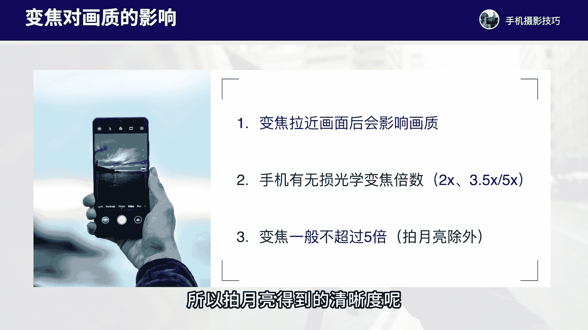
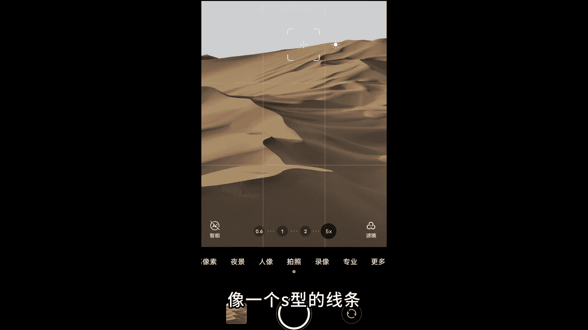

# vivo手机拍照操作课：4：vivo手机变焦功能的拍摄技巧 📸

在本节课中，我们将学习vivo手机变焦功能的具体操作与拍摄技巧。掌握正确的变焦方法，能有效提升照片画质，并帮助你通过不同焦距进行更有创意的构图。

## 正确使用变焦功能

在vivo手机的拍摄界面，我们可以直接点击屏幕上预设的数字（如0.6x、1x、2x、5x）来切换焦距。这是使用变焦功能的核心操作。

**核心操作：点击数字切换焦距，而非双指放大。**

*   **正确操作**：直接点击屏幕上的数字（如 `1x`、`2x`、`5x`）进行切换。这调用的是手机的光学变焦或高质量混合变焦，画质损失最小。
*   **错误操作**：避免使用两个手指在屏幕上滑动放大。这通常会导致画质严重下降的数码变焦。

如果直接滑动到一个非预设的数字焦距（如3.7x），画质压缩会更加明显。因此，在普通拍摄中，变焦倍数一般不建议超过5倍（拍摄月亮等特殊场景除外）。

## 认识你的变焦选项

不同型号的vivo手机，其预设的变焦数字可能略有不同。了解你手机的光学变焦选项是关键。

以下是常见机型的变焦选项示例：

*   **vivo X80 Pro**：提供 `0.6x`、`1x`、`2x`、`5x` 等选项。
*   **vivo X90 Pro+ 或更新机型**：可能提供 `0.6x`、`1x`、`2x`、`3.5x` 等选项。其中的 `10x` 通常是混合变焦，画质压缩相对较大。

**核心概念**：`光学变焦` 画质最佳，`混合变焦` 次之，`数码变焦` 画质损失最大。我们应优先使用光学变焦倍数进行拍摄。

## 变焦在构图中的实际运用

上一节我们介绍了变焦的基本操作，本节中我们来看看如何利用不同焦距进行创造性构图。变焦的本质是改变视角和取景范围，从而突出主体、简化画面或展现细节。

以下是几个运用变焦构图的实例：

**1. 使用长焦简化画面，实现框架构图**
在一处大厅内，使用1倍焦距拍摄时，画面元素较多。切换到5倍长焦后，可以聚焦于远处的门框和塔，形成干净的框架式构图，主体明确，画面简洁。

**2. 使用长焦截取局部，营造意境**
在拍摄婺源秋景时，1倍焦距下的画面虽然信息丰富但缺乏重点。切换到5倍长焦，只截取房屋、树木与晨雾交织的局部，画面瞬间变得如诗如画，意境简约突出。

**3. 拍摄月亮：使用高倍变焦**
拍摄月亮时，3.5倍焦距下的月亮显得较小。切换到10倍或更高倍数（可利用“超级月亮”模式），能让月亮在画面中更突出，构图更极简。但需注意，拍摄普通景物时，高倍变焦对光线要求极高。

**4. 使用长焦突出线条与明暗**
在沙漠中，1倍焦距下的沙丘线条杂乱。使用5倍长焦拉近构图，可以强化远处沙丘优美的S型线条，并在晨光下形成强烈的明暗对比，使画面更具层次感和韵律感。

**5. 使用长焦展现独特层次**
当无法用广角展现盘龙古道全貌时，改用长焦聚焦于远山的线条、光影与烟尘的层次，舍弃前景的杂乱元素，能拍出更具独特感和纵深感的照片。

**6. 广角拍全景，长焦拍细节**
在江南古镇，1倍广角能拍下完整的倒影，展现静谧的全景。而切换到3.5倍长焦，则可以聚焦于建筑局部的结构、瓦檐等细节，表现另一种美感。

## 课程总结

本节课中，我们一起学习了vivo手机变焦功能的核心技巧。

首先，我们掌握了**点击数字切换焦距**的正确操作方法，这是保证画质的基础。其次，我们了解了不同机型的光学变焦选项，认识到应优先使用光学变焦倍数（如 `2x`、`3.5x`）进行拍摄。

最重要的是，我们通过多个实例，学习了如何灵活运用变焦来**简化画面、突出主体、截取局部、强化线条**，从而让构图更具看点和创意。记住：**广角擅长表现广阔场景，长焦则善于捕捉细节与层次**。

今后拍摄时，请先明确你想要表达的重点，再选择合适的焦距进行构图。在光线不足的情况下，尽量避免使用高倍数的数码变焦，以保证照片的清晰度。熟练掌握变焦，你的手机摄影将打开一扇新的大门。

好了，本节课程的讲解就到这里，下节课我们将继续深入学习其他拍摄功能。