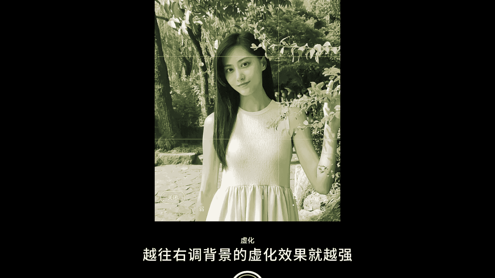
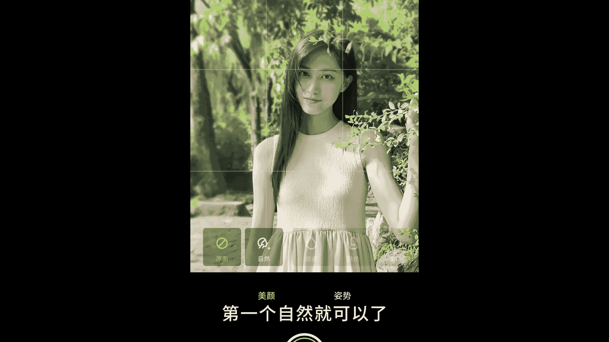
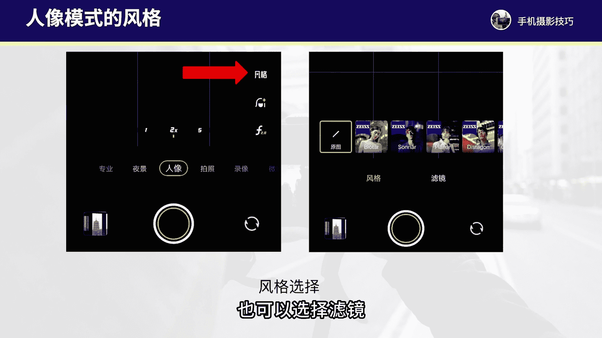
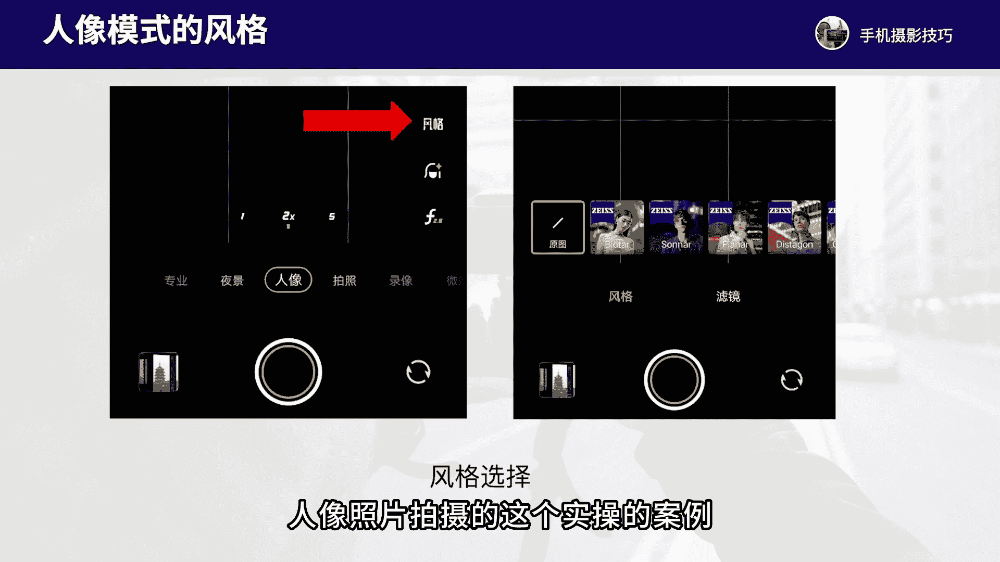
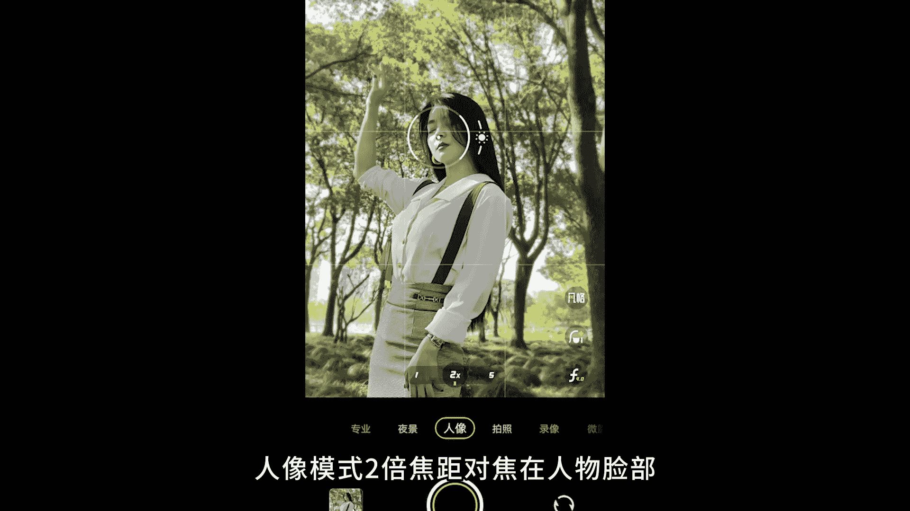
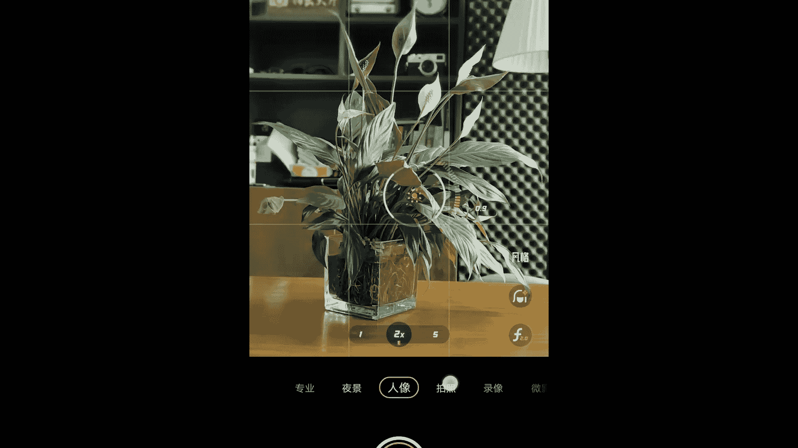

# vivo手机拍照操作课：5：vivo手机人像模式拍摄技巧 📸

在本节课中，我们将学习如何使用vivo手机的人像模式进行拍摄，并掌握拍摄人像照片时需要注意的关键事项。我们将从核心操作、参数调整到实际拍摄案例，系统地讲解如何拍出背景虚化、主体突出的人像作品。

## 概述

人像模式是vivo手机摄影中用于拍摄背景虚化效果的核心功能。它不仅适用于拍摄人物，也适用于拍摄静物、花草等。掌握其操作技巧，能显著提升照片的质感和艺术感。

## 核心操作与概念

上一节我们介绍了人像模式的基本用途，本节中我们来看看其核心的拍摄操作与概念。

人像模式的最佳拍摄焦距是**两倍焦距**。使用一倍焦距拍摄可能导致背景杂乱，且在近距离拍摄人物时可能产生变形。两倍焦距能获得更紧凑、耐看的构图。

人像模式的核心原理是模拟大光圈镜头的浅景深效果，其虚化程度可通过算法调整。公式上，景深与光圈值（F值）成反比，**F值越小，背景虚化效果越强**。在vivo手机中，我们通过调整“F”参数来控制这一点。

## 参数调整详解

了解了基本概念后，接下来我们详细看看人像模式下可调整的各项参数。

进入人像模式后，屏幕下方会出现几个功能按钮。以下是各按钮功能的详细说明：

1.  **虚化强度 (F值按钮)**：
    *   点击 **`F`** 按钮，会出现一个滑动条。
    *   数值**向左**滑动，背景虚化效果**减弱**。
    *   数值**向右**滑动，背景虚化效果**增强**。
    *   此参数用于精确控制背景的模糊程度。

2.  **美颜效果**：
    *   第二个按钮用于调节人物肤色的美颜效果。
    *   建议初学者选择“**自然**”模式，或保持“**自动**”默认设置，无需手动过度调整。

3.  **虚化风格与滤镜**：
    *   第三个按钮提供不同的背景虚化光斑风格（如圆形、旋焦）和滤镜效果。
    *   可以尝试第二、第三或第四个选项以获得独特效果。
    *   对于追求自然感的用户，推荐使用第一个“**原图**”效果。

## 拍摄距离与构图技巧

调整好参数后，拍摄时的距离与构图同样至关重要。

最佳的拍摄距离应控制在**1.5米到2米**之间。这个距离能让人像模式发挥出最好的背景虚化效果。如果拍摄静物或花草，距离可能需要更近，大约在**0.5米到1米**左右。

以下是提升构图水平的几个关键技巧：

*   **低角度仰拍**：适当降低机位（例如在人物腰部或腿部高度），进行轻微仰拍。这样可以让人物身后呈现更多干净的背景（如天空），避开地面杂物，使画面更简洁，人物也更显修长。
*   **高角度俯拍**：当人物位置较低（如蹲坐）时，可以站高一些进行俯拍，以干净的地面或前景作为背景，避免与后方杂乱的景物重叠。
*   **寻找简洁背景**：始终有意识地寻找干净、统一的背景，如天空、墙面或成片的植物，这能让人像模式的效果更突出。

## 实战案例解析

现在，让我们结合具体照片，分析如何运用上述技巧。

*   **场景**：芦苇丛中，背景杂乱。
*   **操作**：切换至人像模式，使用两倍焦距。将机位降低至人物大腿高度，轻微仰拍，使天空成为背景。对焦于人物脸部后拍摄。
*   **效果**：前景和背景的杂草被虚化，人物突出，构图干净。

*   **场景**：公园草丛，背景树木杂乱。
*   **操作**：人像模式，两倍焦距。机位在人物腰部高度，侧身仰拍。对焦于脸部。
*   **效果**：天空成为主要背景，虚化柔和，人物线条优美。

*   **场景**：树林中，人物蹲坐于草地。
*   **操作**：人像模式，两倍焦距。采用较高机位俯拍，使草地成为背景，避免人物与后方树木重合。对焦于脸部。
*   **效果**：获得层次感丰富的柔美虚化效果。

## 拓展应用：拍摄静物与花草

人像模式并非专属于人物摄影。只要你想突出主体、虚化背景，都可以使用它。

*   **拍摄静物**（如桌面上的相机）：进入人像模式，使用两倍焦距。对焦于主体后，可以适当下拉“小太阳”图标降低曝光，以增强明暗对比和质感，然后拍摄。

*   **拍摄花草**：同样使用人像模式的两倍焦距。将对焦点放在花朵上，可微调曝光后拍摄，能获得类似微距的虚化效果。

**注意**：人像模式对距离较远的风景或建筑无效，因为它需要计算主体与背景的距离差。有效拍摄距离通常如前所述。

## 重要注意事项总结

在本节课的最后，我们来总结一下使用vivo手机人像模式时必须牢记的几个要点：

1.  **保证光线充足**：人像模式通常调用像素较低的副摄像头。在光线良好的环境下拍摄，能确保照片拥有最佳画质。
2.  **坚持使用两倍焦距**：无论是拍人还是拍物，**两倍焦距**都是获得最佳构图和虚化效果的首选。
3.  **控制好拍摄距离**：将手机与主体之间的距离保持在**1.5至2米**（拍静物可更近）。距离太远虚化效果不佳，太近则可能对焦失败。
4.  **善用构图技巧**：灵活运用**低角度仰拍**或**高角度俯拍**来寻找简洁背景，是拍出好照片的关键。

## 课程总结

本节课中，我们一起深入学习了vivo手机人像模式的核心操作。我们从理解两倍焦距的优势开始，学习了如何调整虚化强度、美颜和风格等参数，并掌握了控制拍摄距离与运用仰拍、俯拍等构图技巧的方法。通过多个实战案例，我们看到了这些技巧如何应用于人物和静物拍摄中。记住，多练习、多尝试不同的角度和距离，你就能熟练运用人像模式，拍出背景虚化柔美、主体突出的精彩照片。

下节课我们将继续深入学习其他摄影功能。