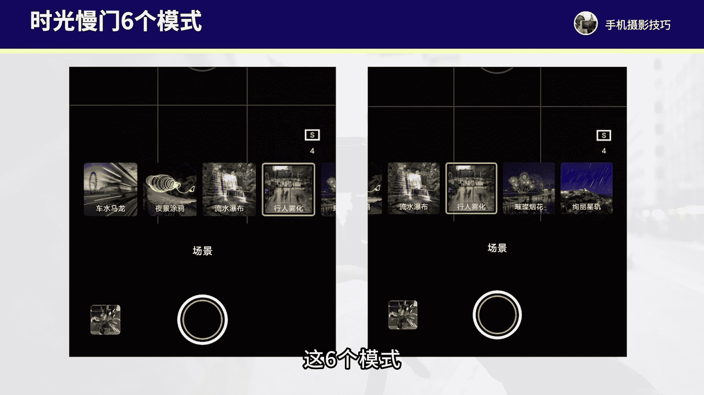
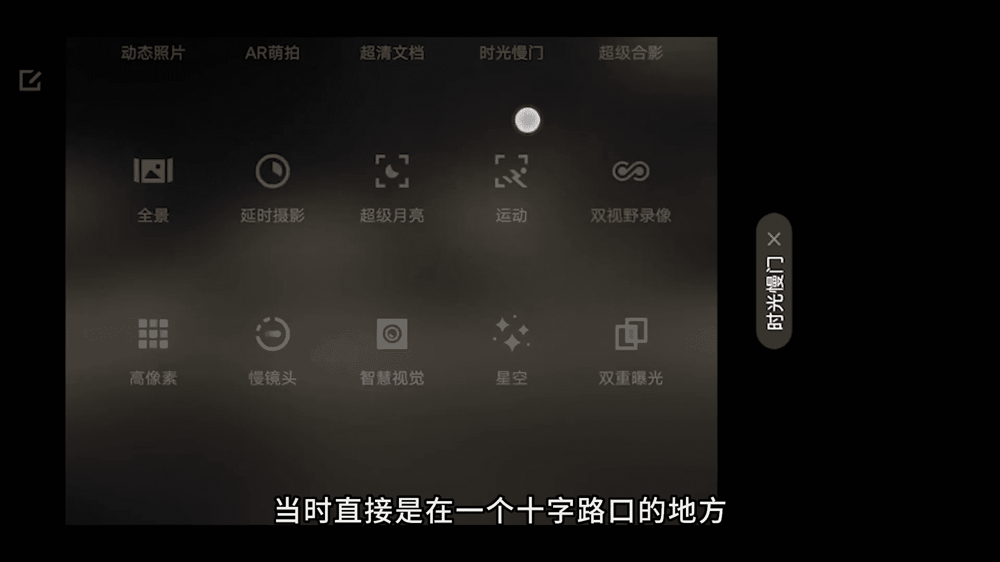
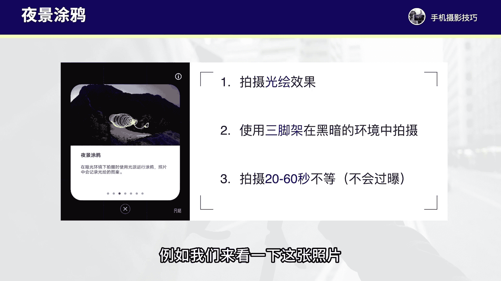
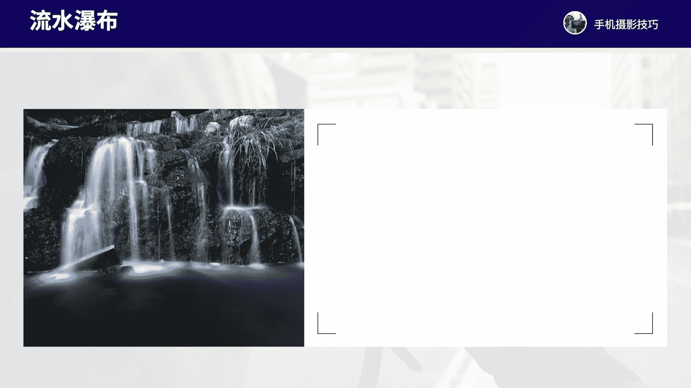
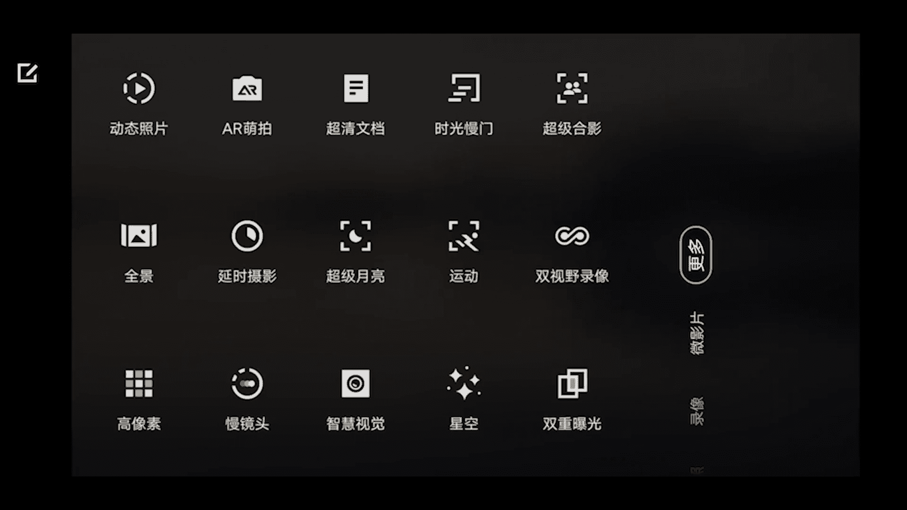
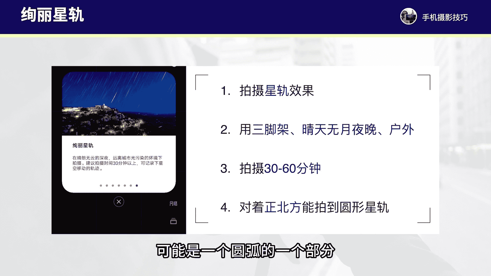

# vivo手机拍照操作课：6：玩转vivo手机的慢门摄影 📸

在本节课中，我们将要学习如何使用vivo手机的“时光慢门”模式。这个模式主要用于拍摄具有拉丝效果的慢门照片，能够将动态场景转化为富有艺术感的静态画面。我们将详细介绍该模式下的六个子功能及其具体应用场景。

## 概述

“时光慢门”模式位于vivo手机相机应用的“更多”选项中。进入后，您会看到六个不同的拍摄模式：**车水马龙**、**夜景涂鸦**、**流水瀑布**、**行人物化**、**璀璨烟花**和**绚丽星轨**。每个模式都针对特定的慢门摄影场景进行了优化。

接下来，我们将逐一解析这六个模式。

## 1. 车水马龙模式 🚗

车水马龙模式主要用于拍摄夜晚车流的灯光轨迹，可以将行驶中的车辆拍出拉丝的光带效果。

以下是使用此模式的关键要点：
*   **取景**：选择视野开阔的位置，例如天桥或十字路口。
*   **稳定设备**：**强烈建议使用三脚架**。新款vivo手机防抖性能较好，手持拍摄需确保手机**极其稳定**。
*   **拍摄时长**：通常拍摄**3到6秒**即可出片。在车流较稀疏或想获得更长轨迹时，可延长至30秒左右。
*   **操作步骤**：进入模式后，点击画面中的灯光进行对焦，然后按下快门即可。

例如，在十字路口使用此模式拍摄约6秒，即可获得车流拉丝轨迹的照片。将手机置于低机位，也能拍出公交车驶过时的抽象光轨效果。

## 2. 夜景涂鸦模式 🎨

夜景涂鸦模式可以拍摄抽象的光绘涂鸦效果，让您在黑暗中用光源“作画”。

以下是使用此模式的关键要点：
*   **环境**：需在**光线非常暗**的夜晚环境下使用。
*   **稳定设备**：**必须使用三脚架**，以保证画面清晰。手持极易导致模糊。
*   **拍摄时长**：通常在**20秒到1分钟**之间，以便描绘出完整的图案。
*   **光线控制**：此模式通常不易过曝，但应避免在拍摄过程中有太强的环境光或灯光直射镜头。

例如，在黑暗房间中，以相机为主体，用另一部手机屏幕的彩色图片在背景中挥舞，即可拍出光轨环绕的抽象照片。使用烟花棒或小灯在空中画出圆形等图案，也能创造出富有视觉冲击力的光绘作品。

## 3. 流水瀑布模式 🌊

流水瀑布模式专用于拍摄水流、瀑布或云彩的拉丝效果，使动态的景物变得柔和平滑。

以下是使用此模式的关键要点：
*   **适用场景**：瀑布、溪流、喷泉、海浪以及移动的云彩。
*   **稳定设备**：**建议使用三脚架**。新款手机手持需尽量拿稳。
*   **拍摄时长**：一般拍摄**10到30秒**。水流拉丝效果几秒即可呈现，云彩拉丝则需要更长时间。
*   **拍摄时机**：建议在**清晨或傍晚**光线柔和时拍摄，中午强光下容易过曝且色彩平淡。

例如，在日落时分的湖边拍摄喷泉，约8秒即可将水柱拍成丝滑状态。拍摄天空中的流云，25秒左右就能得到云彩拉丝的效果。

## 4. 行人物化模式 👥

行人物化模式用于在人多杂乱的场景中，虚化走动的人物和车辆，突出静止的主体。

以下是使用此模式的关键要点：
*   **适用场景**：游客众多的景点、繁华的街道等。
*   **稳定设备**：**建议使用三脚架**。新款手机手持拍摄需保持稳定。
*   **拍摄时长**：通常拍摄**4到6秒**即可有效虚化移动物体。
*   **构图**：确保想要突出的主体（如建筑、雕像）在画面中保持静止。

例如，在游客众多的西湖边拍摄亭子，使用此模式拍摄约20秒，走动的人群会被虚化，而静止的亭子则保持清晰，从而得到一张干净、主次分明的照片。

## 5. 璀璨烟花模式 🎆

璀璨烟花模式专门用于捕捉烟花爆炸瞬间的绚丽轨迹和拉丝效果。

以下是使用此模式的关键要点：
*   **稳定设备**：新款vivo手机可尝试手持，老款手机**建议使用三脚架**。
*   **拍摄时长**：**2到3秒**即可记录下烟花绽放的主要过程。
*   **拍摄时机**：在节日或有烟花的夜晚使用。

使用此模式，可以轻松记录下烟花从爆开到火花下落的完整拉丝光轨，操作简单且效果出众。

## 6. 绚丽星轨模式 🌌

绚丽星轨模式用于拍摄星空移动产生的星轨照片，对环境和设备要求较高。

以下是使用此模式的关键要点：
*   **环境要求**：需在**户外、无月、晴朗**的夜晚，并**远离城市光污染**。
*   **稳定设备**：**必须使用三脚架**固定手机。
*   **拍摄时长**：至少需要**连续拍摄30分钟以上**，时间越长星轨越完整。
*   **拍摄方向**：对准**正北方**拍摄，可以拍到以北极星为中心的圆形星轨；对准其他方向则可能拍到弧形星轨。
*   **构图建议**：加入地面建筑、树木等作为前景，可以增强照片的层次感和视觉冲击力。

例如，对准正北方拍摄60分钟，可以得到圆形的星轨照片。搭配前景建筑构图，能让画面更具故事性和观赏性。

## 总结

本节课我们一起学习了vivo手机“时光慢门”的六个核心模式：**车水马龙**、**夜景涂鸦**、**流水瀑布**、**行人物化**、**璀璨烟花**和**绚丽星轨**。每个模式都对应着独特的慢门摄影场景，掌握它们的关键在于理解其适用环境、确保设备稳定以及控制好拍摄时间。

重点熟悉这六个模式的操作，当您遇到合适的场景时，就能灵活运用，创作出充满美感和抽象艺术感的慢门摄影作品。