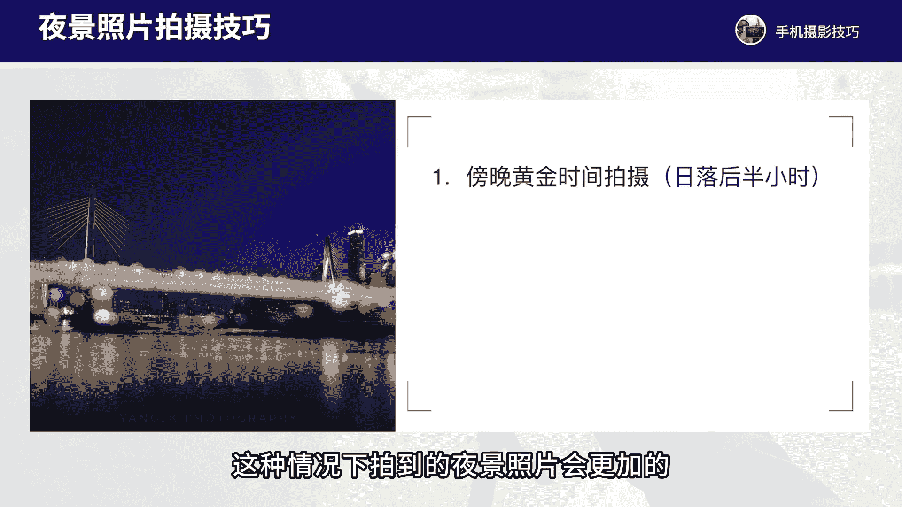

# vivo手机拍照操作课：7：夜景模式拍摄技巧 📸

在本节课中，我们将学习如何使用vivo手机的夜景模式，并掌握拍摄夜景照片的取景与构图方法。通过学习，你将能够拍出色彩饱满、曝光通透的夜景作品。

## 概述

夜景模式是vivo手机中一项强大的功能，它能显著提升弱光环境下的拍摄效果。本节课程将详细介绍其基本操作，并重点讲解拍摄时机、构图技巧与色彩运用，帮助你从零开始掌握夜景摄影。

## 夜景模式基本操作

vivo手机的夜景模式操作非常简便。你只需在相机应用中切换到“夜景”模式，然后直接拍摄即可。

以下是操作的核心步骤：
1.  打开相机应用。
2.  滑动模式选项，找到并选择“夜景”模式。
3.  对准拍摄场景，保持手机稳定，按下快门。

**核心要点**：拍摄时务必保持手机稳定。手持拍摄时，尽量拿稳手机；如果使用老款机型或追求极致画质，可以配合三脚架使用。新款vivo手机的防抖功能通常足够应对手持夜景拍摄。

## 夜景拍摄的黄金时间

上一节我们介绍了基本操作，本节中我们来看看拍摄夜景的第一个关键技巧——把握黄金时间。

拍摄夜景的最佳时机是日落后约半小时内的“蓝调时刻”。此时，天空尚未完全变黑，呈现深邃的蓝色，与城市灯光形成美妙的色彩与明暗对比。

请看以下对比示例，理解时间的重要性：
*   **效果不佳的示例**：在夜晚10点后拍摄，天空往往一片死黑，缺乏层次和色彩。
*   **效果出色的示例**：在蓝调时刻拍摄，天空保有蓝色调，灯光也已亮起，画面色彩丰富、细节饱满、曝光均衡。

因此，**强烈建议在日落后半小时内进行拍摄**，这是获得高质量夜景照片的首要条件。

## 夜景构图技巧

掌握了拍摄时机后，接下来我们探讨如何通过构图让夜景照片更具吸引力。好的构图能突出主体，增强画面的层次感和故事性。

以下是几种实用的夜景构图方法：

**1. 突出城市地标**
寻找并利用城市中的标志性建筑（如高塔、桥梁、特色大厦）作为画面主体。即使在小城市，也能找到合适的高楼或独特建筑作为视觉中心。

**2. 利用倒影创造对称**
寻找水面、玻璃等反光物体，拍摄建筑与倒影形成的对称画面。这种构图能增加画面的趣味性和形式美感。

**3. 加入前景增强层次**
在画面中加入前景元素（如礁石、桥梁、植物），与背景的建筑主体形成前后对比与呼应。这能有效增强画面的空间纵深感和层次感。

**4. 运用冷暖色彩对比**
充分利用蓝调时刻的冷色调天空与城市灯光的暖色调（橙、黄、红），在画面中形成鲜明的冷暖色彩对比。这种对比是夜景照片吸引眼球的一大亮点。

## 总结

本节课中，我们一起学习了vivo手机夜景模式的拍摄技巧。

我们首先了解了**夜景模式的基本操作**，即切换模式并稳定拍摄。随后，我们深入探讨了三个核心技巧：第一，把握**日落后半小时的蓝调黄金时间**；第二，运用多种**构图方法**，如突出地标、利用倒影、加入前景；第三，巧妙运用**冷暖色彩对比**来提升画面的视觉吸引力。

记住，出色的夜景照片源于精心的准备与观察，而不仅仅是按下快门。多尝试不同的时间和视角，你也能用vivo手机拍出令人赞叹的夜景作品。

---

下节课我们将继续深入学习其他摄影技巧。