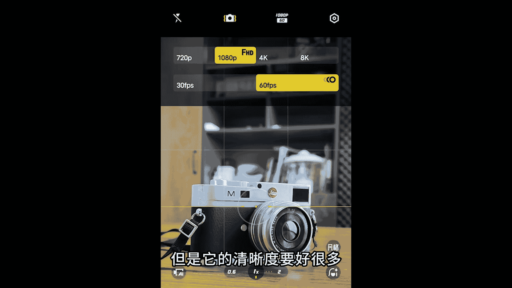
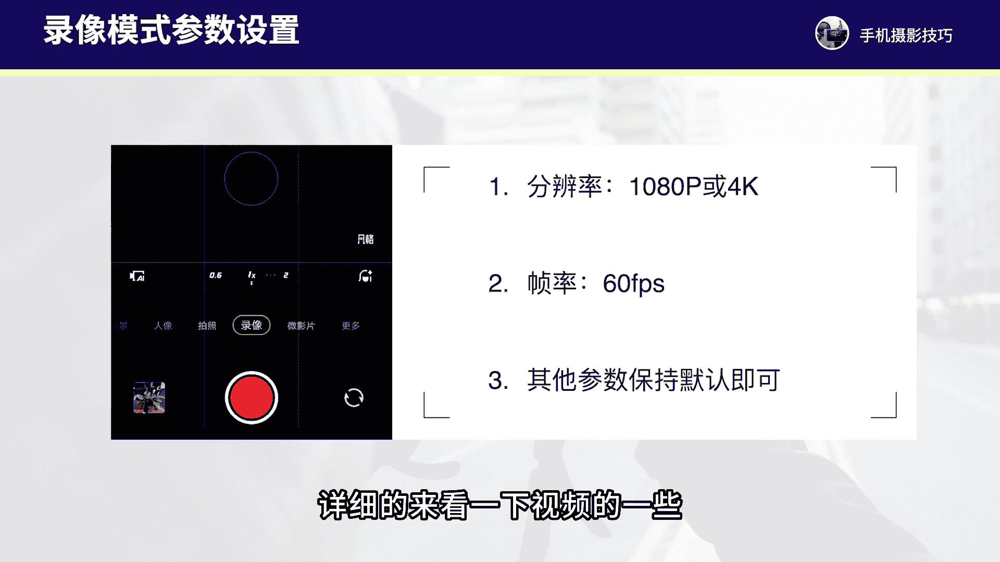
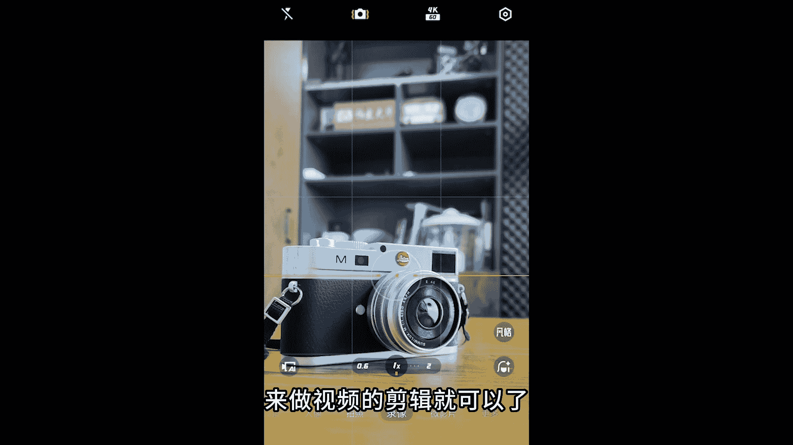
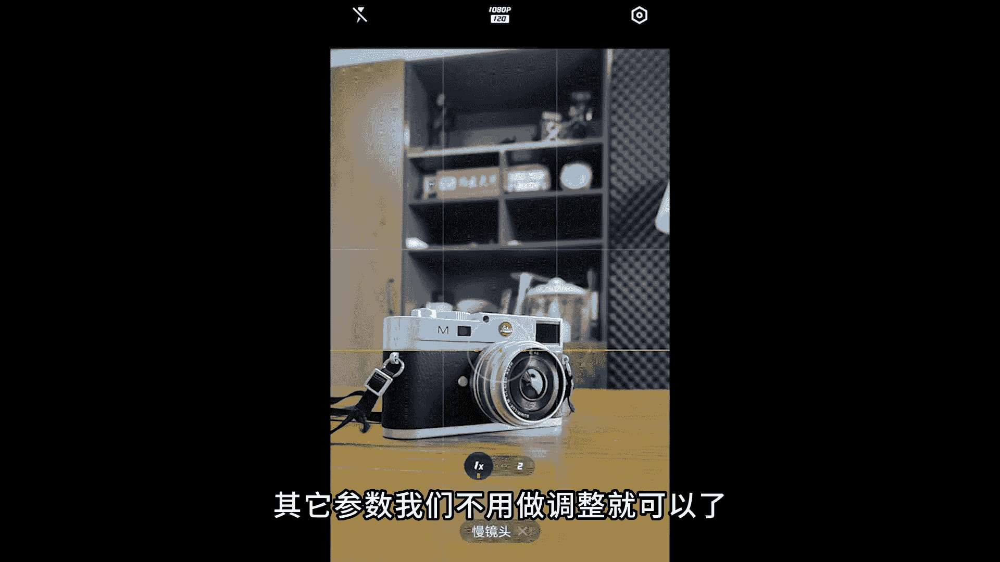
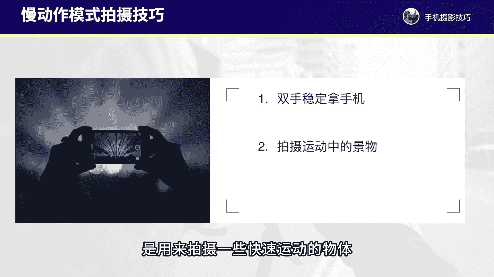
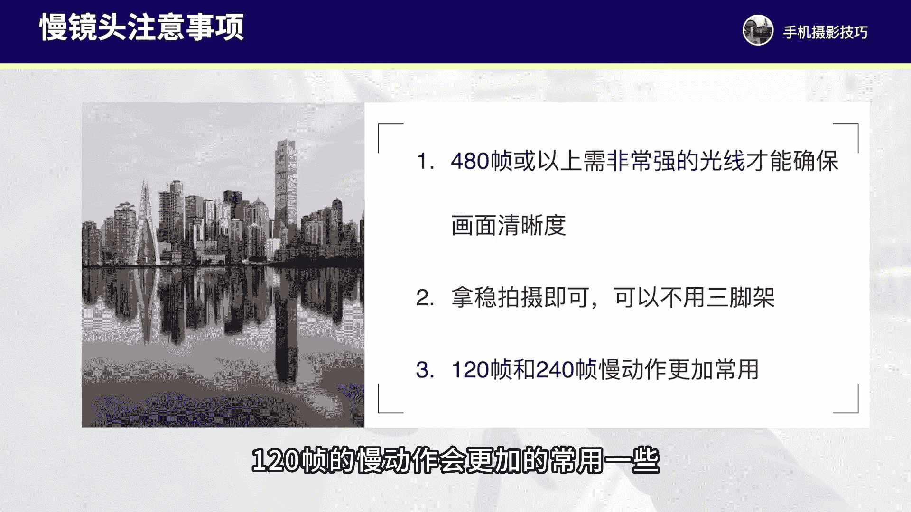

# vivo手机拍照操作课：8：录像与慢动作拍摄技巧 📹

在本节课中，我们将学习vivo手机的录像模式与慢动作模式的设置与基础拍摄操作。我们将从参数调整开始，逐步讲解拍摄技巧，并通过具体案例帮助你快速上手。

## 录像模式设置与基础操作

上一节我们介绍了拍照功能，本节中我们来看看如何录制视频。录像模式主要用于拍摄视频。在此模式下，我们首先需要调整几个核心参数。

以下是录像模式的主要参数设置：

1.  **分辨率**：在拍摄界面顶部点击按钮可调整分辨率。建议选择`1080P`或`4K`。`1080P`清晰度尚可且节省存储空间；`4K`清晰度更高，但占用存储空间更大。若手机存储空间充足，建议使用`4K`分辨率。
2.  **帧率**：建议将帧率调整为`60FPS`。使用此帧率拍摄的视频，画面流畅度会更好。
3.  **其他参数**：保持默认设置即可。

调整好基本参数后，拍摄视频时，我们需要寻找独特的视角，并运用多种运镜方式让画面动起来。

以下是几种常见的运镜方式：

*   **推进**：平稳地将手机向前移动。
*   **横移**：将手机向左或向右水平移动。
*   **环绕**：围绕一个主体进行弧形移动。

通过组合不同的景别和运镜，可以让视频更具动感。下面我们通过一个在树林中拍摄的案例，详细讲解基础操作。

例如在树林中，拍摄前可长按屏幕两秒钟锁定对焦与曝光，然后平稳地持手机向前推进拍摄。接着，可以靠近一片树叶，长按屏幕锁定对焦曝光后，做一个小的环绕运镜来拍摄树叶细节。此外，可以蹲下将手机贴近草丛，拍摄露珠等微距画面细节。

拍摄时，可以蹲下以草地作为前景，后方纳入天空和路面，然后向左横移运镜拍摄。同样，在树下拍摄时，可以将手机贴近树干，对焦后方树叶后锁定对焦，再向左横移运镜，利用树作为前景能增强画面动感。还可以拍摄风吹动树叶的画面。拍摄多段素材后，通过剪辑软件进行合成即可成片。

## 微影片模式简介

接下来，我们了解一下vivo手机中的“微影片”模式。点击进入此模式后，会发现其中预设了多种拍摄模板。

如果使用的是新款vivo手机，微影片模式的形式可能有所不同。若想拍摄某种特定风格，例如夜景，可以点击“夜景”模板进行查看。

该模式已为我们设定好分镜画面，例如第一段拍3.5秒，第二段拍3秒，后续段落也按提示拍摄。我们可以参照这些预设画面进行拍摄，从而快速出片。

这是一个预设的视频拍摄模板功能。新款手机的模板可能不同，但核心功能一致：直接套用模板进行拍摄，可以更加省时省力。不过，这些模板并非万能，有些场景限制较多。通常，我们了解微影片的功能即可，日常拍摄建议使用录像模式自行运镜取景，后期再使用剪映等软件进行剪辑。

## 慢动作模式拍摄详解

现在，我们来看手机的慢镜头（即慢动作）模式如何设置与拍摄。慢动作拍摄的视频画面速度比常规视频更慢。

在vivo手机的慢动作模式中，主要可调整两个参数：

1.  **分辨率**：建议调整为`1080P`，以保证清晰度。
2.  **帧率**：建议使用`120帧`或`240帧`。`480帧`或更高的帧率会导致视频过慢，且画质下降明显。

其他参数保持默认即可。最常用的参数组合是`1080P`分辨率搭配`120帧`帧率。

那么，慢动作模式有哪些拍摄技巧和操作要点呢？

首先，通常需要双手持稳手机进行拍摄，以避免画面严重晃动，尽可能保持画面稳定。其次，慢动作主要用于拍摄快速运动的物体。

一定要寻找动感强烈、画面丰富的场景进行拍摄，这样慢动作呈现的效果才更具视觉冲击力。此外，慢动作拍摄必须在光线充足的环境下进行，以确保画面更清晰、质感更好。

慢动作拍摄并非适合所有场景，它主要适用于以下几类题材：

以下是适合用慢动作表现的拍摄题材：

*   **人物的动作与神态**：例如人物走路的脚步动作、手部动作、随风飘动的裙摆或头发、脸部的笑容与情绪变化、人物奔跑等瞬间。慢动作可以更具体地展现人物的动作和神态细节。
*   **自然界的动态场景**：例如风吹草动、树叶摇曳、浪花、流水、瀑布等。慢动作可以捕捉到更多细微的瞬间。
*   **日常生活与动物**：例如街头场景，或动物奔跑、飞鸟、小猫小狗的动作。使用慢动作可以记录更丰富的画面细节，增强感染力。

拍摄慢动作视频时，也需要注意几个问题：

以下是拍摄慢动作视频的注意事项：

1.  **注意光线**：如果设置`480帧`或更高的帧率，必须保证非常强的光线才能确保画面清晰。因为高帧率意味着单位时间内需要捕捉更多画面，对光线要求更高。
2.  **持稳与运镜**：无需三脚架，双手持稳拍摄即可。在拍摄过程中，可以结合推进、环绕、横移或后拉等运镜方式，让画面保持一定的动感。
3.  **帧率选择**：尽可能使用`120帧`或`240帧`，其中`120帧`更为常用。

## 课程总结

本节课中，我们一起学习了vivo手机录像模式的参数设置与基础运镜操作，以及慢动作模式的适用场景、参数设置和拍摄技巧。下节课我们将详细学习延时摄影的拍摄与操作。