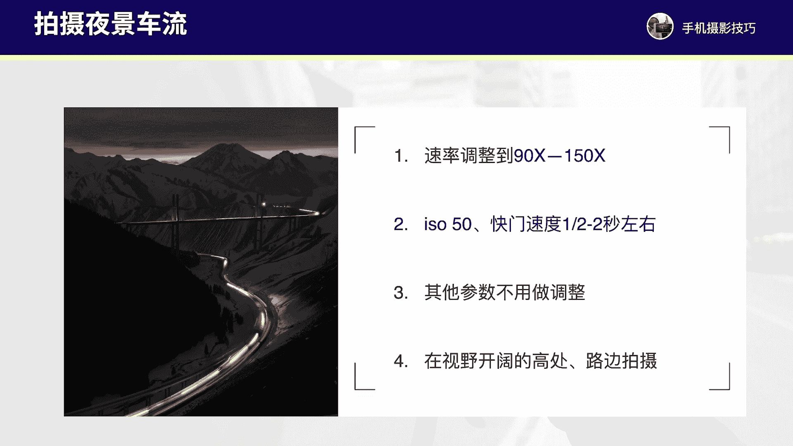

# vivo手机拍照操作课：9：玩转延时摄影拍出酷炫视频 🎬

在本节课中，我们将学习如何使用vivo手机的专业延时摄影模式，包括核心参数设置与针对不同场景的拍摄技巧。延时摄影能将长时间缓慢变化的场景压缩成一段短小精悍、动感十足的视频。

## 界面与基础参数设置

上一节我们介绍了延时摄影的概念，本节中我们来看看vivo手机延时摄影模式的具体操作界面和基础参数。

进入vivo手机的相机应用，点击“更多”选项，选择“延时摄影”模式。

在拍摄界面中，我们需要关注几个关键参数：

以下是界面中需要调整的核心参数列表：
1.  **分辨率与帧率**：点击顶部或左侧中间的按钮，建议将分辨率设置为 **4K**，帧率保持默认的 **30fps** 即可。
2.  **防抖功能**：界面左下方的防抖按钮，建议保持默认关闭状态。因为延时摄影通常需要使用三脚架固定拍摄，开启防抖反而不利于画面稳定。
3.  **拍摄速率（倍速）**：这是最重要的参数之一，位于画面右上方（竖屏时在右下方）。点击后可以手动调整速率倍数，**公式为：最终视频时长 = 实际拍摄时长 / 速率倍数**。默认的“自动”模式变化感较慢，建议手动设置。
4.  **专业参数**：点击三条杠按钮，可进入专业模式调整感光度（ISO）、快门速度（S）和对焦（AF）。这些参数主要用于拍摄星空、夜景等特殊场景。
5.  **焦距**：通过滑动屏幕或点击变焦按钮调整，用于改变构图和拍摄视角。

## 核心参数详解：速率与专业设置

了解了基础界面后，我们深入探讨两个最核心的参数：拍摄速率和专业模式设置。

首先，**拍摄速率**直接决定了最终视频中物体运动的快慢感。速率倍数越高，时间压缩比越大，视频中的运动看起来就越快。

其次，在拍摄某些特定场景时，我们需要进入专业模式调整参数。以下是需要调整的情况：
*   **感光度（ISO）**：控制相机对光的敏感度。数值越低（如 **ISO 50**），画面噪点越少，画质越纯净。
*   **快门速度（S）**：控制光线进入相机的时间。例如，**S=1s** 表示快门打开1秒，适合拍摄车流光轨。
*   **对焦（AF）**：拍摄星空等远景时，通常需要将对焦滑块手动调整至最右侧（无穷远）。

**重要提示**：无论拍摄何种延时摄影，都必须使用三脚架稳定手机，因为拍摄过程通常持续数分钟甚至数小时。

## 不同场景的拍摄实战

掌握了参数原理，接下来我们看看如何将这些设置应用到具体场景中。以下是针对六种常见场景的拍摄方案。

### 1. 人物车流延时
拍摄街头行人、车辆流动的场景。
*   **速率设置**：**90倍 至 150倍**。
*   **专业参数**：无需调整，使用自动模式即可。
*   **操作要点**：选择视野开阔的路口，固定好手机，拍摄约 **5分钟**，即可获得一段车水马龙的动态视频。

### 2. 云彩走动延时
拍摄天空云层移动的场景。
*   **速率设置**：**120倍 至 150倍**。
*   **专业参数**：无需调整。
*   **操作要点**：点击屏幕中天空与地面的交界处进行对焦。建议拍摄 **10分钟** 以上，以捕捉完整的云彩运动轨迹。

### 3. 日出日落延时
拍摄太阳升起或落下的过程。
*   **速率设置**：**300倍 至 480倍**。
*   **专业参数**：无需调整。
*   **操作要点**：需在日出/日落前至少10分钟准备好。点击天际线附近对焦，拍摄 **30-40分钟**，记录完整的光影变化。

### 4. 花朵开放延时
记录花朵缓慢绽放的过程。
*   **速率设置**：**960倍**（最大）。
*   **专业参数**：无需调整。
*   **操作要点**：这是最需要耐心的拍摄。需在**光线均匀的室内环境**进行（建议使用台灯补光，关闭自然光以避免光线变化），拍摄时长可能长达 **10至20小时**，需保证电源充足。

### 5. 夜晚车轨延时
拍摄夜间汽车灯光形成的光轨。
*   **速率设置**：**90倍 至 150倍**。
*   **专业参数**：需要调整。将 **ISO** 设为最低（如 **50**），**快门速度（S）** 设为 **0.5秒 至 2秒**（通常1秒左右）。
*   **操作要点**：选择天桥或十字路口等车流密集处。调整好参数后，点击画面中亮部区域（如路灯）对焦，拍摄 **4-5分钟**。

### 6. 星空延时
拍摄星辰移动的轨迹。
*   **速率设置**：**960倍**（最大）。
*   **专业参数**：需要调整。**ISO** 设为 **1600 至 3200**，**快门速度（S）** 设为 **15秒 至 30秒**，**对焦（AF）** 滑块拉至最右侧。
*   **操作要点**：在无月光、无云、远离城市光污染的晴朗夜空下拍摄。至少拍摄 **40分钟** 以上，建议拍摄1小时以获得更佳效果。

## 总结

本节课中我们一起学习了vivo手机专业延时摄影的核心技巧。我们首先认识了拍摄界面与基础参数，重点掌握了**速率倍数**的控制和**专业模式（ISO、快门、对焦）** 的适用场景。随后，我们针对**人物车流、云彩、日出日落、花朵开放、夜晚车轨、星空**这六种典型场景，提供了具体的参数设置与拍摄步骤。

记住，延时摄影的精髓在于**耐心**和**稳定**。多加练习，你就能用手机拍摄出极具视觉冲击力的时光大片。