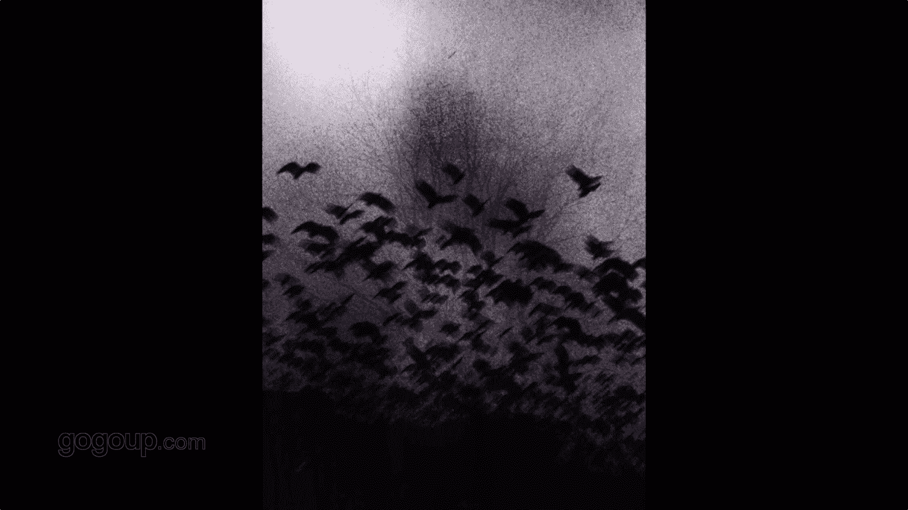

# 何雄手机摄影教程：第01课：跟着何老师去外拍：课时1 · 昆明红嘴鸥

## 概述

在本节课中，我们将跟随摄影师何雄，学习如何利用手机进行户外摄影创作。课程将以昆明红嘴鸥的拍摄为例，探讨手机摄影的优势、拍摄技巧以及创作心态，帮助初学者轻松入门。

我叫何雄，是一名摄影师。很多朋友叫我鸟人。我一直是传统的摄影师，近年来热衷于用手机进行创作。很多朋友在网上看过我的作品，其中影响力较大的是“鸟人”系列。

## 为什么选择手机摄影？📱

上一节我们认识了课程主题，本节中我们来看看为什么手机是值得信赖的创作工具。

手机摄影是摄影领域不可回避的话题。最好的相机是随身携带的相机，手机就是这样一台相机。在光线好、空气质量佳的场景下，手机拍摄效果不输专业相机。手机摄影有其独特的味道。

在输出尺寸15英寸以内时，苹果4或500万、800万像素的手机已经足够。当代手机摄影非常亲民。拍摄人物时，被摄者对手机镜头没有抵触感，感到亲切自然。

最后，手机上有非常多强大的修图APP，更新快，能轻松完成自己喜欢的照片后期处理。因此，手机足够我们使用。

## 我的手机摄影起点：红嘴鸥 🕊️

了解了手机摄影的普遍优势后，我们来看看何雄老师个人的创作起点。

我的手机摄影始于2010年一次偶然的机会，用手机抓拍到了红嘴鸥的瞬间。说到红嘴鸥，大家可能都知道或听说过昆明的红嘴鸥。

红嘴鸥是在1985年冬天，一次寒流将它们从西伯利亚带到了昆明。这个高原城市从1985年至今的30多年里，都有红嘴鸥的身影。我拍摄它们是在2010年冬天，一次偶然的机会。我与它们的亲密接触和手机创作，就是从红嘴鸥开始的。

## 拍摄对象：人与鸟的亲密关系

在开始具体拍摄前，理解你拍摄的对象至关重要。昆明红嘴鸥与人的关系非常亲密自然，就像亲人一样。

在现场，你能直接感受到那种无需多言的美好。它会让你产生想飞的心态，释放自我，渴望与鸟在一起。很多时候，你看到它就想成为鸟。鸟与人、人与自然的和谐关系在这里体现得非常完美。

因此，在拍鸟时，融入自己的情感和状态非常重要。我希望大家在创作过程中，能融入自己的情感，去表达一幅有人情味、有自我情感的作品。这样的作品才有生命力，才有个人风格。

## 实战拍摄技巧 📸

前面我们建立了对拍摄对象的情感认知，现在进入实战环节，看看具体的拍摄技巧。

以下是拍摄红嘴鸥时可以采用的一些方法：

*   **利用广角特性**：手机广角镜头（通常在28mm到35mm之间）能贴近拍摄，让红嘴鸥体型显得很大，同时清晰交代周围环境。
*   **关闭声音**：拍摄时关闭手机快门声音，避免干扰鸟类。
*   **控制曝光**：在强光下，可以使用点测光并降低曝光补偿，以保留红嘴鸥白色羽毛的细节，避免过曝。这是为后期处理做准备的重要前期技巧。
*   **选择性拍摄**：不建议一直按住快门连拍。内心应预先构想想要的画面，再有选择地释放快门去捕捉瞬间。摄影，尤其是抓拍，不要考虑太多条条框框。手机让人更轻松，可以依靠本能反应去捕捉不可复制的瞬间，这会带来很多惊喜。
*   **尝试特殊角度**：手机比相机轻便灵活。可以尝试趴着或放低机位，甚至不看屏幕，把手机贴在地面上拍摄，以获得独特的视角。
*   **引导与等待**：可以引导红嘴鸥，但不必直白地拍摄喂食。我更关注在“吃与不吃”之间，鸟与人的互动关系。精彩瞬间往往一闪而过。
*   **对焦体验**：目前手机的对焦速度非常快，几乎没有时滞。对焦在红嘴鸥头部时，背景虚化效果和画面整体感都很好，这是手机的一个特性。

## 构图与光影的运用 🌅

掌握了基本操作后，我们来提升作品的层次，学习如何通过构图和光影增加表现力。

在构图上，可以寻找特别的角度。例如，等待人物的头发被风吹起与海鸥飞翔的瞬间重合，营造一种狂放自由的感觉。

拍摄红嘴鸥时，我会在不同时段（早晨、中午）和不同光位（顺光、侧顺光、逆光）进行尝试。

*   **顺光拍摄**：光影对比强，画面通透。
*   **逆光拍摄**：能产生令人惊喜的特别效果。早期使用苹果4等手机逆光拍摄时，会产生独特的莲花状光斑。这在专业相机上被认为是需要避免的“眩光”，但在手机摄影中，它可以成为增加画面戏剧性和创意的优点。
*   **观察光影**：细心观察生活。例如，中午阳光直射时，空中飞过的红嘴鸥会在地面或水面上投下影子。拍摄影子，或让人的影子与鸟的影子结合，是光与影的完美组合。

## 耐心与积累：从量变到质变

追求完美瞬间往往需要耐心。对于抓拍喜欢的题材，通常是从制造大量“影像垃圾”开始的。不要否定这个过程。

这里涉及一个专业概念：**陷阱对焦**。即预先构图和对焦，等待你期望的画面进入焦点区域时再释放快门。

例如，为了抓拍一张逆光飞翔的红嘴鸥，我可能连续三个早上拍摄不下2000张照片，最后只选出1到3张。这很有戏剧性。很多时候，那个瞬间不是我找到的，而是它恰好来到我面前。

## 最重要的前提：爱与信任 ❤️

技术之外，情感是连接拍摄者与被摄者的桥梁。

拍了这么多海鸥，最重要的一点是你要去爱它们，打心里觉得它们可爱。这样它们才会愿意亲近你，不害怕你。

基于这种相互的默契和信赖，它们愿意待在我身上或头上来觅食。这对我们来说，是一种特别的相互信任，是人与鸟、与自然关系的融洽体现。

## 总结

本节课中，我们一起学习了手机摄影的入门知识。我们从选择手机摄影的理由开始，以昆明红嘴鸥为例，探讨了如何理解拍摄对象、运用实战拍摄技巧、巧妙构图和利用光影，并强调了耐心积累以及以爱与信任为前提的创作心态。记住，最好的相机是你随身携带的那一台，放松心态，用心观察，你也能用手机捕捉到动人的瞬间。