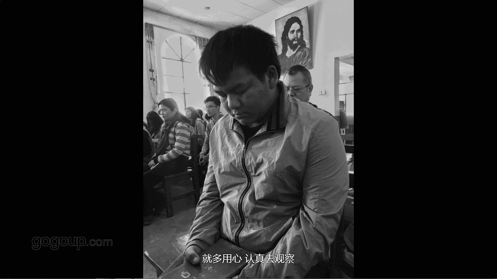

# 手机摄影教程：第01课：跟着何老师去外拍：课时2 · 苗族基督教堂

在本节课中，我们将跟随一次有计划的苗族教堂外拍活动，学习在特定文化场景下进行纪实摄影的完整流程，包括前期沟通、观察方法、拍摄技巧以及后期交流。

## 拍摄背景与主题

上一节我们介绍了外拍的基本概念，本节中我们来看看一个具体的宗教文化题材拍摄案例。

本次外拍地点是昆明郊外一个名为“小水井”的苗族村落。这个村落的居民信仰基督教，其信仰历史可追溯至早期传教士用苗文翻译圣经并在此传播。我们拍摄的主题是他们做礼拜和唱诗班活动的过程。

## 核心原则：沟通与尊重

在拍摄此类严肃的宗教或人文题材时，有一个核心原则必须牢记：**充分的沟通**。

以下是沟通的三个关键阶段：
*   **拍摄前沟通**：了解并尊重对方的习俗与习惯，获得拍摄许可。
*   **拍摄中沟通**：通过眼神或简短交流，保持友好，减少对被摄者的干扰。
*   **拍摄后沟通**：展示照片，获得反馈，这是建立信任的重要环节。

沟通是成功拍摄的基础，它体现了对拍摄对象的尊重。

## 观察与拍摄：从静物到人物

进入拍摄场景后，我们需要从环境细节开始观察。

我到达较早，在空凳子上发现了一本特别的苗文圣经。这引发了拍摄灵感，我采用竖构图，将这位阅读圣经的苗族老奶奶与她的民族服饰一同纳入画面，形成文化对比，营造想象空间。

当看到两位头戴旧式帆布帽的老大爷专注阅读时，我决定靠近拍摄。由于室内光线较暗，我选择了**手动对焦（MF）**，将对焦点放在近处大爷的脸上，并保持手部稳定，以确保画面清晰。对于重要瞬间，我会从不同角度（横图、竖图、方图）多次拍摄，以获取最理想的表达效果。他们的虔诚与和善，使得拍摄过程非常顺利。

## 捕捉生动瞬间与场景交代

在人物众多的场景中，生动的瞬间是照片的灵魂。

教堂里有不同年龄的信徒。我特别注意抓拍孩子的瞬间，他们眼睛明亮，跟随父母参与礼拜，天真无邪的神情非常动人。这种从小受到的信仰熏陶，是题材故事性的重要部分。

同时，一组完整的纪实照片需要有一张场景交代图。我通常在进入教堂时，会在门口拍摄一张展现内部整体环境的广角照片，这有助于观众理解故事发生的背景。

## 发现独特视角与共性画面

用心观察，总能发现独特的构图和富有共性的画面。

例如，一位腿脚不便的老大爷在众人起立时仍低头祷告，我在他身旁静静拍下了这个特写。这些个性化的瞬间让照片充满故事。

当全体信徒起立手持圣经朗诵时，画面形成了强大的共性——黑色的头与白色的书页构成点、线、面的组合，给人一种庄严而神秘的感觉，能引发观者的思考。

我还会尝试一些创意视角。比如，透过一位头发稀疏的老大爷的发丝间隙，将对面的十字架纳入画面，这种构图能产生独特的视觉联想和空间感。

## 完整记录与科技辅助

一个题材的拍摄应力求完整，涵盖不同群体。

礼拜结束后，从老人到小孩的活动都值得记录。我跟随孩子们进入教堂，他们要在舞台上进行唱诗演练。这时，手机强大的**人脸识别自动对焦**功能非常实用，它能确保抓拍多人场景时，每一张面孔都清晰，表情瞬间都被捕捉。

在庄严的舞台上，孩子们天真甚至有些笨拙的举动，引得台下父母会心一笑。这种严肃与欢愉并存的和谐瞬间，极具感染力，绝不能错过。除了照片，我也会拍摄一些短视频，动态影像有时能更好地记录氛围。

## 拍摄后的互动与延伸

拍摄活动结束后的互动，同样是纪实摄影的一部分。

散场后，我在教堂门口看到一位带孩子的家长。我本能地上前交流，打招呼、询问孩子年龄、轻轻摸摸孩子的头。在这种简单的互动中，用手机为他们拍摄照片，显得非常自然。

教堂旁有一所学校，孩子们在校门口玩耍。我加入他们，在嬉戏打闹间抓拍了许多城里难得一见的天真画面。这让我感受到，手机摄影应该是随心所欲、充满快乐的一件事。

🎼

## 课程总结

本节课中，我们一起学习了如何进行一次有计划的人文纪实外拍。我们从**充分的沟通**这一核心原则出发，逐步实践了从环境观察、静物拍摄，到捕捉人物神态、个性瞬间与共性画面的全过程。我们还探讨了利用手机科技（如人脸对焦）辅助拍摄，以及通过后期互动完善故事的重要性。记住，尊重你的拍摄对象，用心观察，你就能用手机记录下充满力量的故事。