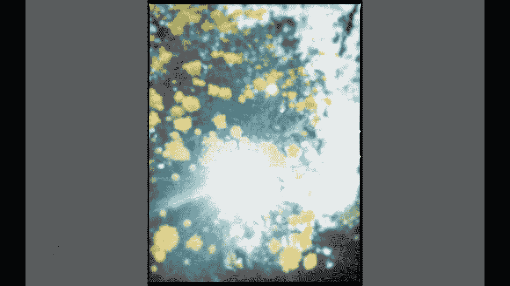

# 手机摄影教程：第03课：手机拍摄的技巧（作品实例讲解）：课时2 · 创意对焦

在本节课中，我们将要学习如何利用“对焦”这一基础功能进行创意表达。上一节我们介绍了曝光技巧，本节中我们来看看如何通过控制焦点来营造独特的画面氛围和情绪。

前面所分享的是些曝光的技巧。现在我们来讲一下对焦。这张照片是一张失焦的照片。失焦的照片常规来说就是没有清晰焦点的照片。

对于我来说，我表达这张照片的话，是一种很梦幻的感觉。它在朦胧之间逆着光。大家看到画面就可能有一种很魔幻的效果。当然也可以创作成另外的其他表现手法。

比如这个逆光的失焦的菊花。它有一种跟那个强大的反差。这就是我们表达一些情绪。可能后面会说要表达情绪的一种手法。就直接得不用后期，直接前期就可以做到的一些所需要得到的效果。

## 核心概念：理解对焦与失焦

在手机摄影中，对焦通常指通过点击屏幕，让相机自动将某个主体拍摄清晰的过程。其核心公式可以理解为：

**清晰成像 = 镜头对焦于被摄主体平面**

而“失焦”或“脱焦”，则是指相机没有将对焦点放在主体上，导致画面整体或部分区域模糊。这通常被视为技术失误，但也可以被主动运用为一种创作手法。

## 创意对焦的应用场景

以下是几种可以利用创意对焦来增强照片表现力的场景：

**1. 营造梦幻与朦胧感**
当光线透过失焦的透明或半透明物体（如玻璃、花瓣、水珠）时，会形成柔和的光斑和色彩晕染，非常适合表现浪漫、回忆或梦幻的主题。

**2. 简化复杂背景**
在杂乱的场景中，通过对焦在前景或让背景完全失焦，可以将干扰元素虚化成模糊的色块，从而突出主体。这在人像和静物摄影中非常常用。

**3. 表达抽象情绪**
失焦带来的模糊、不确定性和光影混合，可以直接传达迷茫、怀旧、躁动或温柔等抽象情绪，是一种“前期直出”的情绪表达手法。

**4. 创造视觉反差**
让画面中一部分清晰、一部分极度模糊，可以形成强烈的虚实对比和视觉张力，引导观众的视线和思考。

## 如何用手机实现创意对焦

手机摄影实现创意对焦主要依赖手动控制。以下是具体操作步骤：

**步骤一：打开相机应用**
确保相机处于照片拍摄模式。

**步骤二：关闭自动对焦（如需）**
大部分手机默认是自动对焦。要实现固定失焦，需要先锁定焦点。通常方法是：在屏幕上长按你想要对焦的区域，直到出现“自动对焦/自动曝光锁定”的提示（在iPhone上是一个黄色方框带“AE/AF锁定”字样）。

**步骤三：手动选择对焦点**
点击屏幕上你希望清晰呈现的区域。如果你想拍失焦效果，就点击一个非常近或非常远的物体，或者在对焦锁定后，轻微移动手机改变与主体的距离。

**步骤四：利用外接镜头（进阶）**
一些手机外接微距或人像镜头能产生更浅的景深和更柔和的虚化效果，为创意对焦提供更多可能。

## 实践建议与注意事项

在尝试创意对焦时，请注意以下几点：

*   **明确创作意图**：先想好你要表达什么，再决定是否使用以及如何使用失焦。
*   **保证光线充足**：失焦会损失大量细节，充足的光线可以保证色彩和光斑的形状更漂亮。
*   **多尝试不同主体**：逆光的树叶、雨后的车窗、节日灯串、水面反光等都是练习创意对焦的优秀题材。
*   **虚实结合**：完全失焦和局部清晰结合使用，效果往往比全部模糊更有层次感。

本节课中我们一起学习了如何将“对焦”这一基础功能转化为创意工具。我们了解到，主动控制的“失焦”并非失误，而是一种能直接营造氛围、简化画面、表达情绪的有效前期手法。关键在于打破常规思维，明确你想通过模糊传递的信息，并大胆实践。记住，技术服务于表达，清晰的画面是一种美，朦胧的意境同样动人。