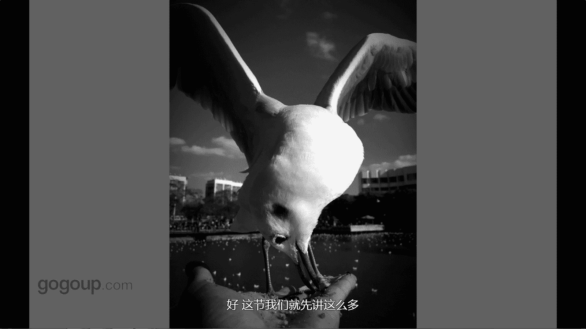

# 手机摄影教程：第03课：手机拍摄的技巧（作品实例讲解）：课时3 · 抓拍

在本节课中，我们将要学习手机摄影中关于抓拍与连拍的核心技巧。我们将通过具体的作品实例，讲解如何预判瞬间、精准释放快门，以及如何通过曝光控制来丰富画面表达，帮助你告别盲目连拍，捕捉到真正有意义的决定性瞬间。

## 抓拍的核心：预判与精准释放

上一节我们介绍了基础的拍摄模式，本节中我们来看看如何捕捉动态瞬间。抓拍的核心在于预判决定性瞬间，并在恰当时机精准释放快门，而不是依赖手机的连续拍摄功能盲目拍摄。

许多手机（如苹果iPhone）支持按住快门进行高速连拍，例如一秒钟拍摄10张或更多照片。然而，我个人并不建议完全依赖这种方式。盲目连拍会产生大量无效照片，即“影像垃圾”，并且很可能错过最关键的瞬间。

我采用的抓拍方法是：预先构图并等待，当预感到那个理想的瞬间即将来临时，再果断按下快门进行单次拍摄。这样捕捉到的瞬间是**可预见**和**有准备**的。相比之下，盲目连拍的效果则不可控。

以下是我在几秒钟内，用左手喂食、右手持手机抓拍的红嘴鸥的一组照片，展示了这种预判式抓拍的效果。

## 曝光控制：为瞬间赋予不同情绪

在抓拍过程中，除了时机，曝光也是重要的创作手段。通过调整曝光，即使拍摄同一主体，也能传达出截然不同的情绪和氛围。

这里重复一个之前提到过的小技巧：曝光补偿。在拍摄这组红嘴鸥照片时，我运用了不同的曝光设置。

以下是具体实例对比：
*   **减少曝光**：画面更暗，氛围可能更深沉或专注。
*   **正常曝光**：呈现主体最真实的状态。
*   **增加曝光**：画面更明亮，能突出明亮、轻快的情绪。

这是一种有效的拍摄手法。你可以在相机设置中找到**曝光补偿（EV +/-）**功能，通过滑动调整，在拍摄时就能直接获得不同曝光效果的照片，为后期处理提供更多选择。

## 实例分析：捕捉神态与姿态

让我们具体分析这组抓拍照片，观察如何通过瞬间控制来捕捉不同的神态。

第一张照片捕捉到红嘴鸥展翅低头准备啄食的瞬间。第二张照片则记录了它低头时的呆萌可爱姿态。我在拍摄时，是在感受到画面中出现了我想要的**神态**或**姿态**后，才释放快门的。这种主动选择，确保了每张照片都包含了明确的意图和情感，而不是从数十张连拍照片中被动筛选。

这张照片（指示例图）还经过了后期调色处理，这将在后续课程中详细讲解。这里主要是分享通过主动抓拍所获得的不同瞬间状态。

## 总结

本节课中，我们一起学习了手机抓拍的核心技巧。关键点在于：**放弃盲目连拍，学会预判瞬间并精准释放快门**。同时，灵活运用**曝光补偿（EV +/-）** 功能，可以在拍摄时就为画面注入不同的情绪。记住，成功的抓拍是主动选择和控制的结果，旨在捕捉那些富有表现力和故事性的决定性瞬间。

🎼The。

