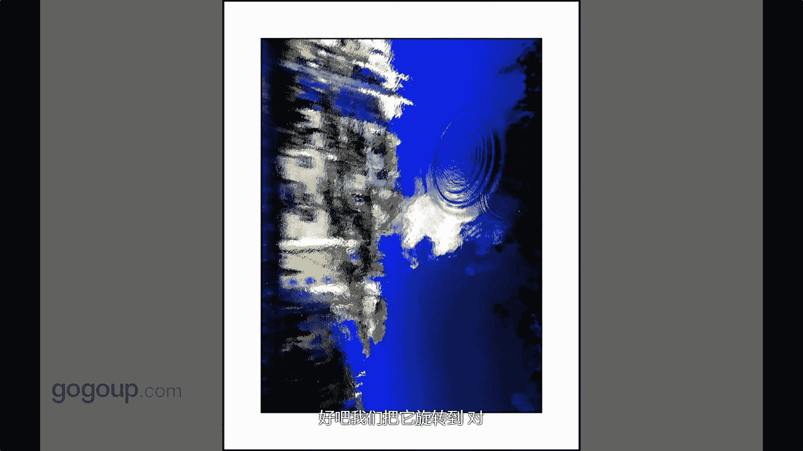

手机摄影教程：第04课：视觉训练（作品实例讲解）：课时10 · 创意-倒置

在本节课中，我们将学习如何利用手机的独特优势进行创意拍摄，特别是通过“倒置”这一手法来创作出富有艺术感的作品。我们将通过具体的作品实例，详细解析从观察到拍摄再到后期处理的完整创作思路。

上一节我们探讨了创意拍摄的基本概念，本节中我们来看看一个非常实用的创意手法——倒置。

手机在创意拍摄上具有显著优势。它能捕捉到一些非常细微或贴近的视角，这些视角往往是传统相机难以实现的。这并非说明相机不好，而是强调手机在特定场景下的灵活性与便利性。

创意作品的核心在于以非常规的视角去观察事物，并将其记录下来。现在，我们来看一张作品实例。

这是一张经过后期处理的湖面倒影照片。创作者采用了倒置的视角。这种创意手法让我们能关注到湖面本身的细微纹理。你可以将手机贴近水面进行拍摄。

通过贴近拍摄，可以捕捉到夕阳西下时，湖面波光粼粼的线性光斑与瞬间光影。下面这张作品也运用了相同的效果。

这张作品拍摄的是湖面倒影，并同样进行了倒置展示，最终效果很像一幅油画。

我们将它旋转回正常视角。这是在湖面平静时拍摄的，其中有一个有趣的细节。当时，岸边的房子和树木倒映在湖中，天气宁静，湖面如镜，只有微风拂过。

微风让水中的倒影产生了一丝朦胧的油画笔触感。我拍摄后，通过简单的倒置处理，就强化了这种油画质感。那么，如何观察并丰富这样的画面呢？

最初观察这个场景时，我感觉画面有些单一，缺乏生气。于是，我运用了一个创意小技巧：捡起一颗小石子扔进湖里。

石子激起的涟漪为静态的画面增添了动态元素，让作品更加生动。关于画面层次的营造，我们后续会详细讨论。

在后期处理中，我主要进行了以下调整：
以下是核心的后期处理步骤：
*   **降低亮度**：使用工具 `亮度 -20`。
*   **增加暗角**：使用工具 `暗角 +15`。
*   **提高饱和度**：使用工具 `饱和度 +10`。

经过这些调整，画面的焦点更加突出，成功融合了水波的“动”与倒影的“静”，最终产生了强烈的油画笔触质感。

本节课中，我们一起学习了“倒置”这一创意摄影手法。关键在于利用手机贴近拍摄的优势，观察并捕捉如水面倒影等独特视角，并通过简单的后期处理（如调整亮度、添加暗角、提高饱和度）来强化艺术效果。记住，创意源于不同的观察角度和敢于尝试的拍摄实践。